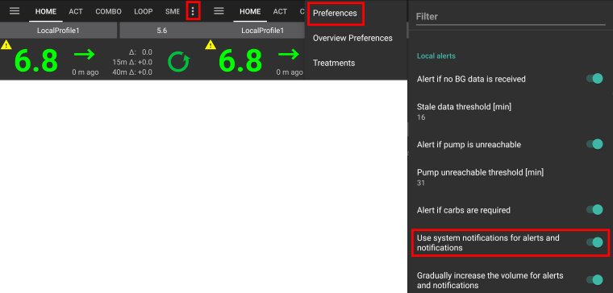

# Android Auto

(Android-auto-AAPS-settings-for-android-auto)=

## AAPS settings for Android Auto

Use system notifications for alerts and notifications:

* פתחו את תפריט 3 הנקודות בפינה הימנית העליונה של מסך הבית ובחרו **העדפות** > **התראות מקומיות** > והפעלת **שימוש בהודעות מערכת עבור התראות ודיווחים** 

(Android-auto-AAPS-settings-in-android-auto-app-on-your-phone)=

## הגדרות באפליקציית Android Auto בטלפון

As AAPS is no official Android Auto app notifications have to be activated in Android Auto.

* פתחו את אפליקציית Android Auto במכשירכם.
* לחצו על תפריט ההמבורגר
* בחרו הגדרות
* גללו מטה עד לתחתית הרשימה והקישו על מס' גרסה 10 פעמים עד שתוצג ההודעה "מצב מפתח מופעל".

* לחצו על תפריט 3 נקודות (⋮) בפינה שמאלית עליונה
* בחר "אפשרויות מפתחים"
* גללו מטה עד לתחתית הרשימה והפעילו את "מקורות לא ידועים"

* כעת תוכלו לצאת ממצב מפתח אם תרצו. הקישו על לחצו על תפריט 3 נקודות (⋮) בפינה שמאלית עליונה כדי לעשות זאת.

## הצגת התראות ברכב

* הקישו על סמל הפעמון בשורת התפריטים התחתונה ב-Android Auto במכונית

* ערכי הסוכר יוצגו באופן הבא:

## פתרון בעיות:

* If you don't see the notification, check if you [allowed AAPS to show notifications](Android-auto-AAPS-settings-for-android-auto) in Android and if [Android Auto has access rights to notifications](Android-auto-AAPS-settings-in-android-auto-app-on-your-phone).