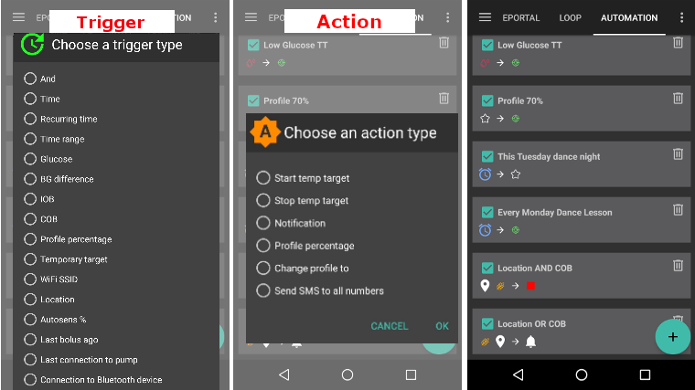
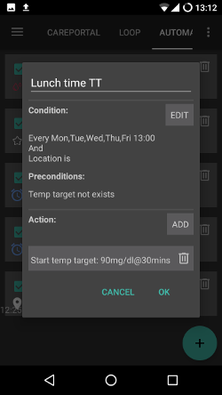

אוטומציה
**************************************************

מהי אוטומציה
==================================================
עבור אותם אירועים תכופים, ייתכן שתצטרכו תמיד לשנות את אותן הגדרות. על מנת למנוע את התעסוקה העודפת, אפשר פשוט לנסות להפוך את האירוע לאוטומטי אם אתם יכולים לאפיין אותו מספיק טוב ולתת לו להתרחש באופן אוטומטי. 

I.e. אם רמת הסוכר נמוכה, אפשר להחליט להעלות את ערך המטרה זמנית באופן אוטומטי. אפשרות נוספת היא להגדיר שאם אתם במכון כושר, יוגדר ערך המטרה גבוה. 

לפני השימוש באוטומציה, עליכם להיות לשלוט בשימוש ב-"ערכי מטרה זמניים </temptarget.html>`_ או החלפות פרופיל ידניות. 

ודאו שאתם באמת מבינים כיצד אוטומציה פועלת לפני הגדרת התנאי הפשוט הראשון שלכם. **במקום פעולה, תנו ל-AAPS להציג תחילה רק התראה.** כשאתם בטוחים שהאוטומציה מופעלת בזמן הנכון, החליפו את ההתראה בפעולה אמיתית.

הוראות שימוש
==================================================
כדי להגדיר אוטומציה, מתחילים מלתת לה שם, לבחור לפחות תנאי אחד ופעולה אחת. 

הערה חשובה
--------------------------------------------------
**אוטומציות ממשיכות להיות פעילות בזמן שהלופ מושבת!**

אז הקפידו במידת הצורך לבטל את כללי האוטומציה במהלך מקרים אלה. ניתן לעשות זאת על ידי ביטול סימון התיבה שלצד השם של האוטומציה.

.. image:: ../images/Automation_ActivateDeactivate.png
  :alt: Activate and deactivaten automation rule

היכן למצוא את הגדרת האוטומציות
--------------------------------------------------
בהתאם ל`הגדרותיכם בבונה התצורה <../Configuration/Config-Builder.html#tab-or-hamburger-menu>`_ תמצאו את `אוטומציות <../Configuration/Config-Builder.html#automation> `__ בתפריט ההמבורגר או כלשונית.

כללי
--------------------------------------------------
ישנן מגבלות:

* ערך הגלוקוז חייב להיות בין 72 ל-270 mg/dl.
* אחוז הפרופיל חייב להיות בין 70% ל-130%.
* ישנו מינימום של 5 דקות בין ביצוע הפעולות.

**נא לשמור על זהירות:**

* **פחות מ-(-2) משמעו (3-) ומטה (-4 וכו')** 
* **יותר מ-(-2) משמעו (1-) ומעלה (0,10 וכו')**

תנאי
--------------------------------------------------
ניתן לבחור בין מספר תנאים. להלן הסברים על מספר סוגי תנאים אבל רובם צריכים להיות קלים להבנה ולא הכל מתואר כאן:

* תנאי חיבור: יכולים להיות לכם מספר תנאים ואפשר לקשר ביניהם עם השערים הלוגיים: 

  * "וגם"
  * "או"
  * "או בררני" (משמעו שאם אך ורק אחד מהתנאים תקף אז הפעולה תופעל)
   
זמן לעומת  זמן חוזרני

  * זמן = מועד חד פעמי
  * זמן חוזרני = אירוע שקורה באופן קבוע (לדוגמה פעם בשבוע, בימי עבודה וכו')
   
* מיקום: בבונה ההגדרות (אוטומציה), אפשר לבחור באיזה שירות מיקום אתם רוצה להשתמש:

  * השתמש במיקום פסיבי: AAPS מקבל מיקומים רק אם אפליקציות אחרות מבקשות זאת
  * השתמש במיקום רשת: מיקום ע"פ רשת ה-WiFi
  * השתמש במיקום GPS (שימו לב!
 עלול לגרום לניצול מוגבר של הסוללה!)
  
פעולות
--------------------------------------------------
אפשר לבחור פעולה אחת או יותר: 

* הפעלת ערך מטרה זמני 

  * חייב להיות בתחום 72-270 mg/dl
  * פועל רק אם אין כבר ערך מטרה זמני בפעולה
   
* הפסקת ערך מטרה זמני
* התראה
* אחוז הפרופיל

  מוכרח להיות בתחום 70-130% 
  * פועל רק אם האחוז הקודם היה 100%

לאחר הוספת הפעולה שבחרתם, **אל תשכחו לשנות את ערכי ברירת המחדל** למה שאתם צריכים, על ידי לחיצה על ערכי ברירת המחדל.
 
.. image:: ../images/Automation_Default_V2_5.png
  :alt: אוטומציה לעומת ערכים מוגדרים

מיון כללי אוטומציה
---------------------
כדי למיין את כללי האוטומציה לחצו כפתור המיון והחזיקו את כפתור ארבע השורות בצד שמאל של המסך וגררו למעלה או למטה.

.. image:: ../images/Automation_Sort.png
  :alt: Sort automation rules
  
מחיקת כללי אוטומציה
-----------------------
על מנת למחוק כללי אוטומציה לחצו על סמל הפח.

.. image:: ../images/Automation_Delete.png
  :alt: Delete automation rule

שיטות עבודה נכונות והסתייגויות
==================================================
* כאשר אתם מתחילים להשתמש באוטומציה או יוצרים תנאי חדש, הגדירו שהפעולה תהיה הודעה בלבד עד שאתם תהיו בטוחים שהתנאי פועל היטב.
* עקבו אחר תוצאות התנאי.
* אל תנסו לעשות תנאים מתירנים מדי (כלומר: אם Bg > 80 mg/dl ו-bg < 180 mg/dl)

  **חשוב כפליים אם הפעולה היא החלפת פרופיל!**
 
* נסו להשתמש בערכי מטרה זמניים במקום בהחלפות פרופיל. החלפות ערכי המטרה הזמניים אינם מאפסים את `Autosens <../Usage/Open-APS-features.html#autosens>`__.
* ודאו שהחלפות הפרופיל נעשות במשורה ורצוי כמוצא אחרון בלבד.

  * החלפת פרופיל הופכת את `Autosens <../Usage/Open-APS-features.html#autosens>`__ לחסר תועלת למשך 6 שעות לפחות.

* מעבר בין פרופילים לא תאפס את הפרופיל בחזרה לפרופיל הבסיסי

  * אתם צריכים לקבוע אוטומציה אחרת כדי להחזיר את הפרופיל או לעשות זאת באופן ידני!
  * סיכון מוגבר להיפוגליקמיה אם החלפת הפרופיל לא תפוג או תוחזר בחזרה לפרופיל הבסיס.

דוגמאות
==================================================
אלו הן רק דוגמאות, לא עצות. אל תעתיקו אותן מבלי להיות מודעים למה שאתם עושים או למה אתה צריכים אותן.

* החלפת פרופילים לפעילויות יומיומיות (כמו בית ספר, חדר כושר, סוף שבוע, יום עבודה...) באמצעות מיקום גיאוגרפי, wifi, זמן וכו'.
* הגדרת ערך מטרה זמני לפעילויות על סמך זמן, מיקום, חיבור למכשיר בלוטות'...
* הגדרת ערך מטרה זמני לאכילה בקרוב בהתבסס על זמן, מיקום...

ערך מטרה זמני בתגובה לרמת סוכר נמוכה
--------------------------------------------------
.. image:: ../images/Automation2.png
  :alt: אוטומציה2

זה נעשה כדי להפעיל ערך מטרה זמני היפו באופן אוטומטי כאשר ערך הגלוקוז נמוך.

ערך מטרה זמני לקראת ארוחת צהריים
--------------------------------------------------

  
דוגמה זו נוצרה על ידי מישהו שאוכל ארוחת צהריים בעבודה באותה שעה בכל יום במהלך ימי עבודה. אם משתמש זה נמצא בשעה מסוימת במיקום ארוחת הצהריים שלו, האוטומציה תגדיר ערך מטרה זמני נמוך (אוכל בקרוב) בזמן ההמתנה לארוחת הצהריים. בגלל השימוש בשער הלוגי "וגם", הפעולה יוצאת לפועל רק בזמן הנבחר כשהמשתמש נמצא במיקום הנבחר. הפעולה לא מופעלת בזמנים אחרים במקום הזה או אם המשתמש נשאר בבית בזמן הזה. 

שימוש שגוי באוטומציות
--------------------------------------------------
יש להיזהר משימוש שגוי באוטומציות. שימוש שגוי עלול להוביל לקשיים ואף לסכנה לבריאותכם. להלן דוגמאות לשימוש לא נכון:

* ניסיון לעקוף לחלוטין את האלגוריתם במקום לכוון אותו (לדוגמה החלפת פרופיל במקום לשפר את הערכים המוגדרים בפרופיל)
* מעבר בין פרופילים כדי לפצות על מזון
* החלפת פרופיל ללא הגדרת משך פעולה
* יצירת אוטומציות חד כיווניות (לדוגמה פעולה שאינה מבוטלת ע"י אוטומציה אחרת)
* יצירת אוטומציות הפועלות לטווח ארוך

אלטרנטיבות
==================================================

למשתמשים מתקדמים, ישנן אפשרויות אחרות לבצע אוטומציה של משימות באמצעות IFTTT או אפליקציית אנדרואיד צד שלישי בשם Automate. ניתן למצוא כמה דוגמאות `כאן <./automationwithapp.html>`_.
