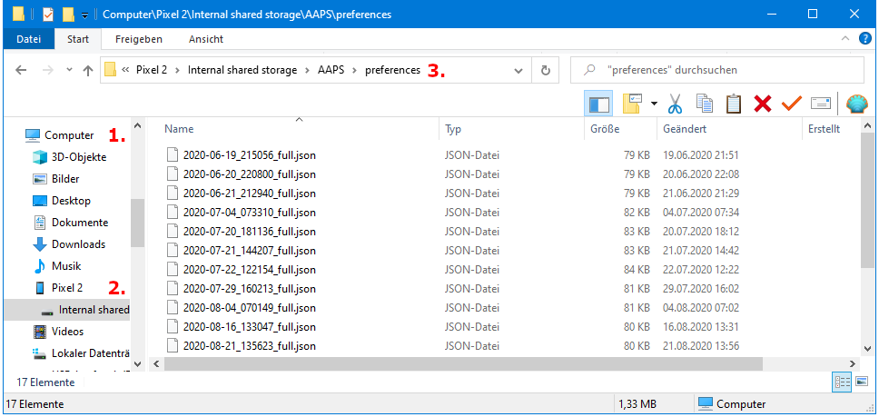

ייבוא\ייצוא הגדרות
**************************************************

מתי כדאי לייצא הגדרות?
==================================================
חשוב להיות מוכנים לבלתי צפוי. ייתכן שתשנו הגדרות חשובות בטעות ושתחוו בקשיים בביטול השינויים הללו. הטלפון שלכם עלול להתקלקל, להישבר או להיגנב. על מנת לחזור חזרה להגדרות בהם הייתם, עליכם לייצא את הגדרותיכם על בסיס קבוע.

מומלץ לייצא לאחר שינויים בהגדרות ובסיום משימות. 

יש להעתיק את ההגדרות המיוצאות לאחסון בענן או למחשב האישי, עדיף לשני מיקומים שונים. כך תהיו מוכנים לאובדן או נזק לטלפון ה-AAPS שלכם ולא תצטרכו להתחיל מאפס.

במחשב Windows 10 זה נראה כך:
  

מידע מיוצא
==================================================
המידע המיוצא כולל בין השאר:

* אירועים של `אוטומציה <../Usage/Automation.html>`_
* הגדרות `בונה התצורה <../Configuration/Config-Builder.html>`_
* הגדרות `פרופיל מקומי <../Configuration/Config-Builder.html#local-profile>`_
* התקדמות במשימות `Objectives <../Usage/Objectives.html>`_ כולל `תוצאות הבחינה של משימה 3 <../Usage/Objectives.html#objective-3-prove-your-knowledge>`_
* `העדפות <../Configuration/Preferences.html>`__ כולל `הגדרות קליינט NS <../Configuration/Preferences.html#nsclient>`_

פורמט הגיבוי המוצפן
==================================================
גיבוי ההגדרות מוצפן על ידי הסיסמה הראשית שניתן להגדיר ב'העדפות <../Configuration/Preferences.html#master-password>`__ .

ייצוא הגדרות
==================================================
* תפריט המבורגר (פינה הימנית העליונה של המסך)
* תחזוקה
* ייצא הגדרות

.. image:: ../images/AAPS_ExportSettings1.png
  :alt: AndroidAPS export settings 1

* התאריך ושעת הייצוא יתווספו לשם הקובץ באופן אוטומטי ויוצגו יחד עם הנתיב.
* לחצו על 'אישור'.
* הזינו `סיסמה ראשית <../Configuration/Preferences.html#master-password>`__ ולחצו על 'אישור'.
* ייצוא מוצלח יוצג בתחתית המסך.

.. image:: ../images/AAPS_ExportSettings2.png
  :alt: AndroidAPS export settings 2
  
ייבוא הגדרות
==================================================
**אל תייבאו הגדרות בזמן פעילות של פוד** - ראו `הוראות Omnipod לפרטים <../Configuration/OmnipodEros.html#import-settings-from-previous-aaps>`_.

* תפריט המבורגר (פינה הימנית העליונה של המסך)
* תחזוקה
* יבא הגדרות

.. image:: ../images/AAPS_ImportSettings1.png
  :alt: AndroidAPS import settings 1

* כל הקבצים מהתיקייה /AAPS/preferences בטלפון יוצגו ברשימה.
* בחרו קובץ.
* אשרו ייבוא על ידי לחיצה על 'אישור'.
* הזינו `סיסמה ראשית <../Configuration/Preferences.html#master-password>`__ ולחצו על 'אישור'.

.. image:: ../images/AAPS_ImportSettings2.png
  :alt: AndroidAPS import settings 2

* יוצגו פרטים על קובץ ההעדפות.
*זוהי ההזדמנות האחרונה לביטול הייבוא.
* לחצו על 'ייבוא'.
* אשרו את ההודעה על ידי לחיצה על 'אישור'.
* AAPS יופעל מחדש כדי להפעיל העדפות מיובאות.

הערה למשתמשי Dana RS
------------------------------------------------------------
* מכיוון שגם הגדרות חיבור המשאבה מיובאות, AAPS בטלפון החדש כבר "יכיר" את המשאבה ולכן לא יתחיל סריקת בלוטות'. 
* יש לצמד טלפון חדש עם המשאבה באופן ידני.

ייבוא הגדרות מגרסאות קודמות (לפני AAPS 2.7)
------------------------------------------------------------
* קובץ ההגדרות "הישן" (הנקרא 'AndroidAPSPreferences' - ללא סיומת קובץ) חייב להיות בתיקיית השורש של הטלפון החכם שלך (/storage/emulated/0).
* אין לשים את הקובץ ה"ישן" באותה תיקיה כמו ההגדרות המיוצאות החדשות (AAPS/העדפות).
* את הקובץ ה"ישן" תמצאו בתחתית הרשימה בדיאלוג הייבוא.

העברת קובץ הגדרות
==================================================
* הדרך הטובה ביותר להעביר קובץ הגדרות לטלפון חדש היא באמצעות כבל USB או שירות ענן (כלומר Google Drive).
* מדריכים ניתן למצוא באינטרנט לדוגמה `דפי עזרה של Android <https://support.google.com/android/answer/9064445?hl=iw>`_.
* אם אתם נתקלים בבעיות עם הקובץ המועבר נסו דרך אחרת להעביר קובץ.
