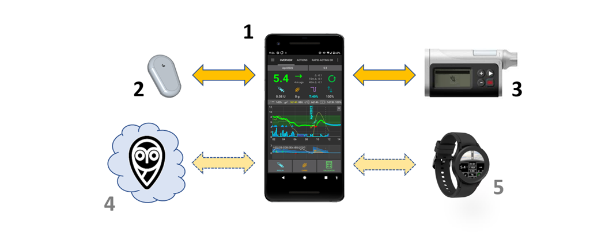

# Welcome to the AAPS documentation



```{admonition} Latest Release
:class: note

14/08/2025 : Version 3.3.2.1 is out. Check the [Release Notes](#latestrelease) to see what's new and get update instructions.

```

Android APS (**AAPS**) is an open source app for people living with insulin-dependent diabetes. It is an artificial pancreas system (APS) which runs on Android smartphones. **AAPS** uses an OpenAPS software algorithm and aims to do what a real pancreas does: keep blood sugar levels within healthy limits by using automated insulin dosing. To use **AAPS** you need **three** compatible devices: **(1)** an Android phone, **(2)** a continuous glucose monitor (CGM), and **(3)** a FDA/CE approved insulin pump. Optionally you will need cloud services **(4)** to remote control **AAPS**, share your data and store them in a reporting server, then also **(5)** a smartwatch.

This documentation explains how to setup and use **AAPS**. You can navigate through the **AAPS** documentation either through the menu on the left (and the handy "**Search docs**" function), or by using the [index](#index-aaps-documentation-index) at the bottom of this page.

## Overview of the AAPS documentation ("The docs")

Section **2) Getting Started**, the [Introduction](Getting-Started/Introduction.md) explains the general concept of what an artificial pancreas system (APS) is designed to do. It outlines the background of looping in general, why **AAPS** was developed, compares **AAPS** to other systems, and addresses safety. It gives suggestions about how to talk to your clinical team about **AAPS**, explains why you need to build the **AAPS** app yourself rather than just downloading it, and gives an overview of the typical connectivity of an **AAPS** system. It also addresses accessibility, and who is likely to benefit from **AAPS**.

[Preparing for AAPS](./Getting-Started/PreparingForAaps.md) gives more detail about safety considerations, and the phones, CGMs (Continuous Glucose Monitors) and insulin pumps which are compatible with **AAPS**. It gives an overview of the process you will go through, and provides an approximate timeline for gaining full functionality of **AAPS**. This section gets you technically prepared to assemble your **AAPS** setup as quickly and efficiently as possible. The subsection [CGM Configuration](./Getting-Started/CompatiblesCgms.md) explains how to optimse CGM setup and what smoothing options are best.

Now that you have a solid understanding of the process, you can start assembling your **AAPS** loop.

Section **3) Setting up AAPS** contains step-by-step instructions to do this. It covers choosing and [setting up your reporting server](./SettingUpAaps/SettingUpTheReportingServer.md) (Nightscout or Tidepool) so you can review and share your data, getting ready for building the AAPS app, building the AAPS app and transferring the AAPS app to your phone. It also covers setting up the **AAPS** app using the setup Wizard, linking it with your CGM app, and either a real or virtual insulin pump, as well as linking **AAPS** to your reporting server. You are then slowly introduced to the full usage of what **AAPS** has to offer via a safe and carefully calibrated step-by-step process designed to make sure that you/your child are thoroughly familiar and comfortable navigating all the different levels and menu configurations before graduating on the next phase, commonly referred to as the next "Objective", until you are have enough experience to begin using the more advanced options available within the app. These Objectives are specially designed in such a way that will gradually unlock more possibilities of **AAPS** and switch from Open Loop to Closed Loop.

Section **4) Daily life with AAPS** covers key **AAPS** features, to help you use (and customise)  **AAPS**. This including understanding the screens, carbs-on-board, sensitivity, profile switching, temp targets, extended carbs (or eCarbs), automations, and DynamicISF. It also covers frequent topics like how to manage different types of meals, how to deal with cannula and sensor changes, smartphone updates, daylight saving changes, and [travelling with AAPS](DailyLifeWithAaps/TimezoneTraveling-DaylightSavingTime.md) and sports. Common questions and answers are located within the troubleshooting section.

Section **5) [Remote AAPS features](./RemoteFeatures/RemoteControl.md)** highlights a real strength of **AAPS**. There are a wide range of possibilities for remotely sending commands to, or simply following the data from **AAPS**. This is equally useful for carers who want to use **AAPS** for minors, and for adults with diabetes who either want to monitor their sugars (and other metrics) more conveniently than just on their phone (on a watch, in the car _etc._), or wish to have significant others to also monitor the data. This section also provides guidance for using Android Auto so you can view glucose levels in the car.

Section **6) Wear OS smartwatches** gives information and procedures to use an Android **Wear OS** smartwatch with the dedicated **AAPS** watchfaces or custom watchfaces, either as a remote control of your phone or just a display indicator.


Section **7) Maintenance of AAPS** covers how to export and backup your settings (which is very important in case you lose/break your phone), gives the latest version notes and details how to update **AAPS**. You can expect that there will be one new version and 2-3 required updates per year. You are required to do these updates as with all software, as any minor bugs are ironed out, and improvements to **AAPS** are made. There is a dedicated "updating" troubleshooting section with the common queries.

Section **8) [Getting Help](GettingHelp/WhereCanIGetHelp.md)** should help direct you to the best places to go to find general help with **AAPS**. This is very important so that you can get in touch with others as quickly as possible, clarify questions and solve the usual pitfalls. A lot of people are already using **AAPS** successfully, but everyone has a question at some point that they couldn't solve on their own. Due to the large number of users, the response times to questions are usually very quick, typically only a few hours. Don’t worry about asking for help, there is no such thing as a dumb question! We encourage users of any/all levels of experience to ask as many questions as they feel is necessary to help get them up and running safely. This section includes general troubleshooting for **AAPS** and **AAPSClient** (a companion following app) as well as explaining how to send your **AAPS** data (logfiles) to the developers for investigation, if you think a technical issue with **AAPS** needs looking at.

Section **9)** covers **Advanced AAPS options** such as how to progress from using **AAPS** for hybrid-closed looping (bolusing for meals _etc._) to full closed looping (no bolusing), and details development and engineering modes. Most users get on just fine with the main or "Master" **AAPS** version without looking into these options, this section is for users who already have good control and are looking to further improve their setup.

In section **10) [How to support AAPS](SupportingAaps/HowToEditTheDocs.md)** we provide  information so that you can support this project. You can donate money, equipment or expertise. You can suggest/make changes to the documentation yourself, help with [translation of the documentation](SupportingAaps/Translations) and provide your data through the Open Humans project.

Section **11) Resources**, contains archived or additional documentation, including a subsection for [clinicians](UsefulLinks/ClinicianGuideToAaps.md) who have expressed interest in open source artificial pancreas technology such as **AAPS**, or for patients who want to share such information with their clinicians, this topic is also addressed in the introduction. More diabetes and looping references and resources are also contained in this section. It includes the  [Glossary](./UsefulLinks/Glossary.md), a list of the acronyms (or short-term names) used throughout **AAPS**. This is where to go to find out what the terms ISF or TT, stand for, for example.


 ### Interested in getting started with **AAPS**? Read more about **AAPS** in the [Introduction](Getting-Started/Introduction.md).

```{admonition} SAFETY NOTICE
:class: danger
The safety of **AAPS** relies on the safety features of your hardware (phone, pump, CGM). Only use a fully functioning FDA/CE approved insulin pump and CGM. Do not use broken, modified or self-built insulin pumps or CGM receivers. Only use original consumable supplies (inserters, cannulas and insulin reservoirs) approved by the manufacturer for use with your pump and CGM. Using untested or modified supplies can cause inaccuracy and insulin dosing errors, resulting in significant risk to the user. 

Do not use **AAPS** if you take SGLT-2 inhibitors (gliflozins), as they lower blood sugar levels. You increase the risk diabetic ketoacidosis (DKA) due to reduced insulin delivery and hypoglycemia due to lowered blood sugar levels. 
```

```{admonition} Disclaimer
:class: note

- All information and code described here is for informational and educational purposes only. Use [Nightscout](https://nightscout.github.io/) and **AAPS** at your own risk, and do not use the information or code to make medical decisions. Nightscout לא עושה כרגע ניסיון לתאימות לפרטיות HIPAA. 
 
- Use of code from github.com is without warranty or formal support of any kind. אנא עיינו ברישיון של מאגר זה לפרטים.

- All product and company names, trademarks, servicemarks, registered trademarks, and registered servicemarks are the property of their respective holders. השימוש בהם הוא למטרות מידע ואינו מרמז על כל זיקה או אישור על ידם. 


**AAPS** has no association with, and is not endorsed by: [SOOIL](http://www.sooil.com/eng/), [Dexcom](https://www.dexcom.com/), [Accu-Chek, Roche Diabetes Care](https://www.accu-chek.com/), [Insulet](https://www.insulet.com/) or [Medtronic](https://www.medtronic.com/).

```

(index-aaps-documentation-index)=

## AAPS Documentation Index

```{toctree}
:caption: 1) Change language

Change language <./NavigateDoc/ChangeLanguage.md>
Change version <./NavigateDoc/ChangeVersion.md>
```
```{toctree}
:caption: 2) Getting started

Introduction to AAPS <./Getting-Started/Introduction.md>
Preparing for AAPS <./Getting-Started/PreparingForAaps.md>
Component Overview <./Getting-Started/ComponentOverview.md>
- Compatible pumps <./Getting-Started/CompatiblePumps.md>
- Compatible CGMs <./Getting-Started/CompatiblesCgms.md>
- Compatible phones  <./Getting-Started/Phones.md>
- Compatible watches  <./Getting-Started/Watches.md>
```

```{toctree}
:caption: 3) Setting up AAPS

Setting up the reporting server <./SettingUpAaps/SettingUpTheReportingServer.md>
- Nightscout <./SettingUpAaps/Nightscout.md>
- Tidepool <./SettingUpAaps/Tidepool.md>
Building AAPS <./SettingUpAaps/BuildingAaps.md>
Transferring and Installing AAPS <./SettingUpAaps/TransferringAndInstallingAaps.md>
Setup Wizard <./SettingUpAaps/SetupWizard.md>
Your AAPS Profile <./SettingUpAaps/YourAapsProfile.md>
Change AAPS configuration <./SettingUpAaps/ChangeAapsConfiguration.md>
- Config Builder <./SettingUpAaps/ConfigBuilder.md>
- Preferences <./SettingUpAaps/Preferences.md>
Completing the objectives <./SettingUpAaps/CompletingTheObjectives.md>
```

```{toctree}
:caption: 4) Daily Life with AAPS

AAPS Screens <./DailyLifeWithAaps/AapsScreens.md>
Key AAPS Features <./DailyLifeWithAaps/KeyAapsFeatures.md>
COB calculation <./DailyLifeWithAaps/CobCalculation.md>
Sensitivity detection <./DailyLifeWithAaps/SensitivityDetectionAndCob.md>
Profile Switch & Profile Percentage <./DailyLifeWithAaps/ProfileSwitch-ProfilePercentage.md>
Temp-Targets <./DailyLifeWithAaps/TempTargets.md>
Extended carbs <./DailyLifeWithAaps/ExtendedCarbs.md>
Automations <./DailyLifeWithAaps/Automations.md>
Dynamic ISF <./DailyLifeWithAaps/DynamicISF.md>
AAPS for children <./DailyLifeWithAaps/AapsForChildren.md>
Pumps and cannulas <./DailyLifeWithAaps/PumpsAndCannulas.md>
Timezone traveling & Daylight Saving Time <./DailyLifeWithAaps/TimezoneTraveling-DaylightSavingTime.md>

```

```{toctree}
:caption: 5) Remote AAPS features

Remote monitoring <./RemoteFeatures/RemoteMonitoring.md>
Remote control <./RemoteFeatures/RemoteControl.md>
SMS Commands <./RemoteFeatures/SMSCommands.md>
Following Only <./RemoteFeatures/FollowingOnly.md>
Android Auto <./RemoteFeatures/AndroidAuto.md>

```
```{toctree}
:caption: 6) Wear OS Smartwatches

AAPS for Wear OS <./WearOS/BuildingAapsWearOS.md>
Use the smartwatch <./WearOS/WearOsSmartwatch.md>
Remote control <./RemoteFeatures/RemoteControlWearOS.md>
Custom watchfaces reference <./ExchangeSiteCustomWatchfaces/CustomWatchfaceReference.md>
Exchange site custom watchfaces <./ExchangeSiteCustomWatchfaces/index.md>

```

```{toctree}
:caption: 7) Maintenance of AAPS

Export/Import Settings <./Maintenance/ExportImportSettings.md>
Reviewing your data <./Maintenance/Reviewing.md>
AAPS Release Notes <./Maintenance/ReleaseNotes.md>
Documentation updates <./Maintenance/DocumentationUpdate.md>
Updating to a new version of AAPS <./Maintenance/UpdateToNewVersion.md>

```

```{toctree}
:caption: 8) Getting Help

Where can I get help with AAPS <./GettingHelp/WhereCanIGetHelp.md>
General troubleshooting <./GettingHelp/GeneralTroubleshooting.md>
Troubleshooting Android Studio <./GettingHelp/TroubleshootingAndroidStudio.md>
Accessing logfiles <./GettingHelp/AccessingLogFiles.md>
```

```{toctree}
:caption: 9) Advanced AAPS options

Full Closed Loop <./AdvancedOptions/FullClosedLoop.md>
Dev branch <./AdvancedOptions/DevBranch.md>
Autotune <./AdvancedOptions/Autotune.md>

```
```{toctree}
:caption: 10) How to support AAPS

How to help <./SupportingAaps/HowCanIHelp.md>
Editing the docs <./SupportingAaps/HowToEditTheDocs.md>
Translating the app and docs <./SupportingAaps/Translations.md>
State of translations <./SupportingAaps/StateOfTranslations.md>
Open Humans Uploader <./SupportingAaps/OpenHumans.md>

```
```{toctree}
:caption: 11) Resources

Glossary <./UsefulLinks/Glossary.md>
FAQ <./UsefulLinks/FAQ.md>
General diabetes and looping resources <./UsefulLinks/BackgroundReading.md>
Dedicated Google account for AAPS (optional)<./UsefulLinks/DedicatedGoogleAccountForAaps.md>
For Clinicians (outdated) <./UsefulLinks/ClinicianGuideToAaps.md>
```