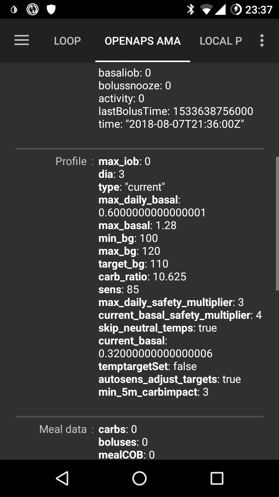

# Loop 사용자를 위한 FAQ

FAQ에 질문 추가하기: 다음 [설명](../make-a-PR.md)을 따르세요

# 포괄적인 정보

## AndroidAPS 설치 파일을 다운로드 할 수 있습니까?

아니오. AndroidAPS apk 파일을 다운받을 수 없습니다. 본인 스스로 파일을 [빌드](../Installing-AndroidAPS/Building-APK.md)해야만 합니다. 그 이유는 다음과 같습니다:

AndroidAPS 는 인슐린펌프를 제어하고 인슐린을 주입하는 기기입니다. 유럽에의 현제 법률 규정에 따르면 Class IIa 혹은 Class IIb 단계의 의료기기는 많은 연구와 검증을 요하는 규제승인(CE마크)를 획득하여야 합니다. 허가 받지 않은 기기를 배포하는 행위는 불법입니다. 세계의 다른 지역에서도 마찬가지로 비슷한 규제가 존재합니다.

이 규정은 (금전적인 대가에 대한 의미로서) 판매하는 것에만 적용되는 것이 아닙니다. 다른 어떠한 종유의 (금전적인 대가 없는) 배포에도 역시 적용됩니다. 본인 스스로 이 장치를 빌드하는 것이 이러한 규제에 영향을 받지 않을 유일한 방법입니다.

이것이 APK 파일 다운로드를 할 수 없는 이유입니다.

## 어떻게 시작해야 합니까?

우선, **Loop가능한 하드웨어 장치들**이 필요로 합니다:

* [지원되는 인슐린펌프](Pump-Choices.md), 
* [안드로이드 스마트폰](Phones.md) (아이폰은 AndroidAPS에서 지원하지 않습니다 - 아이폰을 사용하려면 Loop를 알아보세요 [iOS Loop](https://loopkit.github.io/loopdocs/)) 
* [연속혈당측정기](../Configuration/BG-Source.rst). 

두번째로, **본인의 하드웨어를 설정해야 합니다**. [단계별 튜토리얼 설정 예시를 확인해 보세요](Sample-Setup.md).

세번째로, **소프트웨어 요소들을 설정하여야 합니다**: AndroidAPS 와 CGM/FGM 소스.

네번째로, **관리 요인에 대해 확인하기 위하여 OpenAPS 참조 설계에 관한 공부를하고이해하여야 합니다**. Closed Loop를 하기 위해 가장 기본적으로 요구되는 사항은, 당신의 Basal양과 탄수화물 비율(carb ratio)가 정확해야한다는 점입니다. Closed Loop의 모든 제안들은 당신 필요한 Basal 적정하다고 가정하고 계산됩니다. 따라서 모든 혈당 피크와 저점은 (운동, 스트레스 등) 다른 일시적인 요인들의 결과이며, 인슐린의 일시적인 조절로 관리가 가능하다고 가정합니다. 안전을 위해, Closed Loop가 조절을 하는데 제한이 있습니다. ([OpenAPS Reference Design](https://openaps.org/reference-design/)에서 최대 허용 임시Basal 양을 확인해보세요.) 이것은 당신이 잘못 설정된 Basal양을 바로잡는 용도로 Loop를 사용해서는 안된다는 것을 의미합니다. 예를 들면, 만약 당신이 식사전에 저혈당에 자주 노출된다면 Basal양을 조정할 필요한 것일 수도 있습니다. Autotune</ 0>을 사용하면, 많은 양의 데이터를 기반으로 Basal 및 ISF 조정이 필요한지 혹은 탄수화물 비율(carb ratio)이 변경될 필요가 있는지를 알 수 있습니다. 혹은 [전통적인 방법](http://integrateddiabetes.com/basal-testing/)을 통해서 당신의 Basal량을 테스트하고 설정할 수도 있습니다.
 

## Loop를 위한 실질적인 조언들

### 비밀번호 보호

설정이 쉽게 변경되길 원치 않는다면 설정에 암호를 걸어 보호할 수 있습니다. 설정에서 "설정 비밀번호"를 선택하여 원하는 비밀번호를 입력하면 됩니다. 그 이후로는 설정에 들어갈때마다 비밀번호를 물어볼것입니다. 비밀번호 삭제를 원하면 "설정 비밀번호"를 선택한 후 모든 글자를 삭제하세요.

### 안드로이드 웨어 스마트워치

Bolus를 주입하거나 설정을 변경하기 위해 안드로이드 워치앱을 사용할 계획이라면 AndroidAPS의 알림이 차단되지않은 것을 확인하여야 합니다. 알림을 통하여 확인할 수 있습니다.

### 펌프 일시중지

샤워/목욕/수영/운동 등을 위해 펌프를 분리한다면. 그 기간동안 인슐린이 주입되지 않았다는 것을 AndroidAPS에게 알려 올바른 IOB를 유지시켜야합니다.

* 홈 화면의 상단의 'Closed loop' (또는 'Open Loop') 버튼을 길게 누릅니다. 
* **'X분(시간) 동안 펌프 일시중지'**을 선택합니다
* 이는 해당 시간동안 Basal을 0으로 설정할 것입니다.
* 일시중지를 위한 최소시간은 펌프에서 설정될 수 있는 최소시간의 임시Basal 시간으로 인한 것입니다. 따라서 짧은 기간 동안 연결을 끊으려면 펌프에 사용 가능한 가장 짧은 기간을 선택하십시오. 그런 다음 아래 설명에 따라 펌프를 수동으로 다시 연결하십시오.
* 'Closed Loop' (또는 'Open Loop') 버튼이 '연결 끊어짐(xx분)'으로 남은시간과 함께 변경되고 버튼의 색상도 붉은색으로 변합니다.
* AAPS가 선택된 시간이후 자동으로 재연결되게 되고 Closed Loop 역시 자동으로 다시 작동됩니다.
    
    

* 선택된 시간이 너무 길다면 수동으로 재연결 할 수 있습니다.

* 붉은색의 '연결 끊어짐(xx분)' 버튼을 길게 누릅니다.
* '펌프 재연결'을 선택하세요
    
    

### 단 하나의 CGM 혈당값을 기반으로 판단하는 것이 아닙니다.

안전상의 이유로, CGM에서 들어오는 하나의 혈당값뿐만 아니라 평균 혈당 증분까지 기반으로 하여 판단하게 됩니다. 따라서 센서에서 일부 혈당이 누락되면 AndroidAPS가 필요한 새 데이터를 수집한 다음를 Loop를 다시 시작하는 데 시간이 걸릴 수 있습니다.

### 추가 참고자료

Loop를 사용하는데 있어서 실질적으로 필요한 사항에 대해 이해하는데 도움이 될만한 좋은 팁들이 있는 여러 블로그들이 있습니다.

* [설정 미세 조정하기](http://seemycgm.com/2017/10/29/fine-tuning-settings/) See my CGM
* [왜 DIA가 중요한가요?](http://seemycgm.com/2017/08/09/why-dia-matters/) See my CGM
* [식사후 혈당의 Spike(급등락) 제어하기](https://diyps.org/2016/07/11/picture-this-how-to-do-eating-soon-mode/) #DIYPS
* [호르몬과 Autosens](http://seemycgm.com/2017/06/06/hormones-2/) See my CGM

## 어떤 응급 장비가 준비되어 있어야 하나요?

우선, 인슐린 펌프를 사용하는 다른 1형당뇨인에게 필요한 것과 동일한 응급 장비가 있어야 합니다. AndroidAPS에서 Loop를 사용한다면 다음과 같은 추가 장비를 휴대하거나 근처에 구비해도는 것을 강하게 추천합니다.

* 스마트 폰, 워치 및 (필요한 경우) 블루투스 리더기를 충전하기 위한 보조배터리
* 당신이 사용하는 앱을 클라우드에 백업하세요: 최신 AndroidAPS-APK 설치파일, Key store 비밀번호, AndroidAPS 설정 파일, xDrip 설정파일, (패치된) Dexcom앱 등
* 펌프 배터리

## CGM/FGM을 어떻게 안전하게 부착하나요?

테이프를 부착할 수 있습니다: 일반적인 CGM 센서모양에 맞게 제작된 패치테이프가 판매되고 있습니다. (구글이나 이베이에서 찾아보세요). 일부 Loop사용자는 저렴한 일반 운동용 테이프를 사용하기도 합니다.

고정하는 방법이 있습니다: CGM/FGM을 고무 밴드로 고정시키는 팔뚝 밴드가 판매되고 있습니다 (구글이나 이베이에서 찾아보세요).

# AndroidAPS 설정

다음 사항은 설정을 최적화하는데 도움을 주기 위한 것들입니다. 위에서 아래 순서대로 시작하는것이 가장 좋습니다. 다음번 설정을 변경하기 전에 현재의 설정이 제대로 되었는지 집중하세요. 한번에 모든 것을 완벽하게 설정하려하기 보단 조금씩 단계별로 진행하세요. [Autotune](https://autotuneweb.azurewebsites.net/) 기능을 사용할 수 있지만 맹목적으로 신뢰하여서는 안됩니다: 당신에게는 이 기능이 맞지 않을 수도 있고 또는 모든 환경에서 제대로 작동되지 않을 수도 있습니다. 각 설정이 상호 작용한다는 점을 명심하십시오. 특정 환경 (예: 너무 높은 Basal이 너무 높은 CR과 동시에 발생하는 경우)에서 제대로 작동하는 '잘못된' 설정이 있을 수 있지만 다른 환경에서는 그렇지 않습니다. 이는 당신이 모든 설정을 고려하고 다양한 환경에서 함께 잘 작동하는지 확인해야 함을 의미합니다.

## 인슐린 활동 기간(Duration of insulin activity : DIA)

### 설명 & 테스트

인슐린이 완전히 분해되어 0이 될때까지 걸리는 시간.

이 값은 때때로 너무 짧게 잘못설정하는 경우가 있습니다. 일반적인 경우 최소 5시간, 또는 6 혹은 7 시간으로 설정하게 됩니다.

### 영향

너무 짧은 DIA는 저혈당을 유발할 수 있습니다. 그리고 반대의 경우도 마찬가지입니다.

DIA가 너무 짧게 설정되면, AAPS가 당신이 직전에 주입한 Bolus가 모두 흡수되었다고 너무 일찍 판단하게 되고 그 때 혈당이 높이 유지되고 있다면 적정양 이상으로 인슐린을 더 주입하게 될것입니다. (실제로는, 그렇게 오래 기다리지 않지만 어떤 일이 발생하고 인슐린을 추가를 유지할 것인지 예측합니다). 이것이 근본적으로 AAPS가 알지 못하는 '인슐린 축적'을 발생시키게 됩니다.

너무 짧은 DIA의 예는 고혈당에 이은 AAPS의 과도한 교정주입이고 이는 저혈당을 야기시키게 됩니다.

## Basal 양 설정(U/h)

### 설명 & 테스트

안정적인 혈당을 유지하기 위해 특정 시간대에 설정되는 인슐린의 양.

Loop를 중지, 금식하고, 음식을 먹은 후 5 시간 동안 기다린 후 혈당이 어떻게 변하는 지 확인하여 Basal 양을 테스트하세요. 이를 몇번 더 반복해봅니다.

혈당이 떨어지면, Basal 양이 너무 높은 것입니다. 그리고 반대의 경우도 마찬가지입니다.

### 영향

너무 높은 Basal 양은 저혈당을 유발할 수 있습니다. 그리고 반대의 경우도 마찬가지입니다.

AAPS는기본적으로 Basal 양을 기반으로 합니다. Basal 이 너무 높으면, '제로 임시'(임시 Basal 0)이 원래보다 큰 음의 IOB로 계산됩니다. 이로 인해 AAPS는 궁극적으로 제로 IOB에 도달하는 것보다 더 많은 후속 교정을 유발하게 될것입니다.

따라서 Basal 양이 너무 높으면 기본 Basal 양과 AAPS의 교정을 통해 저혈당이 발생하게 됩니다.

반대로 Basal 양이 너무 낮으면, 목표까지 혈당을 떨어뜨리는데 실패하게 되어 고혈당이 발생하게 됩니다.

## 인슐린 민감도(ISF) (mmol/l/U 또는 mg/dl/U)

### 설명 & 테스트

인슐린 1U 투여로 혈당이 얼마나 떨어지는지에 대한 설정

적정량의 Basal이 설정이 되어 있다고 가정하고, Loop를 중지 IOB가 0인지 확인한 다음 조금 더 '높은' 혈당 수치에 도달하도록 식염포도당 몇알을 복용하여 테스트할 수 있습니다.

그런 다음 목표로한 혈당에 도달하기 위해 일정량의 인슐린 (현재 ISF를 기준으로) 을 주입하세요.

이 설정이 종종 매우 낮게 설정되므로 주의하세요. 너무 낮게 설정되면 1U이 예상보다 더 빨리 혈당을 강하시키게 됩니다.

### 영향

**낮은 ISF** (예: 50 대신 40) = 각 인슐린 단위에 대해 더 공격적이고/강하게 되어 더 크게 혈당을 강하시킵니다. 너무 낮다면, 저혈당을 유발할 수 있습니다.

**높은 ISF** (예: 35 대신 45) = 각 인슐린 단위에 대해 덜 공격적이고/약하게 되어 더 작게 혈당을 강하시킵니다. 너무 높다면, 고혈당을 유발할 수 있습니다.

**예:**

* 혈당이 190 mg/dl 이고 목표는 100 mg/dl 라고 가정합니다. 
* 따라서, 이는 90 mg/dl을 강하시켜야하는 상황입니다 (190 - 100).
* ISF를 30으로 설정했을 경우 -> 90 / 30 = 3유닛의 인슐린
* ISF를 45로 설정했을 경우 -> 90 / 45 = 2유닛의 인슐린

AAPS가 고혈당을 잡기위해 실제로 필요한 양보다 더 많은 인슐린이 필요하다고 생각할 수 있기 때문에, 너무 낮은 ISF는 '인슐린 과잉 주입'을 유발 할 수 있습니다. 이는 '롤러 코스터' 혈당을 유발할 수 있습니다. (특히. 금식 중일 때). 이 상황에서는 ISF를 올려야합니다. 이는 AAPS가 더 적은양을 주입하게 하여, 고혈당일때 과도한 주입을 하지 않게 함으로써 저혈당을 방지하게 됩니다.

반대로, ISF가 너무 높으면 주입이 불충분하게 되고, 혈당이 높게 유지가 되게됩니다 - 특히 수면중에 이런 현상이 초래하게 됩니다.

## 인슐린-탄수화물 비(IC) (g/U)

### 설명 & 테스트

인슐린 1U이 탄수화물 몇 그램(g)을 처리할 수 있는지에 대한 설정.

IC대신 I:C라고도 하며, 탄수화물비율(CR)이라는 용어로 사용되기도 합니다.

적정한 양의 Basal이 설정되어 있다고 가정하고, IOB가 0인 상태에서 혈당이 적정 범위내에 있고 탄수화물양을 확실히 알고 있는 음식을 섭취하고 현재 인슐린-탄수화물비에 기초로 추정된 인슐린을 주입함으로써 이를 테스트할 수 있습니다. 최선의 방법은 당신이 보통 먹는 시간대에 평소 먹는 음식을 섭취하고 정확한 탄수화물양을 계산하는 것입니다.

> **참고:**
> 
> 일부 유럽 국가들에서는 얼마나 많은 인슐린이 필요한지 결정하기 위해 빵 단위(bread units)를 사용합니다. 초기엔 1 빵단위(bread unit)가 12g의 탄수화물에 해당하였었는데, 나중에 10g의 탄수화물로 변경되었습니다.
> 
> 이 빵단위 모델에서는 탄수화물의 양은 고정되어있고 인슐린의 양이 가변적입니다. ("1 빵단위(bread unit)를 처리하기 위해 얼마나 많은 인슐린이 필요합니까?")
> 
> 반대로 IC를 사용할땐 인슐린 양이 고정되어 있고 탄수화물 양이 가변적입니다. ("1유닛의 인슐린이 얼마나 많은 탄수화물(g)을 처리할 수 있습니까?")
> 
> 예:
> 
> Bread unit fatcor (BU = 12g carbs): 2,4 U/BU -> You need 2,4 units of insulin when you eat one bread unit.
> 
> Corresponding IC: 12g / 2,4 U = 5,0 g/U -> 5,0g carbs can be covered with one unit of insulin.
> 
> BU factor 2,4 U / 12g ===> IC = 12g / 2,4 U = 5,0 g/U
> 
> Conversion tables are available online i.e. [here](https://www.mylife-diabetescare.com/files/media/03_Documents/11_Software/FAS/SOF_FAS_App_KI-Verha%CC%88ltnis_MSTR-DE-AT-CH.pdf).

### 영향

**낮은 IC** = 인슐린 단위당 더 적은 음식양, 즉 일정 양의 탄수화물에 대해 더 많은 인슐린이 주입됩니다. '더 공격적'이라고 할 수 있습니다.

**높은 IC** = 인슐린 단위당 더 많은 음식양, 즉 일정 양의 탄수화물에 대해 더 적은 인슐린이 주입됩니다. '덜 공격적'이라고 할 수 있습니다.

식사가 소화가 되고 IOB가 0으로 복귀했는데 혈당이 식사전 보다 더 높게 유지가 되었다면, IC가 너무 높이 설정되었을 가능성이 있습니다. 반대로 혈당이 식사전보다 낮다면, IC가 너무 작게 설정되었을 가능성이 있습니다.

# APS 알고리즘

## 프로파일의 설정엔 다른 DIA가 설정이 되어있음에도 불구하고 왜 "OPENAPS-AMA" 탭에서는 "dia:3"으로 표시되나요?

AMA에서, DIA가 실제 '인슐린 활동 기간'을 의미하지 않습니다. 과거에 DIA와 관련된 매개 변수였습니다. 현재는 '교정이 완료되는 시간'를 의미합니다. IOB계산과는 관계가 없습니다. OpenAPS SMB에서는, 이 매개변수가 더 이상 필요로 하지 않습니다.

## 프로파일

### DIA (인슐린 활동 시간)을 2-3시간 대신 최소 5시간 이상을 사용하는 이유가 무엇입니까?

[여기](http://www.diabettech.com/insulin/why-we-are-regularly-wrong-in-the-duration-of-insulin-action-dia-times-we-use-and-why-it-matters/)에 잘 설명이 되어 있습니다. DIA 변경 후 `프로파일 활성화하기`하는 것을 잊지마세요.

### 무엇 때문에 나의 혈당이 COB 없이 자주 저혈당이 발생하게 합니까?

우선, 당신의 Basal 양을 확인하고 탄수화물없이 Basal양을 테스트해보세요. 만약 Basal 양이 올바르다면, 일반적으로 너무 낮은 ISF가 원인일 수 있습니다. 너무 낮은 ISF의 일반적인 예는 다음과 같습니다:

### Closed Loop에서 높은 식후 피크의 원인은 무엇입니까?

우선, 당신의 Basal 양을 확인하고 탄수화물없이 Basal양을 테스트해보세요. 만약 Basal 양이 올바르고 탄수화물이 충분히 섭취된 이후에야 목표를 향해 혈당이 떨어진다면, 식사전에 AndroidAPS에서 '식사 직전' 임시 목표를 설정하거나 의사와 함께 적당한 사전 Bolus 시간에 대해 상의해보시기 바랍니다. 만약 식사후 혈당이 너무 높고 탄수화물이 충분히 흡수된 이후로도 여전히 높다면, 의사와 IC를 줄이는 것을 상담하여 보세요. COB가 활성상태에서 혈당이 너무 높고 탄수화물이 모두 흡수된 후 혈당이 너무 낮다면, IC를 늘리는 것과 적당한 사전 Bolus 시간에 대하여 의사와 상담해보세요.

# 기타 설정

## Nightscout 설정

### AndroidAPS NSClient가 '허가 되지 않았다'라 표시되며 데이터를 업로드하지 않습니다. 어떻게 해야 하나요?

NSClient에서 '연결 설정'을 확인하세요. 아마도 허가되지 않은 와이파이망에 연결되어 있거나 혹은 '충전중일때만'을 활성화하고 충전케이블을 연결하지 않았을것입니다.

## CGM 설정

### 왜 AndroidAPS에서 '혈당 소스가 고급 필터링을 지원하지 않는다'라고 표시되나요?

xDrip native 모드에서 Dexcom G5 또는 G6 이외의 CGM/FGM을 사용하는 경우 AndroidAPS의 OpenAPS 탭에 이 경고가 표시됩니다. 자세한 사항은 [혈당 데이터 평활화](../Usage/Smoothing-Blood-Glucose-Data-in-xDrip.md)을 확인하세요.

## 펌프

### 펌프를 어디에 착용해야합니까?

펌프를 착용할 위치로 여러 군데의 옵션이 있습니다. 펌프 착용 위치가 Loop를 사용하는데 있어서 영향을 주진 않습니다.

### 배터리

Loop사용은 펌프 배터리를 더 빠르게 소모시킬 수 있습니다. 이는 일반적인 사용보다 더 빈번하게 블루투스 통신을 하기 때문입니다. 배터리를 25%가 되면 교체하는 것이 좋습니다. 그렇지 않으면 펌프 통신이 불안정 할 수 있습니다. Nightscout 사이트에 PUMP_WARN_BATT_P 변수를 사용하면 펌프배터리 경고 알람을 설정할 수 있습니다. 다음은 배터리 수명을 늘려줄 수 있는 요령입니다:

* 펌프 설정메뉴에서 LCD가 켜져있는 시간을 줄여주세요.
* 펌프 설정메뉴에서 백라이트가 켜져있는 시간을 줄여주세요.
* 펌프 설정메뉴에서 진동보다는 소리알람으로 설정하세요.
* 교체시에만 펌프에 있는 버튼을 이용하세요. 이력, 배터리 및 주사기 용량들을 확인할땐 AndroidAPS를 이용하세요.
* AndroidAPS가 특정스마트폰에서는 자원과 메모리를 절약하기 위해 자주 종료될 수도 있습니다. AndroidAPS 재시작될때마다 펌프와 블루투스로 연결이 될 것이고, 현재 Basal과 Bolus 이력을 다시 조회하게 됩니다. 이것이 배터리를 소모시키게 됩니다. 이러한 행동을 확인하고 싶으면 설정 > NSClient 로 가서 '앱시작을 NS에 기록하기'를 활성화 하세요. AndroidAPS가 재시작할때마다 Nightscout 이벤트를 기록하게 되며, 이 문제를 쉽게 추적할 수 있습니다. 이 문제를 해결하기 위해서 스마트폰 배터리 설정에서 AndroidAPS를 예외 허용케 하여, 폰이 스스로 배터리를 절약하기 위해 강제 종료를 못하도록 방지합니다.
    
    예를 들면, Android Pie(안드로이드 9.0) 삼성폰에서 예외를 허용하기 위해서:
    
    * 설정 -> 디바이스 관리 -> 배터리 에 들어갑니다 
    * AndroidAPS가 나올때까지 스크롤하여 선택합니다 
    * "앱을 휴면 상태로 두기" 를 선택 취소합니다.
    * 또 설정 -> 앱 -> (화면 우측상단의 점 세개 기호) 에 들어간 후 "특별한 접근" -> 배터리 사용량 최적화에 들어갑니다
    * AndroidAPS를 찾은 후 선택 해제되어있는지 확인합니다.

* 알코올로 배터리 전극을 청소하여 왁스및 그리스 잔여 물이 남아 있지 않도록 합니다.

* [Dana R/RS 펌프](../Configuration/DanaRS-Insulin-Pump.md)의 경우 배터리를 처음 삽입후 시동하게 되면 배터리에 고전류를 흐르게하여 산화피막 막을 의도적으로 파괴하게 됩니다. 이는 보관시 에너지의 손실을 방지하기 위함입니다. 하지만 이 작업이 100% 항상 성공하는 것은 아닙니다. 펌프화면에 배터리가 100%가 표시될때까지 배터리를 2-3차례 제거 및 재삽입하거나, 금속을 이용하여 배터리의 양극을 닿도록하여 쇼트하는 방법을 사용할 수 있습니다.
* 더 많은 정보는 [특정 유형의 배터리](../Usage/Accu-Chek-Combo-Tips-for-Basic-usage#battery-type-and-causes-of-short-battery-life)에서 확인하세요

### 주사기 및 캐뉼라 교체

카트리지 AndroidAPS를 통해 교체 할 수 없으므로 교체는 이전과 마찬가지로 펌프에서 수행해야합니다.

* 홈 탭에서 "Open Loop"/"Closed Loop"를 길게 누르고 '1시간동안 Loop 일시 중지'를 선택하세요
* 이제 펌프를 떼어내고 펌프의 지시에 따라 주사기를 교체합니다.
* Also piming and filling tube and canula can be done directly on the pump. In this case use [PRIME/FILL button](../Usage/CPbefore26#pump) in the actions tab just to record the change.
* Once reconnected to the pump continue the loop by long pressing on 'Suspended (X m)'.

캐뉼라 교체는 펌프의 "프라임 주입 세트" 기능을 사용하지 않지만, Bolus를 이용하여 주입세트 그리고/또는 캐뉼라를 채우는 것은 Bolus 이력에 나타나지 않습니다. 이는 임시 Basal 양을 중단하지 않음을 의미합니다. On the Actions (Act) tab, use the [PRIME/FILL button](../Usage/CPbefore26#pump) to set the amount of insulin needed to fill the infusion set and start the priming. 양이 충분치 않으면, 다시 채움을 하세요. 기본 인슐린 양 버튼은 설정 > 기타 > 채움/교체에서 설정할 수 있습니다. 바늘 길이와 튜브 길이에 따라 얼마나 많은 유닛이 채워져야하는지 캐뉼라 상자안의 설명서를 확인하세요.

## 배경화면

스마트폰용 AndroidAPS 배경화면을 [폰 페이지](../Getting-Started/Phones#phone-background)에서 확인할 수 있습니다.

## 일상생활

### 위생

#### 샤워나 목욕시 어떻게 하나요?

샤워나 목욕시 펌프를 떼어낼 수 있습니다. 짧은 시간동안은 펌프가 일반적으로 필요없을 것입니다. 하지만 올바른 IOB 계산을 위해서 AAPS에게 이러한 상황을 알려주어야 합니다.

[위 설명](../Getting-Started/FAQ#disconnect-pump)을 확인하세요.

### 업무

당신의 직업의 종류에 따라서, 근무일에 다른 설정을 사용할 수 있습니다. Loop 사용자는 근무일에 [프로파일 변경](../Usage/Profiles.md)사용 하는 것(예. 사무실에 앉아 있는 경우라면 8시간동안 100% 이상 혹은 활동량이 많은 직업일 경우라면 100% 미만으로 설정), 높거나 낮은 임시목표 설정하는 것, 혹은 (평소보다 훨씬 빨리 또는 늦게 깨어 난 경우) 프로파일 시간 이동하는 것을 고려해보아야 합니다. [Nightscout 프로파일](../Configuration/Config-Builder#ns-profile)을 사용한다면, 다른 프로파일을 생성(예 '집' 혹은 '근무날')하고 실제 필요한 프로파일로 변경할 수 있습니다.

## 여가 활동

### 스포츠

Loop를 사용하기 전이 가졌던 오랜 운동 습관들을 고쳐야합니다. 운동시 예전과 같이 탄수화물을 섭취한다면, Closed Loop가 이를 인식하고 교정하려고 할 것입니다.

따라서 당신의 체내에 탄수화물이 더 많이 있게될 것이지만, 동시에 Loop가 이에 대응하고 인슐린을 주입하게 됩니다.

Loop시 아래 단계를 시도해보아야 합니다:

* 100% 미만의 [프로파일 변경](../Usage/Profiles.md).
* 표준 목표 이상으로 [활동 임시 목표](../Usage/temptarget#activity-temp-target) 설정.
* SMB를 사용하고 있다면 ["높은 임시 목표에서 SMB 사용하기"](../Usage/Open-APS-features#enable-smb-with-high-temp-targets)를 활성화하고 ["항상 SMB 사용하기"](../Usage/Open-APS-features#enable-smb-always)는 비활성화 하세요.

이러한 설정의 사전 및 사후 처리가 중요합니다. 운동 전 미리 이러한 설정을 변경하고, 근력운동이 주는 영향도 고려하세요.

같은 시간에 운동을 규칙적으로 한다면 (예: 운동 수업 등) 프로파일변경이나 임시목표를 설정하기 위해서 [자동화](../Usage/Automation.rst) 기능을 사용하는 것을 고려해봄직합니다. 위치 기반 자동화도 좋은 생각일 수 있지만 사전처리를 더 어렵게 할 수 있습니다.

프로파일 변경의 퍼센트, 활동 임시 목표 설정 그리고 변경하는 최고의 시간은 모두 개개인에 따라 다릅니다. 당신에게 적합한 설정값을 찾을때 우선 보수적으로 시작하세요 (낮은 퍼센트의 프로파일 변경과 높은 임시목표로 시작해보세요).

### 성교

방해받고 싶지 않다면 펌프를 떼어낼 수 있습니다만, IOB가 올바르게 계산되도록 AAPS에게 알려주세요.

[위 설명](../Getting-Started/FAQ#disconnect-pump)을 확인하세요.

### 음주

알콜이 혈당에 어떤 영향을 줄지 알고리즘이 예측할 수 없기때문에 Closed Loop에서 음주하는것은 위험합니다. AndroidAPS에서 다음 기능들을 사용하여 음주시 어떻게 대처해야하는지 본인만의 방법을 찾아야합니다.

* Closed Loop를 비활성화하고 수동으로 당뇨를 관리하거나
* 높은 임시 목표를 설정하고 UAM을 비활성화하여 의도치 않고 섭취한 음식으로 인해 Loop가 IOB를 높이는 것을 방지하거나
* 100%보다 훨씬 낮게 프로파일을 변경합니다. 

음주를 할때는, CGM을 항시 확인해서 스스로 저혈당이 예상될 경우 직접 탄수화물을 섭취하여 저혈당을 방지하여야 합니다.

### 수면

#### 전화통화 및 WIFI 사용 없이 야간에 Loop를 어떻게 작동할 수 있습니까?

많은 사용자들이 야간에 폰을 비행기모드로 전환합니다. 수면중에 Loop 실행을 원한다면, 다음과 같이 진행하세요 (이 방법은 오직 xDrip+ 혹은 패치된 덱스콤 앱과 같은 로컬 혈당 소스만 사용가능하며, Nightscout로 부터 혈당을 받아오는 것은 불가능합니다):

1. 폰에서 비행기모드를 작동합니다.
2. 비행기모드 활성화될때까지 기다립니다.
3. 블루투스를 켭니다.

이렇게 하면 전화가 오지 않고, 인터넷에도 연결되지 않습니다. 하지만 Loop는 작동합니다.

일부 사용자들이 비행기 모드가 켜져있을 때 로컬 브로드캐스트에 문제가 있는 것을 발견하였습니다 (즉, AAPS가 xDrip +에서 혈당을 받지 못했습니다). 그럴 경우 xDrip+의 설정 > Inter-app settings > Identify receiver 에 들어가서 `info.nightscout.androidaps`를 입력하세요.

### 여행

#### 시간대를 변경하는 방법은 무엇입니까?

다나R 혹은 다나R(한글버전)을 사용한다면 아무것도 할 필요가 없습니다. 다른 펌프 사용자들은 [시간대 변경](../Usage/Timezone-traveling.md) 페이지를 확인하세요.

## 의료 관련 주제

### 입원

AndroidAPS와 DIY Loop에 대한 정보를 당신의 의료진과 공유하길 원한다면 [의료진을 위한 AndroidAPS 가이드](../Resources/clinician-guide-to-AndroidAPS.md)를 출력해 의료진에게 보여주세요.

### 내분비과 의사와의 진료 예약

#### 보고서

Nightscout 리포트(https://당신의NS사이트주소.com/report) 혹은 or [Nightscout 리포터 사이트](https://nightscout-reporter.zreptil.de/)를 이용하세요.