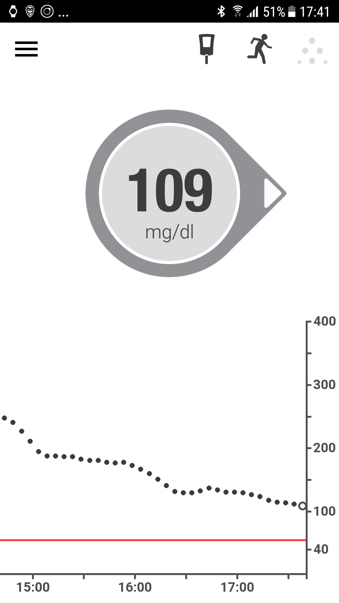
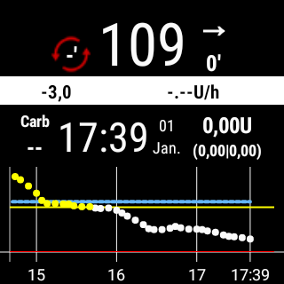

# Sample setup: Samsung S7, Dana RS, Dexcom G6 and Sony Smartwatch

## 상세설명

이 셋업에서는 삼성갤럭시 S7이 Loop를 제어하기 위해 사용되었습니다. The slightly modified Dexcom App reads glucose values from the Dexcom G6 CGM. AndroidAPS is used to control the Dana RS insulin pump from Korean manufacturer SOOIL via bluetooth. 추가적인 장치는 요구되어지지 않습니다.

Dexcom앱은 제한된 알림기능을 제공함에 따라서, 오픈소스앱 xDrip+는 하이/로우 알림기능 외 개인적인 알람기능을 제공하게 됩니다.

추가적으로 안드로이드 스마트워치 또한 사용될 수 있습니다. 이 번 예시에서는 소니 스마트워치3 (SWR50)이 안드로이드 앱에서 혈당치를 보여주도록 설명됩니다. 스마트워치는 AndroidAPS을 제어할 수도 있습니다. (예를 들면 Bolus 주입도 할 수 있습니다.)

시스템은 오프라인에서 작동됩니다. 이는 데이터 연결을 위해서 스마트폰이 인터넷에 연결될 필요가 없음을 의미합니다.

그럼에도 불구하고, 데이트는 인터넷 연결이 될 때, 자동으로 Nightscout에 업로드됩니다. 이렇게 함에 따라서, 병원방문시 사용되는 또는 가족들과 자료를 공유할 수 있는 다양한 보고서를 만들수 있습니다. 사전에 설정된 Wi-fi를 통해서 Nightscout로 데이터를 보낼 수도 있으며, 이는 기존의 Nightscout리포트를 갱신할 수 있습니다.

## 요구사양.

1. 삼성 갤럭시 S7
    
    * 대안: AndroidAPS 사용을 위해 [테스트해본 폰과 워치의 리스트](https://docs.google.com/spreadsheets/d/1gZAsN6f0gv6tkgy9EBsYl0BQNhna0RDqA9QGycAqCQc/edit#gid=698881435)를 확인하세요

2. [DanaRS(다나알에스)](http://www.sooil.com/eng/product/)
    
    * 대안: 
    * [아큐-첵 콤보](../Configuration/Accu-Chek-Combo-Pump.md)
    * [Accu-Chek Insight (아큐첵 인사이트)](../Configuration/Accu-Chek-Insight-Pump.md)
    * [DanaR (다나알)](../Configuration/DanaR-Insulin-Pump.md)
    * [Some old Medtronic pumps (additionally needed: RileyLink/Gnarl hardware, Android Phone with bluetooth low energy / BLE-chipset)](../Configuration/MedtronicPump.md)
    * Other pumps might be available in the future, see [future possible pump drivers](Future-possible-Pump-Drivers.md) for details.

3. [Dexcom G6](https://dexcom.com)
    
    * 대안: 이용가능한 [혈당 소스](../Configuration/BG-Source.rst)리스트를 참조하세요

4. 옵션: 소니 스마트워치3 (SWR50)
    
    * Alternatives: All [watches with Google Wear OS](https://wearos.google.com/intl/de_de/#find-your-watch) should work fine, for details see [list of tested phones and watches](https://docs.google.com/spreadsheets/d/1gZAsN6f0gv6tkgy9EBsYl0BQNhna0RDqA9QGycAqCQc/edit#gid=698881435) for AndroidAPS (OS must be Android Wear)

## Nightscout 설정

[Nightscout 설정](../Installing-AndroidAPS/Nightscout.md)을 참조하세요.

## 컴퓨터 설정

To be able to create an Android app from the freely available AAPS open source code you need Android Studio on your computer or notebook (Windows, Mac, Linux). A detailed instruction can be found at [building the APK](../Installing-AndroidAPS/Building-APK.md).

Please be patient when installing Android Studio as the software downloads a lot of additional data once installed on your computer.

## Smartphone setup

### Check smartphone firmware

* Menu > Settings > Phone info > Software info: At least "Android-Version 7.0" (successfully tested up to Android version 8.0.0 Oreo - Samsung Experience Version 9.0) 
* For firmware update: menu > Preferences > software update

### Allow installation from unknown sources

Menu > Settings > Device security > Unknown sources > slider to right side (= active)

For security reasons this setting should be set back to inactive once the installation of all apps described here has been completed.

### 블루투스를 활성화 시키세요.

1. Menu > Settings > Connections > Bluetooth > slider to right side (= active)
2. Menu > Settings > Connections > Location > slider to right side (= active)

Location services ("GPS") must be activated in order for Bluetooth to work properly.

### Install Dexcom App (modified version)

The original Dexcom app from the Google Play Store will not work because it does not broadcast the values to other apps. Therefore, a version slightly modified by the community is required. Only this modified Dexcom app can communicate with AAPS. Additionally the modified Dexcom App can be used with all Android smartphones not only the ones in [Dexcom's compatibility list](https://www.dexcom.com/dexcom-international-compatibility).

A mmol/l version and a mg/dl version of the modified Dexcom G6 app are available at <https://github.com/dexcomapp/dexcomapp/tree/master/2.4>. You have to choose G6 [app for your region](../Hardware/DexcomG6#if-using-g6-with-patched-dexcom-app).

To do this perform the following steps on your smartphone:

1. If the original Dexcom app is already installed: 
    * Stop sensor
    * Uninstall app via Menu > Settings > Apps > Dexcom G6 Mobile > Uninstall
2. Download modified Dexcom app (check unit mg/dl or mmol/l and [region](../Hardware/DexcomG6#if-using-g6-with-patched-dexcom-app) according to your needs): <https://github.com/dexcomapp/dexcomapp/tree/master/2.4>
3. Install modified Dexcom G6 app on your smartphone (= select the downloaded APK file)
4. Start modified Dexcom G6 app, activate/calibrate the sensor according to the given instructions and wait until the warm-up phase is finished.
5. Once the modified Dexcom app shows actual glucose value, setup the warnings (hamburger menu on top left side of the screen) as follows: 
    * Urgent low `55mg/dl` / `3.1mmol/l` (cannot be disabled)
    * Low `OFF`
    * High `OFF`
    * Rise rate `OFF`
    * Fall rate `OFF`
    * Signal loss `OFF`

## Install AndroidAPS

1. Follow the instructions to [build the APK](../Installing-AndroidAPS/Building-APK#generate-signed-apk)
2. [Transfer](../Installing-AndroidAPS/Building-APK#transfer-apk-to-smartphone) the generated APK to your phone
3. [Configure AndroidAPS](../Configuration/Config-Builder.md) according to your needs using the setup assistant or manually
4. In this sample setup we used (among others)

* BG source: `Dexcom G6 App (patched)` -- click cock-wheel and activate `Upload BG data to NS` and `Send BG data to xDrip+` (see [BG source](../Configuration/BG-Source.rst))

* NS Client activated (see [NS Client](../Configuration/Config-Builder#ns-profile) and [Nightscout setup](../Installing-AndroidAPS/Nightscout.md))

## Install xDrip+

xDrip+ is another mature open source app that offers countless possibilities. In this setup, contrary to what the developers first wrote the app for, xDrip+ is not used to collect glucose data from the Dexcom G6, but only to output alarms and to display the current glucose value including the curve on the Android home screen in the widget. With xDrip+ the alarms can be set much more individually than with the Dexcom software, AAPS or Nightscout (no limitation in the selection of sounds, different alarms depending on day/night time etc.).

1. Download the latest stable APK version of xDrip+ with your smartphone <https://xdrip-plus-updates.appspot.com/stable/xdrip-plus-latest.apk> - not the version from the Google Play Store!
2. Install xDrip+ by selecting the downloaded APK file.
3. Start xDrip+ and make the following settings (hamburger menu at top left) 
    * Settings > Alarms and Alerts > Glucose Level Alert List > Create Alerts (high and low) according to your needs. 
    * The existing alarms can be changed with a long press on the alarm.
    * Settings > Alarms and Alerts > Calibration Alerts: disabled (reminded via the modified Dexcom app)
    * Settings > Hardware Data Source > 640G/EverSense
    * Settings > Inter-app settings > Accept Calibrations > `ON`
    * Menu > Start sensor (is only "pro forma" and has nothing to do with the running G6 sensor. This is necessary otherwise an error message will appear regularly.) 

For more information about xDrip+, see here [BG source page](../Configuration/BG-Source.rst).

### Example of an alarm setup

The "Urgent low alarm" (below 55 mg/dl resp. 3,1 mmol) is a standard alarm from the modified Dexcom app that cannot be disabled.

Tip for meetings / church visits / cinema etc..:

If "Do not disturb" mode is activated in the Samsung Galaxy S7 (Menu > Settings > Sounds and vibration > Do not disturb: slider to right side (= active)), the phone only vibrates during urgent low alarm and does not issue an acoustic warning. For the other alarms set up via xDrip+ you can select whether the silent mode should be ignored (acoustic sound played) or not.

## Disable power saving option

On your Samsung Galaxy S7 go to Menu > Settings > Device Maintenance > Battery > Unmonitored Apps > + Add apps: Select the apps AndroidAPS, Dexcom G6 Mobile, xDrip+ and Android Wear (if smartwatch is used) one after the other

## Optional: Setup Sony Smartwatch 3 (SWR50)

With an Android Wear smartwatch life with diabetes can be made even more inconspicuous. The watch can be used to display the current glucose level, the status of the loop etc. on the wrist. 스마트워치는 AndroidAPS을 제어할 수도 있습니다. (예를 들면 Bolus 주입도 할 수 있습니다.) To do this, double tap the CGM value of the AAPSv2 watchface. The SWR50 usually runs for a full day until the battery needs to be recharged (same charger as the Samsung Galaxy S7: microUSB).

Details about the information displayed on the watchface can be found [here](../Configuration/Watchfaces.md).

* Install the app "Android Wear" on your smartphone via the Google Play Store and connect the smartwatch according to the instructions there.
* In AAPS choose hamburger menu (top left corner) > Config Builder > General (at the bottom of the list) > Wear > activate on left side, click cock wheel > Wear settings and activate `Controls from Watch`
* On your smartwatch: Long press display to change watchface and select `AAPSv2`
* If necessary restart both devices once.

## Pump setup

see [Dana RS pump](../Configuration/DanaRS-Insulin-Pump.md)