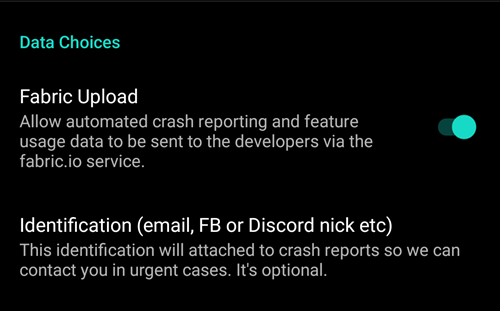

# 설정

- **Open preferences** by clicking the three-dot menu on the top right side of the home screen.

  

- You can jump directly to preferences for a certain tab (i.e. pump tab) by opening this tab and clicking Plugin preferences.

  

- **Sub-menus** can be opened by clicking the triangle below the sub-menu title.

  

- With the **filter** on top of the preferences screen you can quickly access certain preferences. Just start typing part of the text you are looking for.

  

```{contents}
:backlinks: entry
:depth: 2
```

(Preferences-general)=
## General


**Units**

- Set units to mmol/l or mg/dl depending on your preferences.

**Language**

- New option to use phone's default language (recommended).

- In case you want AAPS in a different language than your standard phone language you can choose from a broad variety.

- If you use different languages you might sometimes see a language mix. This is due to an android issue that overriding the default android language sometimes doesn't work.


**Patient name**

- Can be used if you have to differentiate between multiple setups (i.e. two T1D kids in your family).

(Preferences-protection)=
### Protection

(Preferences-master-password)=


#### Master password

- Necessary to be able to [export settings](../Maintenance/ExportImportSettings.md) as they are encrypted from version 2.7. **Biometric protection may not work on OnePlus phones. This is a known issue of OnePlus on some phones.**

- Open Preferences (three-dot menu on top right of home screen)

- Click triangle below "General"

- Click "Master-Password"

- Enter password, confirm password and click ok.

  

#### Settings protection

- Protect your settings with a password or phone's biometric authentication (i.e. [child is using AAPS](../RemoteFeatures/RemoteMonitoring.md)).

- Custom password should be used if you want to use master password just for securing [exported settings](../Maintenance/ExportImportSettings.md).

- If you are using a custom password click on line "Settings password" to set password as described [above](#Preferences-master-password).

  

#### Application protection

- If app is protected you must enter password or use phone's biometric authentication to open AAPS.
- App will shut down immediately if wrong password is entered - but still run in the background if it was previously opened successfully.

#### Bolus protection

- Bolus protection might be useful if AAPS is used by a small child and you [bolus via SMS](../RemoteFeatures/SMSCommands.md).

- In the example below you see the prompt for biometric protection. If biometric authentication does not work, click in the space above the white prompt and enter master password.

  

(Preferences-skin)=
#### Skin

- You can choose from four types of skins:

  

- 'Low resolution skin' comes with shorter label and age/level removed to have more available space on very low resolution screen.

- Difference of other skins depend of phone's display orientation.

##### Portrait orientation

- **Original Skin** and **Buttons are always displayed on bottom of screen** are identical
- **Large Display** has an increased size of all graphs compared to other skins

##### Landscape orientation

- Using **Original Skin** and **Large Display**, you have to scroll down to see buttons at the bottom of the screen

- **Large Display** has an increased size of all graphs compared to other skins

  

(Preferences-overview)=
## 개요

- In overview section you can define preferences for home screen.

  

### 화면을 켜진 상태로 유지

- Useful while giving a presentation.
- It will consume a lot of energy, so it is wise to have your phone plugged into a charger.

(Preferences-buttons)=
### 버튼

- Define which buttons are visible on the bottom of your home screen.

  

- With the increment figure you can define amount for the three buttons in carb and insulin dialogue for easy entry.

  

  

(Preferences-quick-wizard)=
### Quick Wizard

- If you have a frequent snack or meal, you can use the quick wizard button to easily enter amount of carbs and set calculation basics.

- In setup you define during which time period the button will be visible on your home screen - just one button per period.

  

- If you click the quick wizard button AAPS will calculate and propose a bolus for those carbs based on your current ratios (considering blood glucose value or insulin on board if set up).

- The proposal has to be confirmed before insulin is delivered.

  

(Preferences-default-temp-targets)=
### Default temp targets

- [Temp targets (TT)](../DailyLifeWithAaps/TempTargets.md) allow you to define change your blood glucose target for a certain time period.

- With setting of default TT you can easily change your target for activity, eating soon etc.

  

- Press long on your target in the top right corner on the home screen or use the shortcuts in the orange “Carbs” button at the bottom.

  

###

### Fill/Prime standard insulin amounts

- If you want to fill tube or prime cannula through AAPS you can do this through [actions tab](#screens-action-tab).
- Pre-set values can be defined in this dialogue.

(Preferences-range-for-visualization)=
### Range for visualization

- Define which part of the graph on the home screen shall be you target range and be filled with green background.

  

### Shorten tab titles

- See more tab titles on screen.

- For example the 'OpenAPS AMA' tab becomes 'OAPS', 'OBJECTIVES' becomes 'OBJ' etc.

  

(Preferences-show-notes-field-in-treatments-dialogs)=
### Show notes field in treatments dialogs

- Gives you the option to add short text notes to your treatments (bolus wizard, carbs, insulin...)

  

(Preferences-status-lights)=
### Status lights

- Status lights give a visual warning for

  - Sensor age
  - Sensor battery level for certain smart readers (see [screenshots page](#screens-sensor-level-battery) for details).
  - Insulin age (days reservoir is used)
  - Reservoir level (units)
  - Cannula age
  - Pump battery age
  - Pump battery level (%)

- If threshold warning is exceeded, values will be shown in yellow.

- If threshold critical is exceeded, values will be shown in red.

- In versions prior to AAPS 2.7 settings for status lights had to be made in Nightscout settings.

  

(Preferences-deliver-this-part-of-bolus-wizard-result)=
### Deliver this part of bolus wizard result

Set the [default percentage](#AapsScreens-section-j) of the bolus calculated when using the bolus wizard.

Default is 100%: no correction. Even when setting a different value here, you can still change each time you use the bolus wizard.

When using [SMB](#objectives-objective9), using a value lower than 100% here can be useful:
* for people with slow digestion: sending all the bolus upfront can cause hypo because the insulin action is faster than the digestion.
* to leave more room to *AAPS** to deal by itself with **BG rise**. In both cases, **AAPS** will compensate the missing part of the bolus with SMBs, if/when deemed adequate.

(Preferences-advanced-settings-overview)=
### Advanced Settings (Overview)


(Preferences-superbolus)=
#### Superbolus

- Option to enable superbolus in bolus wizard.
- [Superbolus](https://www.diabetesnet.com/diabetes-technology/blue-skying/super-bolus/) is a concept to "borrow" some insulin from basal rate in the next two hours to prevent spikes.

## Treatment safety

### Patient type

- Safety limits are set based on the age you select in this setting.
- If you start hitting these hard limits (like max bolus) it's time to move one step up.
- It's a bad idea to select higher than real age because it can lead to overdosing by entering the wrong value in insulin dialog (by skipping the decimal dot, for example).
- If you want to know the actual numbers for these hard-coded safety limits, scroll to the algorithm feature you are using on [this page](../DailyLifeWithAaps/KeyAapsFeatures.md).

### Max allowed bolus \[U\]

- Defines maximum amount of bolus insulin that AAPS is allowed to deliver at once.
- This setting exists as a safety limit to prevent the delivery of a massive bolus due to accidental input or user error.
- It is recommended to set this to a sensible amount that corresponds roughly to the maximum amount of bolus insulin that you are ever likely to need for a meal or correction dose.
- This restriction is also applied to the results of the bolus calculator.

### Max allowed carbs \[g\]

- Defines the maximum amount of carbs that AAPS bolus calculator is allowed to dose for.
- This setting exists as a safety limit to prevent the delivery of a massive bolus due to accidental input or user error.
- It is recommended to set this to a sensible amount that corresponds roughly to the maximum amount of carbs that you are ever likely to need for a meal.

## Loop

(Preferences-aps-mode)=
### APS mode

- Toggle between open and closed looping as well as low glucose suspend (LGS)
- **Open looping** means TBR suggestions are made based on your data and appear as a notification. After manual confirmation, the command to dose insulin will be transferred to pump. Only if you use virtual pump you have to enter it manually.
- **Closed looping** means TBR suggestions are automatically sent to your pump without confirmation or input from you.
- **Low glucose suspend** is similar to closed looping, but overrides the maxIOB setting to zero. This means that if blood glucose is dropping it can reduce the basal rate, but if blood glucose is rising then it will only increase the basal rate if the basal IOB is negative (e.g. from a previous Low Glucose Suspend).

(Preferences-minimal-request-change)=
### Minimal request change \[%\]

- When using open loop you will receive notifications every time AAPS recommends to adjust basal rate.
- To reduce number of notifications you can either use a wider BG target range or increase percentage of the minimal request rate.
- This defines the relative change required to trigger a notification.

(Preferences-advanced-meal-assist-ama-or-super-micro-bolus-smb)=
## Advanced Meal Assist (AMA) or Super Micro Bolus (SMB)

Depending on your settings in [config builder](../SettingUpAaps/ConfigBuilder.md) you can choose between two algorithms:

- [Advanced meal assist (OpenAPS AMA)](#Open-APS-features-advanced-meal-assist-ama) - state of the algorithm in 2017
- [Super Micro Bolus (OpenAPS SMB)](#Open-APS-features-super-micro-bolus-smb) - most recent algorithm recommended for beginners

### OpenAPS AMA settings

- Allows the system to high-temp more quickly after a meal bolus IF you enter carbs reliably.
- More details about the settings and Autosens can be found in the [OpenAPS docs](https://openaps.readthedocs.io/en/latest/docs/Customize-Iterate/autosens.html).

(Preferences-max-u-h-a-temp-basal-can-be-set-to)=
#### Max U/h a Temp Basal can be set to

- Exists as a safety limit to prevent AAPS from ever being capable of giving a dangerously high basal rate.
- The value is measured in units per hour (U/h).
- It is advised to set this to something sensible. A good recommendation is to take the **highest basal rate** in your profile and **multiply it by 4**.
- For example, if the highest basal rate in your profile was 0.5 U/h you could multiply that by 4 to get a value of 2 U/h.
- See also [detailed feature description](#Open-APS-features-max-u-h-a-temp-basal-can-be-set-to).

#### Maximum basal IOB OpenAPS can deliver \[U\]

- Amount of additional basal insulin (in units) allowed to accumulate in your body, on top of your normal basal profile.
- Once this value is reached, AAPS will stop giving additional basal insulin until your basal Insulin on Board (IOB) has decayed to within this range again.
- This value **does not consider bolus IOB**, only basal.
- This value is calculated and monitored independently of your normal basal rate. It is only the additional basal insulin on top of that normal rate that is considered.

When you begin looping, **it is advised to set Max Basal IOB to 0** for a period of time, while you are getting used to the system. This prevents AAPS from giving any additional basal insulin at all. During this time AAPS will still be able to limit or turn off your basal insulin to help prevent hypoglycaemia. This is an important step in order to:

- Have a period of time to safely get used to the AAPS system and monitor how it works.
- Take the opportunity to perfect your basal profile and Insulin Sensitivity Factor (ISF).
- See how AAPS limits your basal insulin to prevent hypoglycaemia.

When you feel comfortable, you can allow the system to start giving you additional basal insulin, by raising the Max Basal IOB value. The recommended guideline for this is to take the **highest basal rate** in your profile and **multiply it by 3**. For example, if the highest basal rate in your profile was 0.5 U/h you could multiply that by 3 to get a value of 1.5 U/h.

- You can start conservatively with this value and increase it slowly over time.
- These are guidelines only; everyone's body is different. You may find you need more or less than what is recommended here, but always start conservatively and adjust slowly.

**Note: As a safety feature, Max Basal IOB is hard-limited to 7u.**

#### Autosens

- [Autosens](#Open-APS-features-autosens) looks at blood glucose deviations (positive/negative/neutral).
- It will try and figure out how sensitive/resistant you are based on these deviations and adjust basal rate and ISF based on these deviations.
- If you select "Autosens adjust target, too" the algorithm will also modify your glucose target.

#### Advanced settings (OpenAPS AMA)

- Normally you do not have to change the settings in this dialogue!
- If you want to change them anyway make sure to read about details in [OpenAPS docs](https://openaps.readthedocs.io/en/latest/docs/While%20You%20Wait%20For%20Gear/preferences-and-safety-settings.html#) and to understand what you are doing.

(Preferences-openaps-smb-settings)=
### OpenAPS SMB settings

- In contrast to AMA, [SMB](#Open-APS-features-super-micro-bolus-smb) does not use temporary basal rates to control glucose levels, but mainly small super micro boluses.

- You must have started [objective 9](#objectives-objective9) to use SMB.

- The first three settings are explained [above](#Preferences-max-u-h-a-temp-basal-can-be-set-to).

- Details on the different enable options are described in [OpenAPS feature section](#Open-APS-features-enable-smb).

- *How frequently SMBs will be given in min* is a restriction for SMB to be delivered only every 4 min by default. This value prevents the system from issuing SMB too often (for example in case of a temp target being set). You should not change this setting unless you know exactly about consequences.

- If 'Sensitivity raises target' or 'Resistance lowers target' is enabled [Autosens](#Open-APS-features-autosens) will modify your glucose target according to your blood glucose deviations.

- If target is modified it will be displayed with a green background on your home screen.

  

(Preferences-carb-required-notification)=
#### Carb required notification

- This feature is only available if SMB algorithm is selected.

- Eating of additional carbs will be suggested when the reference design detects that it requires carbs.

- In this case you will receive a notification which can be snoozed for 5, 15 or 30 minutes.

- Additionally the required carbs will be displayed in the COB section on your home screen.

- A threshold can be defined - minimum amount of carbs needed to trigger a notification.

- Carb required notifications can be pushed to Nightscout if wished, in which case an announcement will be shown and broadcast.

  

#### Advanced settings (OpenAPS SMB)

- Normally you do not have to change the settings in this dialogue!
- If you want to change them anyway make sure to read about details in [OpenAPS docs](https://openaps.readthedocs.io/en/latest/docs/While%20You%20Wait%20For%20Gear/preferences-and-safety-settings.html#) and to understand what you are doing.

## Absorption settings


(Preferences-min_5m_carbimpact)=
### min_5m_carbimpact

- The algorithm uses BGI (blood glucose impact) to determine when carbs are absorbed.

- The value is only used during gaps in CGM readings or when physical activity “uses up” all the blood glucose rise that would otherwise cause AAPS to decay COB.

- At times when carb absorption can’t be dynamically worked out based on your blood's reactions it inserts a default decay to your carbs. Basically, it is a failsafe.

- To put it simply: The algorithm "knows" how your BGs *should* behave when affected by the current dose of insulin etc.

- Whenever there is a positive deviation from the expected behaviour, some carbs are absorbed/decayed. Big change=many carbs etc.

- The min_5m_carbimpact does define the default carb absorption impact per 5 minutes. For more details see [OpenAPS docs](https://openaps.readthedocs.io/en/latest/docs/While%20You%20Wait%20For%20Gear/preferences-and-safety-settings.html?highlight=carbimpact#min-5m-carbimpact).

- Standard value for AMA is 5, for SMB it's 8.

- The COB graph on the home screen indicates when min_5m_impact is being used by putting an orange circle at the top.

  

### Maximum meal absorption time

- If you often eat high fat or protein meals you will need to increase your meal absorption time.

### Advanced settings - autosens ratio

- Define min. and max. [autosens](#Open-APS-features-autosens) ratio.
- Normally standard values (max. 1.2 and min. 0.7) should not be changed.

## Pump settings

The options here will vary depending on which pump driver you have selected in [Config Builder](#Config-Builder-pump).  Pair and set your pump up according to the pump related instructions:

- [DanaR Insulin Pump](../CompatiblePumps/DanaR-Insulin-Pump.md)
- [DanaRS Insulin Pump](../CompatiblePumps/DanaRS-Insulin-Pump.md)
- [아큐-첵 콤보 펌프](../CompatiblePumps/Accu-Chek-Combo-Pump.md)
- [Accu Chek Insight Pump](../CompatiblePumps/Accu-Chek-Insight-Pump.md)
- [Medtronic Pump](../CompatiblePumps/MedtronicPump.md)

If using AAPS to open loop then make sure you have selected Virtual Pump in config builder.

(Preferences-nsclient)=
## NSClient


Original communication protocol, can be used with older Nightscout versions.

- Set your *Nightscout URL* (i.e. <https://yoursitename.yourplaform.dom>).
  - **Make sure that the URL is WITHOUT /api/v1/ at the end.**
- The *[API secret](https://nightscout.github.io/nightscout/setup_variables/#api-secret-nightscout-password)* (a 12 character password recorded in your Nightscout variables).
- This enables data to be read and written between both the Nightscout website and AAPS.
- Double check for typos here if you are stuck in Objective 1.

## NSClientV3


[New protocol introduced with AAPS 3.2.](#Important-comments-on-using-v3-versus-v1-API-for-Nightscout-with-AAPS) Safer and more efficient.

```{admonition} V3 data uploaders
:class: warning

When using NSClientV3, all uploaders must be using the API V3. Since most are not compatible yet, this means **you must let AAPS upload all data** (BG, treatments, ...) to Nightscout and disable all other uploaders if they're not V3 compliant.
```

- Set your *Nightscout URL* (i.e. <https://yoursitename.yourplaform.dom>).
  - **Make sure that the URL is WITHOUT /api/v1/ at the end.**
- In Nightscout, create an *[Admin token](https://nightscout.github.io/nightscout/security/#create-a-token)* (requires [Nightscout 15](https://nightscout.github.io/update/update/) to use the V3 API) and enter it in **NS access token** (not your API Secret!).
- This enables data to be read and written between both the Nightscout website and AAPS.
- Double check for typos here if you are stuck in Objective 1.
- Leave Connect to websockets enabled (recommended).

### Synchronization

Synchronization choices will depend on the way you will want to use AAPS.

You can select which data you want to [upload and download to or from Nightscout](#Nightscout-aaps-settings).

### Alarm options


- Alarm options allows you to select which Nightscout alarms to use through the app. AAPS will alarm when a Nightscout alarms trigger.
  - For the alarms to sound you need to set the Urgent High, High, Low and Urgent Low alarm values in your [Nightscout variables](https://nightscout.github.io/nightscout/setup_variables/#alarms).
  - They will only work whilst you have a connection to Nightscout and are intended for parent/caregivers.
  - If you have the CGM source on your phone (i.e. xDrip+ or BYODA) then use those alarms instead of Nightscout Alarms.
- Create notifications from Nightscout [announcements](https://nightscout.github.io/nightscout/discover/#announcement) will echo Nightscout announcements in the AAPS notifications bar.
- You can change stale data and urgent stale data alarms threshold when no data is received from Nightscout after a certain time.

### Connection settings


- Connection settings define when Nightscout connection will be enabled.
- Restrict Nightscout upload to Wi-Fi only or even to certain Wi-Fi SSIDs.
- If you want to use only a specific WiFi network you can enter its WiFi SSID.
- Multiple SSIDs can be separated by semicolon.
- To delete all SSIDs enter a blank space in the field.

(Preferences-advanced-settings-nsclient)=
### Advanced settings (NSClient)


Options in advanced settings are self-explanatory.

## SMS 통신기

- Options will only be displayed if SMS communicator is selected in [Config Builder](#Config-Builder-sms-communicator).
- This setting allows remote control of the app by texting instructions to the patient's phone which the app will follow such as suspending loop, or bolusing.
- Further information is described in [SMS Commands](../RemoteFeatures/SMSCommands.md).
- Additional safety is obtained through use of an authenticator app and additional PIN at token end.

## Automation

Select which location service shall be used:

- Use passive location: AAPS only takes locations if other apps are requesting it
- Use network location: Location of your Wi-Fi
- Use GPS location (Attention! May cause excessive battery drain!)

## Local alerts


- Settings should be self-explanatory.

## Data choices



- You can help develop AAPS further by sending crash reports to the developers.

## Maintenance settings


- Standard recipient of logs is <logs@aaps.app>.

## Open Humans

- You can help the community by donating your data to research projects! Details are described on the [Open Humans page](../SupportingAaps/OpenHumans.md).

- In Preferences you can define when data shall be uploaded

  - only if connected to WiFi
  - only if charging
