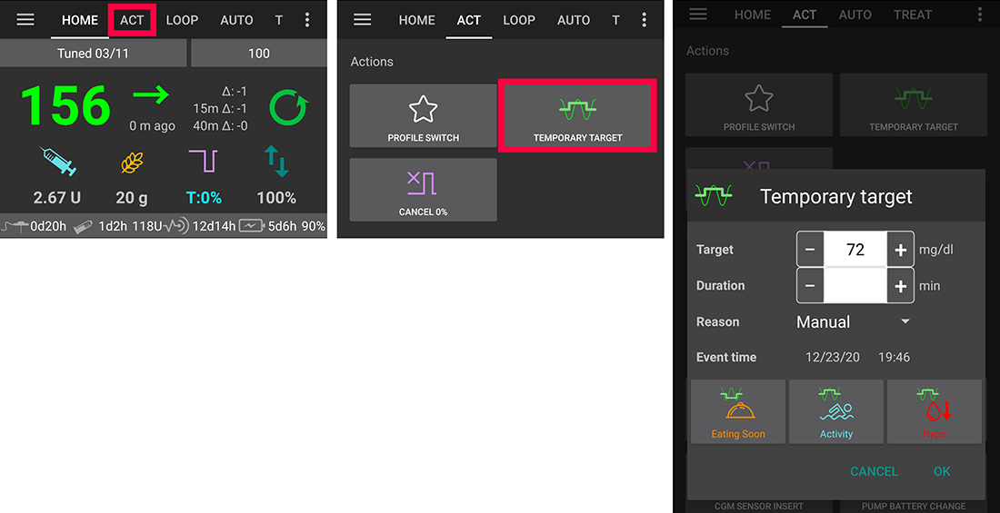

# 임시 목표

## 임시 목표는 무엇이며, 어떻게 설정할 수 있을까요?

임시 목표 (또는 TT) 를 이용하여, 특정 기간 동안 혈당 목표를 변경할 수 있습니다. 이는 대부분 활동 시, 저혈당 시 (탄수화물 교정) 또는 식사 직전에 필요하며, 기본 설정으로 사용할 수 있습니다. 우측 상단 코너에 있는 메뉴의 설정 -> 기타 -> 임시 목표 기본값에서 설정할 수 있습니다.

홈 화면 탭에서 우측 상단 코너에 있는 목표를 길게 누르거나 주황색 "탄수화물" 단축키를 눌러 임시 목표 기본값"을 설정할 수 있습니다. To manually set a [“Custom Temp-Target”](../Usage/temptarget#custom-temp-target) (BG value and/or duration) use “Custom“ after long-pressing your target in the top right corner or use the “Temporary Target“ button in the [actions tab / menu](../Configuration/Config-Builder#actions).

## 저혈당 임시 목표

가장 중요한 임시 목표라고 할 수 있습니다. 다음과 같은 이유 때문입니다:

1. 혈당이 낮아지고 있는 것을 인식했을 때: 보통은 loop이 이를 조절할 수 있지만, 때때로 사용자가 loop보다 먼저 인지할 수도 있습니다. 따라서 목표 혈당값을 높게 설정하면 loop가 보다 빠르게 반응할 수 있습니다.
2. 저혈당 교정 탄수화물 섭취 시, 혈당이 급격히 상승할 수 있습니다. Loop은 이러한 혈당 상승을 교정하거나, SMB가 활성화 되었을 경우 작동시킬 수 있습니다. "저혈당 임시 목표"는 이를 방지할 수 있습니다. 
3. (상급 설정, [목표 10](../Usage/Objectives#objective-10-enabling-additional-oref1-features-for-daytime-use-such-as-super-micro-bolus-smb)): OpenAPS SMB에서 임시 목표가 100mg/dl 또는 5.5mol/l 이상인 경우 "높은 임시 목표 설정이 민감도를 높임" 사용하여 AndroidAPS의 민감도를 높일 수 있습니다.
4. (상급 설정, [목표 10](../Usage/Objectives#objective-10-enabling-additional-oref1-features-for-daytime-use-such-as-super-micro-bolus-smb)): "높은 임시 목표에서 SMB 사용하기"를 비활성화 할 수 있습니다. 이 기능을 비활성화 시, OpenAPS SMB를 사용할 때 COB > 0 이고 "임시 목표에서 SMB 사용하기" 또는 "항상 SMB 사용하기"가 활성화되어 있을지라도, AndroidAPS는 높은 임시 목표가 설정되어 있는 동안에는 SMB를 제공하지 않습니다. 

참고: 혈당이 72mg/dl 또는 4mmol/l 미만인 경우, 탄수화물 버튼을 눌러 탄수화물 입력 시 저혈당 임시목표는 자동으로 활성화됩니다.

## 활동 임시 목표

활동 전이나 활동 중에, 저혈당 예방을 위한 높은 임시 목표 설정을 원할 수 있습니다. "활동 임시 목표" 기본값에서 임시 목표를 쉽게 설정할 수 있습니다. DIA, IOB, 경험에 근거하여 활동 전에 임시 목표를 설정할 수 있습니다. [FAQ의 스포츠 섹션](../Getting-Started/FAQ#sports)을 확인하십시오.

상급 설정, [목표 10](../Usage/Objectives#objective-10-enabling-additional-oref1-features-for-daytime-use-such-as-super-micro-bolus-smb): OpenAPS SMB 사용 시 "활동 임시 목표"의 장점은 임시 목표가 100mg/dl 또는 5.5mol/l 이상일 경우에 "높은 임시 목표 설정이 민감도를 높임" 기능을 활성화할 수 있다는 것입니다. 이를 통해 AndroidAPS는 더 민감하게 작동합니다. 일부 사용자는 활동 임시 목표 대신 활동 전/활동 중에 프로파일 변경을 사용하기도 합니다만, 개개인에 따라서 달라지게 됩니다. 만약 "높은 임시 목표에서 SMB 사용하기"가 비활성화 되어 있다면, OpenAPS SMB를 사용할 때 COB > 0, "임시 목표에서 SMB 사용하기" 또는 "항상 SMB 사용하기"가 활성화되어 있을지라도, AndroidAPS는 SMB를 제공하지 않습니다.

## 식사 직전 임시 목표

곧 식사를 할 예정이라면, 이 임시 목표를 활성화하여 식사 전에 IOB를 늘릴 수 있습니다. 특히 식사 전 bolus를 주입하지 않는 경우, 혈당을 미리 낮추기 위해 좋은 대안이 될 수 있습니다. "식사 직전 모드"와 관련한 많은 정보를 ['“식사 직전” 모드 활용 방법'](https://diyps.org/2015/03/26/how-to-do-eating-soon-mode-diyps-lessons-learned/) 또는 [이곳](https://diyps.org/tag/eating-soon-mode/)에서 확인할 수 있습니다.

상급 설정, [목표 10](../Usage/Objectives#objective-10-enabling-additional-oref1-features-for-daytime-use-such-as-super-micro-bolus-smb): OpenAPS SMB와 "낮은 임시 목표 설정이 민감도를 낮춤"을 사용하는 경우, AndroidAPS는 좀 더 공격적으로 작동합니다. 이 옵션은 임시 목표가 100mg/dl 또는 5.5mmol/l 미만일 때 사용 가능합니다.

## 사용자 지정 임시 목표

때로는 기본값이 아닌 임시 목표를 사용하고자 할 수 있습니다. 홈 화면의 우측 코너에 있는 목표(범위) 를 길게 누르거나 "실행" 탭에서 설정할 수 있습니다.

