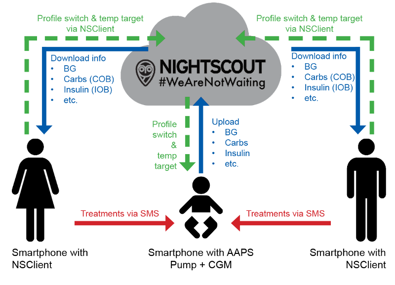

Nuotolinis stebėjimas
**************************************************

  
AndroidAPS siūlo kelis variantus vaikų nuotoliniam stebėjimui, taip pat leidžia siųsti nuotolinio valdymo komandas. Žinoma, jūs galite taip pat naudoti nuotolinį stebėjimą jūsų partneriui arba draugui.

Funkcijos
==================================================
* Vaiko pompa yra kontroliuojama per vaiko telefoną naudojant AndroidAPS.
* Tėvai gali nuotoliniu būdu sekti, matyti visus svarbius duomenis, tokius, kaip gliukozės kiekis, aktyvūs angliavandeniai, aktyvus insulinas, ir pan. naudojant **NSClient app** jų telefone. AndroidAPS ir NSClient parametrai turi būti vienodi.
* Tėvai gali gauti savo telefone perspėjimus, naudodami **xDrip+ programa sekėjo režime**.
* AndroidAPS nuotolinis valdymas naudojant `SMS Komandas <../Children/SMS-Commands.html>`_.
* Profilio perjungimas ir laikinų tikslų nustatymas nuotoliniu būdu per NSClient programą.

Įrankiai ir programos, skirtos nuotoliniam stebėjimui
--------------------------------------------------
* `Nightscout <http://www.nightscout.info/>`_ interneto naršyklėje (pateikiami duomenys)
* NSClient programėlė
* Dexcom Follow, jei naudojate originalią Dexcom programėlę (tik glikemijos duomenys)
* `xDrip+ <../Configuration/xdrip.html>`_ sekėjo režime (glikemijos reikšmės ir **aliarmai**)
*	`Spike <https://spike-app.com/>`_ iPhone telefone (glikemijos reikšmės ir **aliarmai**)

Būtina atsižvelgti
==================================================
* Nustatyti vaikams teisingus `terapijos faktorius <../Getting-Started/FAQ.html#how-to-begin>`_ (bazės, IVT, JIF...) yra sudėtinga, ypač veikiant augimo hormonams. 
* AndroidAPS ir NSClient parametrai turi būti vienodi.
* Atsižvelkite į laiko tarpą tarp pagrindinio telefono ir jūsų naudojamo išmaniojo telefono komunikacijos. Tai lemia įkėlimui ir atsisiuntimui reikalingo laiko trukmė. Taip pat, pagrindinis AAPS telefonas įkelia duomenis tik tuo atveju, jei išmaniajame telefone buvo įvykdyta uždaro ciklo veikla.
* Todėl skirkite laiko, kad nustatytumėte juos teisingai ir išbandykite juos, kai vaikas yra šalia jūsų, ypač prieš pradėdami nuotolinį stebėjimą ir nuotolines terapijas. Mokyklinės atostogos gali būti labai geras laikas tam.
* Koks yra jūsų veiksmų planas, kai nuotolinis valdymas neveikia (t. y. kyla ryšio problemos)?
* Nuotolinis stebėjimas ir terapija gali būti tikrai naudingi vaikui esant darželyje ar pradinėje mokykloje. Tačiau įsitikinkite, kad mokytojai ir auklėtojai žino jūsų vaiko diabeto priežiūros planą. Tokių sveikatos priežiūros planų galima rasti `Facebook "AndroidAPS users" dokumentų skyriuje <https://www.facebook.com/groups/AndroidAPSUsers/files/>`_.
