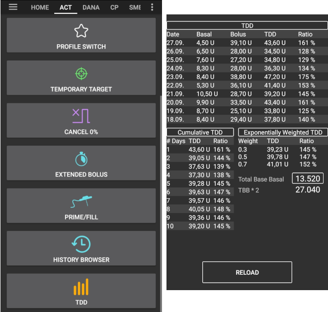

# Konfigūracija

Priklausomai nuo jūsų nustatymų, konfigūratorių galite atidaryti naudodami skirtuką ekrano viršuje arba per trijų juostelių meniu.

Konfigūratorius yra skirtukas, kuriame galite įjungti ir atjungti programos modulius. Kairėje (A) esantys pasirinkimo laukeliai suaktyvina pasirinktą funkciją, dešinėje (C) esantys pasirinkimo laukeliai nustato, ar funkcija rodoma kaip skirtukas (E), ar ne. Tuo atveju, kai reikalingas langelis neaktyvuotas, funkciją galite pasiekti iš išskleidžiamojo meniu (D), esančio viršutiniame kairiajame ekrano kampe.

Jei modulyje yra papildomų parametrų, galite spustelėti krumpliaratį (B), kuris nukreipia jus į nustatymus.

** Pirmoji konfigūracija: ** Pradedant AAPS 2.0 versija, AndroidAPS sąrankos procesą kontroliuoja sąrankos vedlys. Norėdami jį pradėti, spustelėkite trijų taškų meniu viršutiniame dešiniajame meniu ekrano kampe (F) ir pasirinkite „Sąrankos vedlys“.

## Skirtukai arba trijų linijų meniu

Pažymėdami langelį po akies simboliu jūs nuspręsite, kaip atidaryti atitinkamą programos skyrių.

## Profile

Pasirinkite bazės profilį, kurį norite naudoti. Papildomos informacijos apie diegimą rasite puslapyje [ Profiliai ](../Usage/Profiles.md).

### Vietinis profilis (rekomenduojama)

Vietinis profilis yra pagrindinis profilis, rankiniu būdu įvestas į telefoną. Pasirinkus vietinį profilį, pasirodo naujas skirtukas, kuriame prireikus galite pakeisti iš pompos nuskaitytus profilio duomenis. Kito prijungimo prie profilio metu jie bus įrašyti į pompos profilį Nr. 1. Mes rekomenduojame šį profilį, nes jis nepriklauso nuo jūsų interneto ryšio.

Privalumai:

* norint pakeisti profilio parametrus, nereikia interneto ryšio
* profilio pakeitimai gali būti atliekami tiesiogiai telefone

Trūkumai:

* tik vienas profilis

### NS profilis

NS Profilis naudoja profilius, kuriuos išsaugojote savo Nightscout svetainėje (https://[yournightscoutsiteaddress]/profilis). Jei norite pakeisti aktyvų profilį, galite naudoti [ Profilio perjungimas ](../Usage/Profiles.md). Sukurtas profilis perduodamas į pompą, tai svarbu, jei kyla problemų su AndroidAPS. Tai leidžia jums lengvai sukurti kelis profilius Nightscout (pvz., darbe, namuose, sporto, švenčių dienomis ir pan.). Paspaudus mygtuką „Išsaugoti“, jie bus perkelti į AAPS, jei jūsų išmanusis telefonas prijungtas prie interneto. Net be interneto ryšio ar be Nightscout ryšio, po sinchronizacijos NS profiliai yra pasiekiami AAPS.

Norėdami suaktyvinti Nightscout profilį, pasirinkite ** Profilio perjungimas**. Paspauskite ir palaikykite dabartinio profilio pavadinimą viršutinėje AAPS ekrano dalyje > Perjungti profilį> Pasirinkti profilį> Gerai. Pakeitus profilį, AAPS taip pat įrašo pasirinktą profilį į pompą, kad jis būtų prieinamas ir veiktų iškilus AAPS problemoms.

Privalumai:

* keli profiliai
* lengva redaguoti per kompiuterį arba planšetę

Trūkumai:

* profilio parametrų pakeisti vietoje negalima
* profilio pakeitimai negali būti atliekami tiesiogiai telefone

### Paprastas profilis

Paprastas profilis su vienu laiko bloku, kuriame nustatyta IVT, IA, JIF, bazė ir tikslinė glikemija (t.y., valandinės bazės paros metu nesikeičia). Greičiausiai jis bus naudojamas testavimui, nebent jūsų nustatymai nesikeičia 24 valandas per parą. Pasirinkus „Paprastas profilis“, AAPS pasirodys naujas skirtukas, kuriame galėsite įvesti profilio duomenis.

## Insulinas

Pasirinkite insulino veikimo kreivės tipą. „Greitai veikiantis Oref“, „Ypač greitas Oref“ ir „Be piko Oref“ parinktys turi eksponentinę formą. Norėdami sužinoti daugiau informacijos, žiūrėkite [ OpenAPS dokumentai ](http://openaps.readthedocs.io/en/latest/docs/While%20You%20Wait%20For%20Gear/understanding-insulin-on-board-calculations.html#understanding-the-new-iob-curves-based-on-exponential-activity-curves). Kreivės skiriasi atsižvelgiant į insulino trukmę ir piko laiką.

IVT nėra vienoda visiems. Todėl turite nustatyti ją patys. Bet ji turi būti bent 5 valandos. Galite perskaityti daugiau apie tai Insulino profilio skyriaus [šiame](../Getting-Started/Screenshots#insulin-profile) puslapyje.

Greitai veikiančio ir ypač greitai veikiančio insulino veikimo trukmė yra vienintelis kintamasis, kurį galite susikonfigūruoti patys, piko laikas yra fiksuotas. „Be piko“ leidžia konfigūruoti ir insulino veikimo trukmę IVT, ir piko laiką. Ši parinktis skirta patyrusiems vartotojams, žinantiems šių nustatymų pasekmes.

[Insulino kreivės grafikas](../Getting-Started/Screenshots#insulin-profile) padeda suprasti skirtingas kreives. Jį galima pamatyti skirtuke, jei jį pažymėjote varnele konfigūratoriuje arba pasirinkdami iš trijų linijų meniu kairėje.

### Greito veikimo Oref

* rekomenduojama Humalog, Novolog ir Novorapid
* IVT = bent 5.0 val.
* Maks. pikas = 75 minutės po injekcijos (fiksuotas, nekeičiamas)

### Ypač greito veikimo Oref

* rekomenduojama FIASP
* DIA = at least 5.0h
* Max. pikas = 55 minutės po injekcijos (fiksuotas, nekeičiamas)

Daugeliui žmonių FIASP poveikis beveik nepastebimas po 3–4 valandų, net jei paprastai lieka 0,0xx vienetų. Šis likutis gali būti jaučiamas, pavyzdžiui, sporto metu. Todėl AndroidAPS naudojama mažiausia IVT yra 5 val.

### Oref be piko

„Be piko 0ref“ profilyje galite patys įvesti piko laiką. Insulino veikimo trukmė automatiškai nustatoma 5 valandoms, jei profilyje nenustatoma didesnė vertė.

Šis insulino profilis yra rekomenduojamas, jei naudojamas nepalaikomas insulino tipas arba skirtingų insulinų mišiniai.

## Glikemijos šaltinis

Pasirinkite pagrindinį glikemijos duomenų šaltinį - daugiau informacijos apie nustatymus ieškokite puslapyje [ Glikemijos šaltinis ](BG-Source.rst).

* [xDrip+](https://xdrip-plus-updates.appspot.com/stable/xdrip-plus-latest.apk)
* NSClient KG
* [MM640g](https://github.com/pazaan/600SeriesAndroidUploader/releases)
* [Glimp](https://play.google.com/store/apps/details?id=it.ct.glicemia&hl=de)
* Modifikuota programa [ Dexcom App ](https://github.com/dexcomapp/dexcomapp/) - pasirinkite „Siųsti KG duomenis į xDrip+“, jei norite gauti pranešimus iš xDrip+.
    
    

* [Poctech](http://www.poctechcorp.com/en/contents/268/5682.html)

## Pompa

Pasirinkite pompą, kurią naudojate.

* [Dana R](DanaR-Insulin-Pump.md)
* DanaR Korean (DanaR, skirta Korėjos rinkai)
* DanaRv2 (DanaR su atnaujinta programine įranga)
* [Dana R](DanaRS-Insulin-Pump.md)
* [ Accu-Chek Combo](Accu-Chek-Combo-Pump.md) (reikia įdiegti ruffy programą)
* MDI (AAPS pateikia insulino tiekimo patarimus naudojant insulino švirkštimo priemones)
* Virtuali pompa (atviras ciklas pompai, kuri dar nėra palaikoma - AAPS teikia tik pasiūlymus)

Jei reikia, eikite į ** Išplėstiniai nustatymai **, kad suaktyvintumėte BT Watchdog. Jei prisijungti prie pompos neįmanoma, jis vienai sekundei išjungia Bluetooth. Tai padeda kai kuriuose telefonuose, kur užstringa Bluetooth modulis.

## Jautrumo nustatymas

Pasirinkite jautrumo nustatymo tipą. Algoritmas analizuos duomenų istoriją ir koreguos, jei atpažins, kad į insuliną reaguojate jautriau (arba, atvirkščiai, su mažesniu jautrumu) nei įprastai. Daugiau apie „Oref0“ jautrumo algoritmą galite perskaityti [ OpenAPS dokumentacijoje ](http://openaps.readthedocs.io/en/latest/docs/walkthrough/phase-4/advanced-features.html#auto-sensitivity-mode).

Pagrindiniame puslapyje galite peržiūrėti jautrumo kreivę, pasirinkdami laukelį Jautrumas. Jis rodomas kaip balta linija. Dėmesio, turite būti [Tiksle 8](../Usage/Objectives#objective-8-adjust-basals-and-ratios-if-needed-and-then-enable-autosens), norint naudoti Jautrumo aptikimą/autosens.

### Angliavandenių įsisavinimo parametrai

Jei naudojate „Oref1“ su SMB, turite nustatyti ** min_5m_ carbimpact** reikšmę į 8. Ši vertė naudojama tik tuo atveju, jei NGJ vertės negaunamos arba fizinis aktyvumas kompensuoja padidėjusį gliukozės kiekį kraujyje, kurį AAPS paprastai naudoja angliavandenių skaidymui apskaičiuoti. Tais atvejais, kai angliavandenių absorbcijos negalima dinamiškai apskaičiuoti pagal gliukozės kiekį kraujyje, naudojama ši numatytoji absorbcijos vertė. Iš esmės tai yra atsarginis saugiklis.

## APS

Pasirinkite norimą APS algoritmą terapijos koregavimui. Išsamią informaciją apie pasirinktą algoritmą galite rasti skirtuke OpenAPS (OPAS).

* OpenAPS MA (maisto asistentas, algoritmas nuo 2016 m.)
* OpenAPS AMA (pažangusis maisto asistentas, algoritmas nuo 2016 m.)   
    Išsamios informacijos apie OpenAPS AMA galima rasti [ OpenAPS dokumentacijoje ](http://openaps.readthedocs.io/en/latest/docs/Customize-Iterate/autosens.html#advanced-meal-assist-or-ama). Paprastai tariant nauda tokia, kad po suleisto maisto boluso sistema gali greičiau kelti bazę, JEI jūs teisingai įvedėte angliavandenius.  
    Pastaba: jūs turite būti [9-ame tiksle](../Usage/Objectives#objective-9-enabling-additional-oref0-features-for-daytime-use-such-as-advanced-meal-assist-ama)norint naudoti OpenAPS AMA.
* [OpenAPS SMB](../Usage/Open-APS-features.md) (super mikro bolusas, naujausias algoritmas patyrusiems vartotojams)  
    Pastaba: jūs turite būti[ 10-ame tiksle ](../Usage/Objectives#objective-10-enabling-additional-oref1-features-for-daytime-use-such-as-super-micro-bolus-smb)norint naudoti OpenAPS SMB ir min_5m_carbimpact turi būti nustatyti į 8 Konfigūracijos generatorius> Jautrumo aptikimas> Jautrumo Oref1 nustatymai.

## Ciklas

Čia galite nustatyti, ar norite leisti automatinį AAPS valdymą, ar ne.

### Atviras Ciklas

AAPS nuolat vertina visus turimus duomenis (AIO, AAO, glikemijos reikšmė) ir, jei reikia, teikia patarimus, kaip pritaikyti terapiją. Pasiūlymai nėra vykdomi automatiškai (kaip uždarame cikle), bet turi būti rankiniu būdu įvedami į pompą. Jei naudojate suderinamą pompą (Dana R / RS arba Accu Chek Combo), tai taip pat galima padaryti naudojant mygtuką AndroidAPS. Šis nustatymas skirtas susipažinti su AndroidAPS arba naudojimui su nepalaikomoms pompoms.

### Uždaras Ciklas

AAPS nuolat vertina visus turimus duomenis (AIO, AAO, glikemijos reikšmes) ir automatiškai koreguoja terapiją pagal poreikį (t.y. be jūsų tolesnio įsikišimo), kad būtų pasiektas nustatytas tikslo diapazonas arba tikslinė vertė (boluso įvedimas, laikinos bazės nustatymas, insulino sustabdymas siekiant išvengti hipoglikemijos ir t.t.). Uždaras ciklas veikia atsižvelgiant į daugybę saugumo ribų, kurias galite nustatyti atskirai. Uždaras ciklas yra galimas, jei esate [6-ame tiksle](../Usage/Objectives#objective-6-starting-to-close-the-loop-with-low-glucose-suspend) ar toliau ir naudojate palaikomą pompą.

## Tikslai (mokymosi programa)

AndroidAPS turi keletą mokymosi tikslų, kuriuos turite įgyvendinti palaipsniui. Tai padės jums saugiai sukurti uždaro ciklo sistemą. Tai garantuoja, kad jūs turite viską nustatyti teisingai ir suprasti, kaip sistema tiksliai veikia. Tai yra vienintelis būdas suprasti, kad galite pasitikėti sistema.

Turėtumėte reguliariai[eksportuoti savo nustatymus](../Usage/ExportImportSettings.rst) (įskaitant pažangą tiksluose). Ateityje, jei jums reikės pakeisti išmanųjį telefoną (naujas pirkinys, sugadinimas ir pan.), galite tiesiog importuoti šiuos parametrus.

Norėdami rasti daugiau informacijos, žiūrėkite puslapį [ Tikslai ](../Usage/Objectives.rst).

## Terapija

Skirtuke Terapija (Terapija) rodomos terapijos, kurios buvo įkeltos į Nightscout. Jei norite taisyti ar ištrinti įrašą (pavyzdžiui, suvalgėte mažiau angliavandenių nei tikėtasi), pasirinkite Pašalinti ir terapijos portalo skirtuko lape įveskite naują vertę (jei reikia, pakeiskite laiką).

## General

### Apžvalga

Parodo dabartinę dažniausiai naudojamų veiksmų algoritmo ir mygtukų būseną (išsamesnės informacijos žr. [ Pradinio ekrano skyrius ](../Getting-Started/Screenshots.md)). Prieiga prie parametrų - per krumpliaračio piktogramą.

#### Laikyti ekraną įjungtą

Parinktis „Laikyti ekraną įjungtą“ privers Android sistemą nuolat laikyti įjungtą ekraną. Tai naudinga pristatymams ir kt. Bet tai sunaudoja daug baterijos energijos. Todėl rekomenduojama išmanųjį telefoną prijungti prie įkroviklio laido.

#### Mygtukai

Galite nustatyti, kurie mygtukai bus rodomi pradiniame ekrane.

* Terapija
* Skaičiuotuvas
* Insulinas
* Angliavandeniai
* NGJ (atsidaro xDrip+)
* Kalibravimas

Taip pat galite nustatyti fiksuotus insulino ir angliavandenių įvedimo žingsnius ir nuspręsti, ar prie šių terapijos įrašų reikia rodyti "pastabų" lauką.

#### Greitojo patarėjo nustatymai

Čia galite sukurti mygtuką konkrečiam standartiniam maistui (angliavandenių ir boluso skaičiavimo metodas), kuris bus rodomas pagrindiniame ekrane. Tai labai praverčia, jei jūs dažnai valgote tą patį. Jei sukursite keletą standartinių patiekalų ir jiems nustatysite skirtingą laiką, priklausomai nuo dienos laiko pagrindiniame ekrane visada turėsite atitinkamą standartinio patiekalo mygtuką.

Pastaba: mygtukas nebus rodomas už nustatytų laikotarpių ribų bei tuo atveju, jei yra pakankamai insulino (AIO) angliavandenių kiekiui, numatytam mygtuko nustatymuose, padengti.

#### Papildomi nustatymai

Įjungti super boluso funkciją. Būkite atsargūs ir neaktyvinkite jo tol, kol nesuprasite, ką jis iš tikrųjų daro. Jo esmė ta, kad dviejų būsimų valandų bazinis insulinas pridedamas prie boluso, o bazė dviem valandoms nustatoma ties nuliu. ** AAPS ciklo funkcijos bus išjungtos - naudokite atsargiai! Jei naudosite SMB, AAPS ciklo funkcijos bus išjungtos atsižvelgiant į jūsų nustatymus, pateiktus [ „SMB atitinka valandinės bazės insulino kiekį, kuris gaunamas ne daugiau, kaip per“ ](../Usage/Open-APS-features#max-minutes-of-basal-to-limit-smb-to). Jei nenaudosite SMB, ciklas bus išjungtas dviem valandoms. **Norėdami gauti daugiau informacijos apie Superbolusus, skaitykite [ čia ](https://www.diabetesnet.com/diabetes-technology/blue-skying/super-bolus).

### Veiksmai

Mygtukai greitesniam pagrindinių funkcijų paleidimui:

* Profilio keitimas (profilio perjungimas - daugiau informacijos rasite [Profiliai](../Usage/Profiles.md))
* Laikinas tikslas
* Nustatyti / atšaukti laikiną valandinę bazę
* Ištęstas bolusas (tik DanaR/RS arba Combo pompa)
* Rezervuaro / kateterio pildymas (tik DanaR/RS arba Combo)
* Istorija
* BPD (Bendra paros dozė = bolusas + bazė per dieną)

Kai kurie gydytojai rekomenduoja - ypač pradedantiesiems - bazinio ir boluso insulino santykį 50:50. Todėl santykis apskaičiuojamas kaip BPD / 2 * PB (pagrindinė bazė = valandinių bazių suma per 24 valandas). Others prefer range of 32% to 37% of TDD for TBB. Like most of these rules-of-thumb it is of limited real validity. Note: Your diabetes may vary!

### Careportal

Allows you to record any specific care entries and view the current sensor, insulin, canula and pump battery ages in the Careportal (CP) tab.

Note: **No insulin** will be given if entered via careportal (i.e. meal bolus, correction bolus...)

Carbs entered in the careportal (i.e. correction carbs) will be used for COB calculation.

### SMS Communicator

Allows remote caregivers to control some AndroidAPS features via SMS, see [SMS Commands](../Children/SMS-Commands.rst) for more setup information.

### Food

Displays the food presets defined in the Nightscout food database, see [Nightscout Readme](https://github.com/nightscout/cgm-remote-monitor#food-custom-foods) for more setup information.

Note: Entries cannot be used in the AndroidAPS calculator. (View only)

### Wear

Monitor and control AAPS using your Android Wear watch (see [page Watchfaces](../Configuration/Watchfaces.md)). Use settings (cog wheel) to define which variables should be considered when calculating bolus given though your watch (i.e. 15min trend, COB...).

If you want to bolus etc. from the watch then within "Wear settings" you need to enable "Controls from Watch".

Through Wear tab or hamburger menu (top left of screen, if tab is not displayed) you can

* Resend all data. Might be helpful if watch was not connected for some time and you want to push the information to the watch.
* Open settings on your watch directly from your phone.

### xDrip Statusline (watch)

Display loop information on your xDrip+ watchface (if you are not using AAPS/[AAPSv2 watchface](../Configuration/Watchfaces.md)

### Ongoing Notification

Displays a summary of current BG, delta, active TBR%, active basal u/h and profile, IOB and split into bolus IOB and basal IOB on the phones's dropdown screen and phone's lock screen.

### NS Client

Setup sync of your AndroidAPS data with Nightscout.

If **Log app start to NS** is activated each AndroidAPS will be visible in Nightscout. Might be useful to detect problems with the app (i.e. battery optimization not disabled for AAPS) but can flood the Nightscout graph with entries.

#### Alarm options

Activate/deactivate AndroidAPS alarms

#### Connection settings

Offline looping, disable roaming...

If you want to use only a specific WiFi network you can enter its **WiFi SSID **. Several SSIDs can be separated by semicolon. To delete all SSIDs enter a blank space in the field.

#### Advanced settings

* Auto backfill missing BGs from Nightscout
* Create announcement from errors Create Nightscout announcement for error dialogs and local alerts (also viewable in careportal in treatments section)
* Enable local broadcast to other apps like xDrip+
* NS upload only (sync disabled)
* No upload to NS
* Always use basal absolute values -> Must be activated if you want to use [Autotune](https://openaps.readthedocs.io/en/latest/docs/Customize-Iterate/autotune.html) properly.

### Maintenance

Email and number of logs to be send. Normally no change necessary.

### Config Builder

Use tab for config builder instead of hamburger menu.