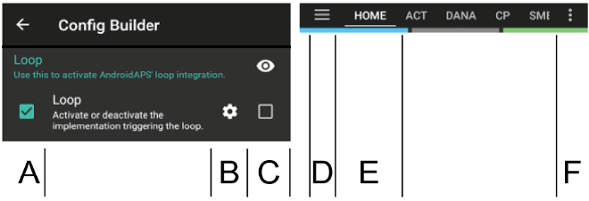

# Konfigūracija

Priklausomai nuo jūsų nustatymų, konfigūratorių galite atidaryti naudodami skirtuką ekrano viršuje arba per trijų juostelių meniu.

Konfigūratorius yra skirtukas, kuriame galite įjungti ir atjungti programos modulius. Kairėje (A) esantys pasirinkimo laukeliai suaktyvina pasirinktą funkciją, dešinėje (C) esantys pasirinkimo laukeliai nustato, ar funkcija rodoma kaip skirtukas (E), ar ne. Tuo atveju, kai reikalingas langelis neaktyvuotas, funkciją galite pasiekti iš išskleidžiamojo meniu (D), esančio viršutiniame kairiajame ekrano kampe.

Jei modulyje yra papildomų parametrų, galite spustelėti krumpliaratį (B), kuris nukreipia jus į nustatymus.

** Pirmoji konfigūracija: ** Pradedant AAPS 2.0 versija, AndroidAPS sąrankos procesą kontroliuoja sąrankos vedlys. Norėdami jį pradėti, spustelėkite trijų taškų meniu viršutiniame dešiniajame meniu ekrano kampe (F) ir pasirinkite „Sąrankos vedlys“.

## Skirtukai arba trijų linijų meniu

Pažymėdami langelį po akies simboliu jūs nuspręsite, kaip atidaryti atitinkamą programos skyrių.

## Profilis

Pasirinkite bazės profilį, kurį norite naudoti. Papildomos informacijos apie diegimą rasite puslapyje [ Profiliai ](../Usage/Profiles.md).

### Vietinis profilis (rekomenduojama)

Vietinis profilis yra pagrindinis profilis, rankiniu būdu įvestas į telefoną. Pasirinkus vietinį profilį, pasirodo naujas skirtukas, kuriame prireikus galite pakeisti iš pompos nuskaitytus profilio duomenis. Kito prijungimo prie profilio metu jie bus įrašyti į pompos profilį Nr. 1. Mes rekomenduojame šį profilį, nes jis nepriklauso nuo jūsų interneto ryšio.

Jūsų vietos profiliai yra [eksportuotų nustatymų](../Usage/ExportImportSettings.rst) dalis. Todėl įsitikinkite, kad turite atsarginę kopiją saugioje vietoje.

Mygtukai:

* žalias pliusas: pridėti
* raudonas X: ištrinti
* mėlyna rodyklė: dubliuoti

Jei atliekate pakeitimus savo profilį, įsitikinkite, kad redaguojate teisingą profilį. Perjungiant į profilio skirtuką, ne visada rodomas šiuo metu naudojamas profilis. Pavyzdžiui, jei jūs Jei pakeitėte profilį per pradinį ekraną, profilio skirtuke gali būti rodomas kitas profilis.

#### Profilių perjungimo klonavimas

Per profilio perjungimo funkciją galite lengvai sukurti naują vietinį profilį. Laiko postūmis ir profilio pasikeitimo procentas bus pritaikyti naujame vietiniame profilyje.

1. Eikite į Terapijos skirtuką.
2. Pasirinkite "Profilio perjungimas".
3. Paspauskite "Klonuoti".
4. Naują vietinį profilį galite redaguoti skirtuke „Vietinis profilis“ (VP) arba per trijų linijų meniu.

Jei norite perjungti iš Nightscout profilio į vietinį profilį, tiesiog atlikite NS profilio pakeitimą ir klonuokite profilio perjungimą, kaip aprašyta aukščiau.

#### Vietinių profilių įkėlimas į Nightscout

Vietiniai profiliai taip pat gali būti įkelti į Nightscout. Nustatymai gali būti rasti [NSClient nustatymai](../Configuration/Preferences#nsclient).

Privalumai:

* norint pakeisti profilio parametrus, nereikia interneto ryšio
* profilio pakeitimai gali būti atliekami tiesiogiai telefone
* naują profilį galite sukurti per profilio perjungimą
* vietiniai profiliai gali būti įkelti į Nightscout

Trūkumas:

* nėra

### Profilio pagalbininkas

Profilio pagalbininkas siūlo dvi funkcijas:

1. Rasti profilį vaikams
2. Palyginti du profilius arba profilio pakeitimus, kad būtų galima klonuoti naują profilį

Detalės yra paaiškintos atskirame [profilio pagalbininko puslapyje](../Configuration/profilehelper.rst).

### NS profilis

NS Profilis naudoja profilius, kuriuos išsaugojote savo Nightscout svetainėje (https://[yournightscoutsiteaddress]/profilis). Jei norite pakeisti aktyvų profilį, galite naudoti [ Profilio perjungimas ](../Usage/Profiles.md). Ši funkcija sukurtą profilį užrašo pompoje, jei kiltų ryšio problemų su AndroidAPS. Tai leidžia jums lengvai sukurti kelis profilius Nightscout (pvz., darbe, namuose, sporto, švenčių dienomis ir pan.). Netrukus, paspaudus mygtuką „Išsaugoti“, jie bus perkelti į AAPS, jei jūsų išmanusis telefonas prijungtas prie interneto. Net be interneto ryšio ar be Nightscout ryšio, NS profiliai yra pasiekiami AAPS po sinchronizacijos.

Norėdami suaktyvinti Nightscout profilį, pasirinkite ** Profilio perjungimas**. Paspauskite ir palaikykite dabartinio profilio pavadinimą viršutinėje AAPS ekrano dalyje (pilkasis laukas yra tarp šviesiai mėlyno lauko „Atviras / uždaras ciklas“ ir tamsiai mėlyno tikslo lauko) > Perjungti profilį> Pasirinkti profilį> Gerai. Pakeitęs profilį, AAPS taip pat užrašo pasirinktą profilį į pompą, kad jis būtų prieinamas iškilus AAPS problemoms, ir toliau veikia.

Privalumai:

* keli profiliai
* lengva redaguoti per kompiuterį arba planšetę

Trūkumai:

* profilio parametrų pakeisti vietoje negalima
* profilio pakeitimai negali būti atliekami tiesiogiai telefone

## Insulinas

Pasirinkite insulino veikimo kreivės tipą. „Greitai veikiantis Oref“, „Ypač greitas Oref“ ir „Be piko Oref“ parinktys turi eksponentinę formą. Norėdami sužinoti daugiau informacijos, žiūrėkite [ OpenAPS dokumentai ](http://openaps.readthedocs.io/en/latest/docs/While%20You%20Wait%20For%20Gear/understanding-insulin-on-board-calculations.html#understanding-the-new-iob-curves-based-on-exponential-activity-curves). Kreivės skiriasi atsižvelgiant į insulino trukmę IVT ir piko laiką.

IVT nėra vienoda visiems. Todėl turite nustatyti ją patys. Bet ji turi būti mažiausiai bent 5 valandos. Galite perskaityti daugiau apie tai Insulino profilio skyriaus [šiame](../Getting-Started/Screenshots#insulin-profile) puslapyje.

Greitai veikiančio ir ypač greitai veikiančio insulino IVT veikimo trukmė yra vienintelis kintamasis, kurį galite susikonfigūruoti patys, piko laikas yra fiksuotas. „Be piko“ leidžia konfigūruoti ir insulino veikimo trukmę IVT, ir piko laiką. Ši parinktis skirta patyrusiems vartotojams, žinantiems šių nustatymų pasekmes.

[Insulino kreivės grafikas](../Getting-Started/Screenshots#insulin-profile) padeda suprasti skirtingas kreives. Jį galima pamatyti skirtuke, jei jį pažymėjote varnele konfigūratoriuje arba pasirinkdami iš išskleidžiamojo meniu kairėje.

### Greito veikimo Oref

* rekomenduojama Humalog, Novolog ir Novorapid
* IVT = bent 5.0 val
* Maks. pikas = 75 minutės po injekcijos (fiksuotas, nekeičiamas)

### Ypač greito veikimo Oref

* rekomenduojama FIASP
* IVT = bent 5.0 val
* Maks. pikas = 55 minutės po injekcijos (fiksuotas, nekeičiamas)

Daugeliui žmonių FIASP poveikis beveik nepastebimas po 3–4 valandų, net jei paprastai liktų 0,0xx vienetų. Šis likutis gali būti jaučiamas, pavyzdžiui, sporto metu. Todėl AndroidAPS insulino veikimo trukmė IVT naudojama mažiausiai 5 valandos.

### Oref be piko

„Be piko 0ref“ profilyje galite patys įvesti piko laiką. Insulino veikimo trukmė IVT automatiškai nustatoma 5 valandoms, jei profilyje nenustatoma didesnė vertė.

Šis insulino profilis yra rekomenduojamas, jei naudojamas nepalaikomas insulino tipas arba skirtingų insulinų mišiniai.

## Glikemijos šaltinis

Pasirinkite pagrindinės glikemijos duomenų šaltinį - daugiau informacijos apie nustatymus ieškokite puslapyje [ KG šaltinis ](BG-Source.rst).

* [xDrip+](https://xdrip-plus-updates.appspot.com/stable/xdrip-plus-latest.apk)
* NSClient KG
* [MM640g](https://github.com/pazaan/600SeriesAndroidUploader/releases)
* [Glimp](https://play.google.com/store/apps/details?id=it.ct.glicemia&hl=de) - palaikoma versija 4.15.57 ir naujesnė
* Modifikuota programa [ Dexcom App ](https://github.com/dexcomapp/dexcomapp/) - pasirinkite „Siųsti KG duomenis į xDrip+“, jei norite gauti pranešimus iš xDrip+.
    
    

* [Poctech](http://www.poctechcorp.com/en/contents/268/5682.html)

* [Tomato programėlė](http://tomato.cool/) MiaoMiao įrenginiui
* Generuoja atsitiktinių KG duomenis (demonstracinis režimas)

## Pompa

Pasirinkite pompą, kurią naudojate.

* [Dana R](DanaR-Insulin-Pump.md)
* DanaR Korean (DanaR, skirta Korėjos rinkai)
* DanaRv2 (DanaR su neoficialia atnaujinta programine įranga)
* [Dana R](DanaRS-Insulin-Pump.md)
* [Accu-Chek Insight](Accu-Chek-Insight-Pump.md)
* [Accu-Chek Combo](Accu-Chek-Combo-Pump.md) (reikia įdiegti ruffy programą)
* [Medtronic](MedtronicPump.md)
* MDI (AAPS pateikia insulino tiekimo patarimus naudojant insulino švirkštimo priemones)
* Virtuali pompa (atviras ciklas pompai, kuri dar nėra palaikoma - AAPS teikia tik pasiūlymus)

Naudojantis Dana pompa, eikite į **Išplėstiniai nustatymai**, kad suaktyvintumėte BT Watchdog, jei tai reikalinga. Jei prisijungti prie pompos neįmanoma, jis vienai sekundei išjungia Bluetooth. Tai padeda kai kuriuose telefonuose, kur užstringa Bluetooth modulis.

[Danos RS pompos slaptažodis](../Configuration/DanaRS-Insulin-Pump.md) turi būti įvestas teisingai. Slaptažodis nebuvo patikrinamas ankstesnėse versijose.

## Jautrumo nustatymas

Pasirinkite jautrumo nustatymo tipą. Daugiau informacijos apie skirtingas variacijas prašome [skaityti čia](../Configuration/Sensitivity-detection-and-COB.md). Algoritmas analizuos duomenų istoriją ir koreguos, jei atpažins, kad į insuliną reaguojate jautriau (arba, atvirkščiai, su mažesniu jautrumu) nei įprastai. Daugiau apie Jautrumo algoritmą galite perskaityti [OpenAPS dokumentacijoje](http://openaps.readthedocs.io/en/latest/docs/walkthrough/phase-4/advanced-features.html#auto-sensitivity-mode).

Pagrindiniame puslapyje galite peržiūrėti jautrumo kreivę, pasirinkdami laukelį Jautrumas. Jis atrodo kaip balta linija. Dėmesio, turite būti [Tiksle 8](../Usage/Objectives#objective-8-adjust-basals-and-ratios-if-needed-and-then-enable-autosens), kad leistumėte Jautrumo aptikimui/[Autosens](../Usage/Open-APS-features#autosens) automatiškai koreguoti insulino kiekio suleidimą. Kol dar nepasiekėte šio tikslo, Autosens procentas / kreivė rodoma tik informacijai. AAPS neatlieka jokių pakeitimų.

### Angliavandenių įsisavinimo parametrai

Jei naudojate „Oref1“ su SMB, turite nustatyti **min_5m_ carbimpact** reikšmę į 8. Ši vertė naudojama tik tuo atveju, jei NGJ reikšmės negaunamos arba fizinis aktyvumas kompensuoja padidėjusį gliukozės kiekį kraujyje, kurį AAPS paprastai naudoja angliavandenių skaidymui apskaičiuoti. Tais atvejais, kai [angliavandenių absorbcijos](../Usage/COB-calculation.rst) negalima dinamiškai apskaičiuoti pagal gliukozės kiekį kraujyje, naudojama ši numatytoji absorbcijos reikšmė. Iš esmės tai yra saugiklis.

## APS

Pasirinkite norimą APS algoritmą terapijos koregavimui. Išsamią informaciją apie pasirinktą algoritmą galite rasti skirtuke OpenAPS (OPAS).

* OpenAPS AMA (pažangusis maisto asistentas, algoritmas nuo 2017 m.)   
    Išsamios informacijos apie OpenAPS AMA galima rasti [ OpenAPS dokumentacijoje ](http://openaps.readthedocs.io/en/latest/docs/Customize-Iterate/autosens.html#advanced-meal-assist-or-ama). Paprasčiau tariant, nauda yra po to, kai susileidžiate bolusą maistui, sistema gali greičiau įjungti aukštą tikslą, JEI patikimai suvesite angliavandenius. 
* [OpenAPS SMB](../Usage/Open-APS-features.md) (super mikro bolusas, naujausias algoritmas patyrusiems vartotojams)  
    Pastaba: jūs turite būti[10-ame tiksle ](../Usage/Objectives#objective-10-enabling-additional-oref1-features-for-daytime-use-such-as-super-micro-bolus-smb)norint naudoti OpenAPS SMB ir Konfigūratoriuje min_5m_carbimpact turi būti nustatytas į 8 > Jautrumo aptikimas> Jautrumo Oref1 nustatymai.

## Ciklas

* Perjungimas tarp Atviro ciklo, Uždaro ciklo ir Žemos glikemijos stabdymo (ŽGS).

### Atviras Ciklas

* AAPS nuolat vertina visus turimus duomenis (AIO, AAO, glikemija...) ir, jei reikia, teikia patarimus, kaip koreguoti terapiją. 
* Pasiūlymai nėra vykdomi automatiškai (kaip uždarame cikle), bet turi būti rankiniu būdu įvedami į pompą. Jei naudojate suderinamą pompą (Dana R/RS arba Accu-Chek Combo), tai taip pat galima padaryti naudojant mygtuką AndroidAPS. 
* Šis nustatymas skirtas susipažinti su AndroidAPS arba nepalaikomoms pompoms.

### Uždaras Ciklas

* AAPS nuolat vertina visus turimus duomenis (AIO, AAO, glikemijos reikšmes) ir automatiškai koreguoja terapiją pagal poreikį (t.y. be jūsų tolesnio įsikišimo), kad būtų pasiektas nustatytas tikslo diapazonas arba tikslinė vertė (boluso įvedimas, laikinos bazės nustatymas, insulino sustabdymas siekiant išvengti hipoglikemijos ir t.t.). 
* Uždaras ciklas veikia atsižvelgiant į daugybę saugumo ribų, kurias galite nustatyti atskirai.
* Uždaras ciklas yra galimas, jei esate [6-ame tiksle](../Usage/Objectives#objective-6-starting-to-close-the-loop-with-low-glucose-suspend) ar toliau ir naudojate palaikomą pompą.
* Pastaba: Uždaro ciklo režime rekomenduojama vietoj tikslinio intervalo naudoti vieną tikslą (t. y. 5,5 mmol arba 100 mg/dl vietoje 5,0-7,0 mmol arba 90-125 mg/dl).

### Sustabdymas esant žemai gliukozei (ŽGS)

* maxAIO yra lygus nuliui
* Tai reiškia, kad, jei gliukozės kiekis kraujyje mažėja, AAPS gali sumažinti valandinę bazę.
* Bet jei gliukozės kiekis kraujyje didėja, jokių automatinių korekcijų nebus padaryta. Jūsų valandinė bazė išliks tokia pati kaip ir Jūsų pasirinktame profilyje.
* Tik jei valandinė bazė yra neigiama (dėl ankstesnio sustabdymo esant žemai gliukozei), papildomas insulinas bus suleistas, siekiant sumažinti glikemiją.

### Minimalaus pokyčio užklausa

* Naudodami atvirą ciklą, gausite pranešimus kiekvieną kartą, kai AAPS rekomenduoja koreguoti valandinę bazę. 
* Norėdami sumažinti pranešimų skaičių, galite naudoti platesnį KG tikslinį intervalą arba padidinti procentais nuo minimalios užklausos normos.
* Tai apibrėžia santykinį pokytį, kurio reikia, kad būtų galima pateikti pranešimą.

## Tikslai (mokymosi programa)

„AndroidAPS“ turi mokymosi programą (tikslus), kurią turite įgyvendinti palaipsniui. Panašus algoritmo organizavimas padės jums sukurti uždaro ciklo sistemą. Tai garantuoja, kad jūs turite viską nustatyti teisingai ir suprasti, kaip sistema tiksliai veikia. Tai yra vienintelis būdas suprasti, kad galite pasitikėti sistema.

Turėtumėte reguliariai[eksportuoti savo nustatymus](../Usage/ExportImportSettings.rst) (įskaitant pažangą tiksluose). Ateityje, jei jums reikės pakeisti išmanųjį telefoną (naujas pirkinys, sugadinimas ir pan.), galite tiesiog importuoti šiuos parametrus.

Norėdami rasti daugiau informacijos, žiūrėkite puslapį [Tikslai](../Usage/Objectives.rst).

## Terapija

Skirtuke Terapija (Terapija) rodomos terapijos, kurios buvo įkeltos į Nightscout. Jei norite taisyti ar ištrinti įrašą (pavyzdžiui, suvalgykite mažiau angliavandenių nei tikėtasi), pasirinkite Trinti ir [pagrindinio ekrano AV mygtuku](../Getting-Started/Screenshots#carb-correction) įveskite naują reikšmę (jei reikia, pakeiskite laiką).

## Bendrieji

### Apžvalga

Parodo dabartinę dažniausiai naudojamų veiksmų algoritmo ir mygtukų būseną (išsamesnės informacijos žr. [ Pradinio ekrano skyrius ](../Getting-Started/Screenshots.md)). Prieiga prie parametrų - per krumpliaračio piktogramą.

#### Laikyti ekraną įjungtą

Parinktis „Neišjungti ekrano“ privers Android nuolat laikyti įjungtą ekraną. Tai naudinga pristatymams ir kt. Bet ji sunaudoja daug baterijos energijos. Todėl rekomenduojama išmanųjį telefoną prijungti prie įkroviklio laido.

#### Mygtukai

Nustatyti, kurie mygtukai rodomi pradiniame ekrane.

* Terapija
* Skaičiuotuvas
* Insulinas
* Angliavandeniai
* NGJ (atsidaro xDrip+)
* Kalibravimas

Taip pat galite nustatyti fiksuotas insulino ir angliavandenių lygio padidinimo vertes ir nuspręsti, ar terapijos dialogo lange rodyti užrašo lauką.

#### Greitojo patarėjo nustatymai

Čia galite sukurti mygtuką konkrečiam standartiniam maistui (angliavandenių ir boluso skaičiavimo metodas), kuris bus rodomas pagrindiniame ekrane. Tai labai praverčia, jei jūs dažnai valgo tą patį. Jei sukursite keletą standartinių patiekalų ir jiems nustatysite skirtingą laiką, priklausomai nuo dienos laiko pagrindiniame ekrane visada turėsite atitinkamą standartinio patiekalo mygtuką.

Pastaba: mygtukas nebus rodomas už nustatytų laikotarpių ribų. Tas pats pasakytina ir tuo atveju, jei yra pakankamai aktyvaus insulino AIO angliavandenių kiekiui padengti, nustatytam mygtuko nustatymuose.

#### Numatyti Laikini Tikslai

Pasirinkite numatytuosius laikinus tikslus (trukmė ir reikšmė). Iš anksto nustatytos reikšmės:

* netrukus valgysiu: tikslas 72 mg/dl / 4.0 mmol/l, trukmė 45 min
* aktyvumas: tikslas 140 mg/dl/ 7.8 mmol/l, trukmė 90 min
* hipo: tikslas 125 mg/dl / 6.9 mmol/l, trukmė 45 min

#### Standartiniai insulino kiekiai kateterio/kaniulės užpildymui

Pasirinkite numatytuosius kiekius iš trijų mygtukų, užpildymo/pirminio užpildymo lange, priklausomai nuo jūsų kateterio ilgio.

#### Vizualizacijos diapazonas

Pasirinkite aukštos ir žemos glikemijos ribas grafike. Jos bus matomos AndroidAPS apžvalgoje ir išmaniajame laikrodyje. Tai tik vizualizacija, o ne tikslinės jūsų glikemijos ribos. Pavyzdžiui: 70-180 mg/dl arba 3,9-10 mmol/l

#### Naudoti sutrumpintus skirtukų pavadinimus

Pasirinkite ar skirtukų pavadinimai AndroidAPS yra ilgi (pvz. VEIKSMAI, VIETINIS PROFILIS, AUTOMATIZAVIMAS) arba trumpi (pvz., VEIKS, VP, AUTO)

#### Rodyti pastabų laukelį terapijos dialoguose

Pasirinkite, ar norite matyti pastabas, kai įvedate terapijas arba ne.

#### Būklės indikatoriai

Pasirinkite, ar norite matyti [būsenos indikatorius](../Configuration/Preferences#status-lights) kaniulės, insulino, sensoriaus, baterijos amžiui, rezervuaro ar baterijos lygiui. Pasiekus įspėjamąjį lygį, būsenos indikatorius taps geltonas. Kritinis lygis bus rodomas raudona spalva.

#### Papildomi nustatymai

**Suleisti dalį boluso iš boluso patarėjo**: Kai naudojamasi SMB, dauguma žmonių nesusileidžia 100% reikiamo insulino, o tik dalį jo (pvz., 75 %) ir leidžia SMB su NDM (nedeklaruotas maitas) atlikti likusį darbą. Šiuo atveju, galite pasirinkti numatytąją procentinę reikšmę, į kurią boluso patarėjas turėtų atsižvelgti. Jei šis nustatymas yra 75%, o jūs turite susileisti 10vv, boluso patarėjas jums pasiūlys iš karto susileisti tik 7,5 vienetus.

**Įjungti Superboluso funkciją skaičiuoklėje** (Tai skiriasi nuo *super mikro boluso SMB*!): Naudokite atsargiai ir neįjunkite, kol nesuprasite, kas iš tikrųjų tai yra. Iš esmės valandinė bazė pridedama prie boluso kitoms dviem valandoms, o valandinė bazė dviem valandoms nustatoma ties nuliu. ** AAPS ciklo funkcijos bus išjungtos - naudokite atsargiai! Jei naudosite SMB, AAPS ciklo funkcijos bus išjungtos atsižvelgiant į jūsų nustatymus, pateiktus [„SMB bazinė riba minutėmis“](../Usage/Open-APS-features#max-minutes-of-basal-to-limit-smb-to). Jei nenaudosite SMB, ciklas bus išjungtas dviem valandoms. **Norėdami gauti daugiau informacijos apie Superbolus, skaitykite [čia](https://www.diabetesnet.com/diabetes-technology/blue-skying/super-bolus).

### Veiksmai

Mygtukai greitesniam pagrindinių funkcijų paleidimui:

* Profilio keitimas (profilio perjungimas - daugiau informacijos rasite [Profiliai](../Usage/Profiles.md))
* Laikinas tikslas
* Nustatyti / atšaukti laikiną valandinė bazė
* Ištęstas bolusas (tik DanaR/RS arba Combo pompa)
* Įrašykite specifinius terapijos veiksmus
    
    * KG testas
    * Pirminis užpildymas / pildymas - įrašyti kateterio kaniulės keitimą ir ją užpildyti (jei nėra atlikta pompoje)
    * NGJ sensoriaus įvedimas
    * Pompos baterijos keitimas
    * Pastaba
    * Aktyvumas
* Peržiūrėti jutiklio, insulino rezervuaro, kaniulės ir pompos baterijos naudojimo laiką
* Istorija
* BPD (Bendra paros dozė = bolusas + bazė per dieną)

Kai kurie gydytojai rekomenduoja - ypač pradedantiesiems - bazės ir boluso insulino santykį 50:50. Todėl santykis apskaičiuojamas kaip bendra BPD / 2 * BPB paros dozė (BPB bendra paros bazė = valandinių bazių suma per 24 valandas). Kiti labiau linkę apskaičiuoti paros BPB dozę kaip 32–37% paros insulino BPD. Kaip ir dauguma jų, jie turi ribotą praktinę reikšmę. Pastaba: Jūsų diabetas gali skirtis!

### Automatizavimas

Vartotojo apibrėžtos automatizavimo užduotys ("jei-tada-jei ne"). Prašome [skaityti čia](../Usage/Automation.rst).

### SMS komunikatorius

Leidžia nuotoliniu būdu valdyti kai kurias AndroidAPS funkcijas SMS žinutėmis, daugiau informacijos apie konfigūraciją žr. [ SMS komandos ](../Children/SMS-Commands.rst).

### Maistas

Parodo iš anksto nustatytas maisto savybes, apibrėžtas Nightscout duomenų bazėje, daugiau informacijos apie parinktis žr. [ Nightscout ](https://github.com/nightscout/cgm-remote-monitor#food-custom-foods).

Pastaba: įrašų negalima naudoti AndroidAPS skaičiuotuve. (Tik peržiūra)

### Išmanieji laikrodžiai

Android Wear laikrodyje galima peržiūrėti AAPS duomenis ir valdyti kai kurias funkcijas (žr. [ Laikrodžiai](../Configuration/Watchfaces.md)). Nustatymuose (krumpliaračio piktograma) galite nustatyti kintamuosius, į kuriuos reikia atsižvelgti apskaičiuojant bolusą atsižvelgiant į laikrodį (pavyzdžiui, 15 min. tendencija, aktyvūs angliavandeniai AAO...).

Pavyzdžiui, jei norite suleisti boliusą, tuomet laikrodžio nustatymuose turėtumėte įjungti „Valdymas iš laikrodžio“.

Naudodamiesi skirtuku „Išmanieji laikrodžiai“ arba trijų linijų meniu (ekrano viršutiniame kairiajame kampe, jei skirtukas nerodomas), galite

* Pakartotinai siųsti visus duomenis. Gali būti naudinga, jei laikrodis nebuvo prijungtas šiek tiek laiko ir norite perduoti informaciją į laikrodį.
* Atidaryti laikrodžio nustatymus tiesiai iš savo telefono.

### xDrip būsenos juosta (laikrodyje)

Rodyti informaciją apie algoritmo būseną xDrip+ laikrodžio ekrane (jei nenaudojate AAPS /[AAPSv2 laikrodžio ekrane](../Configuration/Watchfaces.md)

### NSClient

* AndroidAPS duomenų sinchronizavimą su Nightscout sinchronizavimas.
* Pasirinkimai [nustatymuose](../Configuration/Preferences#nsclient) gali būti pasiekiami paspaudus krumpliaračio simbolį.

### Servisas

El. Pašto adresas ir siunčiamų protokolų skaičius. Paprastai nereikia jokių pakeitimų.

### Konfigūracija

Vietoje trijų linijų meniu kairėje galite naudoti konfigūratoriaus skirtuką.