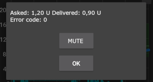

# DanaRS pompa

*Naudokite šias instrukcijas AAPS programėlės ir DanaRS (nuo 2017 m.) pompos konfigūravimui. Jei turite DanaR pompą, skaitykite [DanaR insulino pompa](./DanaR-Insulin-Pump).*

**Nauja Dana RS v3 programinė įranga gali būti naudojama su AndroidAPS 2.7 ir naujesne versija.**

* Programėlė naudoja tik "BASAL A". Programa pati perrašo duomenis pompoje.

## Pompos susiejimas

* AndroidAPS programoje eikite į Konfigūratorių ir pasirinkite DanaRS

* Pradinio lango viršutiniame dešiniajame kampe paspauskite 3 taškus. Išsirinkite Nustatymai.

* Pasirinkite "DanaRS susieti naują pompą" ir patvirtinkite Jūsų DanaRS pompos serijinį numerį.
    
    

* Paspauskite "Pompos slaptažodis" ir įveskite savo pompos slaptažodį.

### Numatytasis slaptažodis

* Pompos DanaRS su programine įranga v1 ir v2 numatytasis slaptažodis yra 1234.
* Pompos DanaRS su programine įranga v3 numatytasis slaptažodis yra gamybos mėnesio ir gamybos datos (pvz., 01 mėnesio ir 24 dienos) derinys. Pompoje atidarykite pagrindinį meniu > peržiūra > informacija. Trečias skaičius yra pagaminimo data.

* **Turite patvirtinti pompos susiejimą!** Susiejimas panašus į kitų bluetooth įrenginių (pvz., išmaniojo telefono ir automobilio audio) susiejimą.
    
    

* Pasirinkite "Boluso greitis", jei norite pakeisti standartinį boluso greitį (1 vv per 12 s, 1 vv per 30 s, 1 vv per 60 s).

* Paleiskite telefoną iš naujo.
* Naudodami Gydytojo meniu (žr. pompos Vartotojo vadovą) nustatykite pompos bazinį greitį 0,01 vv/h
* Įgalinkite ištęstus bolusus pompoje

## Slaptažodžio keitimas pompoje

* paspauskite OK mygtuką pompoje
* Pagrindiniame meniu pasirinkite „OPTION“ (judėkite dešinėn kelis kartus paspausdami rodyklės mygtuką)
    
    

* Meniu Parinktys pasirinkite „USER OPTION“
    
    

* Rodyklės mygtuku slinkite žemyn iki "11. password"
    
    

* Paspauskite OK senojo slaptažodžio įvedimui.

* Įveskite **seną slaptažodį** (Numatytasis slaptažodis žr. [aukščiau](#default-password)) ir paspauskite OK
    
    

* Jei įvedamas neteisingas slaptažodis, nebus jokio pranešimo apie klaidą!

* Įveskite **naują slaptažodį** (Keiskite numerius mygtukais + ir - / Perkelkite į dešinę rodyklės mygtuku).
    
    

* Patvirtinkite paspausdami OK mygtuką.

* Išsaugokite spausdami OK mygtuką dar kartą.
    
    

* Pereikite žemyn į „14. EXIT" ir paspauskite OK mygtuką.
    
    

## Specifinės DanaRS klaidos 

### Klaida suleidžiant insuliną

Jei ryšys tarp AAPS ir DanaRS pompos nutrūksta boluso suleidimo metu (pvz.: Jūs nueinate per toli nuo telefono), Jūs matysite klaidos pranešimą ir girdėsite garsinį signalą.

* Dažniausiai tai tik ryšio klaida ir visas insulino kiekis sėkmingai suleidžiamas.
* Patikrinkite, ar suleistas teisingas insulino kiekis pompos istorijoje (pačioje pompoje arba AAPS skirtuke Dana > Pompos istorija > Bolusai.
* Jei norite, ištrinkite klaidingą įrašą [Terapijos skirtuke](../Getting-Started/Screenshots#carb-correction).
* Kito programos ir pompos susijungimo metu suleisto insulino kiekis bus patikrintas ir įrašytas. Galite tiesiog palaukti kito susijungimo arba jį pagreitinti paspaudę BT piktogramą Dana skirtuke.

## Specialūs veiksmai keičiant telefoną

Kai keičiate seną telefoną į naują, turite atlikti šiuos veiksmus:

* [Eksportuokite nustatymus](../Usage/ExportImportSettings#export-settings) senajame telefone
* Perkelkite nustatymus į naują telefoną
* **Rankiniu būdu** susiekite Dana RS su nauju telefonu
    
    * Kadangi pompos susiejimo nustatymai persikelia į naują telefoną kartu su kitais, Jūsų naujas telefonas jau "pažįsta" pompą, todėl nepradės BT paieškos. Todėl naują telefoną ir pompą reikia susieti rankiniu būdu.
* Instaliuokite AndroidAPS naujame telefone.
* [Importuokite nustatymus](../Usage/ExportImportSettings#import-settings) į naują telefoną

## Keliavimas per skirtingas laiko juostas su DanaRS pompa

Žiūrėkite skyrių [Keliavimas per skirtingas laiko juostas su pompa](../Usage/Timezone-traveling#danarv2-danars).