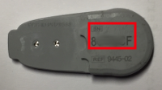
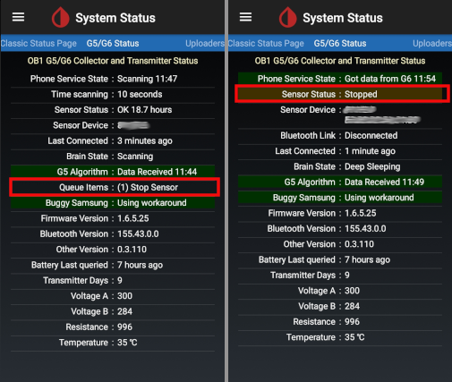
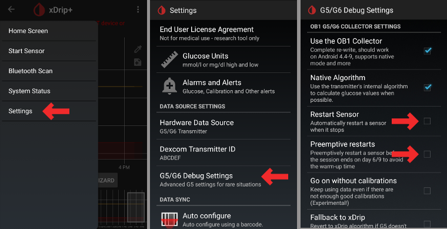
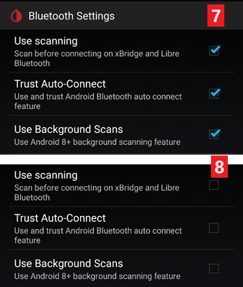

# xDrip+ Nustatymai

Jei dar jo nenustatėte, atsisiųskite [xDrip+](https://jamorham.github.io/#xdrip-plus).

**Šios instrukcijos yra skirtos tik xDrip+ Android sistemai.** Yra programa „xDrip for iOS“, kuri neturi nieko bendra su originalia xDrip+ Android sistemai.

Naudojantis G6 siųstuvais, kurie tiekiami po 2018 m. rudens/pabaigos (pvz., serijos nr. prasideda 80 arba 81), jums reikia bent [xDrip+ pagrindinės](https://jamorham.github.io/#xdrip-plus) programos versijos.

Jei jūsų Dexcom G6 siųstuvo serijos nr. pradeda su 8G..., 8H... ar 8J... naudokite vieną iš [naujausių nightly versijų](https://github.com/NightscoutFoundation/xDrip/releases).

Jei naudojate Android 10 ir kyla problemų dėl xDrip+ pagrindinės versijos, galite išbandyti [nightly 2019/12/31 versiją ar vėlesnę](https://github.com/NightscoutFoundation/xDrip/releases).

## Pagrindiniai visų stebėjimo sistemų nustatymai

* Teisingai įveskite savo svetainės adresą (URL), įskaitant raidę **S**, esantį http**s**:// (ne http://)
   
   t. y. https://API_SECRET@jusu-svetaines-vardas.herokuapp.com/api/v1/
   
   -> trijų linijų meniu (ekrano viršuje, kairėje) -> Nustatymai -> Debesų įkėlimas -> Nightscout įkėlimas (REST-API) -> Pagrindinis URL

* Išjungti `Automatinis kalibravimas (Automatic Calibration)` Jei pažymėtas langelyje `Automatinis kalibravimas (Automatic Calibration)`, vieną kartą suaktyvinkite `Atsisiųsti duomenis (Download data)`, tada panaikinkite žymėjimą laukelyje `Automatinis kalibravimas (Automatic Calibration)` ir deaktyvuokite `Atsisiųskite duomenis(Download data)` dar kartą. Priešingu atveju terapija (insulinas& ir angliavandeniai) bus įvedamos du kartus į Nightscout.

* Paspauskite `Papildomos Funkcijos (Extra Options)`

* Deaktyvuokite `Įkelti terapijas (Upload treatments)` ir `Užpildyti praleistus duomenis (Back-fill data)`.
   
   **Saugos įspėjimas : Jūs turite išjungti "Įkelti terapiją" iš xDrip+, priešingu atveju terapijos duomenys gali dubliuotis AAPS, kas gali sąlygoti neteisingus AAO ir AIO.**

* Pasirinkimas `Perspėjimas apie gedimus (Alert on failures)` taip pat turėtų būti išjungtas. Priešingu atveju kas 5 minutes gausite aliarmą, jei WiFi/ mobiliojo ryšio tinklas yra per silpnas arba serveris nepasiekiamas.
   
   
   
   

* **Sąveika su programomis (InterApp-Settings)** (transliacija) Norint naudoti AndroidAPS, į jį reikia nukreipti duomenis; turėtumėte suaktyvinti xDrip+ transliaciją Inter-App nustatymuose.

* Norint išvengti programų neatitikimų, reikia suaktyvinti `Siųsti rodomą glikemijos reikšmę (Send the displayed glucose value)`.

* Jei taip pat suaktyvinote `Priimti terapiją (Accept treatments)` ir perdavimą AndroidAPS, tada xDrip+ iš AndroidAPS gaus informaciją apie insuliną, angliavandenius ir valandinę bazę bei galės numatyti hipoglikemiją ir kt. tiksliau.
   
   

### Nustatyti gavėjus

* Jei aptikote problemų su lokaliu duomenų perdavimu (AAPS negauna KG iš xDrip+), eikite į Nustatymai > Vidiniai nustatymai > Identifikuoti siųstuvą ir spauskite `info.nightscout.androidaps`.
* Dėmesio: automatinis taisymas kartais keičia raidę i iš mažosios į didžiąją I raidę. Turite naudoti tik **mažąsias raides**, jei įvedate `info.nightscout.androidaps`. Didžioji I raidė neleidžia AAPS gauti glikemijos reikšmes iš xDrip+.
   
   

## xDrip+ & Dexcom G6

* Dexcom G6 siųstuvą galima vienu metu sujungti su Dexcom imtuvu (arba alternatyviai su t:slim pompa) ir mobiliojo telefono programa.
* Jei naudojate xDrip+ glikemijos duomenims gauti, pirmiausia pašalinkite Dexcom programą. **Negalite vienu metu prijungti xDrip+ ir Dexcom programos prie vieno siųstuvo!**
* Jei jums reikia Clarity programos ir vis tiek norite naudotis xDrip+ aliarmais, jums reikia [modifikuotos Dexcom programos](../Hardware/DexcomG6#if-using-g6-with-patched-dexcom-app) su įjungta lokalaus duomenų perdavimo funkcija į xDrip+.

### xDrip+ versija, priklausomai nuo to G6 siųstuvo serijos nr.

* Naudojantis G6 siųstuvais, kurie tiekiami po 2018 m. rudens/pabaigos (pvz., serijos nr. prasideda 80 arba 81), jums reikia bent [xDrip+ pagrindinės](https://jamorham.github.io/#xdrip-plus) programos versijos. 
* Jei jūsų Dexcom G6 siųstuvo serijos nr. pradedant nuo 8G, 8H ar 8J, naudokite vieną iš paskutinių [nightly versijų, pvz., 2019/07/28 ar vėlesnę](https://github.com/NightscoutFoundation/xDrip/releases).

### Dexcom specialūs nustatymai

* Atidarykite G5/G6 derinimo nustatymus (G5/G6 Debug Settings) -> Trijų linijų meniu (pagrindiniame ekrano viršuje kairėje) -> Nustatymai -> G5/G6 derinimo nustatymai 

* Įgalinkite šiuos parametrus
   
   * `Naudoti OB1 Kolektorių`
   * `Natyvinis Algoritmas` (svarbu, jei jūs norite naudotis SMB)
   * `G6 palaikymas`
   * `Leisti atjungti OB1`
   * `Leisti OB1 inicijuoti poravimą`
* Visos kitos funkcijos turėtų būti išjungtos
* Nustatykite įspėjimo apie žemą akumuliatorių lygį iki 280 (G5/G6 derinimo nustatymų apačioje)
   
   

### Pakartoninis paleidimas nerekomenduojamas

**Su Dexcom siųstuvais, kurių serijos nr. pradeda su 8G, 8H ar 8J, pakartotinis paleidimas iš naujo neveikia ir gali sugadinti jutiklį visiškai!**

Nerekomenduojama automatiškai pratęsti Dexcom jutiklio veikimo (`Pakartotinis paleidimas (preemptive restarts)`), nes tai gali sukelti glikemijų reikšmių šuolius 9 dieną po pakartotinio paleidimo.

Naudoti G6 yra šiek tiek sudėtingiau, nei atrodė anksčiau. Norint jį naudoti saugiai, yra keletas niuansų, kuriuos reikia žinoti:

* Jei xDrip ar Spike naudojate natyvinius duomenis su kalibravimo kodu, saugumo sumetimais neturėtumėte leisti pakartotinio paleidimo iš naujo.
* Jei vis dėlto naudojatės pakartotiniu paleidimu, tada jis turėtų būti daromas tokiu metu, kai galima stebėti pokyčius ir prireikus kalibruoti. 
* Jei iš naujo paleisite sensorių, atlikite tai be gamyklinio kalibravimo, kad rezultatai būtų saugūs 11-ą ir 12-ą dieną, arba būkite pasirengę kalibruoti ir stebėti pokyčius.
* „Išankstinis įmirkymas“ (sensoriaus įvedimas daug anksčiau nei jo pradžia programoje) G6 su gamykliniu kalibravimu gali sukelti duomenų nukrypimus. Jei sensorių įvedate anksčiau, nei jį startuojate, gali reikėti jį kalibruoti, kad gautumėte geriausius rezultatus.
* Jei neplanuojate sekti visų galimų nukrypimų, geriau grįžti į tradicinį kalibravimo režimą ir naudoti sistemą kaip G5.

Norėdami gauti daugiau informacijos ir šių rekomendacijų priežastis, skaitykite Tim Street [visą straipsnį](http://www.diabettech.com/artificial-pancreas/diy-looping-and-cgm/) svetainėje [www.diabettech.com](http://www.diabettech.com).

### Prijungti G6 siųstuvą pirmą kartą

**Apie antrą ir kitus siųstuvus skaitykite žemiau [Siųstuvo veikimo trukmės pratęsimas ](../Configuration/xdrip#extend-transmitter-life).**

Naudojantis G6 siųstuvais, kurie tiekiami po 2018 m. rudens/pabaigos (pvz., serijos nr. prasideda 80 arba 81), jums reikia bent [xDrip+ pagrindinės](https://jamorham.github.io/#xdrip-plus) programos versijos.

Jei jūsų Dexcom G6 siųstuvo serijos nr. pradedant nuo 8G, 8H ar 8J, naudokite vieną iš paskutinių [nightly versijų, pvz., 2019/07/28 ar vėlesnę](https://github.com/NightscoutFoundation/xDrip/releases).

* Išjunkite originalų „Dexcom“ imtuvą (jei naudojate).
* Ilgai spauskite kraujo lašo piktogramą pagrindiniame xDrip+ ekrane, kad suaktyvintumėte `Glikemijos šaltinio parinkimo vedlys (Source Wizard Button)` mygtuką.
* Naudokite mygtuką Glikemijos šaltinio parinkimo vedlys. Tai užtikrins, kad naudosite numatytuosius nustatymus, įskaitant OB1 & natyvinį režimą 
   * Vedlys leis atlikti pradinę sąranką.
   * jums reikės siųstuvo serijos numerio, jei jį naudojate pirmą kartą.

* Įveskite naujo siųstuvo serijos numerį (ant siųstuvo pakuotės arba ant jo galinės dalies). Be careful not to confuse `0` (zero) and `O` (capital letter o).
   
   

* Įdėkite naują sensorių (tik keičiant)

* Uždėkite siųstuvą ant sensoriaus
* If a message pops up asking to pair with "DexcomXX", where "XX" is the last two characters of the transmitter's serial no., accept it (tap "pair")
* Do not start new sensor before the following information is shown in Classic Status Page -> G5/G6 status -> PhoneServiceState:
   
   * Siųstuvo serijos numeris prasideda 80 arba 81: „Got data hh:mm“ (pvz., „Got data 19:04“)
   * Transmitter serial starting with 8G, 8H or 8J: "Got glucose hh:mm" (i.e. "Got glucose 19:04") or "Got no raw hh:mm" (i.e. "Got no raw 19:04")
   
   

* Start sensor (only if replacing)
   
   -> Near the bottom of the screen `Warm Up x,x hours left` must be displayed after a few minutes.

-> Jei jūsų siųstuvo serijos nr. neprasideda reikšme 8G, 8H ar 8J ir po keleto minučių nerodo sensoriaus įšilimo (warm-up) laiko, sustabdykite ir paleiskite sensorių iš naujo.

* Paleiskite kolektorių iš naujo (sistemos būsena - jei nekeičiamas sensorius}
* Neįjunkite originalaus Dexcom imtuvo (jei jį naudojate), kol xDrip+ nepasirodys pirmieji duomenys.
* Ilgai spauskite kraujo lašo piktogramą pagrindiniame xDrip+ ekrane, kad deaktyvintumėte `Glikemijos šaltinio parinkimo vedlys (Source Wizard Button)` mygtuką.
   
   
   
   
   
   
   
   

### Siųstuvo baterijos būsena

* Baterijos būseną galima pamatyti sistemos būsenos lange (pagrindinio ekrano viršuje, kairėje esančiame trijų linijų meniu)
* Braukite kairėn, kad pamatytumėte antrą ekraną. 

* Tikslios vertės, kai siųstuvas „miršta“ dėl išsekusios baterijos, nežinomos. Po to, kai siųstuvas galutinai neveikė, internete buvo paskelbta ši informacija:
   
   * Pranešimas 1: Veikimo laikas: 151 dienos / Įtampa A: 297 / Įtampa B: 260 / Varža: 2391
   * Pranešimas 2: Veikimo laikas: 249 dienos / Įtampa A: 275 (klaidos metu)

### Pailginkite siųstuvo veikimo laiką

* Kol kas nerastas būdas prailginti tarnavimo laiką siųstuvų, kurių serijos nr. prasideda 8G, 8H ar 8J. Tas pats pasakytina ir apie siųstuvus su serijos Nr. prasideda nuo 81 ir programine įranga nuo 1.6.5.**27** (žr. xDrip+ sistemos būklę - G5/G6 statusas, kaip parodyta [ekrano nuotraukoje aukščiau](../Configuration/xdrip#transmitter-battery-status)).
* Norint išvengti sunkumų paleidžiant sensorius, ypač rekomenduojama, kad siųstuvas veiktų iki 100-osios pirmojo naudojimo dienos.
* Naudoti siųstuvą, kurio serijos nr. prasideda nuo 81 ir programinė įranga 1.6.5.**27**, po 100 dienų galima tik tuo atveju, jei "engineering mode" yra įjungtas ir "natyvinis režimas" yra išjungtas (trijų linijų meniu-> nustatymai-> G5/G6 derinimo nustatymai-> natyvinis algoritmas), nes siųstuvo kietasis restartas (hard reset) yra NEĮMANOMAS.
* Veikiančio sensoriaus seansas bus sustabdytas, jei tuo metu prailginsite siųstuvo veikimo laiką. Todėl šį manipuliavimą reikėtų atlikti prieš keičiant sensorių arba būti pasirengusiam dėl to, kad įsijungs dviejų valandų jo įšilimo (warm-up) fazė.
* Rankiniu būdu sustabdykite sensorių per trijų linijų meniu.
* Įjunkite `Inžinieriaus režimą`: 
   * pagrindiniame xDrip+ ekrane dešinėje spustelėkite švirkšto piktogramą
   * tada spustelėkite mikrofono piktogramą apatiniame dešiniajame kampe
   * Įveskite „enable engineering mode“ teksto laukelyje 
   * spauskite Atlikta
   * Jei įgalinta Google Speak, galite duoti balso komandą angliškai: „enable engineering mode“. 
* Eikite į G5 derinimo nustatymus ir įsitikinkite, kad įjungta `Naudokite OB1 kolektorių` funkcija.
* Duokite balso komandą angliškai: „hard reset transmitter“ (kietas perkrovimas iš naujo)
* Balso komanda bus įvykdyta su kitų siųstuvo duomenų gavimu
* Pažvelkite į sistemos būseną (trijų linijų meniu -> sistemos būsena) ir pamatysite rezultatą
* Po maždaug 10 min. galite pereiti į "Classic Status" puslapį (braukite į dešinę) ir spustelėkite "Restart collector". Tai nustato jutiklio dienas ties 0, be būtinybės startuoti naują jutiklį.
* Alternatyva: jei matote pranešimą „Telefono būsena: Hard Reset maybe failed (Kietas perkrovimas iš naujo neįvyko)“, tiesiog paleiskite sensorių antrame sistemos būsenos ekrane ir šis pranešimas turėtų išnykti.
   
   

* Sėkmės atveju siųstuvo veikimo laikas bus nustatytas iš naujo į 0.

### Siųstuvo pakeitimas

Naudojantis G6 siųstuvais, kurie tiekiami po 2018 m. rudens/pabaigos (pvz., serijos nr. prasideda 80 arba 81), jums reikia bent [xDrip+ pagrindinės](https://jamorham.github.io/#xdrip-plus) programos versijos.

Jei jūsų Dexcom G6 siųstuvo serijos nr. pradedant nuo 8G, 8H ar 8J, naudokite vieną iš paskutinių [nightly versijų](https://github.com/NightscoutFoundation/xDrip/releases).

* Išjunkite originalų „Dexcom“ imtuvą (jei naudojate).
* Sustabdykite sensorių (tik keičiant sensorių)
   
   Įsitikinkite, kad jis tikrai yra sustabdytas:
   
   Kitame G5/G6 Būsenos ekrane raskite `eilės elementus (Queue Items)` - ten pasirodys kažkas panašaus į `(1) Stop Sensor`
   
   Palaukite, kol tai įvyks - paprastai per kelias minutes. Sensoriaus būsena turi būti "Stopped" (žr. Ekrano kopiją).
   
   -> Kaip nuimti siųstuvą nesustabdžius sensoriaus, žiūrėkite vaizdo įrašą<https://youtu.be/AAhBVsc6NZo>.
   
   
   
   

* Ištrinkite įrenginį išmaniojo telefono xDrip+ IR Bluetooth nustatymuose (rodomas kaip Dexcom?? kur?? ar yra paskutiniai du siųstuvo serijos numerio skaitmenys)
   
   

* Nuimti siųstuvą (ir sensorių, jei keičiamas sensorius)

* Patraukite seną siųstuvą kuo toliau, kad jis nebūtų vėl prijungtas. Mikrobangų krosnelė yra tobulas Faraday skydas, atjunkite maitinimo laidą, kad būtumėte 100% tikri, kad ja niekas tuo metu nesinaudoja.
* Ilgai spauskite kraujo lašo piktogramą pagrindiniame xDrip+ ekrane, kad suaktyvintumėte `Glikemijos šaltinio parinkimo vedlys (Source Wizard Button)` mygtuką.
* Naudokite mygtuką Glikemijos šaltinio parinkimo vedlys. Tai užtikrins, kad naudosite numatytuosius nustatymus, įskaitant OB1 & natyvinį režimą 
   * Vedlys leis atlikti pradinę sąranką.
   * Jums reikės siųstuvo serijos numerio, jei jį naudojate pirmą kartą.
* Įveskite naujo siųstuvo serijos nr. Nesupainiokite 0 (nulis) ir O (didžiosios raidės o).
* Įdėkite naują sensorių (tik keičiant).
* Uždėkite siųstuvą ant sensoriaus - **Nestartuokite sensoriaus tuoj pat!**
* Naujasis Firefly siųstuvas (serijos nr. prasidedantis 8G, 8H ar 8J) gali būti naudojami tik natyviniu (native) režimu.
* Šias parinktis NEGALIMA suaktyvinti naujam „Firefly“ siųstuvui (serijos Nr. prasideda 8G, 8H ar 8J):
   
   * Preemptive Restart (išjunkite!)
   * Restart sensor (išjunkite!)
   * Fallback to xDrip+ (išjunkite!)
   
   

* Patikrinkite, ar klasikinės būsenos puslapyje -> G5/G6 būsena -> PhoneServiceState rodoma ši informacija:
   
   * Siųstuvo serijos numeris prasideda 80 arba 81: „Got data hh:mm“ (pvz., „Got data 19:04“)
   * Siųstuvo serijos numeris prasideda 8G, 8H arba 8J: „Got glucose hh:mm“ (pvz., „Got glucose 19:04“) arba „Got no raw hh:mm“ (pvz., „Got now raw 19:04“)
   
   

* Palaukite 15 minučių. Prieš paleisdami naują sensorių, siųstuvas turėtų keletą kartų susisiekti su xDrip+. Baterijos duomenys bus rodomi žemiau programinės įrangos informacijos, kai tik ateis laikas.
   
   

* Startuokite sensorių ir NEĮVESKITE savo datos! Visada pasirinkite "Taip, šiandien"!

* Paleiskite kolektorių iš naujo (sistemos būsena - jei nekeičiamas sensorius)
* Neįjunkite originalaus Dexcom imtuvo (jei jį naudojate), kol xDrip+ nepasirodys pirmieji duomenys.
* Ilgai spauskite kraujo lašo piktogramą pagrindiniame xDrip+ ekrane, kad deaktyvintumėte `Glikemijos šaltinio parinkimo vedlys (Source Wizard Button)` mygtuką.
   
   
   
   
   
   
   
   

### Naujas sensorius

* Išjunkite originalų „Dexcom“ imtuvą (jei naudojate).
* Jei reikia, sustabdykite sensorių
   
   Įsitikinkite, kad jis tikrai yra sustabdytas:
   
   Kitame G5/G6 Būsenos ekrane raskite `eilės elementus (Queue Items)` - ten pasirodys kažkas panašaus į `(1) Stop Sensor`
   
   Palaukite, kol tai įvyks - paprastai per kelias minutes.
   
   
   
   

* Nuvalykite kontaktus (siųstuvo apatinę dalį) alkoholiu ir nusausinkite.

* Jei naudosite šią funkciją, išjunkite ` Sensoriaus paleidimas iš naujo ` ir ` Pakartotinis paleidimas ` (Trijų linijų meniu -> Nustatymai -> G5/G6 derinimo nustatymai). Jei praleisite šį veiksmą ir paliksite šias funkcijas įjungtas, naujas sensorius tinkamai nepasileis.
   
   

* Startuoti sensorių
   
   **Naujiems Firefly siųstuvams** (serijos nr. prasideda nuo 8G, 8H arba 8J) **tarp senojo sensoriaus sustabdymo ir naujojo sensoriaus startavimo privalote palaukti bent 15 minučių (kol antrame sistemos būsenos ekrane pasirodys `Sensor Status: Stopped`). Kitiems siųstuvams laukti yra tik rekomenduojama. NEĮVESKITE SAVO DATOS!**

* Nustatyti įvedimo laiką
   
   * Norint naudoti natyvinį G6 režimą, reikia palaukti 2 valandas, kol jis "įšils" (warm-up) (t.y. įvedimo laikas - dabar).
   * Jei naudojate xDrip+ algoritmą, galite nustatyti įvedimo laiką daugiau nei prieš 2 valandas, kad išvengtumėte įšilimo (warm-up) etapo. Duomenys gali būti labai netolygūs ir netikslūs. Todėl tai nėra rekomenduojama.
* Įveskite sensoriaus kodą (ant nuimamos sensoriaus folijos) 
   * Išsaugokite kodą, jei įdiegsite iš naujo (pvz, naujas startas pašalinus siųstuvą)
   * Kodą taip pat galima rasti [xDrip+ žurnaluose](../Configuration/xdrip#retrieve-sensor-code): pagrindiniame xDrip+ ekrane spustelėkite 3 taškų meniu ir pasirinkite `Peržiūrėti įvykių žurnalus (View Event Logs)`.
* Kai naudojate G6 natyviniame režime, kalibruoti nereikia. xDrip+ pradės rodyti duomenis automatiškai po 2 valandų apšilimo.
* Neįjunkite originalaus Dexcom imtuvo (jei jį naudojate), kol xDrip+ nepasirodys pirmieji duomenys.
   
   
   
   

### Sensoriaus kodo gavimas

* Naujausiose programos versijose (pradedant nuo 2019/05/18) sensoriaus kodas rodomas sistemos būsenoje (pagrindinio ekrano viršuje, kairėje, trijų linijų meniu).
* Braukite kairėn, kad pamatytumėte antrą ekraną.
   
   

* Dexcom sensoriaus kodą galima rasti xDrip+ veiklos žurnaluose.

* Paspauskite trijų taškų meniu (pagrindiniame ekrane viršuje, dešinėje)
* Pasirinkite `Peržiūrėti įvykių žurnalus (View Event Logs)` ir ieškokite žodžio „code“ (kodas)
   
   

## Dexcom G6 ir xDrip+ trikčių šalinimas

### Sujungimo su siųstuvu problema

* Siųstuvas turėtų būti matomas jūsų išmaniojo telefono Bluetooth nustatymuose.
* Ar siųstuvas bus matomas kaip Dexcom?? kur?? ar yra paskutiniai du siųstuvo serijos numerio skaitmenys). (t. y. DexcomHY).
* Atidarykite sistemos būseną xDrip+ (pagrindinio ekrano viršuje, kairėje esančiame trijų linijų meniu).
* Patikrinkite, ar siųstuvas matomas pirmame sistemos būsenos puslapyje (klasikinis sistemos būsenos puslapis).
* Jei ne: pašalinkite įrenginį iš savo išmaniojo telefono Bluetooth nustatymų.
* Palaukite apie 5 min. kol Dexcom siųstuvas pakartotinai prisijungs automatiškai.

### Problemos paleidžiant naują sensorių

Atminkite, kad šis metodas gali neveikti, jei jūsų siųstuvo serijos Nr. prasideda 8G, 8H ar 8J.

* Natyvinis sensorius pažymimas kaip: „KLAIDA: Sensoriaus nepavyko startuoti“
* Sustabdykite sensorių
* Paleiskite telefoną iš naujo
* Startuokite sensorių su kodu 0000 (keturi nuliai)
* Palaukite 15 min
* Sustabdykite sensorių
* Startuokite sensorių su tikru kodu (atspausdintu ant apsauginės plėvelės)

Patikrinkite xDrip+ žurnalus, ar xDrip+ pradeda skaičiuoti „Trukmė: 1 minutė“ (ir pan.). Tik xDrip+ žurnaluose galite iš anksto nustatyti, ar xDrip+ sustabdė sensorių. Pradinio ekrano apačioje vėliausia būsena ne visada rodoma teisingai.

## xDrip+ & Freestyle Libre

### Libre specialūs nustatymai

* Atidarykite Bluetooth parametrus -> trijų linijų meniu (pagrindinio ekrano viršuje, kairėje) -> Parametrai -> slinkite žemyn -> Mažiau įprasti parametrai - > Bluetooth Nustatymai
   
   

* Įgalinkite šiuos parametrus
   
   * `Įjunkite Bluetooth` 
   * `Naudotis skanavimu`
   * `Visada aptikti servisus`

* Visos kitos funkcijos turėtų būti išjungtos
   
   

### Prijunkite Libre siųstuvą & paleiskite sensorių

