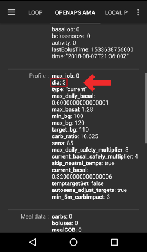

# AAPS dažnai užduodami klausimai

Kaip įtraukti klausimus į DUK: Sekite šias [instrukcijas](../make-a-PR.md)

# Bendrieji

## Ar galiu tiesiog atsisiųsti AndroidAPS įdiegimo failą?

Ne. AndroidAPS nepateikia atsisiunčiamo APK failo. Jūs turite [sukurti](../Installing-AndroidAPS/Building-APK.md) jį patys. Štai priežastis, kodėl:

AndroidAPS yra skirtas pompos valdymui ir insulino suleidimui. Remiantis galiojančiais Europos teisės aktais, visos sistemos, klasifikuojamos kaip IIa ar IIb, yra medicinos prietaisai, kuriuos privaloma sertifikuoti (gauti CE ženklą), kuriems, savo ruožtu, reikalingi atitinkami tyrimai ir patvirtinimas. Nesertifikuotų prietaisų platinimas yra neteisėtas. Panašios taisyklės yra kitose pasaulio šalyse.

Ši nuostata neapsiriboja prekyba, ji taikoma bet kokio tipo platinimui (net neatlygintinai). Kurkite medicinos prietaisą sau - vienintelė galimybė, kuriai šios taisyklės įtakos neturi.

Štai kodėl negalima platinti paruoštų programų apk pavidalu.

## Kaip pradėti?

Pirmiausia turite **paruošti komponentus, kurie veikia su AAPS**:

* [palaikomą insulino pompą](Pump-Choices.md) 
* [Android išmanusis telefonas](Phones.md) (Apple iOS nepalaiko„AndroidAPS“ - vietoj to pabandykite [iOS Loop](https://loopkit.github.io/loopdocs/)), ir 
* [Nuolatinė gliukozės kiekio kraujyje (KG) stebėjimo sistema](../Configuration/BG-Source.rst). 

Antra, jūs turite **sukonfigūruoti savo įrangą**. Žr. [Diegimo pažingsniui pavyzdį](Sample-Setup.md).

Trečia, turite **konfigūruoti programinės įrangos komponentus**: AndroidAPS ir kraujo gliukozės monitoringo šaltinius.

Ketvirta, jūs turite **išmokti ir suprasti rekomenduojamą OpenAPS struktūrą, kad galėtumėte patikrinti savo terapijos veiksnius**. Pagrindinis uždaro ciklo principas: tiksliai nustatytos valandinės bazės ir insulino - angliavandenių rodikliai. Visose rekomendacijose daroma prielaida, kad pagrindinį poreikį patenkina bazinis insulinas ir kad atsirandantys gliukozės kiekio kraujyje svyravimai atsiranda dėl kitų priežasčių (mankšta, stresas ir kt.), kurias tuo metu reikia koreguoti. Saugumo sumetimais koregavimai, kuriuos AAPS gali atlikti automatiškai, yra riboti (žr. „Maksimalus leistinas laikinas bazinis dažnis“ [OpenAPS struktūra](https://openaps.org/reference-design/)). Tai reiškia, kad neturėtumėte naudoti ciklo neteisingam bazinio greičio profiliui ištaisyti. Pvz., jei prieš valgį dažnai turite žemą glikemiją, tada tikriausiai turite pakoreguoti valandinę bazę. Naudodamiesi [Automatinis derinimas Autotune](http://openaps.readthedocs.io/en/latest/docs/Customize-Iterate/autotune.html#phase-c-running-autotune-for-suggested-adjustments-without-an-openaps-rig), galite naudoti daugybę esamų terapijos duomenų norėdami sužinoti, ar reikia koreguoti bazes, IA ir JIF. Arba galite patikrinti ir nustatyti bazę [senuoju būdu](http://integrateddiabetes.com/basal-testing/).

## Svarbūs praktiniai aspektai?

### Apsauga slaptažodžiu

Jei nenorite, kad nustatymai būtų lengvai pakeičiami, nustatymų meniu galite apsaugoti slaptažodžiu. Norėdami tai padaryti, nustatymų meniu suaktyvinkite parinktį „Nustatymų slaptažodis“ ir įveskite norimą slaptažodį. Kitą kartą eidami į „Nustatymus“, turėsite įvesti slaptažodį, kad galėtumėte atlikti pakeitimus. Jei vėliau norite išjungti slaptažodį, eikite į „Nustatymų slaptažodį“ ir ištrinkite tekstą iš lauko.

### Android Wear išmanieji laikrodžiai

Jei planuojate naudoti Android Wear programą norėdami suleisti bolusą ar pakeisti nustatymus, turite įsitikinti, kad pranešimai iš AndroidAPS nėra užblokuoti. Veiksmas patvirtinamas pateikiant pranešimą.

### Atjungti pompą

Jei reikia išjungti pompą prieš dušą / maudymąsi / plaukiojimą / sportavimą ir pan. turite pranešti AndroidAPS, kad nėra tiekiamas insulinas, kad užtikrintumėte teisingą aktyvaus insulino AIO apskaičiavimą.

* Pagrindinio ekrano viršuje ilgai paspauskite mygtuką „Uždaras ciklas“ (kol neaktyvintas uždaras ciklas, vadinama „Atviras ciklas“). 
* Pasirinkite **Atjungti pompą XY min**
* Tai nustatys laikiną bazę 0% nustatytam laiko tarpui.
* Minimali atjungimo trukmė yra mažiausia laikinos bazės TBR, kurią galima nustatyti pompoje, trukmė. Todėl, jei norite atsijungti trumpesniam laikotarpiui, vis tiek pasirinkite mažiausią turimą pompos išjungimo laiką ir prijunkite rankiniu būdu, kaip aprašyta toliau.
* Mygtukas „Uždaras Ciklas“ (arba „Atviras ciklas“) pasidarys raudonas ir dabar bus pavadintas „Išjungta (xx min)“, rodantis likusį atsijungimo laiką.
* Pasibaigus pasirinktam laikui, AAPS automatiškai vėl prisijungs, o uždaras ciklas vėl pasileis.
    
    

* Jei pasirinktas laikas buvo pernelyg ilgas, galite iš naujo prisijungti rankiniu būdu.

* Ilgai paspauskite raudoną mygtuką 'Išjungta (xx min)".
* Pasirinkite "Prijungti pompą"
    
    

### Rekomendacijos grindžiamos daugiau nei viena stebėjimo indikacija

Saugumui užtikrinti sistemos rekomendacijos pateikiamos ne pagal vieną KG rodmenį, o pagal paskutinių reikšmių vidurkį (atsižvelgiant į pokyčio delta). Todėl, jei praleidžiami keli rodmenys, gali praeiti šiek tiek laiko, kol AndroidAPS vėl pradės koreguoti glikemiją uždarojo ciklo režimu.

### Papildoma informacija

Čia yra keli tinklaraščiai su naudingais patarimais, kurie padės suprasti, kaip veikia uždaro ciklo sisemos:

* [Fine-tuning Settings](http://seemycgm.com/2017/10/29/fine-tuning-settings/) See my CGM
* [Why DIA matters](http://seemycgm.com/2017/08/09/why-dia-matters/) See my CGM
* [Limiting meal spikes](https://diyps.org/2016/07/11/picture-this-how-to-do-eating-soon-mode/) #DIYPS
* [Hormones and autosens](http://seemycgm.com/2017/06/06/hormones-2/) See my CGM

## Kokią atsarginę įrangą rekomenduojama turėti su savimi?

Žinoma, pirmiausia turite naudotis ta pačia įranga, kaip ir bet kuris kitas asmuo, sergantis 1 tipo cukriniu diabetu, su insulino pompa. Kai naudojatės AndroidAPS, mes primygtinai rekomenduojame visada ar netoliese turėti šią atsarginę įrangą:

* Baterijos, skirtos jūsų išmaniajam telefonui, išmaniajam laikrodžiui ir (galbūt) Bluetooth skaitytuvui
* Atsarginių kopijų kūrimas debesyje (Dropbox, Google diskas ...) naudojamoms programoms: naujausią AndroidAPS APK ir Key Store slaptažodį, AndroidAPS nustatymų atsarginėms kopijoms, xDrip+ nustatymų atsarginėms kopijoms, modifikuotai Dexcom app, ...
* Pompos baterijas

## Kaip saugiai pritvirtinti CGM/FGM nuolatinio monitoringo sistemas?

Galite priklijuoti: parduodami iš anksto iškirpti pleistrai populiariausioms CGM sistemoms (paieškokite Google ar eBay). Kai kurie vartotojai naudoja pigesnius standartinius kineziteipus ar juostinius pleistrus.

Galite pritvirtinti: parduodami viršutinės rankos dalies laikikliai pritvirtinti CGM/FGM guminiu raiščiu (ieškoti Google ar ebay).

# AndroidAPS parametrai

Šis sąrašas padės optimizuoti jūsų nustatymus. Pradėkite nuo viršaus ir judėkite žemyn. Prieš pradėdami spręsti kitą, įsitikinkite, kad pirmasis nustatymas tikrai teisingas. Judėkite mažais žingsneliais, tuoj pat neatlikite didelių pokyčių. Galite naudoti [Automatinį derinimą Autotune](https://autotuneweb.azurewebsites.net/), kuris nurodys bendrą kryptį, tačiau nepriimkite rekomendacijų aklai ir ne visose situacijose. Atkreipkite dėmesį, kad nustatymai papildo vienas kitą - galbūt turite „neteisingus“ nustatymus, kurie tam tikromis aplinkybėmis veikia gerai (pvz., Jei valandinė bazė yra nustatyta per didelė tuo pačiu metu, kai angliavandenių koeficientas IA yra per didelis), tačiau kitais atvejais jie neveikia. Tai reiškia, kad turite atsižvelgti į visus parametrus ir įsitikinti, kad jie veikia kartu skirtingomis aplinkybėmis.

## Insulino veikimo trukmė (IVT)

### Aprašymas & bandymai

Laikas, kol insulinas visiškai suyra.

Jis dažnai būna nustatomas per trumpas. Daugeliui žmonių reikia bent 5, kartais 6 ar 7 valandų.

### Įtaka

Per trumpas IVT gali sukelti hipoglikemiją. Ir atvirkščiai.

Jei insulino veikimo laikas per trumpas, AAPS numato per anksti, kad ankstesnis bolusas būtų visiškai „suvartotas“, ir, padidėjus glikemija, pateiks papildomo insulino. (Tiesą sakant, AAPS neišlaukia viso insulino veikimo laiko, bet prognozuoja gliukozės lygio kitimą ir atitinkamai suleidžia insuliną). Tai iš esmės lemia „insulino susikaupimą“, apie kurį AAPS nieko nežino.

Per trumpas insulino veikimo trukmės pavyzdys yra hiperglikemija, po kurios eina AAPS perteklinė korekcija ir vėliau seka hipoglikemija.

## Valandinė bazė (vv/h)

### Aprašymas & bandymai

Insulino kiekis, tiekiamas per tam tikrą valandą, kad gliukozės lygis būtų stabilus.

Išbandykite valandinę bazę išjungdami ciklą, nevalgius, laukdami maždaug penkias valandas po valgymo ir patikrindami, kaip keičiasi glikemija. Pakartokite kelis kartus.

Jei glikemija krenta, bazė yra per didelė. Ir atvirkščiai.

### Įtaka

Per aukšta bazė gali sukelti hipoglikemiją. Ir atvirkščiai.

Pagal numatytuosius nustatymus AAPS sukuria savo algoritmą, remdamasis bazės parametrais. Jei bazinė dalis per aukšta, tada nulinė laikina bazė bus nustatoma su didesne neigiama aktyvaus insulino AIO reikšme, nei reikalinga. Dėl to AAPS bus darys daugiau koregavimų, nei turėtų būti, kad aktyvusis insulinas AIO sumažėtų iki nulio.

Taigi per didelė bazė lemia žemą glikemiją tiek per standartinę bazę, tiek vėliau dėl AAPS koregavimų.

Priešingai, per maža bazė gali sukelti aukštą glikemiją ir trukdyti AAPS grąžinti ją į tikslinį diapazoną.

## Jautrumo insulinui faktorius (JIF) (mmol/l/U arba mg/dl/U)

### Aprašymas & bandymai

Tikėtinas KG sumažėjimas suleidus 1 vv insulino.

Darant prielaidą, kad bazė yra teisinga, galite tai išbandyti taip: įsitikinkite, kad AIO yra lygus nuliui, išjunkite ciklą ir suvalgykite šiek tiek gliukozės, kad gautumėte stabiliai "aukštą" glikemiją.

Tada susileiskite numatomą insulino kiekį (esant dabartiniam 1/JIF santykiui), kad gautumėte tikslinę glikemiją.

Būkite atsargūs, nes gana dažnai reikšmė yra per žema. Per žema reiškia, kad 1 vienetas sumažins glikemiją greičiau, nei tikėtasi.

### Įtaka

**Mažesnis JIF jautrumas** (pvz., 40 mg/dl/vienetui, o ne 50) = agresyvesnis algoritmas, lemiantis didesnį KG sumažėjimą kiekvienam insulino vienetui. Jei jis per mažas, tai gali sukelti hipoglikemiją.

**Didesnis JIF jautrumas** (pvz., 45 mg/dl/vienetui vietoj 35) = mažiau agresyvus algoritmas, dėl kurio mažesnis KG kritimas kiekvienam insulino vienetui. Jei per didelis, tai gali sukelti hiperglikemiją.

**Pavyzdys:**

* KG yra 190 mg/dl (10,5 mmol) ir tikslas yra 100 mg/dl (5,6 mmol). 
* Jums reikia sureguliuoti 90 mg/dl (= 190 - 100).
* JIF = 30 -> 90 / 30 = 3 vienetai insulino
* JIF = 45 -> 90 / 45 = 2 vienetai insulino

Per mažas nurodytas jautrumas JIF (dažnai) gali atlikti „per didelę korekciją“, nes AAPS darys prielaidą, kad norint koreguoti aukštą glikemiją reikia daugiau insulino, nei yra iš tikrųjų. Tai gali lemti "kalnelius"' (ypač nevalgius). Šiuo atveju jums reikia padidinti savo JIF. Tai reiškia, kad AAPS teiks mažesnes korekcijos dozes ir tai padės išvengti per didelio koregavimo, kuris baigiasi žema glikemija.

Priešingai, per mažas JIF gali sukelti „dalinius pataisymus“. Tai reiškia, kad jūsų KG išliks didesnė nei jūsų tikslinė glikemija, ypač naktį.

## Insulino angliavandenių santykis (IA) (g/U)

### Aprašymas & bandymai

Gramai angliavandenių kiekvienam insulino vienetui.

Kai kurie žmonės naudoja I:A vietoj IA arba turi omenyje angliavandenių santykį (CR).

Darant prielaidą, kad bazė yra teisinga, galite išbandyti pagal dabartinius nustatymus, jei jūsų AIO = 0 ir jūsų KG reikšmė yra normos ribose. Valgykite žinomą angliavandenių kiekį ir suleiskite reikiamą kiekį insulino, apskaičiuotą pagal jūsų IA santykį. Geriausia valgyti maisto produktus, kuriuos paprastai valgote tokiu dienos metu, ir tiksliai apskaičiuoti angliavandenių kiekį juose.

> **PASTABA:**
> 
> Kai kuriose Europos šalyse duonos vienetai buvo naudojami nustatant, kiek insulino reikia maistui. Pradžioje 1 duonos vienetas prilygo 12g angliavandenių, vėliau buvo pakeista į 10g angliavandenių.
> 
> Pagal šį modelį angliavandenių kiekis buvo nustatomas fiksuotas, insulino kiekis buvo kintamas. ("Kiek insulino reikia padengti vienam duonos vienetui?")
> 
> Naudojant IA rodiklį, insulino kiekis yra fiksuotas, o angliavandenių kiekis yra kintamas. ("Kiek gramų angliavandenių padengia vienas vienetas insulino?")
> 
> Pavyzdys:
> 
> Duonos vieneto faktorius (DV = 12g angliavandenių): 2,4vv/DV -> Jums reikia 2,4 vienetų insulino, vienam duonos vienetui.
> 
> Atitinkamai IA: 12 g /2,4 vv = 5,0 g/vv -> 1 vienetas insulino dengia 5,0 g angliavandenių.
> 
> DV (duonos vieneto) koeficientas 2,4 vv / 12g ===> IA = 12g / 2,4 vv = 5,0 g/vv
> 
> Perskaičiavimo lentelės yra prieinamos internete, pvz., [čia](https://www.mylife-diabetescare.com/files/media/03_Documents/11_Software/FAS/SOF_FAS_App_KI-Verha%CC%88ltnis_MSTR-DE-AT-CH.pdf).

### Įtaka

**Žemesnis IA** = mažiau angliavandenių vienam insulino vienetui, t. y. jums reikia daugiau insulino konkrečiam angliavandenių kiekiui. Jis gali būti vadinamas "agresyvesniu".

**Aukštesnis IA** = daugiau angliavandenių vienam insulino vienetui, t. y. jums reikia mažiau insulino konkrečiam angliavandenių kiekiui. Jis gali būti vadinamas "mažiau agresyvus".

Jei po valgio angliavandeniai visiškai suskaidomi, AIO vėl tampa lygus nuliui, o jūsų KG yra didesnė nei prieš valgį, tada jūsų IA tikriausiai yra per didelis. Ir atvirkščiai, IA yra per mažas, jei jūsų KG yra mažesnė nei prieš valgant.

# APS algoritmas

## Kodėl skirtuke „OPENAPS AMA“ IVT insulino trukmė rodoma kaip 3 (dia:3), nors mano profilis turi kitokią reikšmę?

AMA kontekste „dia“ nereiškia „insulino veikimo trukmė“. Tai parametras, kuris naudojamas susijungimui su IVT. Tai reiškia, kada korekcinė dozė turėtų nustoti veikti. Tai neturi nieko bendro su aktyvaus insulino AIO skaičiavimais. OpenAPS SMB šis parametras nebenaudojamas.

## Profilis

### Kodėl verta naudoti minimalią IVT (insulino veikimo trukmė) 5 valandas, o ne 2 ar 3 valandas?

Išsamiai paaiškinta [šiame straipsnyje](http://www.diabettech.com/insulin/why-we-are-regularly-wrong-in-the-duration-of-insulin-action-dia-times-we-use-and-why-it-matters/). Nepamirškite `AKTYVUOTI PROFILĮ` pakeitus savo insulino veikimo trukmę DIA.

### Kas lemia, kad ciklas mažina mano glikemiją iki hipoglikemijos, nors aktyvių angliavandenių AAO nėra?

Pirmiausia turėtumėte patikrinti savo bazės nustatymus ir atlikti bazės testą nevartojus angliavandenių. Jei bazė nustatyta teisinga, tokį elgesį paprastai sukelia per mažas jautrumo insulinui faktorius JIF. Per mažas JIF paprastai atrodo taip:

### Kas lemia aukštą glikemiją po valgio naudojant uždarą ciklą?

Pirmiausia turėtumėte patikrinti savo bazės nustatymus ir atlikti bazės testą nevartojus angliavandenių. Jei tai teisinga ir jūsų KG vis tiek nenusileidžia iki tikslinės normos po visiško angliavandenių įsisavinimo, pabandykite nusistatyti laikiną tikslą „greitai valgysiu“ likus šiek tiek laiko prieš valgį arba aptarkite su savo endokrinologu, koks laiko tarpas nuo susileidimo iki valgymo būtų tinkamas. Jei po valgymo jūsų glikemija yra per didelė, net ir visiškai absorbavus angliavandenius, pasitarkite su savo endokrinologu, ar neturėtų sumažinti insulino:angliavandenių IA santykio. Jei jūsų KG lygis yra per aukštas esant aktyviems angliavandeniams AAO, ir per žemas, juos visiškai absorbavus, pasitarkite su savo endokrinologu, ar turėtumėte padidinti insulino:angliavandenių santykį IA bei koks laiko tarpas nuo susileidimo iki valgymo būtų tinkamas.

# Kiti nustatymai

## Nightscout parametrai

### AndroidAPS NSClient praneša „neleidžiama“ ir neįkelia jokių duomenų. Ką aš galiu padaryti?

NSClient patikrinkite "Ryšio parametrai". Galbūt nesate prisijungę prie leidžiamo WiFi tinklo arba turite įjungtą parinktį „Tik kraunant“, o įkrovimo laidas nėra prijungtas.

## CGM parametrai

### Kodėl AndroidAPS sako "KG šaltinis nepalaiko pažangaus filtravimo"?

Jei naudojate kitokią nuolatinio monitoringo sistemą, nei Dexcom G5 ar G6, xDrip natyvinėje būsenoje, šią pranešimą gausite skirtuke AndroidAPS OpenAPS. Norėdami gauti daugiau informacijos, žr. [Gliukozės kiekio kraujyje duomenų išlyginimas](../Usage/Smoothing-Blood-Glucose-Data-in-xDrip.md).

## Pompa

### Kur turėčiau dėvėti pompą?

Yra daugybė būdų, kurioje vietoje dėvėti pompą. Nesvarbu, ar naudojate AAPS, ar ne.

### Baterijos

Silpna baterija gali išsikrauti greičiau nei įprasta, nes sistema su pompa veikia daug intensyviau nei paprastas vartotojas. Todėl rekomenduojama vėliausiai pakeisti baterija, kai ji pasiekia 25% įkrovos, nes tai gali apsunkinti duomenų perdavimą. Nightscout galite sukurti įspėjimą apie baterijos įkrovimą naudodami kintamąjį PUMP_WARN_BATT_P. Patarimai, kaip padidinti baterijos veikimo laiką:

* sutrumpinkite pompos ekrano išsijungimo laiką (pompos meniu)
* sumažinkite pompos ekrano apšvietimo trukmę (pompos nustatymų meniu)
* nustatykite garsinį, o ne vibracinį pompos pranešimą (pompos nustatymų meniu)
* pompos mygtukus spauskite tik pompos užpildymui, visą kitą informaciją, pvz., peržiūrėti istoriją, akumuliatoriaus lygį ir rezervuaro lygį turėtumėte patikrinti AndroidAPS.
* AndroidAPS programą dažnai gali išjungti telefono Android operacinė sistema, norėdama sutaupyti energijos ar atlaisvinti atmintį. Kai AndroidAPS vėl inicijuojamas, jis kiekvienu paleidimu užmezga Bluetooth ryšį su pompą ir perskaito esamą valandinę bazę ir boluso istoriją. Tam naudojama baterija. Norėdami sužinoti, ar taip atsitinka, eikite į Nustatymai> NSClient ir įgalinkite "Siųsti programų paleidimus NS". Nightscout gaus įvykio duomenis kiekvieną kartą, kai AndroidAPS bus paleista iš naujo, todėl bus lengviau sekti problemą. Norėdami sumažinti baterijos sunaudojimą tokių įvykių metu, į telefono akumuliatoriaus nustatymus įtraukite AndroidAPS į leidžiamų programų sąrašą ir tada energijos suvartojimo monitorius nustos uždarinėti AAPS.
    
    Pavyzdžiui, norint įtraukti į sąrašą Samsung telefone, kuriame įdiegtas Android Pie:
    
    * Eikite į Nustatymus -> Įrenginio priežiūra -> Akumuliatorius 
    * Ieškokite kol rasite AndroidAPS ir pasirinkite ją 
    * Nuimkite žymėjimą nuo "Įjungti programėlei miego režimą"
    * TAIP PAT eikite į Parametrai -> Programos -> (Trys apskritimo ženklai viršutiniame dešiniajame kampe) pasirinkite "specialios prieigos" -> Optimizuoti baterijos naudojimą
    * Pereikite prie AndroidAPS ir įsitikinkite, kad varnelė nepažymėta.

* nuvalykite baterijos kontaktus alkoholio servetėlėmis, kad ant jos neliktų gamyklinių riebalų pėdsakų.

* [DanaR/RS pompose](../Configuration/DanaRS-Insulin-Pump.md) baterijos paleidimo procedūra siunčia aukštos įtampos impulsą, kad būtų pašalinta gamyklinė plėvelė (tai apsaugo nuo energijos praradimo saugojimo metu), tačiau tai ne visada suveikia 100 proc. Išimkite ir vėl įdėkite bateriją 2–3 kartus, kol ekrane pasirodys 100%, arba prieš dedant ją, baterijos raktu palieskite abu baterijos galus, tačiau tik labai trumpam, kad įvyktų trumpasis jungimas.
* taip pat žiūrėkite patarimus apie [baterijų tipai](../Usage/Accu-Chek-Combo-Tips-for-Basic-usage#battery-type-and-causes-of-short-battery-life)

### Rezervuaro ir kateterių keitimas

Rezervuaro keitimo negali atlikti per AndroidAPS - tik tiesiogiai per pompą.

* AndroidAPS pagrindinio ekrano skirtuke paspauskite ir palaikykite mygtuką Atviras ciklas / Uždaras ciklas ir pasirinkite "Sustabdyti ciklą 1 val."
* Dabar atjunkite pompą, ir pakeiskite rezervuarą pagal pompos instrukciją.
* Taip pat, pirminis užpildymas bei žarnelės ir kaniulės užpildymas gali būti atliekamas tiesiogiai iš pompos. Tokiu atveju naudokite [KATETERIO KEITIMO mygtuką](../Usage/CPbefore26#pump) veiksmų skirtuke, tiesiog užregistruoti šį veiksmą.
* Iš naujo prijungę pompą, atnaujinkite ciklą ilgai paspausdami mygtuką „Sustabdyta (X min.)“.

AndroidAPS nenaudoja pompos funkcijos „Pirminis kateterio užpildymas“, o užpildo kateterį įprastu bolusu, kuris į istoriją neįrašomas. Tai reiškia, kad jis nenutraukia tuo metu nustatytos laikinos valandinės bazės. AndroidAPS skirtuke Veiksmai naudokite mygtuką „Kateterio keitimas“, kad nustatytumėte reikiamą insulino kiekį ir pradėtumėte užpildyti kateterio kaniulę. Jei kiekis nėra pakankamas, pakartokite užpildymą. Numatytuosius kiekius galite nustatyti trijų taškų meniu, esančiame skiltyje Nustatymai > Kita > Užpildymas / pirminio užpildymo standartiniai kiekiai. Norėdami sužinoti, kiek vienetų turėtumėte naudoti, priklausomai nuo adatos ir vamzdelio ilgio, skaitykite kateterio (kaniulės) instrukcijas.

## Fonas

Jūsų išmaniojo telefono AndroidAPS ekrano foną galite rasti [Išmaniųjų telefonų](../Getting-Started/Phones#phone-background) puslapyje.

## Kasdienis naudojimas

### Higiena

#### Ką daryti, kai prausiuosi po dušu ar vonioje?

Galite nusiimti pompą prieš maudantis duše ar vonioje. Per šį trumpą laiką pompos jums paprastai nereikia. Bet jūs apie tai turėtumėte pranešti AAPS, kad aktyvaus insulino IOB skaičiavimas išliktų teisingas.

Žr. [aprašymą aukščiau](../Getting-Started/FAQ#disconnect-pump).

### Darbas

Priklausomai nuo to, kokį darbą dirbate, gali būti, kad darbo dienomis naudojate skirtingus terapijos veiksnius. Turėtumėte pagalvoti apie [profilio pakeitimą](../Usage/Profiles.md) visos darbo dienos metu (pvz., daugiau nei 100% 8 valandas, jei dirbate sėdimą darbą, arba mažiau nei 100%, jei esate aktyvus), aukštą arba žemą laikiną tikslą arba nustatykite [laiko perstūmimą](../Usage/Profiles#time-shift) savo profilyje, jei atsikeliate daug anksčiau ar vėliau nei įprastai. Jei naudojate [Nightscout profilius](../Configuration/Config-Builder#ns-profile), tuomet galite ten sukurti antrą profilį (pvz., "Pagrindinis“ ir „Darbas“) ir pakeisti profilį į reikiamą.

## Laisvalaikio veikla

### Sportas

Turite pamiršti savo senus sportavimo įpročius, kuriuos turėjote prieš naudojantis AAPS ir išsiugdyti naujus. Jei tiesiog vartojate angliavandenius sportui, jūsų uždaro ciklo sistema tai atpažins ir atitinkamai suleis korekcijos bolusą.

Tuomet turite daugiau aktyvių angliavandenių, tačiau tuo pačiu ciklas įsikiš ir nurodys pompai suleisti daugiau insulino.

Kai naudojate uždarą ciklą, turėtumėte pabandyti šiuos veiksmus:

* Nustatyti [Profilį](../Usage/Profiles.md) mažiau nei 100%.
* Nustatyti [Aktyvumo laikiną tikslą](../Usage/temptarget#activity-temp-target) virš jūsų įprastinio tikslo.
* Jei naudojate SMB, įsitikinkite, kad funkcijos ["Įjungti SMB su aukštais tikslais"](../Usage/Open-APS-features#enable-smb-with-high-temp-targets) ir ["Įjungti SMB visada"](../Usage/Open-APS-features#enable-smb-always) yra išjungtos.

Svarbus išankstinis ir vėlesnis šių parametrų apdorojimas. Prieš sportuodami atlikite pakeitimus ir įvertinkite raumenų darbo poveikį.

Jei sportuojate reguliariai tuo pačiu metu (pvz., sportuojate sporto salėje), galite naudoti [Automatizavimą](../Usage/Automation.rst), kad pakeistumėte profilį ir laikinus tikslus. Geografine padėtimi pagrįsta automatizavimas taip pat yra gera idėja, tačiau apsunkina išankstinį apdorojimą.

Profilio pasikeitimo procentas, laikino tikslo dydis esant sportiniam aktyvumui bei pokyčių nustatymo geriausias laikas yra individualūs. Pradėkite nuo saugesnių parinkčių (pavyzdžiui, su mažu profilio procentu ir aukštesniais laikinais tikslais).

### Seksas

Galite nusiimti pompą, kad būtumėte laisvas, tačiau apie tai turite pranešti AAPS, kad aktyvaus insulino IOB skaičiavimai būtų teisingi.

Žr. [aprašymą aukščiau](../Getting-Started/FAQ#disconnect-pump).

### Alkoholio vartojimas

Alkoholio vartojimas yra rizikingas su uždaru ciklu, nes algoritmas negali tinkamai numatyti alkoholio įtakos glikemijai. Turėsite rasti savo metodą, kaip tai padaryti, tačiau galite naudoti šias AndroidAPS funkcijas:

* Išjungti uždaro ciklo režimą išjungimas ir valdyti diabetą rankiniu būdu, arba
* nustatykite aukštus laikinus tikslus ir išjunkite nepranešto valgymo UAM funkciją, kad ciklas nedidintų aktyvaus insulino IOB, dėl įtarimo, kad valgoma nepranešus, arba
* pakeisti profilį į žymiai mažesnį nei 100% 

Jei vartojate alkoholį, visada turite stebėti savo glikemiją, kad išvengtumėte hipoglikemijos valgydami angliavandenius.

### Miegas

#### Kaip užtikrinti ciklo veikimą naktį, neveikiant mobiliajai ir WIFI spinduliuotei?

Daugelis vartotojų naktį mobiliajame telefone įsijungia lėktuvo režimą. Jei norite, kad ciklas veiktų jūsų miego metu, atlikite šiuos veiksmus (tačiau tai veiks tik tada, jei naudojate vietinį glikemijos šaltinį, pvz., xDrip+ arba modifikuotą Dexcom programą, jis NEVEIKS, jei glikemijos duomenis gaunate per NIghtscout):

1. Įjunkite lėktuvo režimą mobiliajame telefone.
2. Palaukite, kol lėktuvo režimas bus įjungtas.
3. Įjunkite Bluetooth.

Dabar negausite skambučių ir nebūsite prisijungęs prie interneto. Bet ciklas veiks.

Kai kuriems vartotojams kilo problemų naudojantis telefoną skrydžio režime (AAPS negavo glikemijos reikšmių iš xDrip+). Eikite į Parametrai > Inter-app nustatymai > Nustatyti gavėjus ir įrašyti `info.nightscout.androidaps`.

### Keliavimas

#### Kaip elgtis keičiantis laiko juostai?

Su Dana R ir Dana R Korean jums nereikia daryti nieko. Kitoms pompoms - žr. puslapyje [Keliavimas per laiko juostas](../Usage/Timezone-traveling.md).

## Medicininiai aspektai

### Hospitalizacija

Jei norite suteikti gydytojui informaciją apie AndroidAPS ir šią "pasidaryk pats Dirbtinę kasą", tada galite atspausdinti [AndroidAPS vadovas medikams“](../Resources/clinician-guide-to-AndroidAPS.md).

### Vizitas pas endokrinologą

#### Ataskaitos

Galite parodyti savo Nightscout ataskaitas (https://jusu-nightscout-svetaine.com/report) arba naudoti [Nightscout Reporter](https://nightscout-reporter.zreptil.de/).