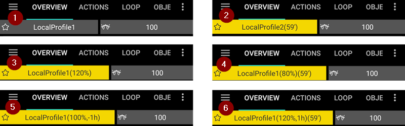
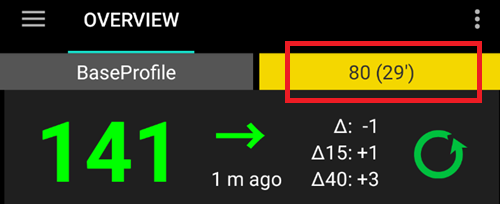
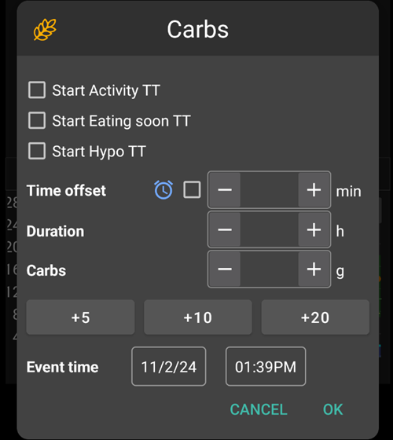

# AndroidAPS ekranai

## Pradžios ekranas

Tai pradinis ekranas, kurį matysite paleidę AndroidAPS, ir kuriame yra visa svarbiausia informacija.

### Skiltis A - Skirtukai

* Naršyti tarp įvairių AndroidAPS modulių.
* Arba galite pakeisti ekranus, pasukant į kairę arba į dešinę.
* Rodomi skirtukai gali būti pasirenkami [Konfigūratoriuje](../Configuration/Config-Builder#tab-or-hamburger-menu).

### Skiltis B - Profilis & tikslinė glikemija

#### Dabartinis profilis

* Dabartinis profilis rodomas juostos kairėje.
* Ilgai paspaudus profilio juostą, galite pamatyti išsamią profilio informaciją arba [ perjungti profilį](../Usage/Profiles#profile-switch).
* Jei profilio perjungimas buvo atliktas konkrečiam apribotm laikui, skliausteliuose nurodomas likęs laikas minutėmis.

#### Tikslas

* Dabartinė tikslinė glikemija rodoma juostoje dešinėje.
* Ilgai paspaudus tikslo juostą, galite nustatyti [laikiną tikslą](../Usage/temptarget.md).
* Jei nustatytas laikinas tikslas, juosta tampa geltona, o likęs laikas minutėmis rodomas skliausteliuose.

#### Dinaminio tikslo koregavimo vizualizavimas

* AAPS gali dinamiškai koreguoti tikslą pagal jautrumą, jei naudojate SMB algoritmą.
* Suaktyvinkite vieną arba abi [parinktis](../Configuration/Preferences#openaps-smb-settings) 
   * "jautrumas didina tikslą" ir/arba 
   * "rezistencija mažina tikslą" 
* Jei AAPS aptinka jautrumo padidėjimą ar sumažėjimą, tikslas pasikeičia priklausomai nuo to, kas apibrėžta profilyje. 
* Kai jis pakeičia tikslinę glikemiją, juostos fonas tampa žalias.

### Skiltis C - Glikemija & ciklo būklė

#### Dabartinis gliukozės kiekis kraujyje

* Paskutinis iš jūsų NGJ gautas gliukozės kiekis kraujyje rodomas kairėje pusėje.
* Gliukozės kiekio kraujyje reikšmės spalva atspindi jo padėtį, palyginti su nustatytu [diapazonu](../Configuration/Preferences#range-for-visualization). 
   * žalias = normos ribose
   * raudona = žemiau normos ribų
   * geltona = virš normos ribų
* Vidurinis pilkas blokas rodo minutes nuo paskutinių duomenų ir pokyčius nuo ankstesnių duomenų skaitymo, taip pat pokyčius per paskutines 15 ir 40 minučių.

#### Ciklo būklė

* Naujas ženkliukas rodo ciklo būklę:
   
   * žalias apskritimas = ciklas veikia
   * žalias apskritimas su punktyrine linija = [sustabdymas esant žemai glikemijai](../Usage/Objectives#objective-6-starting-to-close-the-loop-with-low-glucose-suspend)
   * raudonas apskritimas = ciklas išjungtas (išjungtas visiškai)
   * geltonas apskritimas = ciklas laikinai sustabdytas (nustatyta valandinė bazė leidžiama) - likęs laikas rodomas žemiau piktogramos
   * pilkas apskritimas = pompa atjungta (laikinai nėra leidžimas insulinas) - likęs laikas rodomas žemiau piktogramos
   * Oranžinis apskritimas = veikia super bolusas - likęs laikas rodomas žemiau piktogramos
   * mėlynas apskritimas su punktyrine linija = atviras ciklas

* Ilgai paspauskite apskritimo piktogramą, kad atidarytumėte meniu, leidžiantį išjungti, sustabdyti, vėl įjungti ciklą arba atjungti / vėl prijungti pompą.
   
   

### Skiltis D - AIO, AAO, Bazė ir Jautrumas

* Švirkšto piktograma: aktyvus insulinas (AIO) - aktyvaus insulino kiekis jūsų kūne
   
   * Aktyvaus insulino organizme kiekis yra nulis, jei naudojama tik standartinė bazė ir nėra bolusų insulino. 
   * AIO gali būti neigiamas, jei paskutiniu metu buvo sumažinta valandinė bazė.
   * Spustelėkite ant ženkliuko, kad pamatytumėte bolusų ir bazinio insulino paskirstymą

* Kviečio grūdas: [aktyvūs angliavandeniai (AAO)](../Usage/COB-calculation.rst) - anksčiau suvalgyti ir dar neįsisavinti angliavandeniai -> piktograma mirksi (oranžinė / raudona), jei apskaičiuojama kad būtina suvartoti angliavandenių

* Violetinė linija: valandinė bazė - piktogramos pokyčiai atspindi laikinos valandinės bazės pokyčius (tiesi, kai nustatyta 100%) 
   * Spustelėkite ant piktogramos, kad peržiūrėtumėte profilio nustatytą valandinę bazę ir išsamią informaciją apie bet kokią laikiną bazę (įskaitant likusį laiką)
* Rodyklės aukštyn ir žemyn: nurodo [autosens - jautrumo nustatymo](../Usage/Open-APS-features#autosens) būseną (įjungta arba išjungta), o jautrumo reikšmė rodoma po piktograma

#### Būtini angliavandeniai

* Angliavandenių pasiūlymai pateikiami, kai algoritmas nustato, kad reikia papildomų angliavandenių.
* Tai yra tada, kai oref algoritmas mano, kad negali sustabdyti glikemijos kritimo vien nustačius 0% laikiną bazę, o norint jus apsaugoti nuo hipoglikemijos, reikia suvalgyti šiek tiek angliavandenių.
* Angliavandenių apskaičiavimo pranešimai yra daug sudėtingesni nei skaičiuotuvo (boluso patarėjo) pranešimai. Galite pamatyti angliavandenių pasiūlymą, o Skaičiuotuvas (boluso vedlys) nerodo trūkstamų angliavandenių.
* Jei reikia, reikalaujamų angliavandenių pranešimai gali būti siunčiami Nightscout, tokiu atveju pranešimas bus rodomas ir perduodamas.

### Skiltis E - Būklės indikatoriai

* Būsenos indikatoriai pateikia vizualų įspėjimą 
   * Kateterio amžius
   * Insulino amžius (kiek dienų yra naudojamas rezervuaras)
   * Rezervuaro lygis (vienetais)
   * Sensorius
   * Baterijos amžius ir lygis (%)
* Jei pasiekiamas lygis, dėl kurio reikia atkreipti dėmesį, reikšmės bus rodomos geltonai.
* Jei pasiekiamas lygis, dėl kurio būtina atkreipti dėmesį, reikšmės bus rodomos raudonai.
* Nustatymai atliekami [Nustatymuose](../Configuration/Preferences#status-lights).

### Skiltis G - Pagrindinis grafikas

* Grafike rodomas gliukozės kiekis kraujyje (KG), kurį perduoda gliukozės kiekio kraujyje jutiklis (NGJ). 
* Čia rodomos veiksmų skirtuke įvestos pastabos, tokios kaip kalibravimas, angliavandenių įrašai ir profilio pakeitimai. 
* Ilgai paspaudę ant grafiko, galite pakeisti laiko skalę. Jūs galite pasirinkti 6, 12, 18 ar 24 valandų duomenis.
* Žalioji zona atspindi jūsų tikslinę sritį. Ji gali būti konfigūruojama [Nustatymuose](../Configuration/Preferences#range-for-visualization).
* Mėlyni trikampiai rodo [SMB](../Usage/Open-APS-features#super-micro-bolus-smb) - jei jie aktyvuoti [Nustatymuose](../Configuration/Preferences#openaps-smb-settings).
* Papildoma informacija:
   
   * Prognozės
   * Bazė
   * Aktyvumas - insulino aktyvumo kreivė

#### Papildomos informacijos aktyvavimas

* Spustelėkite trikampį, esantį dešinėje pagrindinio grafiko pusėje, kad pasirinktumėte informaciją, kuri bus rodoma pagrindiniame grafike.
* Pagrindiniam grafikui galimi tik trys variantai, esantys virš eilutės „\---\---- 1 grafikas\---\----“.
   
   

#### Prognozavimo kreivės

* **Oranžinė** linija: [AAO](../Usage/COB-calculation.rst) (oranžinė spalva dažniausiai naudojama angliavandeniams vaizduoti)
   
   Ši prognozavimo kreivė parodo, kaip jūsų KG (be aktyvių angliavandenių) turėtų keistis, atsižvelgiant į jūsų dabartinius pompos nustatymus, darant prielaidą, kad nukrypimai nuo angliavandenių įsisavinimo išlieka pastovūs. Ši kreivė rodoma tik tuo atveju, jei yra žinomi AAO.

* **Mėlyna** linija: AIO (ši spalva įprastai žymi insuliną)
   
   Ši prognozavimo kreivė parodo, kokia gali būti glikemija veikiant tik insulinui. Pavyzdžiui, jei susileidote insulino, bet nevalgėte angliavandenių.

* **Žydra** linija: glikemijos kitimo prognozė, jei būtų nustatyta nulinė bazė
   
   Ši prognozavimo kreivė parodo, kaip keisis AIO kreivė, jei pompa visiškai sustabdys insulino leidimą (0% TBR).

* **Geltona** linija: [NDM](../Configuration/Sensitivity-detection-and-COB#sensitivity-oref1) (nedeklaruotas maistas)
   
   Nedeklaruotas maistas - reikšmingo glikemijos kilimo dėl neįvesto maisto, adrenalino ar kito poveikio aptikimas. Prognozuojama kreivė yra panaši į ORANŽINĘ AAO kreivę, tačiau daroma prielaida, kad nuokrypiai mažės pastoviu greičiu (didinant dabartinį kritimo greitį).

Paprastai faktinė glikemijos kreivė baigsis šių eilučių viduryje arba netoli tos linijos, kuri geriausiai atspindi jūsų tikrąją situaciją.

#### Bazė

* Vientisa **mėlyna linija** rodo valandinę bazę, nustatytą pompoje, ir atspindi aktualų insulino suleidimą per tam tikrą laiką.
* Brūkšniuota **mėlyna linija** būtų buvusi tokia, kokia turėjo būti nustatyta valandinė bazė, jei nebūtų laikinų bazių (TBR) koregavimų.
* Tuo metu, kai leidžiama nustatyta valandinė bazė, plotas po kreive rodomas tamsiai mėlyna spalva.
* Laikinai koregavus (padidinus ar sumažinus) valandinę bazę, plotas po kreive rodomas šviesiai mėlyna spalva.

#### Aktyvumas

* **Plona geltona** linija rodo insulino aktyvumą. 
* Ji remiasi tikėtinu insulino poveikiu glikemijai, kai neveikia kiti veiksniai (pvz.: angliavandeniai).

### Skiltis G - papildomi grafikai

* Jūs galite aktyvuoti iki keturių papildomų grafikų žemiau pagrindinio grafiko.
* Norėdami atidaryti papildomų grafikų nustatymus, spustelėkite trikampį dešinėje [pagrindinio grafiko](../Getting-Started/Screenshots#section-f-main-graph) pusėje ir slinkite žemyn.

* Norėdami pridėti papildomą grafiką, pažymėkite langelį kairėje jo pavadinimo pusėje (pvz., \---\--- 1 grafikas \-----).

#### Insulinas absoliučiais vienetais

* Aktyvus insulinas, įskaitant bolusus **ir bazę**.

#### Aktyvus insulinas organizme

* Parodo, kiek insulino turite suleista (= aktyvus insulinas jūsų organizme). Į jį įeina insulino bolusas ir laikina bazė (**bet neįtraukiama valandinė bazė, nustatyta jūsų profilyje**).
* Jei IVT laikotarpiu nebūtų [SMB](../Usage/Open-APS-features#super-micro-bolus-smb), bolusų ir laikinų bazių, aktyvus insulinas būtų lygus nuliui.
* AIO gali būti neigiamas, jei nebėra aktyvių bolusų ir ilgesnį laiką buvo nustatyta nulinė/žema laikina bazė.
* Insulino suskaidymas organizme priklauso nuo jūsų [IVT ir insulino profilio nustatymų](../Configuration/Config-Builder#local-profile-recommended). 

#### Aktyvūs angliavandeniai

* Rodo suvartotus angliavandenius (= aktyvūs, dar neįsisavinti angliavandeniai jūsų organizme). 
* Jų nykimas priklauso nuo algoritmo apskaičiuotų nuokrypių (deviacijų). 
* Kai nustatoma didesnė angliavandenių įtaka, nei tikėtasi, sistema suleis daugiau insulino ir AIO padidės (kaip labai padidės priklauso nuo Jūsų saugumo nustatymų). 

#### Nuokrypiai

* **PILKI** stulpeliai rodo glikemijos svyravimus (nuokrypius arba deviacijas), kuriuos sukelia angliavandeniai. 
* **ŽALI** stulpeliai rodo, kad glikemija yra didesnė, nei algoritmas apskaičiavo. Žalius stulpelius naudoja [Autosens](../Usage/Open-APS-features#autosens), kad padidintų atsparumą.
* **RAUDONI** stulpeliai rodo, kad glikemija yra mažesnė, nei algoritmas apskaičiavo. Raudonąsias juostas naudoja [Autosens](../Usage/Open-APS-features#autosens), kad padidintų jautrumą.
* **GELTONUOSE** stulpeliuose rodomas nuokrypis dėl nedeklaruoto maisto NDM.

#### Jautrumas insulinui

* Rodo jautrumą, kurį aptinka [Autosens](../Usage/Open-APS-features#autosens). 
* Tai jautrumo insulinui faktoriaus pokyčiai dėl fizinio aktyvumo, hormonų ir pan.

#### Aktyvumas

* Rodo insulino aktyvumą, apskaičiuotą pagal jūsų insulino profilį (tai nėra AIO išraiška). 
* Kreivė tuo aukštesnė, kuo insulino aktyvumo pikas arčiau.
* AIO mažėjant, aktyvumas gali tapti neigiamas. 

#### Nukrypimo koeficientas

* Algoritme naudojama vidinė vertė.

### Skiltis H - Mygtukai

* Visada yra rodomi insulino, angliavandenių ir skaičiuotuvo mygtukai. 
* Kiti mygtukai turi būti nustatyti [Nustatymuose](../Configuration/Preferences#buttons).

#### Insulinas

* Tam tikrą insulino kiekį suleisti galima nenaudojant [boluso skaičiuotuvo](../Getting-Started/Screenhots#bolus-wizard).
* Pažymėję langelį galite automatiškai inicijuoti savo [netrukus valgysiu laikiną tikslą](../Configuration/Preferences#default-temp-targets).
* Jei nenorite suleisti bolusą per pompą, bet tiesiog įrašyti insulino suleidimą (pvz., švirkštu ar penu), pažymėkite atitinkamą langelį.

#### Angliavandeniai

* Naudojama angliavandenių įvedimui be boluso suleidimo.
* Kai kuriuos [iš anksto nustatytus laikinus tikslus](../Configuration/Preferences#default-temp-targets) galima pasirinkti tiesiog pažymint langelį.
* Laiko poslinkis: kai valgysite/ruošiatės valgyti angliavandenius (minutėmis).
* Trukmė: naudojama [ištęstiems angliavandeniams](../Usage/Extended-Carbs.rst)
* Mygtukais galite patogiai greitai padidinti angliavandenių kiekį.
* Pastabos bus įkeltos į Nightscout - priklausomai nuo jūsų [NS client](../Configuration/Preferences#ns-client) nustatymų.

#### Skaičiuotuvas

* Žr. [informaciją žemiau](../Configuration/Screenhots#bolus-wizard)

#### Kalibravimas

* Siunčia kalibraciją į xDrip+ arba atidaro Dexcom kalibracijos langą.
* Turi būti aktyvuotas [Nustatymuose](../Configuration/Preferences#buttons).

#### NGJ

* Atveria xDrip+.
* Atgal mygtukas grįžta į AAPS.
* Turi būti aktyvuotas [Nustatymuose](../Configuration/Preferences#buttons).

#### Greitas vedlys

* Lengvai įveskite angliavandenių kiekį ir nustatykite skaičiavimo parametrus.
* Nustatymo parametrai koreguojami [Nustatymuose](../Configuration/Preferences#quick-wizard).

## Boluso skaičiuotuvas

Įprastai jis naudojamas maisto bolusams suleisti.

### Skiltis I

* KG (kraujo gliukozės) langelyje matosi paskutinis sensoriaus rodmuo. Jei sensorius neveikia, šis langelis bus tuščias. 
* AV langelyje turite įvesti maisto, kurį valgysite, angliavandenių ar jų atitikmens kiekį. 
* CORR laukas yra, jei norite pakeisti galutinę dozę dėl kokios nors priežasties.
* Laukas Laiko poslinkis skirtas išankstiniam bolusui, todėl galite nurodyti, kad angliavandeniai bus valgomi vėliau. Šiame langelyje galite įvesti ir laiką su minuso ženklu, jei angliavandenius jau suvalgėte anksčiau.

### Skiltis J

* Jei pažymėsite SUPER BOLUSO laukelį, bus suleistas papildomas insulinas, kurio kiekis lygus ateinančių 2 valandų bazei, o bazė taps nulinė. 
* Tai galbūt padės išvengti didelio glikemijos pakilimo po maisto, nes papildomai "pasiskolinama" insulino iš bazės.
* Išsamesnę informaciją skaitykite [diabetesnet.com](https://www.diabetesnet.com/diabetes-technology/blue-skying/super-bolus/).

### Skiltis K

* Rodo apskaičiuotą bolusą. 
* Jei aktyvaus, anksčiau suleisto insulino kiekis viršija apskaičiuotą boluso kiekį, bus parodytas tik papildomai reikalingų angliavandenių kiekis.
* Pastabos bus įkeltos į Nightscout - priklausomai nuo jūsų [NS client](../Configuration/Preferences#ns-client) nustatymų.

### Skiltis L

* Informacija apie boluso skaičiuotuvo apskaičiavimo parametrus.
* Jūs galite nuimti žymes nuo bet kurių iš jų, tačiau normaliai neturėtumėte to daryti.
* Saugumo sumetimais langelį **LT (laikinas tikslas) reikia pažymėti rankiniu būdu**, jei norite, kad boluso skaičiuotuvas atsižvelgtų į nustatytą laikiną tikslą.

#### AAO ir AIO kombinacijos ir jų reikšmė

* Saugumo sumetimais, pažymėjus AAO laukelį, negalima panaikinti AIO žymėjimo. Kitu atveju insulino gali būti suleista per daug, jei AAPS neatsižvelgs į tai, kiek insulino jau buvo suleista.
* Jei pažymėsite ir AAO, ir AIO, į skaičiavimus bus įtraukti visi dar aktyvūs angliavandeniai ir visas aktyvus insulinas (suleistas kaip laikina bazė ar SMB).
* Jei pažymėsite tik AIO be AAO, AAPS skaičiavimuose atsižvelgs į anksčiau suleistą ir aktyvų insuliną, tačiau ne į angliavandenius. Todėl matysite pranešimą 'trūkstami angliavandeniai'.
* Jei norite suleisti bolusą **papildomam maistui**, kurį valgėte tuoj po jau įvesto maisto (pvz.: užsimanėte deserto), naudinga **nuimti žymes nuo visų laukelių**. Tokiu būdu bus įskaičiuojami tik nauji angliavandeniai, o ne tie, kurie buvo įvesti anksčiau, nes jie nebūtinai tiksliai absorbuoti ir AIO nebūtinai juos tiksliai atitinka.

#### Neteisingo AAO kiekio nustatymas

* Jei pasinaudoję skaičiuotuvu matote tokį perspėjimą, reiškia sistema nustatė galimai klaidingą AAO kiekį. 
* Todėl suleisdami papildomą bolusą po paskutinio valgymo rizikuojate perdozuoti! 
* Išsamesnės informacijos ieškokite [AAO apskaičiavimo puslapyje](../Usage/COB-calculation#detection-of-wrong-cob-values).

## Insulino profilis

* Tai rodo insulino aktyvumo profilį, kurį pasirinkote [Konfigūratoriuje](../Configuration/Config-Builder#insulin). 
* VIOLETINĖ kreivė rodo, kiek insulino lieka laikui bėgant po injekcijos, nes jis pamažu ardomas, o MĖLYNA kreivė rodo, kaip kinta jo aktyvumas.
* Svarbu atkreipti dėmesį į tai, kad insulino veikimo laikas yra labai ilgas. 
* Įprastai naudodami pompą Jūs tikriausiai skaičiuodavote, kad insulinas išnyksta po maždaug 3.5 val. 
* Tačiau uždarame cikle "uodegos" yra labai reikšmingos, nes skaičiavimai yra žymiai preciziškesni, todėl net mažiausi insulino likučiai turi būti įskaičiuojami.

Išsamiau apie skirtingus insulino tipus, aktyvumo profilius ir kam viso to reikia, galite paskaityti čia: [Understanding the New IOB Curves Based on Exponential Activity Curves](https://openaps.readthedocs.io/en/latest/docs/While%20You%20Wait%20For%20Gear/understanding-insulin-on-board-calculations.html#understanding-the-new-iob-curves-based-on-exponential-activity-curves)

Jūs taip pat galite perskaityti puikų blogo straipsnį čia: [Why we are regularly wrong in the duration of insulin action (DIA) times we use, and why it matters…](http://www.diabettech.com/insulin/why-we-are-regularly-wrong-in-the-duration-of-insulin-action-dia-times-we-use-and-why-it-matters/)

Ir dar daugiau čia: [Exponential Insulin Curves + Fiasp](http://seemycgm.com/2017/10/21/exponential-insulin-curves-fiasp/)

## Pompos statusas

* Pateikiama įvairi informacija apie pompos būklę. Rodoma informacija priklauso nuo jūsų pompos modelio.
* Žr. [Pompų puslapį](../Hardware/pumps.rst) dėl išsamesnės informacijos.

## Priežiūra

Priežiūros skiltyje rasite tas pačias funkcijas, kaip Jūsų Nightscout puslapyje po "+" simboliu, ir galėsite pridėti pastabų prie savo duomenų.

### Peržiūrėkite angliavandenių apskaičivimą

* Jei insulino kiekiui apskaičiuoti naudojote [Skaičiuotuvą](../Getting-Started/Screenshots#bolus-wizard), šį skaičiavimą galite peržiūrėti vėliau Terapijos skirtuke.
* Tiesiog paspauskite žalią Skaič. nuorodą. (Priklausomai nuo naudojamos pompos, insulinas ir angliavandeniai Terapijos skirtuke taip pat gali būti rodomi kaip viena eilutė)

### Angliavandenių korekcija

Įrašų skiltis gali būti naudojama neteisingam angliavandenių kiekiui ištaisyti (pvz., jei pervertinote ar per mažai įvertinote angliavandenių kiekį).

1. Patikrinkite ir įsidėmėkite esamą aktyvių angliavandenių AAO ir aktyvaus insulino AIO kiekį, rodomą pagrindiniame ekrane.
2. Priklausomai nuo pompos modelio, angliavandeniai rodomi kartu su insulinu vienoje eilutėje arba kaip atskiras įrašas (pvz., Dana RS).
3. Ištrinkite neteisingo angliavandenių kiekio įrašą.
4. Patikrinkite aktyvių angliavandenių kiekio AAO įrašą pagrindiniame ekrane - šitaip įsitikinkite, kad angliavandeniai buvo sėkmingai ištrinti.
5. Atlikite tą patį su aktyviu insulinu AIO, jei skirtuke „Įrašai“ matote angliavandenius ir insuliną vienoje eilutėje.
   
   -> Jei angliavandeniai nėra ištrinti, kaip nurodyta (6.), ir įvedate papildomų angliavandenių, tikėtina, kad aktyvių angliavandenių AAO bus per daug, ir dėl to gali būti suleista per daug insulino.

6. Įvesite teisingą angliavandenių kiekį per AV mygtuką pagrindiniame ekrane ir įsitikinkite, kad teisingai įvedėte valgymo laiką.

7. Jei skirtuke „Įrašai“ matote vienoje eilutėje angliavandenius ir insuliną, taip pat turite iš naujo įvesti insulino kiekį. Atkreipkite dėmesį į tinkamo laiko pasirinkimą ir tada pradžios ekrane patikrinkite aktyvaus insulino AIO duomenis.

## Ciklas, AMA / SMB

* Šie skirtukai rodo informaciją apie algoritmų skaičiavimus ir kodėl AAPS veikia taip, kaip jis daro.
* Skaičiavimai vykdomi kiekvieną kartą, kai sistema gauna naujus duomenis iš NGJ.
* Išsamesnės informacijos ieškokite skyriaus [Konfigūratoriaus APS dalies puslapyje](../Configuration/Config-Builder#aps).

## Profilis

* Profilyje yra informacija apie jūsų individualius diabeto parametrus:
   
   * IVT (insulino veikimo trukmė)
   * IA: insulino ir angliavandenių santykis
   * JIF: Jautrumo insulinui faktorius
   * Valandinė bazė
   * Tikslas: Kraujo gliukozės lygis, kurį nustatote ir kurio turi siekti AAPS

* Galite naudoti [vietinį profilį](../Configuration/Config-Builder#local-profile-recommended), kurį galima redaguoti išmaniajame telefone, arba [Nightscout profilį](../Configuration/Config-Builder#ns-profile), kurį reikia redaguoti NS puslapyje ir perkelti į telefoną (aktyvuoti telefone). Išsamesnės informacijos ieškokite atitinkamuose skyriuose [Konfigūratoriaus puslapyje](../Configuration/Config-Builder.md).

## Terapija

Šių terapijų istorija:

* Bolusas ir angliavandeniai -> parinktis, leidžianti [ištrinti įrašus](../Getting-Started/Screenshots#carb-correction), siekiant koreguoti istoriją
* [Ištęstas bolusas](../Usage/Extended-Carbs#id1)
* Laikina bazė
* [Laikinas tikslas](../Usage/temptarget.md)
* [Profilio keitimas](../Usage/Profiles.md)
* [Priežiūros portalas ](../Usage/CPbefore26#careportal-discontinued) - užrašai, įvesti skirtuke Veiksmas ir užrašai pranešimuose

## KG Šaltinis - xDrip, modifikuota Dexcom programėlė...

* Priklausomai nuo jūsų KG šaltinio nustatymų, ši kortelė yra pavadinta skirtingai.
* Parodo NGJ duomenų istoriją ir siūlo galimybę ištrinti duomenis nesklandumo atveju (pvz., duomenys, esant prispaustam jutikliui).

## NSClient

* Rodo ryšio su jūsų Nightscout svetaine būseną.
* Nustatymai atliekami [Nustatymuose](../Configuration/Preferences#nsclient). Atidarykite atitinkamą skyrių spustelėdami krumpliaračio simbolį viršutiniame dešiniajame ekrano kampe.
* Apie trikčių šalinimą žr. [šį puslapį](../Usage/Troubleshooting-NSClient.md).