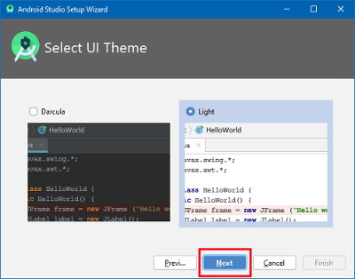

# Android programos (APK) kūrimas

## Kurti sau, o ne parsisiųsti

**Dėl reikalavimų medicininiams įrenginiams, nėra galimybės tiesiog parsisiųsti AndroidAPS programą. Programos kūrimas savo reikmėms yra visiškai teisėtas, tačiau jums neleidžiama perduoti jos kopijos kitiems! Žr. [DUK](../Getting-Started/FAQ.md) dėl išsamesnės informacijos.**

## ## Svarbios pastabos

* Norėdami sukurti APK failą, naudokite **[Android Studio 3.6.1 arba naujesnę versiją](https://developer.android.com/studio/)**.
* [Windows 10 32-bitų sistemos](../Installing-AndroidAPS/troubleshooting_androidstudio#unable-to-start-daemon-process) nėra palaikomos Android Studio 3.6.1.

**Konfigūracija pagal pareikalavimą** nepalaikoma dabartinėje Android Gradle modulio versijoje!

Jei sukurti APK nepavyko dėl pasirinktinės konfigūracijos klaidos, galite atlikti šiuos veiksmus:

* Atidarykite nustatymų langą spustelėdami File > Settings (Mac kompiuteryje Android Studio > Preferences).
* Kairiojoje srityje spustelėkite Build, Execution, Deployment > Compiler.
* Panaikinkite langelio „Configure on demand“ žymėjimą.
* Spustelėkite Apply arba OK.

* * *

### Šis straipsnis yra padalintas į dvi dalis.

* Apžvalgos skyriuje paaiškinta, kokių veiksmų reikia norint sukurti APK failą.
* Žingsnis po žingsnio instrukcijose rasite konkretaus diegimo ekrano kopijas. Kadangi Android Studio versijos - programinės įrangos kūrimo aplinka, kurioje sukursime APK - keičiasi labai greitai, tikslios atitikties su savo kūrimu nepamatysite, tačiau susidarysite bendrą įspūdį, kaip tai daroma. Android Studio veikia Windows, Mac OS X ir Linux ir kiekvienoje platformoje gali būti nedidelių skirtumų. Jei pastebite, kad kažkas svarbaus neveikia tinkamai arba jo trūksta, praneškite Facebook grupėje "AndroidAPS users" arba Gitter kanale [Android APS](https://gitter.im/MilosKozak/AndroidAPS) arba [AndroidAPSwiki](https://gitter.im/AndroidAPSwiki/Lobby), kad galėtumėme išspręsti problemą.

## Apžvalga

APK failui sukurti reikalingi šie veiksmai:

1. [Git diegimas](../Installing-AndroidAPS/git-install.rst)
2. [Android Studio įdiegimas](../Installing-AndroidAPS/Building-APK#install-android-studio)
3. [Nustatyti git kelią Android Studio parametruose](../Installing-AndroidAPS/Building-APK#set-git-path-in-preferences)
4. [Atsisiųsti AndroidAPS kodą](../Installing-AndroidAPS/Building-APK#download-androidaps-code)
5. [Atsisiųskite AndroidAPS SDK](../Installing-AndroidAPS/Building-APK#download-android-sdk)
6. [Sukurti programą](../Installing-AndroidAPS/Building-APK#generate-signed-apk) (generuoti pasirašomą apk)
7. [Perkelti apk failą į telefoną](../Installing-AndroidAPS/Building-APK#transfer-apk-to-smartphone)
8. [Identifikuoti gavėją, jei naudojate xDrip+](../Installing-AndroidAPS/Building-APK#identify-receiver-if-using-xdrip)

## Žingsnis po žingsnio instrukcija

Detalus veiksmų, reikalingų sukurti APK failą, aprašymas.

## Įdiegti git (jei neturite)

Vykdykite instrukcijas pagal [git instaliavimo puslapį](../Installing-AndroidAPS/git-install.rst).

## Android Studio įdiegimas

Šios ekrano kopijos yra iš Android Studio 3.6.1 versijos. Priklausomai nuo Android Studio versijos, jūsų ekranas gali atrodyti šiek tiek kitaip. Bet jūs vis tiek turėtumėte sugebėti susitvarkyti. Čia galite rasti [bendruomenės pagalbą](../Where-To-Go-For-Help/Connect-with-other-users.md).

Vienas iš svarbiausių aspektų diegiant Android Studio yra: **Būkite kantrūs!** Diegiant ir nustatant Android Studio yra įkeliama daug duomenų ir tai užima daug laiko.

Įdiekite [Android Studio](https://developer.android.com/studio/install.html) ir nustatykite jį pirmojo paleidimo metu.

Pasirinkite „Do not import settings“, nes iki šiol nebuvo atlikta jokių nustatymų.


Nuspręsti, ar norite bendrinti duomenis su Google, ar ne.


Kitame ekrane spustelėkite "Next" (kitas).


Pasirinkite "Standart" instaliavimą ir spauskite "Next".


Pasirinkite sąsajos dizainą, kuris jums labiausiai patinka. (Šiame vadove mes naudojamas "Light".) Tada spustelėkite "Next" (kitas). Tai tik spalvų schema. Galite pasirinkti bet kurią norite (pvz., "Darcula" tamsiam režimui). Šis pasirinkimas neturi įtakos APK kūrimui.



"Verify Settings" (patvirtinti nustatymus) lange spustelėkite "Next".


Palaukite, kol Android Studio siunčiasi papildomus komponentus ir būkite kantrūs. Kai viskas atsisiųs, mygtukas "Finish" (baigti) pamėlynuos. Spustelėkite mygtuką dabar.


## Android Studio nustatymuose įveskite git kelią

Įsitikinkite, kad [git yra įdiegta](../Installing-AndroidAPS/git-install.rst) kompiuteryje.

Android Studio pasisveikinimo ekrane spustelėkite mažą trikampį (1. kitame paveikslėlį) ir pasirinkite "Settings" (Nustatymai) (2.).


### Windows

* Spustelėkite mažą trikampį šalia "Version Control" (1.) norėdami atidaryti sub-meniu.
* Spustelėkite Git (2.).
* Įsitikinkite, kad atnaujinimo metodas "Merge" (3.) yra pasirinktas.
* Check if Android Studio can locate path to git.exe automatically by clicking the button "Test" (4.)
    
    

* If automatic setting is successful git version will be displayed.

* Click "OK" in the dialog box (1.) and "OK" in the settings window (2.).
    
    

* In case file git.exe cannot be found click "OK" in the dialog box (1.) and then the button with the three dots (2.).

* Use [search function](https://www.tenforums.com/tutorials/94452-search-file-explorer-windows-10-a.html) in windows explorer to find "git.exe" if you are unsure where it can be found. Jūs ieškote git.exe, esančiame \bin\ aplanke.
* Select path to git.exe and make sure you selected the one in ** \bin\ ** folder (3.) and click "OK" (4.).
* Close settings window by clicking "OK" button (5.).
    
    

* **Reboot your computer to update system environment.**

### Mac

* Any git version should work. For example <https://git-scm.com/download/mac>.
* Use homebrew to install git: ```$ brew install git```.
* For details on installing git see the [official git documentation](https://git-scm.com/book/en/v2/Getting-Started-Installing-Git).
* If you install git via homebrew there is no need to change any preferences. Jei prireiks: Jos gali būti randamos čia: Android Studio - Preferences.

## Atsisiųsti AndroidAPS kodą

* **If you haven't already rebooted your computer after setting git path in preferences do it now. System environment must be updated.**

* There are two options to start a new project:
    
    * On the Android Studio welcome screen click "Get from version control"
        
        
    
    * If you already opened Android Studio and do not see the welcome screen anymore select File (1.) > New (2.) > Project from Version Control... (3.)
        
        

* Fill in the URL to the main AndroidAPS repository (https://github.com/nightscout/AndroidAPS) (1.).

* Choose the directory where you want to save the cloned code. (2.)
* Click button "Clone" (3.).
    
    

* Do not click "Background" while repository is cloned!
    
    

* After repository is cloned successfully open your local copy by clicking "Yes".
    
    

* In the lower right corner you will see the information that Android Studio is running background tasks.
    
    

* Grant access if your firewall is asking for permission.
    
    

* Once the background tasks are finished you will probably see the following error message:
    
    

## Atsisiųskite AndroidAPS SDK

* Click File > Settings.
    
    

* Click the small triangle next to Appearance & Behaviour (1.).

* Click the small triangle next to System Settings (2.) and select Android SDK (3.)
* Check the box left of "Android 9.0 (Pie)" (4.) (API Level 28).
    
    

* Confirm changes by clicking OK.
    
    

* Accept licence agreement (1.) and click "Next" (2.).
    
    

* Wait until installation is finished.
    
    

* When SDK installation is completed the "Finish" button will turn blue. Click this button.
    
    

* Android Studio might recommend to update the gradle system. **Never update gradle!** This might lead to difficulties!

* If you see an information on the lower right side of your Android Studio window that Android Gradle Plugin is ready to update click on the text "update" (1.) and in the dialog box on "Don't remind me again for this project" (2.).
    
    

## Generuoti pasirašytą APK (Generate signed APK)

Signing means that you indicate your app to be your own creation but in a digital way as a kind of digital fingerprint within the app itself. That is necessary because Android has a rule that it only accepts signed code to run for security reasons. For more information on this topic, follow [this link](https://developer.android.com/studio/publish/app-signing.html#generate-key).

* Spustelėkite "Build" (Sukurti) meniu juostoje ir pasirinkite "Generate Signed Bundle / APK..." (Generuoti pasirašomą rinkinį / APK...).
    
    

* Pasirinkite "APK" (1.) vietoje "Android App Bundle" ir spauskite "Next" (2.).
    
    

* Make sure that module is set to "app" (1.).

* Click "Create new..." (2.) to start creating your key store.
    
    A key store in this case is nothing more than a file in which the information for signing is stored. It is encrypted and the information is secured with passwords.
    
    

* Click the folder symbol (1.) to select your key store path.

* Select the path where your key store shall be saved (2.). **Do not save in same folder as project. You must use a different directory!** One option might be your home folder.
* Type a file name for your key store (3.).
* Click "OK" (4.).
* Passwords for key store and key do not have to be very sophisticated. Make sure to remember those or make a note in a safe place. In case you will not remember your passwords in the future you see [troubleshooting for lost key store](../Installing-AndroidAPS/troubleshooting_androidstudio#lost-keystore).
* Enter (5.) and confirm (6.) the password for your key store.
* Do the same for your key (7. + 8.).
* Validity (9.) is 25 years by default. You do not have to change the default value.
* First and last name must be entered (10.). All other information is optional.
* Click "OK" (11.) when you are done.
    
    

* Make sure the box to remember passwords is checked (1.). So you don't have to enter them again next time you build the apk (i.e. when updating to a new AndroidAPS version).

* Click "Next" (2.).
    
    

* Pasirinkite kūrimo variantą "fullRelease" (1.).

* Pažymėkite langelius V1 ir V2 parašo versijoms(2.).
* Spustelėkite "Finish". (3.)
    
    

* Android Studio bus rodoma informacija "APK(s) generated successfully..."(APK(s) sukurtas sėkmingai...), kai kūrimas bus baigtas.

* Jei kūrimas nebuvo sėkmingas, skaitykite [trikčių diagnostikos skiltį](../Installing-AndroidAPS/troubleshooting_androidstudio.rst).
* Lengviausias būdas surasti sukurtą APK, spustelėkite ant "Event log" (įvykių žurnalai).
    
    

* Įvykių žurnalo skiltyje spauskite "locate" (surasti).
    
    

* failo, kurio ieškote, pavadinimas yra app-full-release.apk.
    
    

## Perkelkite APK į išmanųjį telefoną

Lengviausias būdas perkelti app-full-release.apk failą į telefoną yra [USB kabeliu ar Google Disku](https://support.google.com/android/answer/9064445?hl=en). Prašome atkreipti dėmesį, kad perdavimas elektroniniu paštu gali sukelti sunkumų ir nėra tinkamiausias būdas.

Jūsų telefone jūs turite leisti diegti programas iš nežinomų šaltinių. Instrukcijas, kaip tai padaryti, galima rasti internete (pvz., [čia](https://www.expressvpn.com/de/support/vpn-setup/enable-apk-installs-android/) arba [čia](https://www.androidcentral.com/unknown-sources)).

## Identifikuoti gavėją, jei naudojate xDrip+

[See xDrip+ page](../Configuration/xdrip#identify-receiver)

## Trikčių šalinimas

Žr. atskirą puslapį, kuriame pateiktas [Android Studio trikčių šalinimas](../Installing-AndroidAPS/troubleshooting_androidstudio.rst).