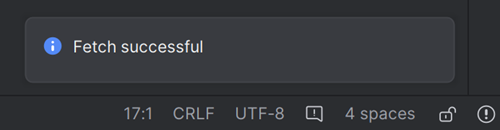

# Atnaujinimas į naują versiją arba atšaką

## Kurti sau, o ne parsisiųsti

**Dėl reikalavimų medicininiams įrenginiams, nėra galimybės tiesiog parsisiųsti AndroidAPS programą. Programos kūrimas savo reikmėms yra visiškai teisėtas, tačiau jums neleidžiama perduoti jos kopijos kitiems! Žr. [DUK](../Getting-Started/FAQ.md) dėl išsamesnės informacijos.**

## Svarbios pastabos

* Prašome atnaujinti kuo greičiau, kai tik nauja versija yra prieinama. Gausite [informaciją AndroidAPS pagrindiniame ekrane](../Installing-AndroidAPS/Releasenotes#release-notes) apie naują versiją.
* Nuo versijos 2.3 jūs turite naudoti git atnaujinimui. Atnaujinimas per zip failą daugiau nebeveikia.
* Versijos 2.7 duomenų saugyklos adresas pakeistas į <https://github.com/nightscout/AndroidAPS>. Jei nesate susipažinę su git, paprasčiausias būdas yra pašalinti esamą AndroidAPS katalogą ir pradėti [programos kūrimą nuo pradžių](../Installing-AndroidAPS/Building-APK.md).
* Please use **[Android Studio Version 2020.3.1 (Arctic Fox)](https://developer.android.com/studio/)** or newer to build the apk.
* [Windows 10 32-bit systems](../Installing-AndroidAPS/troubleshooting_androidstudio#unable-to-start-daemon-process) are not supported by Android Studio 2020.3.1.
* Jei naudojate xDrip įsitikinkite, kad [nustatote gavėją](../Configuration/xdrip#identify-receiver).
* You can also use Dexcom G6 with the ['Build your own Dexcom App'](../Hardware/DexcomG6.html#if-using-g6-with-build-your-own-dexcom-app).

## Trumpas vadovas patyrusiems vartotojams

Please skip this paragraph if you are updating for the first time. Trumpas vadovas patyrusiems vartotojams. Kitas jūsų žingsnis būtų [įdiegti git](../Installing-AndroidAPS/git-install.rst), jei dar to nepadarėte.

If you have already updated AAPS from previous versions and use a Windows PC you can update in four simple steps:

1. [Export your settings](../Usage/ExportImportSettings#export-settings) from the existing AAPS version on your phone to be on the save side
2. [Atnaujinkite vietinę kopiją](../Installing-AndroidAPS/Update-to-new-version#update-your-local-copy) (VCS->Git->Pull)
3. [Generuokite pasirašomąAPK](../Installing-AndroidAPS/Update-to-new-version#generate-signed-apk) (Pasirinkite "app", o ne "wear"!)
4. Depending on your [BG source](../Configuration/BG-Source.rst) make sure to [identify receiver](../Configuration/xdrip#identify-receiver) in xDrip or use the ['Build your own Dexcom App'](../Hardware/DexcomG6.html#if-using-g6-with-build-your-own-dexcom-app).

## Įdiegti git (jei neturite)

Vykdykite instrukcijas pagal [git instaliavimo puslapį](../Installing-AndroidAPS/git-install.rst).

## Atnaujinkite savo vietinę kopiją

* Versijos 2.7 duomenų saugyklos adresas pakeistas į <https://github.com/nightscout/AndroidAPS>. If you are not familiar with git the easiest way for update is remove directory with AndroidAPS on your disk and follow the instructions to do a [New clone](../Installing-AndroidAPS/Building-APK.md). If you have already changed the URL or update from version 2.8.x, follow these steps:

* Open your existing AndroidAPS project with Android Studio. You might need to select your project. (Double) click on the AndroidAPS project.
    
    

* In the menu bar of Android Studio, select Git -> Fetch
    
    

* You will see a message in the lower right corner that Fetch was successful.
    
    

* In the menu bar, now select Git -> Pull
    
    

* Leave all options as they are (origin/master) and select Pull
    
    

* Wait while download is in progress, you will see this as info in the bottom bar. When it's done, you will see a success message. Note: The files that were updated may vary! This is not an indication
    
    

* Gradle Sync will be running a couple of seconds to download some dependencies. Wait until it is finished.
    
    

* Your sourcecode is now the current released version. It's time to build the signed apk from it as described in the [build signed apk section](../Installing-AndroidAPS/Building-APK.html#generate-signed-apk).

## Check AAPS version on phone

After you installed the new apk, you can check the AAPS version on your phone by clicking the three dots menu on the top right and then About.

## Trikčių šalinimas

Žr. atskirą puslapį, kuriame pateiktas [Android Studio trikčių šalinimas](../Installing-AndroidAPS/troubleshooting_androidstudio.rst).