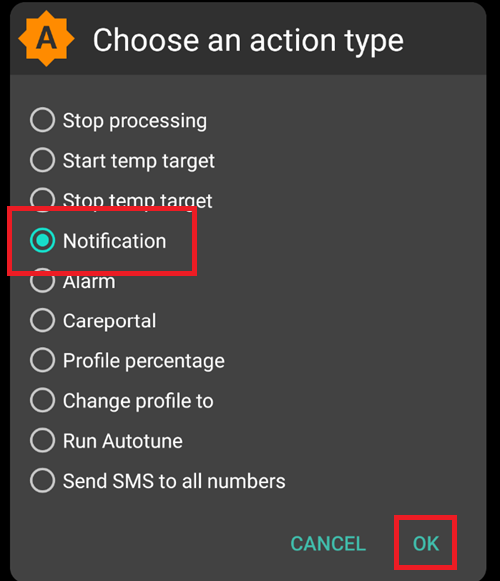
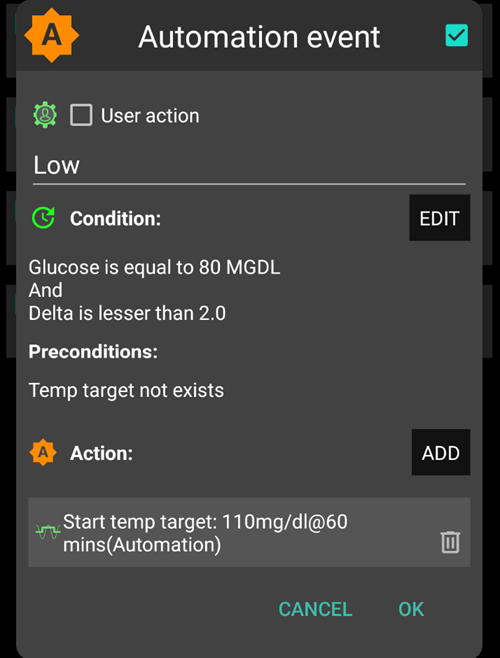

# Automatizavimas

## What is an Automation?

**Automation** is a feature within **AAPS** designed to simplify a user’s **AAPS** management and be personalised to fit within their lifestyle needs.

An **Automation** instructs **AAPS** to carry out a certain action ‘automatically’ and on a regular basis like exercise or eating soon. **Automation** can also be set up to create a rule for a one off event planned into the future, or triggered if the user is located within a certain radius distance of GPS location or WIFI SSID area.

The primary benefit of **Automation** is to relieve the user from the burden of having to constantly action a **Temp Target** or similar **AAPS** setting. According to research conduct by [*Stanford university*](https://www.stanford.edu/) there are on average per day 180 health decisions that have to be made by a user when living with Type 1 (and discussed further here:  https://www.ncbi.nlm.nih.gov/pmc/art Stanford university icles/PMC6286423/#ref4) . **Automations** can therefore help simplify diabetic management by:

* **Decrease decision fatigue:** **Automations** can lessen the mental load of constant decision-making and free up the user’s mental energy for other aspects of life.

* **Improve adherence:** **Automations** should help ensure **AAPS** is optimised correctly in the future and avoid **Temp Targets** being missed during busy schedules or periods of forgetfulness. We have all been there!

* **Personalised management:** **Automations** can be tailored to the user’s specific needs and preferences, by creating a rules with **AAPS** that integrate into the user's lifestyle.

* **Promote data-driven decisions:** when data is gathered with **AAPS**, **Automations** will be invoked and make adjustments within the parameters as set by the user. For instance, for predicted low **BG**, the user can set an **Automation** to reduce insulin and raise **BG**.  This can lead to better diabetic management.

The example below illustrates what steps are eliminated by an **Automation** than compared with no **Automation** set up in **AAPS**. The user has set an **Automation** to trigger a 5am ‘Temp Target Exercise’ to ensure their **BG** is at the optimal rate in time for their 6am exercise:

However, it's important to remember that:

**Automations** are not a replacement for expert guidance and users should consult with their healthcare team. This is particularly so if the user feels the **Automation** is compensating for sub-optimal insulin base settings (discussed further below).

As with any other technology, **CGMs** or **Pumps** can malfunction: Technical issues or sensor errors could disrupt the **Automation** actions, and will require manual intervention. **AAPS** should be monitored and alarms & notifications responded to.

Before setting up an **Automation**, a user should have a reasonable BG control within their Closed Loop as well as be comfortable with their **Temp Targets** and **Profile** settings and switches.

## Why is Automation when AAPS is in Closed Loop mode?

Why is **Automation** required if **AAPS** is in **Closed Loop** mode? Because even in **Closed Loop**, the user may require further flexibility to attain optimal **BG** for regular lifestyle events like: Attending the exercise at a regular time: an **Automation** can be created to _automatically_  to drive **BG** to optimal level;

Eating a certain meal regular time, an **Automation** can be created to _automatically_ drive **BG** to optimal level;

For low BG, an **Automation** can be created to _automatically_ activate a high **Temp Target** .

## When can I start using Automation?

It is recommended that new users do not rush into **Automations* without first dummy testing their proposed rule by activating the ‘notification’ option under ‘Actions’.

This will trigger **AAPS** to first display to the user a notification rather than automating an action. When the user is comfortable that the notification has been triggered at the correct time, the **Automation’s** rule can be updated to replace the ‘Notification’ with a real ‘Action’.

## How to set up an Automation?

To set up an **Automation** the user must create a ‘rule’ with **AAPS**. To do this the user must action in **AAPS**:

* give their ‘rule’ a title;
* select at least one ‘Condition’; and
* select one ‘Action’;
* check the right box to the **Automation** event is ‘ticked’ to ensure it is activated.

:::{admonition} Important note
:class: note

Automation is still active when the Loop is disabled!
:::

To deactivate an **Automation** rule when Loop is disabled the user should untick the box left of the name of the **Automation** rule. The example below  illustration an **Automation**  entitled ‘Low Glucose TT’ as be activated (‘ticked) and deactivated (‘unticked’).

## Where are Automations located in AAPS?

Depending on the user’s settings in [config builder](../Installing-AndroidAPS/change-configuration.md#config-builder), an **Automation** is located in the ‘hamburger’ menu or as a tab with **AAPS**.

## Safety limits

There are safety limits set as a general rule for **Automations**:

* The glucose value has to be between 72 and 270 mg/dl or 4 and 15 mmol/l.
* The **Profile** percentage has to be between 70% and 130%.
* There is a 5 minute time limit between executions of  **Automation** (and first execution).

:::{admonition} Warning
:class: warning

Please be careful when selecting a negative value in Automation
:::

Caution must be taken when selecting a ‘negative value’ within the ‘Condition’ like "less than" in **Automations**. Selecting ‘less than’ with a negative value will trigger a negative number. For example:

**Example 1:** Creating a Condition __lesser than -1__ will:

* trigger an **Automation** for any number **strictly lesser than** -1. This includes numbers like -2, -3, -4 and so on.

It's crucial to remember that -1 itself **is not** included in this condition.

**Example 2:** Creating a Condition  __more than -1__ will:

* trigger an **Automation**  opposite to Example 1 above. This means the Condition will be trigger any number **greater than or equal to -1**.

This includes numbers like 0, 1, 10, and any other positive number.

It is therefore important to carefully consider the intention of your **Automation** when choosing a value. Selecting the wrong combination could lead to unintended consequences.

## Sąlyga

There are various ‘Conditions’ that can be selected by the user in  **Automation*. The list below is non exhaustive:

**Condition:** connect conditions

**Options:**

Several conditions can be linked with
* “And”
* “Or”
* “Exclusive or” (which means that if one - and only one of the - conditions applies, the action(s) will happen)

**Condition:** time vs. recurring time

**Options:**

* time = single time event
* recurring time = something that happens regularly (i.e. once a week, every working day etc.)

**Condition:** location

**Options:**

* in the **config builder** (Automation), the user can select their required location service..

**Condition:** location service

**Options:**

* Use passive location: **AAPS** only takes locations when other apps are requesting it.
* Use network location: Location of your Wifi.
* Use GPS location (Attention! This can cause excessive battery drain!)

## Veiksmas

**Actions:** start **Temp Target**

**Options:**

* **BG** must be between 72 mg/dl and 270 mg/dl (4 mmol/l and 15 mmol/l)
* **TT** works only if there is no previous Temp Target

**Actions:** stop **Temp Target**

**Options:**

none

**Actions:** **Profile** percentage

**Options:**

* **Profile** must be between 70% and 130%
* works only if the previous percentage is 100%

Once the ‘Action’ is added,  the default values must be changed to the desired number by clicking and adjusting the default values.

## Reprioritising Automation rules to improve AAPS’ performance

 The performance of **AAPS** can be affected by the set up arrangement organised for **Automations** rules. **AAPS** will automate the rules created in the order of preference in a sliding scale starting from the top of the user’s  **Automation** list. For example, if the ‘low hypoglycemia’  **Automation** is the most preferred  **Automation**, above all other rules, then this  **Automation** should appear at the top of the user’s **Automation** list as demonstrated below:

To reprioritise the **Automation** rules, click and hold the four-lines-button on the right side of the screen and reorganise the  **Automations** by moving the rules up or down.

## How to delete Automation rules

To delete an **Automation** rule click on the trash icon.

## Best practice & caveats

* When using **Automation** for the first time, create a new rule, first add a notification only until you are sure the rule is working effectively.  Watch the **Automation** results.
* Do not try to make the ‘conditions’ too easy (i.e.: IF BG > 80 mg/dl AND bg < 180 mg/dl) as otherwise it is unlikely the **Automation**will be triggered. This is important if the ‘action’ is a Profile switch!
* Try to use **Temp Targets** instead of **Profile Switches**. **Temp Targets** do not reset Autosens back to 0.
* Make sure **Profile Switches** are used sparingly and preferably as a last resort. **Profile Switches** renders Autosens useless for a minimum of 6 hours.
* **Profile Switches** will not reset the **Profile** back to the user’s base Profile
* The user must must create another **Automation** rule to revert to the original**Profile**. Otherwise. the user must action the **Profile**  switch manually!
* **Profile Switches** actioned by an **Automation** should be used sparingly. Frequent use of  **Profile Switches** could be indicative of an underperforming diabetic management due to poor **AAPS** set up.
* There is increased risk of hypoglycemia if the**Profile Switches** does  not expire or reset back to the user’s base **Profile**.

## Examples of Automations created

Below are examples of **Automations** created. Further discussion on **Automations** and how users have individualised their  **Automation** can be found in Facebook discussions groups or on Discord.

As explained above, users should style their **Automation** to suit their own demands and needs.  The examples below should not be replicated without the user having a good understanding of the rudimentals **Automation**, it's potential impact it can have on their **AAPS** management.  The rules should not be replicated by users without dummy testing (as discussed above) and checking if these parameters below are correct for them. Diabetic management varies from user to user, especially in **AAPS**.

### Žemos glikemijos laikinas tikslas

This **Automation**  triggers an automatic ‘Temp Target Hypo’ when low **BG** is at a certain threshold.

### Lunch Time Temp Target (with ‘Location’)

This **Automation** has been created for a user who eats their lunch at work around the same time every weekday but triggered only if the user is situated within a set ‘location’.  So if the user is not at work one day, this Automation will be activated.

This **Automation** will set a low Temp Target (Eating Soon) at 13:00 to drive ‘BG, to 90mg (or 5 mmls) in preparation for lunch.

The ‘Trigger’ location is set by inputting the latitude and longitude GPS coordinates as below:

Because of the ‘And’ connection, the **Automation** only happens during the ‘chosen time’ and if the user is at the selected location.

The **Automation** will not be triggered on any other time at this location or on this time outside of 100 metres set GPS coordinates.

### WIFI SSID Location Automation

Using WIFI SSID is a good option to trigger an **Automation** while within range of a specific wifi network (than compared with GPS), it is fairly precise, uses less battery and works in enclosed spaces where GPS and other location services might not be available.

Here is another example of setting up a **Temp Target** for work days only before breakfast(1).

The **Automation** will trigger at 05:30am only on Monday-Friday(2)  
and while being connected to a home wifi network (3).

It will then set a**Temp Target**  of 75mg/dl for 30 minutes (4). One of the advantages of including the location is that it will not trigger if the user is travelling on vacation for instance.

Here is the screenshot detailing the **Automation**  triggers:

1) Under the main “AND” (both conditions need to be met to trigger) 1) Recurring time = M,T,W,T,F At 5:30am  
1) WIFI SSID = My_Home_Wifi_Name

## Incorrect use of Automation

Using **Automation** incorrectly can lead to difficulties and even danger to the user’s health. Examples for incorrect use are instance:
* Trying to constantly override **AAPS** rather than pause and properly evaluate the users **Profile** and tuning basal, IC etc.
* Setting a **Profile switch** to compensate for the food.
* Setting a **Profile switch** without inputting a duration.
* Creating one way rules (i.e. failing to create another rule in order to undo the original rule).
* Creating long term rules.

## Automation Logs

**AAPS** has a log of the most recent **Automation** triggered at the bottom of the screen under the **Automation** tab.

In the example below the logs indicate:

(1) at 01:58 am, the “Low BG triggers temp hypo profile” is activated
* glucose value is less than 75mg/dl;
* delta is negative (ie: the BG is going down);
* time is within 01:00 am and 06:00 am.

The **Automation** will:
* set a **Temp Target** to 110mg/dl for 40 minutes;
* start a temporary **Profile** at 50% for 40 minutes.

(2) at 03:38 am,  the “High carb after low at night” is triggered
* time is between 01:05 am and 06:00 am;
* glucose value is greater than 110mg/dl. .

The **Automation** will:
* change **Profile** to LocalProfile1 (ie: cancel the temporary profile if any)
* stop **Temp Target** (if any)

## Trikčių šalinimas

* Problem: __My automations are not being triggered by AAPS?__

Check the box to the right of  **Automation** event is ‘ticked’ to ensure the rule is activated.

* Problem: __My automations are being triggered in the wrong order.__

Check your rule prioritisation order as discussed above here.

## Alternatyvos

For advanced users, there are other possibilities to automate tasks using IFTTT or a third party Android app called Automate. Some examples can be found here.

