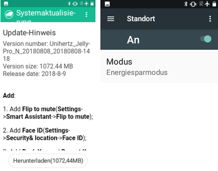

# Jelly Pro

## Pranašumai/Trūkumai

### Jelly privalumai

* Jis tikrai mažas.
* Žmonės gali jo nelaikyti už tikrą telefoną, tačiau jie gali būti išimtis tais atvejais, kai naudotis išmaniaisiais telefonais neleidžiama.

### Jelly trūkumai

* Rekomenduojama tik patyrusiems uždaro ciklo naudotojams (kai kurie parametrai yra neatpažįstami, jūs turite žinoti iš patirties su įprastiniu Android AAPS telefonu, kaip ir kur kas yra. Kai kurie AAPS mygtukai yra sunkiai pasiekiami.)
* Gali būti naudojamas tik kaip uždaro ciklo telefonas. Geriau turėti normalų telefoną kišenėje. 
* Jei nenaudojate Jelly kaip žvaigždė (Visada(!) nešiojate su savimi!), Jelly parodo savo kiaulišką charakterį: atjungia visus Bluetooth ryšius ir purkštauja tol, kol jo neperkraunat. 

## Jelly Pro - baterijos oprimizavimas

Tolimesni nustatymai ir naudojimo patarimai (naudokite laikrodį kasdieniams veiksmams vietoj Jelly telefono) padeda išlaikyti maždaug 35 valandas baterijos veikimo laiko. Papildomas baterijos taupymo režimas nėra būtinas, greičiau atvirkščiai, todėl jį išjunkite.

### Pirmas diegimas

<b>Labai svarbu:</b> Jei jums nereikia Android 8.1 (t. y. uždaras ciklas su Accu-Check Combo) likite su Android 7.0!

Follow these rules to stay with Android 7.0:

* Nesijunkite prie bevielio ar mobilaus ryšio naudojant pirmą kartą, norint išvengti automatinių atnaujinimų.
* Praleiskite bevielio tinklo nustatymą.
* Google paskyrą nustatymas atsijungus yra vienintelis dalykas, kurio negalima praleisti.
* Eikite į nustatymus ir išjungkite automatinį naujinimą (Settings >System >About the phone >System update >Three-point menu top right >Settings >Automatically check for updates >Once)
* Kiekvieną kartą įjungus bevielį arba mobilųjį ryšį, jums bus pranešta, kad sistemą galima atnaujinti. Neatnaujinkite! Geriausia ištrinti pranešimą, kad atsitiktinai neatnaujintumėte. Nes nebus taip lengva šį žingsnį atšaukti. 
* Įdiegtos programos gali ir turėtų būti atnaujintos.

### Parametrai

* Naudokite Jelly tik uždaram ciklui.
* Nustatykite bevielį tinklą tik xDrip, AAPS ir Wear OS, kitu atveju išjunkite. 
* Bevielis ryšys gali būti aktyvuotas tik trumpam laikui, jei norite įkelti duomenis į Nightscout.
* Jelly nereikia SIM kortelės, bet jei jūs naudojate, įsitikinkite, kad išjungėte mobiliuosius duomenis. Paprasčiausias būdas tai padaryti - įjungti skrydžio režimą.
* Net jei ir nenaudojate SIM kortelės, išjunkite mobiliuosius duomenis.
* Bluetooth, žinoma, turi būti įjungtas. Jei pompa nėra pasiekiama ilgesnį laiko tarpą, paieškos funkcija išnaudos daug baterijos.
* DURASPEED DĖL (Nustatymai > Įrenginys > Duraspeed on). Įgalinkite AAPS, Wear OS ir xDrip veikti fone. Visos kitos programos neturėtų veikti fone.
* Uždarykite visas kitas užduotis fone. Nustatymai > Išmanusis padėjėjas > Uždaryti užduotis fone > Išjungti visas kitas programas (išskyrus AAPS, WearOS and xDrip+).
* Vietos nustatymo paslauga turi būti įjungta, bet energijos taupymo režimu (Nustatymai > Vartotojas > Vieta > Režimas > Energijos taupymo režimas).
* Ekrano ryškumas nustatytas 0%, miego režimas - 15-30 sek. (Nustatymai > Įrenginys > Ekranas).
* Kasdienės veiklos tik per laikrodį. Kitus nustatymus ir ekraną naudoti tik krovimo metu. 
* Jelly, kaip ir pompa, lieka nepaliesti po drabužiais visą dieną.

## Patarimai

* Jelly nevisada yra intuityvus naudoti ir kartais elgiasi kaip mažas vaikas. Perkrovimas (mygtukas dešinėje) visada yra gera idėja.
* Portreto režimu ne visi mygtukai gali būti matomi. Todėl verta pasukti Jelly 90 laipsnių kampu.

* Antraštė pradžios ekrane gali talpinti iki 6 piktogamų dešinėje. Laikrodžiui reikia 2 iš jų. Taigi, jei 5 jau yra užimtos (t.y., bluetooth, netrukdyti, nėra SIM kortelės, skrydžio režimas ir baterijos indikatorius), laikrodis nebus rodomas. Šiek tiek padidinkite garsą mygtuku viršutiniame dešiniajame kampe, tada laikrodis atsiras antraštėje. ;-)
* "Žadintuvas", kuris iš pradžių (su gamykliniais paramerais) rodomas pradžios ekrane žemiau laiko, tikriausiai yra antra laiko juosta. Išjunkite šią funkciją, nes AAPS gali pasiekti neteisingą laiko juostą (Nustatymai > Sistema > Data& ir laikas > Automatinė laiko juosta > Išjungti). Naudokite ryšio tinklo laiką.
* Ekrano nuotrauka gali būti padaryta, paspaudus "tylųjį" mygtuką (apačioje kairėje) + mygtuką (dešinėje) vienu metu. 

