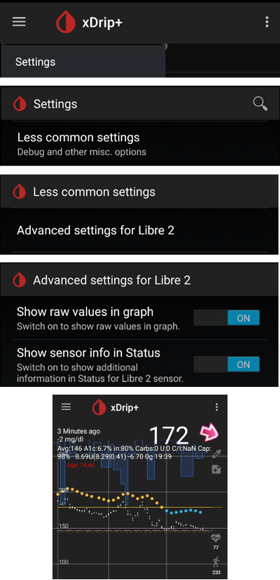

- - -
orphan: true
- - -

# Freestyle Libre 2 and 2+

The Freestyle Libre 2 sensor is now a real CGM even with the official app. Still, LibreLink cannot send data to AAPS. There are several solutions to use it with AAPS.

## 1. Use a Bluetooth bridge and OOP

Bluetooth transmitters can be used with the Libre 2 (EU) or 2+ (EU) and an out of process algorithm app. You can receive blood sugar readings every 5 minutes like with the [Libre 1](./Libre1.md).

Check the bridge and app you want to use are compatible with your sensor and xDrip+ (older Blucon and recent ones won't work, Miaomiao 1 needs firmware 39 and Miaomiao 2 firmware 7).

The Libre2 OOP is creating the same BG readings as with the original reader or the LibreLink app via NFC scan. AAPS with Libre 2 do a 10 to 25 minutes smoothing to avoid certain jumps. See below [Value smoothing & raw values](#libre2-value-smoothing-raw-values). OOP generates readings every 5 minutes with the average of the last 5 minutes. Therefore the BG readings are not that smooth but match the original reader device and faster follow the "real" BG readings. If you try to loop with OOP please enable all smoothing settings in xDrip+.

There are some good reasons to use a Bluetooth transmitter:

-   You can choose various OOP2 calibration strategies (1): have the reader values using "no calibration", or calibrate the sensor like a Libre 1 using "calibrate based on raw" or ultimately calibrate the the readers like values with "calibrate based on glucose".  
  Make sure to leave OOP1 disabled (2).

    → Hamburger Menu → Settings → Less common settings → Other misc. options


-   The Libre 2 sensor can be used 14.5 days as the Libre 1
-   8 hours backfilling is fully supported

Remark: The transmitter can be used in parallel to the LibreLink app without interfering with it.

## 2. Use xDrip+ direct connection

```{admonition} Libre 2 EU only
:class: warning
xDrip+ doesn't support direct connection to Libre 2 US and AUS.
Only Libre 2 and 2+ **EU** models.
```

- Follow [these instructions](https://www.minimallooper.com/post/how-to-setup-freestyle-libre-2-and-oop2-to-use-a-native-bluetooth-connection-in-xdrip) to setup xDrip+ but make sure to download [the latest OOP2](https://drive.google.com/file/d/1hkbs60Bv2udTlMS81UStCdY4RaHR0V57/view) as the one in the document is obsolete.
- Follow setup instructions on [xDrip+ settings page](../CompatibleCgms/xDrip.md).

-   Select xDrip+ in in [ConfigBuilder, BG Source](#Config-Builder-bg-source).

## 3. Use Diabox

- Install [Diabox](https://www.bubblesmartreader.com/_files/ugd/6afd37_f183eabd4fbd44fcac4b1926a79b094f.pdf). In Settings, Integration, enable Share data with other apps.


- Select xDrip+ in in [ConfigBuilder, BG Source](#Config-Builder-bg-source).

## 4. Use Juggluco

See [here](./Juggluco.md).

(libre2-patched-librelink-app-with-xdrip)=

## 5. Use the patched LibreLink app with xDrip+

```{admonition} Libre 2 EU only
:class: warning
The patched app is an old version (22/4/2019) and might not be compatible with recent Android releases.  
```

### Step 1: Build the patched app

For legal reasons, "patching" has to be done by yourself. Gebruik een zoekmachine om links naar de instructies te vinden. There are two variants: The recommended original patched app blocks any internet traffic to avoid tracking. The other variant supports LibreView.

The patched app has to be installed instead of the original app. The next sensor started with it will transmit the current BG values to the xDrip+ app running on your smartphone via Bluetooth.

Important: To avoid possible problems it may help to first install and uninstall the original app on an NFC capable smartphone. NFC has to be enabled.   Installeer daarna pas de gepatchte app.

The patched app can be identified by the foreground authorization notification. The foreground authorization service improves the connection stability compared to the original app which does not use this service.


Other indications could be the Linux penguin logo in the three dot menu -> Info or the font of the patched app (2) different from the original app (1). These criteria are optional depending on the app source you choose.


Ensure that NFC is activated, enable the memory and location permission for the patched app, enable automatic time and time zone and set at least one alarm in the patched app.

### Step 2: Start the sensor with the patched app

Now start the Libre2 sensor with the patched app by simply scanning the sensor. Zorg ervoor dat je alle instellingen als volgt hebt ingesteld.

Verplichte instellingen voor een succesvolle sensor start:

-   NFC enabled / BT enabled
-   memory and location permission enabled
-   location service enabled
-   automatic time and time zone setting
-   set at least one alarm in the patched app

Houd er rekening mee dat de locatieservice een telefooninstelling is. This is not the app location permission which has to be set also!


Once the sensor started with the patched app, you won't be able to connect it to another app/phone. If you uninstall the patched app, you will lose alarms and continuous BG readings.

De eerste verbinding die je maakt met de sensor is van cruciaal belang. The LibreLink app tries to establish a wireless connection to the sensor every 30 seconds. Als een of meer verplichte instellingen ontbreken, moeten ze worden aangepast. Je hebt geen tijdslimiet om dat te doen. The sensor is constantly trying to setup the connection. Zelfs al duurt het een paar uur. Be patient and try different settings before even thinking of changing the sensor.

As long as you see a red exclamation mark ("!") on the upper left corner of the LibreLink start screen there is no connection or some other setting blocks LibreLink to signal alarms. Please check if the sound is enabled and all sorts of blocking app notifications are disabled. When the exclamation mark is gone, the connection should be established and blood sugar values are sent to the smartphone. This should happen after a maximum of 5 minutes.


If the exclamation mark remains or you get an error message, this can have several reasons:

-   Android location service is not granted - please enable it in system settings
-   automatic time and time zone not set - please change settings accordingly
-   activate alarms - at least one of the three alarms must be activated in LibreLink
-   Bluetooth is switched off - please switch on
-   sound is blocked
-   app notifications are blocked
-   idle screen notifications are blocked

Het opnieuw starten van de telefoon kan helpen, het kan nodig zijn om dit meerdere keren te doen. As soon as the connection is established, the red exclamation mark disappears and the most important step is taken. It may happen that depending on system settings the exclamation mark remains but you still get readings. In beide gevallen is dat prima. Sensor and phone are now connected, every minute a blood sugar value is transmitted.


In rare case it could help to empty the bluetooth cache and/or reset all network connections via the system menu. This removes all connected bluetooth devices which may help to setup a proper bluetooth connection. That procedure is safe as the started sensor is remembered by the patched LibreLink app. Nothing additional has to be done here. Simply wait for the patched app to connect to the sensor.

After a successful connection the smartphone settings can be changed if necessary. Dit wordt afgeraden, maar je bespaart er wel energie mee. Location service can be switched off, volume can be set to zero or alarms can be switched off again. The blood sugar levels are transferred anyway.

Bij het starten van de volgende sensor moet je wél alle instellingen opnieuw goed zetten!

Remark: The patched app needs the mandatory settings set in that hour after warmup to enable a connection. For the 14 days operation time they are not needed. In most cases when you have problems with starting a sensor the location service was switched off. For Android it is needed for proper bluetooth operation(!) to connect. Please refer to Google's Android documentation.

During the 14 days you can use in parallel one or more NFC capable smartphones (not the reader device!) running the original LibreLink app for scanning via NFC. Er is geen tijdsbeperking om daarmee te beginnen. You could use a parallel phone for example on day 5 or so. The parallel phones(s) could upload the blood sugar values into the Abbott Cloud (LibreView). LibreView kan rapporten genereren voor jouw diabetesteam.

Please note that the original patched app **does not have any connection to the internet** to avoid tracking.

However there is a variant of the patched app supporting LibreView with enabled internet access. Please be aware that your data is transferred to the cloud then. But your endo team reporting is fully supported then. With that variant it is also possible to move the alarms of a running sensor to a different device which not has started the sensor. Please google in diabetes related German forums how this could be done.

### Step 3: Install and configure xDrip+ app

De glucosewaarden komen op de smartphone binnen op de xDrip+ app.

-   You can safely download the [latest APK (stable)](https://xdrip-plus-updates.appspot.com/stable/xdrip-plus-latest.apk) unless you need recent features, in which case you should use the latest [Nightly Snapshot](https://github.com/NightscoutFoundation/xDrip/releases).
-   Set xDrip+ with the [patched app data source](#xdrip-libre2-patched-app).
-   Follow setup instructions on [xDrip+ settings page](../CompatibleCgms/xDrip.md).

### Step 4: Start sensor

- → Hamburger Menu (1) → Start sensor (2) → Start sensor (3) → Answer "Not Today" (4).


This will not physically start any Libre2 sensor or interact with them in any case. This is simply to indicate xDrip+ that a new sensor is delivering blood sugar levels. If available, enter two bloody measured values for the initial calibration. Now the blood glucose values should be displayed in xDrip+ every 5 minutes. Skipped values, e.g. because you were too far away from your phone, will not be backfilled.

After a sensor change xDrip+ will automatically detect the new sensor and will delete all calibration data. You may check you blood glucose after activation and make a new initial calibration.

### Step 5: Configure AAPS (for looping only)

-   In AAPS go to Config Builder > BG Source and check 'xDrip+'


-   If AAPS does not receive BG values when phone is in airplane mode, use 'Identify receiver' as describe on [xDrip+ settings page](#xdrip-identify-receiver).

(Libre2-experiences-and-troubleshooting)=
### Problemen oplossen en andere tips

#### Verbinding

The connectivity is good with most phones, with the exception of Huawei mobile phones. The connection can break off if the mobile phone is in the pocket opposite the sensor or if you are outdoors. Wear your phone on the sensor side of your body. In rooms, where Bluetooth spreads over reflections, no problems should occur. If you have connectivity problems please test another phone. It may also help to set the sensor with the internal BT antenna pointing down. The slit on the applicator must be pointing down when setting the sensor.

(libre2-value-smoothing-raw-values)=
#### Value smoothing & raw values

Technically, the current blood sugar value is transmitted to xDrip+ every minute. A weighted average filter calculates a smoothed value over the last 25 minutes by default. You can change the period in the NFC Scan features menu.

→ Hamburger menu → Settings → NFC Scan features → Smooth libre 3 data when using xxx method


This is mandatory for looping. The curves look smooth and the loop results are great. The raw values on which the alarms are based jitter a little more, but correspond to the values that the reader also displays. In addition, the raw values can be displayed in the xDrip+ graph in order to be able to react in time to rapid changes. Please switch on Less Common Settings \> Advanced Settings for Libre2 \> "show Raw values" and "show Sensors Infos". Then the raw values are additionally displayed as small white dots and additional sensor info is available in the system menu.

The raw values are very helpful when the blood sugar is moving fast. Even if the dots are jumpier you would detect the tendency much better as using the smoothed line to make proper therapy decisions.

→ Hamburger menu → Settings → Less common settings → Advanced settings for Libre 2



#### Sensor looptijd

The sensor runtime is fixed to 14 days. The 12 extra hours of Libre1 no longer exist. xDrip+ shows additional sensor information after enabling Advanced Settings for Libre2 → "show Sensors Infos" in the system menu like the starting time. The remaining sensor time can also be seen in the patched LibreLink app. Either in the main screen as remaining days display or as the sensor start time in the three-point menu → Help → Event log under "New sensor found".


#### Sensor vervangen

A sensor exchange takes place on-the-fly: Set new sensor shortly before activation. As soon as xDrip+ receives no more data from the old sensor, start the new sensor with the patched app. After one hour new values should appear automatically in xDrip+.

If not, please check the phone settings and proceed as with the first start. You have no time limit. Try to find the correct settings. No need to immediately replace the sensor before you tried different combinations. The sensors are robust and try permanently to establish a connection. Please take your time. In most cases you accidentally changed one setting which causes now problems.

Once successful please select "Sensor Stop" and "Delete calibration only" in xDrip. This indicates for xDrip+ that a new sensor is releasing blood sugar levels and the old calibrations are no longer valid and therefore have to be deleted. No real interaction is done with the Libre2 sensor here! You do not need to start the sensor in xDrip+.


#### Kalibratie

You can calibrate the Libre2 **with an offset of -40 mg/dl to +20 mg/dL \[-2,2 mmol/l to +1,1 mmol/l\]** (intercept). The slope isn't changeable. Please check by fingerpricking after setting a new sensor, keeping in mind it might not be accurate in the first 12 hours after insertion. Since there can be large differences to the blood measurements, verify every 24 hours and calibrate if necessary. If the sensor is completely off after a few days, it should then be replaced.

### Plausibiliteitscheck

The Libre2 sensors contain plausibility checks to detect bad sensor values. As soon as the sensor moves on the arm or is lifted slightly, the values may start to fluctuate. The Libre2 sensor will then shut down for safety reasons. Unfortunately, when scanning with the App, additional checks are made. The app can deactivate the sensor even though the sensor is OK. Currently the internal test is too strict. Avoid scanning the sensor with another phone to reduce the risk of unexpected sensor shutdown.

(Libre2-best-practices-for-calibrating-a-libre-2-sensor)=
# Best practices for calibrating a Libre 2 sensor

To get the best results when calibrating a libre 2 sensor there are some “rules” you should follow. They apply independently of the software combination (e.g. patched libre-app, oop2, …) that is used to handle the libre 2 values.

1.  The most important rule is to only calibrate the sensor when you have a flat bg level for at least 15 minutes. The delta between the last three readings should not exceed 10 mg/dl (over 15min not between each reading). As the libre 2 does not measure your blood glucose level but your flesh glucose level there is some time lag especially when bg level is rising or falling. This time lag can lead to way too large calibration offsets in unfavourable situations even if the bg level rise / fall is not that much. So whenever possible avoid to calibrate on rising or falling edges. -> If you have to add a calibration when you do not have a flat bg level (e.g. when starting a new sensor) it is recommended to remove that calibration(s) as soon as possible and add a new one when in flat bg levels.
2.  Actually this one is automatically taken into account when following rule 1 but to be sure: When doing comparison measurements your bg level should also be flat for about 15min. Do not compare when rising or falling. Important: You still shall do blood glucose measurements whenever you desire, just don’t use the results for calibration when rising or falling!
3.  As calibrating the sensor in flat levels is a very good starting point it is also strongly recommended to calibrate the sensor only within your desired target range like 70 mg/dl to 160 mg/dl. The libre 2 is not optimized to work over a huge range like 50 mg/dl to 350 mg/dl (at least not in a linear manner), so try to only calibrate when within your desired range. -> Simply accept that values outside your calibration range will not perfectly match blood glucose levels.
4.  Do not calibrate too often. Calibrating the sensor very often mostly leads to worse results. When the sensor delivers good results in flat conditions just don’t add any new calibration as it does not have any -useful- effect. It should be sufficient to recheck the status every 3-5 days (of course also in flat conditions).
5.  Avoid calibration when not required. This might sound silly but it is not recommended to add a new calibration if the blood glucose to flesh glucose level difference is only ±10 mg/dl (e.g. blood glucose level: 95, Libre sensor 100 -> do NOT add the 95, blood glucose level: 95, Libre sensor 115 -> add the 95 to be taken into account for the calibration)

Some general notes: After activating a new sensor and at the sensor’s end of life it does make sense to do comparison measurements more often than 3-5 days as stated in rule nr. 4. For new and old sensors it is more likely that the raw values change and a re-calibration is required. From time to time it happens that a sensor does not provide valid values. Most likely the sensor value is way to low compared to the actual blood glucose level (e.g. sensor: 50 mg/dl, bg: 130 mg/dl) even after calibrating. If this is the case the sensor cannot be calibrated to report useful results. E.g. when using the patched libre app one can add an offset of maximal +20 mg/dl. When it happens to you that the sensor does provides way too low values, don’t hesitate to replace it as it will not get better. Even if it might be a defective sensor, when seeing sensors that do provide way too low values very often, try to use different areas to place your sensor. Even in the official area (upper arm) there might be some locations where the sensors just do not provide valid values. This is some kind of trial end error to find areas that work for you.
