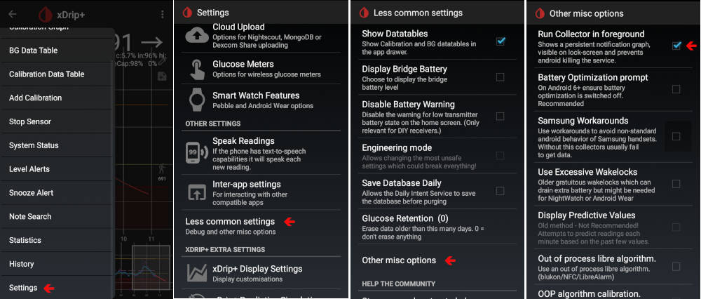

# Een Huawei telefoon instellen

Er zijn verschillende opties, sommige Android specifiek, sommige Huawei specifiek:

* Add AAPS and xdrip+ to apps list which ignore battery optimisations:
  
  * Instellingen / App / Instellingen / Speciale toestemmingen / Batterij optimalisering negeren / Selecteer "Alle toepassingen" / Stel app in op toestaan
    
    

* Pas de batterij-instellingen aan:
  
  * Instellingen / App / Selecteer AndroidAPS/xDrip+ / onder Batterij / App launch
    
    * Zorg ervoor dat "automatisch beheer" verwijderd is
    * Toestaan:
      
      * Automatisch starten
      * Secundair starten (kan worden gestart vanuit andere apps)
      * Op achtergrond uitvoeren
        
        

* App vergrendelen
  
  * Ga naar lijst van recente apps en selecteer het vergrendelingspictogram
    
    

For xDrip+, you must enable persistent notifications (within xDrip+ app):

* Settings / less common settings / other misc options / Run Collector in foreground
  
  

Afhankelijk van jouw Android versie, staan deze instellingen ergens anders. Deze instellingen gelden voor Android 8.1.