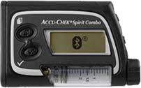

# AccuChek Combo Tips voor eenvoudig gebruik

## Hoe zorgen voor een soepele werking

* Always **carry the smartphone with you**, leave it next to your bed at night. As your pump may lay behind or under you body while you sleep, a higher position (on a shelf or board) works best.
* Always make sure that the pump battery is as full as possible. See the battery section for tipps regarding the battery.
* Whenever possible, only operate the pump via the AAPS app. To facilitate this, activate the key lock on the pump under **PUMP SETTINGS / KEY LOCK / ON**. Alleen bij het vervangen van de batterij of reservoir, is nodig om de pomp toetsen te gebruiken. 

## Pomp niet bereikbaar. Wat te doen?

### Activeer pomp niet bereikbaar alarm

* In AAPS, go to **Settings / Local Alarms** and activate **alarm when pump is unreachable** and set **pump not reachable limit [Min]** to **31** minutes.
* This will give you enough time to not trigger the alarm when leaving the room while your phone is left on the desk, but informs you if the pump cannot be reached for a time that exceeds the duration of a temporary basal rate.

### Restore reachability of the pump

* When AAPS reports a **pump unreachable** alarm, first release the keylock and **press any key on the pump** (e.g. "down" button). As soon as the pump display has turned off, press **Refresh** on the **Combo Tab** in AAPS. Mostly then the communication works again.
* If that does not help, reboot your smartphone. After the restart, AAPS will be reactivated and a new connection will be established with the pump. If you are using the old driver, ruffy will be reactivated as well.

* The tests with different smartphones have shown that certain smartphones trigger the "pump unreachable" error more often than others. See [AAPS Phones](#Phones-list-of-tested-phones) for successfully tested smartphones.

### Root causes and consequences of frequent communication errors

* On phones with **low memory** (or **aggressive power-saving** settings), AAPS is often shut down. You can tell by the fact that the Bolus and Calculator buttons on the Home screen are not shown when opening AAPS because the system is initializing. This can trigger "pump unreachable alarms" at startup. In the **Last Connection** field of the Combo tab, you can check when AAPS last communicated with the pump.

* This error can drain the pump's battery faster because the basal profile is read from the pump when the app is restarted.
* It also increases the likelihood of causing the error that causes the pump to reject all incoming connections until a button on the pump is pressed. 

## Cancellation of temporary basal rate fails

* Occasionally, AAPS can not automatically cancel a **TBR CANCELED** alert. Then you have to either press **UPDATE** in the AAPS **Combo tab** or the alarm on the pump will need to be confirmed.

## Pump battery considerations

### Changing the battery

* After a **low battery** alarm, the battery should be changed as soon as possible to always have enough energy for a reliable Bluetooth communication with the smartphone, even if the phone is within a wider distance of the pump.
* Even after a **low battery** alarm, the battery might be used for a significant amount of time. However, it is recommended to always have a fresh battery with you after a "low battery" alarm rang.
* Before changing the battery, press on the **Loop** symbol on the main screen and select **Suspend loop for 1h**. 
* Wait for the pump to communicate with the pump and the bluetooth logo on the pump has faded.

* Release the key lock on the pump, put the pump into stop mode, confirm a possibly canceled temporary basal rate, and change the battery quickly.
* When using the old driver, if the clock on the pump did not survive the battery change, re-set the date and time on the pump to exactly the date/time on your phone running AAPS. (The new driver automatically updates the pump's date and time.)
* Then put the pump back in run mode select **Resume** when pressing on the **Suspended Loop** icon on the main screen.
* AAPS will re-set a necessary temporary basal rate with the arrival of the next blood sugar value.

(Accu-Chek-Combo-Tips-for-Basic-usage-battery-type-and-causes-of-short-battery-life)=

### Battery type and causes of short battery life

* As intensive Bluetooth communication consumes a lot of energy, only use **high-quality batteries** like Energizer Ultimate Lithium, the "power one"s from the "large" Accu-Chek service pack, or if you are going for a rechargeable battery, use Eneloop batteries. 

 

Ranges for typical life time of the different battery types are as follows:

* **Energizer Ultimate Lithium**: 4 to 7 weeks
* **Power One Alkaline** (Varta) from the service pack: 2 to 4 weeks
* **Eneloop rechargeable** batteries (BK-3MCCE): 1 to 3 weeks

If your battery life is significantly shorter than the ranges given above, please check the following possible causes:

* There are some variants of the screw-on battery cap of the Combo pump, which partially short circuit the batteries and drain them quickly. The caps without this problem can be recognized by the golden metal contacts.
* If the pump clock does not "survive" a short battery change, it is likely that the capacitor is broken which keeps the clock running during a brief power outage. In this case, a replacement of the pump by Roche might help, which is not a problem during the warranty period. 
* The smart phone hardware and software (Android operating system and bluetooth stack) also impact the battery lifetime of the pump, even though the exact factors are not completely known yet. If you have the opportunity, try another smartphone and compare battery lifetimes.

## Extended bolus, multiwave bolus

The OpenAPS algorithm does not support a parallel extended bolus or multiwave bolus. But a similar treatment can be achieved by the following alternatives:

* Use **e-Carbs** when entering carbs or using the Calculator by entering the carbs of the full meal and the duration you expect the carbs to arrive as glucose in you blood. The system will then calculate small carbs equally distributed over the whole duration which will cause th algorithm to provide equivalent insulin dosing while still permanently checking the overall rise/decrease of the blood glucose level. For a multiwave bolus approach, you can also combine a smaller immediate bolus with e-carbs. 
* Before eating, on the **Actions tab** in AAPS set as a temporary **Eating Soon** goal with target glucose 80 for several hours. The duration should be based on the interval you would choose for an extended bolus. This will keep your target lower than usual and therefore increase the amount of insulin delivered.
* Then use the **CALCULATOR** to enter the full carbs of the meal, but do not directly apply the values suggested by the bolus calculator. If a multiwave-like bolus is to be delivered, correct the insulin dosage down. Depending on the meal, the algorithm now has to deliver additional SMBs or higher temporary basal rates to counteract the increase in blood sugar. Here, the safety limitation of the basal rate (Max IE / h, Maximum basal IOB) should be very carefully experimented with and, if necessary, temporarily changed.

* If you are tempted to just use the extended or multiwave bolus directly on the pump, AAPS will penalize you with disabling the closed loop for the next six hours to ensure that no excess insulin dosage is calculated.

## Alarms at bolus delivery

* If AAPS detects that an identical bolus has been successfully delivered at the same minute, bolus delivery will be prevented with identical number of insulin units. If your really want to bolus the same insulin twice in short succession, just wait two more minutes and then deliver the bolus again. If the fist bolus has been interrupted or was not delivered for other reasons, you can immediately re-submit the bolus since AAPS 2.0.
* The alarm is a safety mechanism that reads the pump's bolus history before submitting a new bolus to correctly calculate insulin on board (IOB), even when a bolus is delivered directly from the pump. Here indistinguishable entries must be prevented.

* This mechanism is also responsible for a second cause of the error: If during the use of the bolus calculator another bolus is delivered via the pump and thereby the bolus history changes, the basis of the bolus calculation is wrong and the bolus is aborted. 

