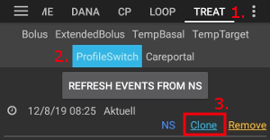

# Configurator

Afhankelijk van je instellingen kun je de Configurator openen via een tabblad bovenaan het scherm of via het hamburger menu (3 streepjes in linkerbovenhoek).

Configurator (Conf) is het tabje waar je alle AAPS-functies kunt instellen. De vakjes aan de linker kant (A) kun je aanvinken wanneer je een bepaalde optie wilt gebruiken, de vakjes aan de rechterkant (C) kun je aanvinken als je die als een van de tabbladen (E) in AndroidAPS wilt laten weergeven. Wanneer je niet het vinkje hebt gezet om iets als tabblad weer te geven, kun je naar die functie toegaan dmv het hamburger menu (D), dit zijn de 3 streepjes onder elkaar in de linkerbovenhoek.

Wanneer er voor een functie nog extra instellingen zijn, dan kun je die openen door op het tandwiel icoontje (B) te klikken.

**Eerste instellingen:** Vanaf AAPS versie 2.0 is er een Setup-wizard die je door alle initiele instellingen van AndroidAPS zal leiden. Druk op de 3 puntjes in de rechterbovenhoek (F) en kies 'Setup Wizard' om hem te openen.

## Tabblad of hamburger menu

Met het selectievakje onder het oog icoontje, kun je instellen hoe een sectie bereikbaar is. De aangevinkte onderdelen zullen als tabbladen worden weergegeven. Alle niet-aangevinkte onderdelen vindt je terug in het hamburger menu (onder de 3 streepjes in linkerbovenhoek).

## Profiel

Selecteer het profiel dat je voor je basaalstanden wilt gebruiken. Hieronder staan de verschillende opties beschreven, zie ook de [Profiel wissel](../Usage/Profiles.md) pagina voor hoe je een profiel kunt activeren (nodig voor je eerste gebruik).

### Lokaal profiel (aanbevolen)

Lokaal profiel gebruikt instellingen voor jouw basaalstanden die je handmatig opgeeft in jouw telefoon. Wanneer je deze selecteert, verschijnt er een nieuw tabblad in AAPS, waar je jouw profielgegevens die uit je pomp zijn uitgelezen kunt veranderen indien nodig. Met de volgende profiel switch worden ze vervolgens naar jouw pomp verstuurd en opgeslagen onder profiel 1. Omdat je voor dit profiel geen internetverbinding nodig hebt, is dit de meest eenvoudige om te gebruiken.

Jow lokale profielen zijn een onderdeel van [de geëxporteerde instellingen](../Usage/ExportImportSettings.rst). Dus zorg ervoor dat je een backup van jouw instellingen-bestand (AAPSPreferences) hebt opgeslagen.

Knoppen:

* groene plus: toevoegen
* rode X: verwijderen
* blauwe pijl: kopiëren

Als je wijzigingen aanbrengt in je profiel, zorg er dan voor dat je het juiste profiel aan het bewerken bent. Op het profiel tabblad wordt niet altijd het gebruikte profiel weergegeven - bijvoorbeeld als je van profiel hebt gewisseld met de profiel tab op het overzicht-scherm, kan dit afwijken van het profiel dat wordt weergegeven in het tabblad profiel omdat er geen koppeling tussen deze tabs bestaat.

#### Profiel wissel dupliceren

Je kunt eenvoudig een nieuw lokaal profiel aanmaken van een profiel wissel. In dit geval word het tijdsverschil en het percentage toegepast op het nieuwe lokale profiel.

1. Ga naar het tabblad behandelingen.
2. Kies Profiel Wissel.
3. Druk op "Dupliceren".
4. Het nieuwe lokale profiel kunt u bewerken in het tabblad Lokaal profiel (LP) of via het hamburgermenu.

Als je van Nightscout profiel wilt veranderen naar lokaal profiel, schakel dan je NS profiel in en kopieer de profiel wissel zoals hierboven beschreven.

#### Lokale profielen uploaden naar Nightscout

Lokale profielen kunnen ook worden geüpload naar Nightscout. De instellingen bevinden zich in NS Client instellingen.

Voordelen:

* Geen internetverbinding nodig om profielinstellingen te wijzigen
* Profielwijzigingen kunnen direct op de telefoon worden aangebracht
* nieuw profiel kan gecreëerd worden via profiel wissel
* lokale profielen kunnen naar Nightscout worden geüpload

Nadelen:

* niks

### NS Profiel

NS Profiel maakt gebruik van de profielen die je hebt opgeslagen op jouw Nightscout site (https://[jouwnightscoutpagina]/profile). Je kunt de [Profiel wissel](../Usage/Profiles.md) gebruiken om te kiezen welk van jouw profielen actief wordt, dit profiel zal vervolgens naar jouw pomp worden gestuurd en in het pompgeheugen worden opgeslagen. Zodat je pomp hierop terugvalt wanneer AndroidAPS niet zou werken. Hierdoor kun je heel makkelijk meerdere profielen gebruiken in Nightscout (dat wil zeggen werk, thuis, sport, vakantie, etc.). Kort nadat je klikt op "Opslaan" zullen deze profielen worden overgedragen naar AAPS als jouw smartphone online is. Zelfs zonder een internetverbinding of zonder een verbinding met Nightscout zijn de Nightscout-profielen beschikbaar in AAPS zodra ze zijn gesynchroniseerd.

Gebruik een **Profiel wissel** om een profiel van Nightscout te activeren. Houd het huidige profiel in het AAPS Overzicht-scherm aan de bovenkant ingedrukt (middelste grijze knop tussen de grijze "Open/Closed Loop"-knop en de grijze streefdoel-knop) > Profiel wissel > Profiel selecteren > OK. AAPS schrijft nu het geselecteerde profiel naar de pomp na de profiel wissel, zodat het beschikbaar blijft zonder AAPS (in noodgevallen) en je pomp dus gewoon blijft doorlopen.

Voordelen:

* Meerdere profielen
* Gemakkelijk te bewerken via PC of tablet

Nadelen:

* Geen lokale wijzigingen in profielinstellingen
* Profielwijzigingen kunnen niet direct op de telefoon worden aangebracht

## Insuline

Kies het werkingsprofiel van de insuline die jij gebruikt. De werkingsprofielen voor 'Rapid-Acting Oref', Ultra-Rapid Oref' en 'Free-Peak Oref' hebben allemaal een exponentiële vorm. Meer informatie staat in de [OpenAPS documenten](http://openaps.readthedocs.io/en/latest/docs/While%20You%20Wait%20For%20Gear/understanding-insulin-on-board-calculations.html#understanding-the-new-iob-curves-based-on-exponential-activity-curves). Het werkingsprofiel zal variëren op basis van de DIA (Duration of Insulin Action, duur van insulineactiviteit) en de piektijd.

De DIA is niet voor iedereen hetzelfde. Daarom moet je het voor jouzelf testen. Maar het moet altijd minstens 5 uur zijn. Meer informatie hierover vind je in de sectie Insuline Profiel van [deze](../Getting-Started/Screenshots#insulin-profile) pagina.

Voor Snel-werkende en Ultra-Rapid is de DIA de enige variabele die je zelf kunt aanpassen, de piektijd is voorgeprogrammeerd en dus niet aan te passen. Bij Free-Peak kun je zowel de DIA als de piektijd aanpassen, en deze optie mag alleen worden gebruikt door geavanceerde gebruikers die de effecten van deze instellingen begrijpen.

De [insuline werkingsgrafiek](../Getting-Started/Screenshots#insulin-profile) laat zien hoe de concentratie en activiteit van jouw insuline verandert versus de tijd. Je kunt deze grafiek bekijken door in de Configurator een vinkje te zetten om het als een tabblad te laten zien, zonder dit vinkje kun je de grafiek bekijken via het hamburger menu (3 streepjes in linkerbovenhoek).

### Snel-werkende Oref

* Aanbevolen voor Humalog, Novolog en Novorapid
* DIA = ten minste 5,0 uur
* Max. piek = 75 minuten na injectie (vast, niet instelbaar)

### Ultra-Rapid Oref

* Aanbevolen voor Fiasp
* DIA = ten minste 5,0 uur
* Max. piek = 55 minuten na injectie (vast, niet instelbaar)

Voor veel mensen is er praktisch geen merkbaar effect van Fiasp na 3-4 uur, zelfs als er dan nog maar 0,0xx eenheden zijn overgebleven. Dit kleine restje kan nog wel steeds een merkbaar effect hebben, bijvoorbeeld tijdens het sporten. Daarom gebruikt AndroidAPS een minimum van 5u als DIA.

### Free-Peak Oref

Met het Free-Peak Oref (Vrije-Piek Oref) kun je zelf het tijdstip kiezen waarop de werkzaamheid van je insuline zijn piek heeft. De DIA wordt automatisch ingesteld op 5 uur, tenzij je hem in jouw profiel hoger hebt ingesteld (dan wordt de waarde uit jouw profiel gebruikt).

Dit profiel wordt aanbevolen als de insuline bij jou een werkingsprofiel heeft dat helemaal niet overeenkomt met de standaarden, of wanneer je een mengsel van verschillende insulines gebruikt.

## BG bron

Selecteer de bloed glucose bron je gebruikt - Zie [BG bron](BG-Source.rst) pagina voor meer informatie over setup.

* [xDrip+](https://xdrip-plus-updates.appspot.com/stable/xdrip-plus-latest.apk)
* NSClient BG
* [MM640g](https://github.com/pazaan/600SeriesAndroidUploader/releases)
* [Glimp](https://play.google.com/store/apps/details?id=it.ct.glicemia&hl=de) - enkel versie 4.15.57 en nieuwer worden ondersteund
* [Dexcom App (aangepast)](https://github.com/dexcomapp/dexcomapp/) - Selecteer 'BG gegevens verzenden naar xDrip+' als je de alarmen van xDrip+ wilt gebruiken.
    
    

* [Poctech](http://www.poctechcorp.com/en/contents/268/5682.html)

## Pomp

Selecteer de pomp die jij gebruikt.

* [Dana R](DanaR-Insulin-Pump.md)
* DanaR Koreaans (Koreaanse versie van DanaR)
* DanaRv2 (DanaR met ge-updatete firmware)
* [Dana RS](DanaRS-Insulin-Pump.md)
* [Accu Chek Combo](Accu-Chek-Combo-Pump.md) (hiervoor moet je Ruffy geïnstalleerd hebben)
* MDI (bedoeld voor mensen die pentherapie gebruiken, hiermee geeft AAPS suggesties voor jouw insulinedosis)
* Virtuele pomp (open loop voor een pomp die niet automatisch kan worden aangestuurd door AAPS, hiermee geeft AAPS alleen suggesties die je zelf handmatig in je pomp moet invoeren)

Voor dana pompen, gebruik **Geavanceerde instellingen ** om BT watchdog te activeren indien nodig. Het schakelt bluetooth uit gedurende één seconde als er geen verbinding met de pomp kan worden gemaakt. Dit kan helpen voor sommige telefoons waarbij problemen met de bluetooth verbinding optreden (meer specifiek: wanneer de bluetooth stack bevriest).

## Gevoeligheid detectie

Selecteer het type gevoeligheid detectie (ook wel bekend als Auto-Sensitivity / Autosens in het Engels). Hiermee houdt het algoritme jouw gegevens van de afgelopen tijd in de gaten, en past zijn gedrag aan wanneer hij merkt dat je gevoeliger (of, juist ongevoeliger) bent voor insuline dan normaal. Details over het Oref0 Gevoeligheid algoritme kun je lezen in de [OpenAPS documenten](http://openaps.readthedocs.io/en/latest/docs/walkthrough/phase-4/advanced-features.html#auto-sensitivity-mode).

Je kunt je gevoeligheid op het Overzicht-scherm laten weergeven door Gevoeligheid te selecteren en te kijken naar de witte lijn. Ook wordt het weergegeven als "AS...%", waarbij AS staat voor AutoSens. Let op, je moet minimaal [Doel 8](../Usage/Objectives#objective-8-adjust-basals-and-ratios-if-needed-and-then-enable-autosens) bereikt hebben om gevoeligheid detectie/[Autosens](../Usage/Open-APS-features.html#autosens) jouw insulinetoediening automatisch te laten aanpassen. Als je dit doel nog niet hebt bereikt, dan wordt de Autosens percentage lijn in de grafiek alleen weergegeven ter info.

### Opname instellingen

Als je Oref1 met SMB gebruikt moet je **min_5m_carbimpact** op 8 instellen. Als je AMA gebruikt moet je dit op 3 hebben staan. Deze waarde wordt gebruikt om de hoeveelheid opgenomen koolhydraten (Carbs On Board, COB) te laten afnemen wanneer jouw bloedsuiker niet zoveel stijgt als het algoritme had verwacht nadat je koolhydraten hebt gegeten. Deze waarde wordt alleen gebruikt in speciale gevallen: wanneer jouw CGM geen gegevens doorgeeft, of wanneer bijv. fysieke activiteit de koolhydraten "opeet". Op momenten wanneer [koolhydraat absorptie](../Usage/COB-calculation.rst) niet dynamisch vastgesteld kan worden aan de hand van veranderende bloed glucose word een basis verval gehanteerd. Het is in feite een vangnet.

## APS

Selecteer het gewenste APS (Artificial Pancreas System, kunstmatig alvleesklier systeem) algoritme. Je kunt de actuele details van jouw gekozen algoritme laten weergeven op het tabblad OpenAPS(OAPS). Daar zie je het resultaat van de meest recente berekening die het algoritme maakte.

* OpenAPS MA (Meal Assist, maaltijd hulp). Versie van het algoritme uit 2016.
* OpenAPS AMA (geavanceerde maaltijdhulp, onderdeel van het algoritme in 2017)  
    Meer details over OpenAPS AMA kun je vinden in de [OpenAPS documenten](http://openaps.readthedocs.io/en/latest/docs/Customize-Iterate/autosens.html#advanced-meal-assist-or-ama). Simpel gezegd helpt de geavanceerde maaltijdhulp je door nadat je jezelf een maaltijd bolus hebt gegeven, het systeem eerder een hogere basaalstand kan instellen ZOLANG je je koolhydraten correct invoert.   
    NB: je moet minimaal in [Doel 9](../Usage/Objectives#objective-9-enabling-additional-oref0-features-for-daytime-use-such-as-advanced-meal-assist-ama) zijn om OpenAPS AMA te kunnen gebruiken.
* [OpenAPS SMB](../Usage/Open-APS-features.md) (Super Micro Bolus). Dit is het meest recente algoritme, bedoeld voor gevorderde gebruikers.   
    Je moet minimaal in [Doel 10](../Usage/Objectives#objective-10-enabling-additional-oref1-features-for-daytime-use-such-as-super-micro-bolus-smb) zijn om OpenAPS SMB te gebruiken, en vergeet niet om je min_5m_carbimpact op 8 in te stellen via Configurator > gevoeligheid detectie > gevoeligheid Oref1 instellingen.

## Loop

Kies hier of je wilt dat AAPS automatisch ingrijpt (closed loop) of dat je zelf handmatig ingrijpt (open loop).

### Open loop

AAPS analyseert continu alle beschikbare gegevens (IOB, COB, BG...) en doet indien nodig suggesties voor hoe je de insulineafgifte op je pomp moet veranderen. De suggesties zullen niet automatisch in je pomp worden doorgevoerd (zoals in closed loop) maar moeten handmatig worden ingevoerd in de pomp. Of, wanneer je een compatibele pomp (Dana R/RS of Accu Chek Combo) gebruikt, dan moet je de suggestie bevestigen met een knop in de app. De open loop modus is bedoeld om te leren hoe AndroidAPS werkt, en om dagelijks gebruik van AndroidAPS mogelijk te maken wanneer je een niet-compatibele pomp hebt.

### Closed loop

AAPS analyseert continu alle beschikbare gegevens (IOB, COB, BG...) en past indien nodig automatisch (d.w.z. zonder dat jij iets hoeft te doen) de insulineafgifte van jouw pomp aan (bolus toedienen, tijdelijke basaalstand, tijdelijke onderbreking van insulineafgifte om een hypo te voorkomen etc.). Zodat jouw bloedglucose op (binnen) de door jou ingestelde streefdoel(en) uikomt. De closed loop modus werkt met vele veiligheidslimieten, die door jou individueel moeten worden ingesteld. De closed loop modus kun je alleen gebruiken als je minimaal in [Doel 6](../Usage/Objectives#objective-6-starting-to-close-the-loop-with-low-glucose-suspend) bent, en als je een compatibele pomp hebt.

## Doelen (leerprogramma)

AndroidAPS heeft een aantal leerdoelen die je stap voor stap moet voltooien. Hierdoor wordt je veilig begeleid door de verschillende stappen om een closed loop te maken. Het garandeert dat je alles correct hebt ingesteld en dat je begrijpt wat het systeem precies doet. Dat is cruciaal om op het systeem te kunnen vertrouwen.

Het is verstandig om regelmatig [jouw instellingen te exporteren](../Usage/ExportImportSettings.rst) (inclusief jouw voortgang van de leerdoelen). In het geval dat je je telefoon moet vervangen (verloren, stuk gegaan etc.) dan kun je deze instellingen importeren, en weer verdergaan waar je gebleven was met je doelen.

Zie [Doelen](../Usage/Objectives.rst) pagina voor meer informatie.

## Behandelingen

Op het tabblad Behandelingen kunt je de behandelingen zien die zijn geüpload naar Nightscout. Wilt u invoer bewerken of verwijderen (bijvoorbeeld bij minder gegeten koolhydraten dan verwacht) selecteer dan 'Verwijderen' en voer de nieuwe waarde in (wijzig indien nodig het tijdstip) via de [koolhydraten knop op het beginscherm](../Getting-Started/Screenshots.md#carb-correction).

## Algemeen

### Overzicht

Hier wordt de huidige status je loop weergegeven, en er zijn knoppen voor meest voorkomende acties (Zie [sectie Overzicht-scherm](../Getting-Started/Screenshots.md) voor details). Instellingen kunnen worden geopend door te klikken op het tandwiel-symbooltje:

#### Laat scherm aan

De optie 'Laat scherm aan' zorgt ervoor dat Android je telefoonscherm altijd aan laat staan. Dit is handig voor presentaties enz. Maar het vreet natuurlijk stroom. Daarom wordt aanbevolen om dit alleen in te schakelen wanneer je smartphone aan de oplader hangt.

#### Knoppen

Kies welke knoppen worden getoond op het Overzicht-scherm.

* Behandelingen
* Boluscalculator
* Insuline
* Koolhydraten
* CGM (opent xDrip+)
* Kalibratie

Ook kun je snelkoppelingen instellen voor insuline- en koolhydraat-stapgroottes en kiezen of het notitieveld moet worden weergegeven in behandeling dialoogvensters.

#### Vaste maaltijd instellingen

Maak een knop voor een bepaalde standaardmaaltijd (koolhydraten en berekeningsmethode voor je bolus) die op het Overzicht-scherm zal worden weergegeven. Gebruik dit voor standaardmaaltijden die je vaak eet. Wanneer je een begin- en eindtijd specificeert voor jouw standaardmaaltijden (optioneel), dan zal de bijbehorende knop alleen zichtbaar zijn op het Overzicht-scherm tijdens de tijden die je hebt gekozen.

Opmerking: De knop voor een standaardmaaltijd zal niet zichbaar zijn wanneer je buiten het opgegeven tijdsbereik bent, of wanneer je genoeg IOB hebt voor de koolhydraten in jouw standaardmaaltijd.

#### Geavanceerde instellingen

Activeer superbolus in de boluscalculator. Activeer deze niet tot je begrijpt wat dit doet. Kort gezegd wordt hiermee jouw basale insuline voor de komende twee uur toegevoegd aan de bolus, waarna jouw basaal voor twee uur op nul wordt gezet (zero-temp). **De AAPS closed loop-functies worden hiermee tijdelijk uitgeschakeld - dus weet wat je doet! Als je SMB gebruikt, dan wordt de loop uitgeschakeld zoals aangegeven in jouw instellingen voor ["Max minuten basaal om SMB tot te limiteren"](../Usage/Open-APS-features#max-minutes-of-basal-to-limit-smb-to). Als je geen SMB gebruikt, dan zal de loop gedurende twee uur uitgeschakeld worden.** Details over superbolus kun je [hier](https://www.diabetesnet.com/diabetes-technology/blue-skying/super-bolus) vinden.

### Acties

Een aantal knoppen voor snelle toegang tot algemene functies:

* Profiel wissel (Zie [Profiel wissel pagina](../Usage/Profiles.md) voor meer informatie)
* Tijdelijk streefdoel
* Zet / annuleer Tijdelijke basaalstand
* Vertraagde bolus (alleen DanaR/RS of Combo pomp)
* Opslaan specifieke zorg gegevens
    
    * BG controle
    * Voorvullen / vullen - wissel canulle en voorvullen (indien niet gedaan door pomp)
    * CGM sensor start
    * Pomp batterij vervangen
    * Notitie
    * Sport
* Bekijk de huidige sensor, insuline, canule en pomp batterij status
* Historiek venster
* TDD (Totale Dagelijkse Dosis = bolus + basale insuline per dag)

Sommige artsen gebruiken - met name voor nieuwe pompgebruikers- een basaal:bolus ratio van 50:50. Daarom wordt de ratio berekend als TDD / 2 * TBB (Totale Basis Basaal = som van alle basale insuline binnen 24 uur). Anderen geven de voorkeur aan 32% tot 37% van de TDD voor TBB. Zoals de meeste vuistregels hoeft ook deze in het echte leven niet persé te kloppen. Ieder mens is anders!

### SMS Communicator

Hiermee kunt je toestaan dat zorgverleners vanaf afstand (bijv. ouders van schoolgaande kinderen) sommige functies van AndroidAPS kunnen laten uitvoeren via SMS. Op de pagina over [SMS-commando's](../Children/SMS-Commands.rst) kun je lezen hoe je dit instelt.

### Voeding

Toont de instellingen voor voeding die zijn gemaakt in de Nightscout food database, zie de [Nightscout Readme](https://github.com/nightscout/cgm-remote-monitor#food-custom-foods) voor meer informatie.

Opmerking: Invoer uit Nightscout kan niet worden gebruikt in de AndroidAPS calculator. Het kan alleen worden bekeken (view only).

### Wear (voor smartwatches)

Gebruik je Android Wear smartwatch om AndroidAPS te bekijken en te besturen (zie [pagina Smartwatch instellingen](../Configuration/Watchfaces.md)). Via de instellingen (tandwiel-icoontje) kun je aanvinken welke variabelen moeten worden meegenomen bij het berekenen van een bolus via je horloge (bijv. 15min-trend, COB...).

Als je wilt bolussen etc. vanaf je horloge, dan moet je bij "Wear instellingen" de optie "Bedieningen via horloge" geactiveerd hebben.

Via het Wear tabblad of via het hamburger menu (3 streepjes linksboven in het Overzicht-scherm als het Wear tabblad niet wordt weergegeven) kun je:

* "Update Wear gegevens" kiezen. Kan handig zijn als je horloge enige tijd niet verbonden is geweest, en je wilt de informatie naar je horloge sturen.
* "Open instellingen op Wear" kiezen. Dit opent de instellingen van je horloge direct vanaf je telefoon.

### xDrip Statuslijn (Horloge)

Toont informatie over jouw loop op je xDrip+ watchface (als je de AAPS/[AAPv2 watchface niet gebruikt](../Configuration/Watchfaces.md)).

### Permanent bericht

Toont een samenvatting van jouw huidige BG, delta, actieve TBR, actieve basaal eenheden/uur en profiel, IOB (gesplitst in bolus IOB en basale IOB) in de menubalk en in het vergrendelscherm van je telefoon.

### NS Client

Synchronisatie van jouw AndroidAPS-gegevens instellen met Nightscout.

Als **Log app start naar NS** is geactiveerd, zal elke keer als AndroidAPS herstart wordt, een melding zichtbaar zijn in Nightscout. Als je vaak deze melding ziet verschijnen, dan wijst dit op een probleem met de app (dat wil zeggen accuoptimalisatie niet uitgeschakeld voor AAPS) maar het kan je Nightscout grafiek volzetten met meldingen. Je kunt er dus voor kiezen om dit uit te schakelen, maar het is beter om de oorzaak van het probleem (accuoptimalisatie) op te lossen!

#### Alarm opties

AndroidAPS alarmen activeren/deactiveren

#### Verbindings instellingen

Offline looping, roaming uitschakelen...

Als je alleen een specifiek WiFi-netwerk wil gebruiken, kun je de **WiFi SSID **invoeren. Meerdere SSID's kunnen worden gescheiden door puntkomma's. Om alle SSIDs te verwijderen vul je een spatie in in dit veld.

#### Geavanceerde instellingen

* Automatisch ontbrekende BGs aanvullen vanuit NS
* Creëer een melding bij storingen. Creëert een Nightscout melding voor storingen en lokale waarschuwingen (ook zichtbaar in tabbladen Careportal en Behandelingen)
* Activeer lokaal delen Activeert het lokaal (geen wifi/Bluetooth nodig) delen van informatie met andere apps zoals xDrip+
* Alleen NS upload (synchronisatie gedeactiveerd)
* Geen upload naar NS
* Gebruik altijd absolute basale waarden-> moet worden geactiveerd als je gebruik wilt maken van [Autotune](https://openaps.readthedocs.io/en/latest/docs/Customize-Iterate/autotune.html) (zorgt dat de Autotune berekeningen correct worden uitgevoerd).

### Onderhoud

Kies het aantal te verzenden logbestanden, en het e-mailadres waarheen ze verstuurd worden. Normaal gesproken geen verandering nodig.

### Configurator

Gebruik tabblad voor Configurator in plaats van het hambuger menu.