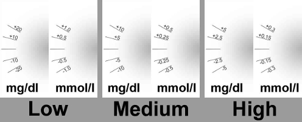

# AAPS op Wear OS smartwatch

Je kunt de AndroidAPS app installeren op je **Wear OS based** smartwatch. Met de watch versie van AAPS kun je:

* **AAPS gegevens bekijken**: door een [specifieke watchface](#aaps-watchfaces) of standaard watchface te gebruiken d.m.v. watchface [complications](#complications)
* **AAPS aansturen**: stel een tijdelijk streefdoel in, bolus, etc. Je moet uiteraard wel jouw telefoon steeds in de buurt hebben, zowel voor het bekijken van gegevens als voor het aansturen.

### Voor je een horloge aanschaft...

* Sommige functies zoals *complicaties* vereisen Wear OS versie 2.0 of recenter om te functioneren
* Google heeft *Android Wear 1.x* omgedoopt naar *Wear OS* vanaf versie 2.x. Indien een smartwatch met *Android Wear* wordt aangeduid, kan het goed zijn dat het de oudere 1.x versie heeft
* Als in een beschrijving van smartwatch alleen compatibiliteit met *Android* en *iOS* aangegeven wordt, betekent het **niet** dat deze draait op *Wear OS* - het kan net zo goed een ander soort fabrikant specifieke OS zijn **die niet compatibel is met AAPS wear!**.
* Check [list of tested phones and watches](Phones-list-of-tested-phones) and [ask community](../Where-To-Go-For-Help/Connect-with-other-users.md) if in doubt if your watch will be supported

### Wear OS-versie van AAPS bouwen

The Wear OS App of AAPS has been seperated from the AAPS build for the Android mobile. Therefore you have to generate a second signed APK. Select as module "AndroidAPS.wear" and as build variant "fullRelease" and a second apk file for the Wear OS clock is generated when [building the APK](../Installing-AndroidAPS/Building-APK.md) (or "pumpcontrolRelease" which will allow you to just remote control the pump without looping).

From March 2021 you need to sideload AAPS onto the watch, it is no longer accessible via the watch's Google Play Store. You can sideload using [Wear Installer](https://youtu.be/8HsfWPTFGQI) which you will need to install on both your watch and phone. The Wear Installer app can be downloaded from the Google Play Store. The linked video from Malcolm Bryant the developer of Wear Installer gives you detailed instructions to a) download the apk to your mobile b) setup the Android Debugger on the wear c) use Wear Installer on mobile and wear to sideload the AAPS wear app to the mobile. Once you have selected AndroidAPS as your app to upload wear version onto the watch you will be able to use watchfaces and complications and the AAPS controls.

### Instellen op de telefoon

Within AndroidAPS, in the ConfigBuilder you need to [enable Wear plugin](Config-Builder-wear).

## AAPS aansturen vanaf het horloge

AndroidAPS is ontworpen om *te worden bediend* vanaf Android Wear horloges. Als je wilt bolussen etc. vanaf je horloge, dan moet je bij "Wear instellingen" de optie "Bedieningen via horloge" geactiveerd hebben.

De volgende functies kunnen vanaf het horloge worden geactiveerd:

* een tijdelijk BG doel (TT) instellen
* use the bolus calculator (calculation variables can be defined in [settings](Config-Builder-wear) on the phone)
* invoeren van vertraagde koolhydraten (eCarbs)
* dien een bolus (insuline + koolhydraten) toe
* watch instellingen
* status 
    * bekijk pomp status
    * bekijk loop status
    * profiel controleren en wijzigen, CPP (Circadiaans percentage profiel = tijdverschuiving + percentage)
    * weergeven van de TDD (Totale Dagelijkse Dosis = bolus + basale insuline per dag)

## AAPS wijzerplaaten

Er zijn verschillende watchfaces om uit te kiezen die de gemiddelde delta, IOB, momenteel actieve tijdelijke basaal en basale profielen + een CGM grafiek kunnen weergeven.

Zorg er voor dat meldingen van AndroidAPS niet geblokkeerd zijn op het horloge. Een actie (bijv. bolus, tijdelijk BG doel) moet door middel van een notificatie worden bevestigd. Pas na swipen en herbevestiging wordt deze uitgevoerd.

Voer een double-tap uit op je BG om sneller naar het AAPS-menu te gaan. Voer een double-tap uit op de BG grafiek om de tijdschaal ervan te wijzigen.

## Beschikbare watchfaces

(Watchfaces-new-watchface-as-of-androidaps-2-8)=

### Nieuw watchface vanaf AndroidAPS 2.8

* Als je in het instellingen menu op het tandwiel-icoontje drukt bij het watchface keuzemenu, dan kun je de kleuren, lijnen, en cirkel zelf aanpassen.

## AAPSv2 wijzerplaat - Legend

A - time since last loop run

B - CGM reading

C - minutes since last CGM reading

D - change compared to last CGM reading (in mmol or mg/dl)

E - average change CGM reading last 15 minutes

F - phone battery

G - basal rate (shown in U/h during standard rate and in % during TBR)

H - BGI (blood glucose interaction) -> the degree to which BG “should” be rising or falling based on insulin activity alone.

I - carbs (carbs on board | e-carbs in the future)

J - insulin on board (from bolus | from basal)

## Toegang tot het hoofdmenu van AAPS

To access main menu of AAPS you can use on of following options:

* dubbel tik op je BG-waarde
* selecteer het AAPS icoon in het applicatie menu van het horloge
* tik op de het AAPS deel van de wijzerplaat (indien geconfigureerd voor menu)

## Instellingen (in Android Wear horloge)

To access to the watchface settings, enter AAPS main menu, slide up and select "Settings".

Filled star is for enabled state (**On**), and hollow star icon indicates that setting is disabled (**Off**):

### AAPS-parameters

* **Trillen bij Bolus** (standaard `Aan`):
* **Eenheden voor acties ** (standaard `mg/dl`): als **On** eenheden voor acties `mg/dl` is, als **Off** eenheid `mmol/l`. Wordt gebruikt bij het instellen van een tijdelijs streefdoel vanaf het horloge.

### Watchface instellingen

* **Toon Datum** (standaard `Uit`): let wel: datum is niet beschikbaar op alle watchfaces
* **Toon IOB** (standaard `Aan`): De IOB waarde weergeven of niet (gedetailleerde instellingen voor de waarde staan in AAPS wear instellingen)
* **Toon COB** (standaard `Aan`): Toon wel of geen COB waarde
* **Toon Delta** (standaard `Aan`): Toon wel of geen BG variatie van de laatste 5 minuten
* **Toon AvgDelta** (standaard `Aan`): De gemiddelde BG variatie van de afgelopen 15 minuten wel of niet weergeven
* **Toon Telefoon Batterij** (standaard `Aan`): Telefoon batterij in %. Is rood beneden de 30%.
* **Rig Batterij tonen** (standaard `Uit`): Rig batterij is een samenvoeging van Telefoon batterij, pompbatterij en sensor accu (over het algemeen de laagste van de 3 waarden)
* **Toon Basaal hoeveelheid** (standaard `Aan`): Huidige basaalstand weergeven (in E/uur of in % bij TBR)
* **Toon Loop Status** (standaard `Aan`): laat aantal minuten zien sinds de laatst uitgevoerde loop (pijlen bij de waarde worden rood indien boven de 15').
* **Toon BG** (standaard `Aan`): Wel of geen laatste BG waarde weergeven
* **Toon richting pijl ** (standaard `Aan`): Wel of geen BG trend pijl weergeven
* **Toon historie** (standaard `Aan`): toon aantal minuten sinds de laatste uitlezing.
* **Donker** (standaard `Aan`): Je kunt overschakelen van zwarte naar witte achtergrond (behalve voor Cockpit en Steampunk wijzerplaaten)
* **Markeer basaal** (standaard `Uit`): verbeter de zichtbaarheid van basaalstanden en tijdelijke basaalstanden
* **Overeenkomst verdeler** (standaard `Uit`): Voor AAPS, AAPSv2 en AAPS(groot) wijzerplaten, toon contrast op de achtergrond voor verdeler (**Uit**) of match met de achtergrondkleur (**Aan**)
* **Grafiek Tijdschaal** (standaard `3 uur`): in het submenu kan je de maximale tijdschaal van de grafiek tussen 1 uur en 5 uur selecteren.

### Gebruikersinterface instellingen

* **Invoer uiterlijk**: met deze parameter kun je de positie van "+" en "- knoppen selecteren voor wanneer je opdrachten in AAPS (TT, Insuline, khd...) invoert

### Specifieke watchface parameters

#### Steampunk watchface

* **Delta Korrelgrootte** (standaard `Medium`)

#### Cirkel Watchface

* **Grote Getallen** (standaard `Uit`): Verhoog tekstgrootte om de zichtbaarheid te verbeteren
* **Geschiedenis Ring** (standaard `Uit`): Bekijk BG geschiedenis met grijze ringen binnen de groene uur ring
* **Lichte Geschiedenis Ring** (standaard `Aan`): Geschiedenis wordt meer discreet weergeven met een donkergrijs
* **Animaties ** (standaard `Aan`): Als dit is ingeschakeld, wordt ondersteund door het horloge en niet in de energiebesparing low-res modus dan zal de watchface cirkel worden geanimeerd

### Opdracht Instellingen

* **Wizard in Menu** (standaard `Aan`): Sta toe dat de wizard interface in het hoofdmenu gebruikt wordt voor het invoeren van koolhydraten en geef een bolus vanaf het horloge
* **Voorvullen in Menu** (standaard `Uit`): Voorvullen / Vullen vanaf horloge toestaan
* **Enkel doel** (standaard `Aan`):
    
    * `Aan`: je stelt een enkele waarde als TT in
    * `Uit`: Laag en hoog doel gelijktijdig als TT ingesteld

* **Wizard Percentage** (standaard `Uit`): Bolus correctie vanuit de wizard toestaan (waarde ingevoerd in percentage voor bevestiging melding)

(Watchfaces-complications)=

## Complications

*Complication* is a term from traditional watchmaking, where it describes addition to the main watchface - as another small window or sub-dial (with date, day of the week, moon phase, etc.). Wear OS 2.0 brings that metaphor to allow custom data providers, like weather, notifications, fitness counters and more - to be added to any watchfaces that support complications.

AndroidAPS Wear OS app supports complications since build `2.6`, and allow any third party watchface that supports complications to be configured to display AAPS related data (BG with the trend, IOB, COB, etc.).

Complications also serve as **shortcut** to AAPS functions. By tapping them you can open AAPS related menus and dialogs (depending on complication type and configuration).

### Complicatie types

AAPS Wear OS app provides only raw data, according to predefined formats. It is up to third-party watchface to decide where and how to render complications, including its layout, border, color, and font. From many Wear OS complication types available, AAPS uses:

* `SHORT TEXT` - Bevat twee regels tekst, 7 tekens elk, soms aangeduid als waarde en label. Meestal weergegeven in een cirkel of kleine 'pill' - de één onder de ander, of naast elkaar. Het is een zeer ruimtebesparende complicatie. AAPS probeert onnodige tekens te verwijderen om deze complicatie in te passen: door het afronden van waarden, het verwijderen van voorafgaande en afsluitende nullen uit waarden, enz.
* `LONG TEXT` - Bevat twee regels tekst, elk ongeveer 20 tekens. Meestal weergegeven in een rechthoek of lange pill - de één onder de ander. Het wordt gebruikt voor extra details en voor de status uitgeschreven in tekst.
* `RANGED VALUE` - Wordt gebruikt voor waardes binnen een vooraf gedefinieerd bereik, zoals een percentage. Het bevat een pictogram, label en wordt meestal weergegeven in cirkelvorm.
* `LARGE IMAGE` - Aangepaste achtergrondafbeelding die kan worden gebruikt (indien ondersteund door watchface) als achtergrond.

### Complicaties instellen

To add complication to watchface, configure it by long press and clicking the gear icon below. Depending on how specific watchface configures them - either click on placeholders or enter the watchface setup menu for complications. AAPS complications are grouped under the AAPS menu entry.

When configuring complications on watchface, Wear OS will present and filter the list of complications that can be fit into selected complication place on watchface. If specific complications cannot be found on the list, it is probably due to its type that cannot be used for the given place.

### Complicaties van AAPS

AndroidAPS provides following complications:

* **BR, CoB & IoB** (`SHORT TEXT`, opent *Menu*): Geeft *basale snelheid* op de eerste regel weer en *Carbs on Board* en *Insulin on Board* op de tweede regel.
* **Bloed Glucose** (`SHORT TEXT`, opent *Menu*): Geeft *Bloed Glucose* waarde en *trend* pijl op de eerste regel weer en *ouderdom vd meting* en *BG delta* op de tweede regel.
* **CoB & IoB** (`SHORT TEXT`, opent *Menu*): Geeft *Carbs on Board* op de eerste regel weer en *Insulin on Board* op de tweede regel.
* **CoB Gedetailleerd** (`SHORT TEXT`, opent *Wizard*): Geeft huidige actieve *Carbs on Board* op de eerste regel weer en geplande (toekomstige, eCarbs) Carbs op de tweede regel.
* **CoB Icon** (`SHORT TEXT`, opent *Wizard*): Geeft *Carbs on Board* waarde weer met een statisch pictogram.
* **Volledige status** (`LONG TEXT`, opent *Menu*): Laat de meeste gegevens tegelijkertijd zien: *Blood Glucose* waarde en *trend* pijl, *BG delta* en *ouderdom vd meting* op de eerste regel. Op de tweede regel *Carbs on Board*, *Insulin on Board* en *basaalstand*.
* **Volledige status (omgekeerd)** (`LONG TEXT`, opent *Menu*): Dezelfde gegevens als voor standaard *Volledige status*, maar de regels zijn omgedraaid. Kan worden gebruikt in watchfaces die een van de twee regels van `LONG TEXT` negeren.
* **IoB Gedetailleerd** (`SHORT TEXT`, opent *Bolus*): Toont totaal *Insulin on Board* op de eerste regel en splitst *IoB* voor *Bolus* en *Basaal* uit op de tweede regel.
* **IoB Icon** (`SHORT TEXT`, opent *Bolus*): Geeft *Insulin on Board* waarde weer met een statisch pictogram.
* **Uploader/Telefoon Batterij** (`RANGED VALUE`, opent *Status*): Geeft het batterij percentage van de AAPS telefoon (uploader) weer, zoals gerapporteerd door AAPS. Afgebeeld als percentagemeter met een batterijpictogram dat de waarde weergeeft. Het kan zijn dat het niet real-time wordt bijgewerkt, maar slechts wanneer andere belangrijke AAPS gegevens veranderen (meestal: elke ~ 5 minuten met nieuwe *Blood Glucose* meting).

Additionally, there are three complications of `LARGE IMAGE` kind: **Dark Wallpaper**, **Gray Wallpaper** and **Light Wallpaper**, displaying static AAPS wallpaper.

### Instellingen voor complicaties

* **Complicatie tik voor actie** (standaard `Standaard`): Bepaalt welk dialoogvenster wordt geopend wanneer de gebruiker op een complicatie tikt: 
    * *Standaard*: actie specifiek voor complicatie type *(zie lijst hierboven)*
    * *Menu*: AAPS hoofdmenu
    * *Wizard*: bolus wizard - bolus calculator
    * *Bolus*: directe bolus waarde ingeven
    * *eCarb*: dialoogvenster eCarbs
    * *Status*: status submenu
    * *Geen*: Er gebeurt niets als je op de AAPS complicatie tikt
* **Unicode in Complicaties** (standaard `Aan`): Wanneer `Aan`, zal de complicatie gebruik maken van Unicode-tekens voor symbolen zoals `Δ` Delta, `,` komma als scheidingsteken of `⎍` Basaal Ratio symbool. De weergave hiervan hangt af van het lettertype, en dat kan zeer horloge-specifiek zijn. Deze optie maakt het mogelijk om Unicode-symbolen `Uit` te schakelen indien nodig - als het lettertype gebruikt door aangepaste watchface deze symbolen niet ondersteunt - om weergavefouten te voorkomen.

## Wear OS Tiles

Wear OS Tiles provide easy access to users' information and actions to get things done. The tiles are only available on Android smartwatches running on Wear Os version 2.0 and higher.

Tiles allow you to quickly access actions on the AAPS application without going through the watch face menu. The tiles are optional and can be added and configured by the user.

The tiles are used "next to" any watch face. To access a tile, when enabled, swipe right to left on your watch face to show them.

Please note; that the tiles do not hold the actual state of the AAPS phone app and will only make a request, which has to be confirmed on the watch before it is applied.

## How to add Tiles

Before using the tiles, you have to switch on "Control from Watch" in the "Wear OS" settings of Android APS.

Depending on your Wear OS version, brand and smartphone there are two ways of enabling the tiles:

1. On your watch, from your watch face; 
    * Swipe right to left till you reach the "+ Add tiles" 
    * Select one of the tiles.
2. On your phone open the companion app for your watch. 
    * For Samsung open "Galaxy Wearable", or for other brands "Wear OS"
    * In the click on the section "Tiles", followed by "+ Add" button
    * Find the AAPS tile you like to add by selecting it.  The order of the tiles can be changed by dragging and dropping

The content of the tiles can be customized by long-pressing a tile and clicking the "Edit" or "gear icon" button.

### APS(Actions) Tile

The action tile can hold 1 to 4 user-defined action buttons. To configure, long-press the tile, which will show the configuration options. Similar actions are also available through the standard watch menu.

Actions supported in the Action tile can request the AAPS phone app for:

* **Calc**; do a bolus calculation, based on carb input and optional a percentage [1]
* **Insulin**; request insulin delivery by entering the unit of insulin
* **Treatment**; request both insulin delivery and add carbs
* **Carbs**; add (extended) carbs
* **TempT**; set a custom temporary target and duration

[1] Via, the Wear OS menu, set the "Calculator Percentage" option to "ON" to show the percentage input in the bolus calculator. The default percentage is based on the phone settings in the"Overview" section ["Deliver this part of the bolus wizard result %"](Config-Builder.html#advanced-settings) When the user does not provide a percentage, the default value from the phone is used. Configure the other parameters for the bolus calculator in the phone app via "Preferences" "Wizard Settings".

### AAPS(Temp Target) Tile

The Temp Target Tile can request a temporary target based on AAPS phone presets. Configure preset time and targets through the phone app setting by going to "Preferences", "Overview", ["Default Temp-Targets"](Config-Builder.html#default-temp-targets) and set the duration and targets for each preset. Configure the visible actions on the tile through the tile settings. Long press the tile to show the configuration options and select 1 to 4 options:

* **Activity**; for sport
* **Hypo**; to raise the target during hypo treatment
* **Eating soon**; to lower the target to raise the insulin on board
* **Manual**; set a custom temporary target and duration
* **Cancel**; to stop the current temporary target

### AAPS(QuickWizard)Tile

The QuickWizard tile can hold 1 to 4 quick wizard action buttons, defined with the phone app[2]. See [QuickWizard](Config-Builder.html#quickwizard-settings). You can set standard meals (carbs and calculation method for the bolus) to be displayed on the tile depending on the time of the day. Ideal for the most common meals/snacks you eat during the day. You can specify if the quick wizard buttons will show on the phone, watch, or both. Please note that the phone can show only one quick wizard button at a time. The quick wizard setup also can specify a custom percentage of the insulin for the bolus. The custom percentage enables you to vary, for example, snack at 120%, slow absorbing breakfast 80% and hypo treatment sugar snack at 0%

[2] Wear OS limits tiles update frequency to only once every 30 seconds. When you notice that the changes on your phone are not reflected on the tile, consider; waiting 30 seconds, using the "Resend all data" button from the Wear OS section of AAPS, or removing the tile and adding it again. To change the order of the QuickWizard buttons dragging an item up or down.

## Always on

Long battery life for Android Wear OS smartwatches is a challenge. Some smartwatches get as much as 30 hours before recharging. The display should be switched off for optimal power saving when not in use. Most watches support the “Always on” display.

Since AAPS version 3, we can use a “Simplify UI” during always-on-mode. This UI only contains the blood glucose, direction, and time. This UI is power-optimized with less frequent updates, showing less information and lightening fewer pixels to save power on OLED displays.

The simplified UI mode is available for the watch-faces: AAPS, AAPS V2, Home Big, Digital Style, Steampunk, and Cockpit. The simplified UI is optional and is configured through the watch face settings. (log press the watch face and click “edit” or the gear icon) Select the configuration “Simplify UI" and set it to “Always on” or “Always on and charging”.

### Night-time mode

While charging, it would be helpful if the display could stay “always-on” and show your blood glucose during the night. However, the standard watch-faces are too bright and have too much information, and the details are hard to read with sleepy eyes. Therefore, we added an option for the watch-face to simplify the UI only during charging when set in the configuration.

The simplified UI mode is available for the watch-faces: AAPS, AAPS V2, Home Big, Digital Style, Steampunk, and Cockpit. The simplified UI is optional and is configured through the watch face settings. (log press the watch face and click “edit” or the gear icon) Select the configuration “Simplify UI" and set it to “During charging” or “Always on and charging”

The Android developer options enable your watch to stay awake during charging. To make the developer options available, see https://developer.android.com/training/wearables/get-started/debugging. Set the “Stay awake when charging” to “on” in the developer options”.

Note: not all displays can handle always-on very well. It can cause screen burn-in, especially on the older OLED displays. The watches will generally dim the display to prevent burn-in; please check your owner’s manual, the manufacturing, or the internet for advice.

### Performance and battery life tips

Wear OS watches are very power-constrained devices. The size of the watch case limits the capacity of the included battery. Even with recent advancements both on hardware and software side, Wear OS watches still require daily charging.

If an experienced battery span is shorter than a day (from dusk to dawn), here are some tips to troubleshoot the issues.

Main battery-demanding areas are:

* Active display with a backlight on (for LED) or in full intensity mode (for OLED)
* Rendering on screen
* Radio communication over Bluetooth

Since we cannot compromise on communication (we need up-to-date data) and want to have the most recent data rendered, most of the optimizations can be done in *display time* area:

* Stock watchfaces are usually better optimized than custom one, downloaded from the store.
* It is better to use watchfaces that limit the amount of rendered data in inactive / dimmed mode.
* Be aware when mixing other Complications, like third party weather widgets, or other - utilizing data from external sources.
* Start with simpler watchfaces. Add one complication at the time and observe how they affect battery life.
* Try to use **Dark** theme for AAPS watchfaces, and [**Matching divider**](#watchface-settings). On OLED devices it will limit the amount of pixels lit and limit burnout.
* Check what performs better on your watch: AAPS stock watchfaces or other watchfaces with AAPS Complications.
* Observe over a few days, with different activity profiles. Most watches activate the display on glancing, movement and other usage-related triggers.
* Check your global system settings that affect performance: notifications, backlight/active display timeout, when GPS is activated.
* Check [list of tested phones and watches](Phones-list-of-tested-phones) and [ask community](../Where-To-Go-For-Help/Connect-with-other-users.md) for other users experiences and reported battery lifetime.
* **We cannot guarantee that data displayed on watchface or complication is up-to-date**. In the end, it is up to Wear OS to decide when to update a watchface or a complication. Even when the AAPS app requests update, the System may decide to postpone or ignore updates to conserve battery. When in doubt and low on battery on watch - always double-check with main AAPS app on phone.

(Watchfaces-troubleshooting-the-wear-app)=

## Troubleshooting the wear app:

* Sometimes it helps to re-sync the apps to the watch as it can be a bit slow to do so itself: Android Wear > Cog icon > Watch name > Resync apps.
* Enable ADB debugging in Developer Options (on watch), connect the watch via USB and start the Wear app once in Android Studio.
* If Complications does not update data - check first if AAPS watchfaces work at all.

### Sony Smartwatch 3

* The Sony Smartwach 3 is one of the most popular watches to be used with AAPS.
* Helaas heeft Google de ondersteuning voor Wear OS 1,5 apparaten in 2020 beëindigd. This leads to problems when using Sony SW3 with AndroidAPS 2.7 and above.
* A possible workaround can be found on this [troubleshooting page](../Usage/SonySW3.md).

## View Nightscout data

If you are using another looping system and want to *view* your looping detail on an Android Wear watch, or want to watch your child's looping, then you can build/download just the NSClient APK. To do this follow the [build APK instructions](../Installing-AndroidAPS/Building-APK.md) selecting the build variant "NSClientRelease". Er zijn verschillende watchfaces om uit te kiezen die de gemiddelde delta, IOB, momenteel actieve tijdelijke basaal en basale profielen + een CGM grafiek kunnen weergeven.

# Pebble

Pebble users can use the [Urchin watchface](https://github.com/mddub/urchin-cgm) to *view* looping data (if uploaded to Nightscout), but you will not be able to interact with AndroidAPS through the watch. You can choose fields to display such as IOB and currently active temp basal rate and predictions. If open looping you can use [IFTTT](https://ifttt.com/) to create an applet that says if Notification received from AndroidAPS then send either SMS or pushover notification.