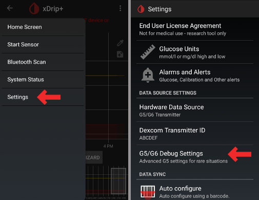

# xDrip+ Instellingen

(For additional information regarding xDrip+, please refer to https://xdrip.readthedocs.io/en/latest/)

If not already set up then download [xDrip+](https://jamorham.github.io/#xdrip-plus).

**This documentation is for xDrip+ for Android only.** There is an app "xDrip for iOS" that has nothing to do with the original xDrip+ for Android.

Voor G6-zenders met een productie datum na het najaar van 2018 (d.w.z. serie nr. starting with 80 or 81) you can use the [master](https://jamorham.github.io/#xdrip-plus) version.

Als je een Dexcom G6 gebruikt en het serienummer van jouw sensor is starting with 8G..., 8H... or 8J... use one of the [latest nightly builds](https://github.com/NightscoutFoundation/xDrip/releases).

If your phone runs Android 10 and you have difficulties with xDrip+ master try [nightly build 2019/12/31 or later](https://github.com/NightscoutFoundation/xDrip/releases).

## Basisinstellingen voor alle CGM-systemen & FSL

* Zorg ervoor dat je de Basis URL correct instelt, inclusief **S** aan het einde van http**s**:/// (niet http:/)
   
   bijv. https://API_SECRET@jouwzelfgekozennaam.herokuapp.com/api/v1/
   
   -> Hamburger Menu (linkerbovenhoek van het beginscherm) -> Settings-> Cloud Upload-> Nightscout Sync (REST-API) > Base URL

* Deactiveer `Automatic calibration` Als de checkbox voor `Automatic calibration` is aangevinkt, activeer `Download data` eenmaal, verwijder dan de checkbox voor `Automatic calibration` en deactiveer `Download data` opnieuw, anders zullen de behandelingen (insuline & koolhydraten) twee keer worden geüpload naar Nightscout.

* Tik op `Extra Options`

* Deactiveer `Upload treatments` en `Backfill data`.
   
   **Waarschuwing: Je moet "Upload behandelingen / Upload treatments" uitschakelen in xDrip, anders kunnen de behandelingen dubbel in AAPS terecht komen, wat leidt tot foutieve COB en IOB!**

* Optie `Alert on failures` moet ook gedeactiveerd worden. Anders krijg je elke 5 minuten een alarm als je wifi/mobiel netwerk te slecht is of de server niet beschikbaar is.
   
   
   
   

* **InterApp-Settings** (Broadcast) Als je AndroidAPS gaat gebruiken dan moet je de glucosegegevens laten doorsturen van xDrip+ naar AndroidAPS. Daarvoor moet je "Local Broadcast" activeren in de Inter-App instellingen van xDrip+.

* Om de doorgestuurde waarden in AAPS te laten overeenkomen met wat je in xDrip+ ziet, moet je `Send the displayed glucose value` (Stuur de weergegeven glucose waarde door) activeren.

* Als je `Accepteer behandelingen` in xDrip+ hebt geactiveerd en "Enable local Broadcasts" in AndroidAPS (onder Nightscout instellingen > Geavanceerd) hebt geactiveerd, dan zal xDrip+ insuline, koolhydraten en basaal informatie ontvangen van AndroidAPS en zal hij bijv. accurater zijn in het geven van hypo voorspellingen, en voorspellings alarmen.
   
   

(xdrip-identify-receiver)=

### Identificeer ontvanger (Identify receiver)

* If you discover problems with local broadcast (AAPS not receiving BG values from xDrip+) go to Settings > Inter-app settings > Identify receiver and enter `info.nightscout.androidaps` for AndroidAPS build (if you are using PumpControl build, please enter `info.nightscout.aapspumpcontrol` instead!!).
* Let op: Auto-correct past soms de beginletter aan naar een hoofdletter. You **must use only lowercase letters** when typing `info.nightscout.androidaps` (or `info.nightscout.aapspumpcontrol` for PumpControl). Capital I would prevent the App from receiving BG values from xDrip+.
   
   

## Dexcom G6 met xDrip+

* De Dexcom G6 zender kan gelijktijdig worden gekoppeld aan de Dexcom ontvanger (of als alternatief de t:slim pomp) en een app op je telefoon.
* Als je jouw Dexcom wilt koppelen aan de xDrip+ app dan zul je dus eerst de Dexcom app moeten verwijderen (of: pas het zender-nummer in de Dexcom app aan naar een onzingetal zodat Dexcom niet probeert aan de zender te koppelen). **Je kunt de xDrip+ app en de Dexcom app niet gelijktijdig koppelen aan een zender.**
* If you need Clarity and want to profit from xDrip+ alarms use the [Build Your Own Dexcom App](DexcomG6-if-using-g6-with-build-your-own-dexcom-app) with local broadcast to xDrip+.

### xDrip+ versie afhankelijk van G6-zendernummer

* Voor G6-zenders met een productie datum na het najaar van 2018 (d.w.z. serie nr. beginnend met 80 of 81) kunt je de [master](https://jamorham.github.io/#xdrip-plus) versie gebruiken. 
* Als je een Dexcom G6 gebruikt en het serienummer van jouw sensor begint met 8G, 8H of 8J probeer de ['nightly build' van 2019/07/28 of later](https://github.com/NightscoutFoundation/xDrip/releases).

### Specifieke instellingen voor Dexcom

* Open G5/G6 Debug Instellingen -> Hamburger Menu (linkerbovenhoek van het beginscherm) -> Instellingen -> G5/G6 Debug Instellingen 

* De volgende opties inschakelen:
   
   * `Use the OB1 Collector`
   * `Native Algorithm` (belangrijk als je SMB wilt gebruiken)
   * `G6 support`
   * `Allow OB1 unbonding`
   * `Allow OB1 initiate bonding`
* Alle andere opties moeten worden uitgeschakeld
* Batterij waarschuwingsniveau aanpassen naar 280 (onderaan de G5/G6 Debug instellingen)
   
   

### Pre-emptive restarts niet aanbevolen

**With Dexcom transmitters who's serial no. is starting with 8G, 8H or 8J preemptive restarts do not work and might kill the sensor completely!**

The automatic extension of Dexcom sensors (`preemptive restarts`) is not recommended as this might lead to “jumps” in BG values on day 9 after restart.

What’s clear is that using the G6 is perhaps a little more complex than it as first suggests. To use it safely, there are a few points to be aware of:

* Wanneer je het "Native" algoritme gebruikt in combinatie met de kalibratiecode in xDrip of Spike, is het veiligste om de optie "Pre-emptive restart" (voortijdige herstart) niet te gebruiken.
* Als je er wel voor kiest om Pre-emptive restarts te gebruiken, zorg dan dat je de sensor start op een moment van de dag dat je tijd kunt vrijmaken om te zien wat er gebeurt tijdens de herstart. Zodat je kunt kalibreren als je ziet dat dat nodig is (je ziet een 'sprong' in je glucosegrafiek). 
* Als je jouw sensoren herstart, dan zul je dat moeten doen A) zonder gebruik te maken van de kalibratiecode voor de veiligste resultaten op dagen 11 en 12, of B) ervoor te zorgen dat je jouw sensorgrafiek in de gaten kunt houden en bereid bent om te kalibreren.
* Het zogenaamde "Pre-soaking" (de sensor alvast inbrengen, waarna je nog wacht met starten) van de G6 met kalibratiecode zal hoogstwaarschijnlijk leiden tot onnauwkeurigheden in je glucosewaardes na starten. Omdat het algoritme van de G6 rekent op weefselbeschadiging na inbrengen, terwijl je met Pre-soaken niet dezelfde mate van weefselbeschadiging zult hebben op het moment dat je de sensor start. Wanneer je Pre-soakt is het waarschijnlijk het beste om de sensor te kalibreren.
* Als je om welke reden ook niet in staat bent om op te letten wat er gebeurt tijdens een herstart / na een Pre-soak, dan kun je beter de kalibratiecode niet gebruiken, en jouw sensor gebruiken met kalibraties, net als bij de G5.

To learn more about the details and reasons for these recommendations read the [complete article](https://www.diabettech.com/artificial-pancreas/diy-looping-and-cgm/) published by Tim Street at [www.diabettech.com](https://www.diabettech.com).

(xdrip-connect-g6-transmitter-for-the-first-time)=

### G6-zender voor de eerste keer verbinden

**For second and following transmitters see [Extend transmitter life](#extend-transmitter-life) below.**

Voor G6-zenders met een productie datum na het najaar van 2018 (d.w.z. serie nr. beginnend met 80 of 81) kunt je de [master](https://jamorham.github.io/#xdrip-plus) versie gebruiken.

Als je een Dexcom G6 gebruikt en het serienummer van jouw sensor begint met 8G, 8H of 8J probeer de ['nightly build' van 2019/07/28 of later](https://github.com/NightscoutFoundation/xDrip/releases).

* Zet originele Dexcom ontvanger uit (indien je die gebruikt).
* Houdt het rode xDrip+ bloeddruppel-icoon op het hoofdscherm lang ingedrukt om de `Source Wizard knop` in beeld te krijgen.
* Gebruik de Source Wizard knop, om de standaardinstellingen in te stellen, inclusief OB1 & Native Mode 
   * Deze wizard helpt je stap voor stap door de initiële instellingen.
   * Het serienummer van je zender heb je hierbij nodig

* Het serienummer van een nieuwe zender vind je op de doos van de zender, en ook op de achterkant van de zender zelf. Let op dat je een `0` (nul) en `O` (hoofdletter o) niet door elkaar haalt.
   
   

* Als je van plan was je sensor te vervangen, doe dit dan nu.

* Plaats zender in de sensor
* Als er een bericht verschijnt met een koppelingsverzoek voor "DexcomXX", waarbij "XX" de laatste twee tekens van het serienummer van de zender is, accepteer het dan (tik op "koppelen")
* Start geen nieuwe sensor voordat de volgende informatie wordt weergegeven in Classic Status Page-> G5/G6 status-> PhoneServiceState:
   
   * Zendernummer beginnend met 80 of 81: "Got data hh:mm" (bijvoorbeeld "Got data 19:04")
   * Zendernummer beginnnend met 8G, 8H of 8J: "Got glucose hh:mm" (bijvoorbeeld "Got glucose 19:04") of "Got no raw hh:mm" (bijvoorbeeld "Got no raw 19:04")
   
   

* Start sensor (alleen indien je zojuist een nieuwe sensor hebt geplaatst)
   
   -> Ergens onderaan het scherm hoort na enkele minuten `Warm Up x,x hours left` te verschijnen.

-> If your transmitter serial no. does not start with 8G, 8H or 8J and there is no time specification after a few minutes stop and restart the sensor.

* Indien je de sensor niet zojuist hebt vervangen: ga naar het Hamburgermenu > System status > klik op de knop 'Restart collector'.
* Zet de originele Dexcom ontvanger (indien je die gebruikt) niet terug aan voordat xDrip+ de eerste meetwaardes toont.
* Houdt het rode xDrip+ bloeddruppel-icoon op het hoofdscherm lang ingedrukt om de `Source Wizard knop` weer te laten verdwijnen.
   
   
   
   
   
   
   
   

(xdrip-transmitter-battery-status)=

### Zender Batterij Status

* Via het Hamburgermenu > System Status kun je de status van de zender batterij (Transmitter battery) zien.
* Veeg (swipe) één keer naar links om het tweede scherm te zien.

* De exacte waarden wanneer de zender ermee stopt omdat zijn batterij leeg is, is niet precies te zeggen. De volgende getallen komen van een paar gebruikers die hun waardes doorgaven vlak voordat hun zender ermee stopte:
   
   * Gebruiker 1: Transmitter days (Zender dagen): 151 / Voltage A: 297 / Voltage B: 260 / Resistance (Weerstand): 2391
   * Gebruiker 2: Transmitter days (Zender dagen): 249 / Voltage A: 275 (op het moment van stoppen)

### Zender resetten

* Een zender kun je resetten zodat de teller van het aantal dagen dat hij in gebruik is, weer op nul komt te staan. Dan gaat hij langer mee dan de maximaal 100 dagen die Dexcom garandeert (na de 100 dagen is de zenderbatterij meestal nog niet leeg, maar hij is geprogrammeerd om te stoppen). Tot nu toe kan een zender niet gereset worden waarvan het serienummer begint met 8G, 8H of 8J. Onderstaande instructies werken dus helaas niet voor deze zenders, wel voor oudere modellen. Hetzelfde geldt voor zenders met serienummer starting with 81 and firmware 1.6.5.**27** (see xDrip+ System Status - G5/G6 status as shown in [screenshot above](xdrip-transmitter-battery-status)).
* Het wordt aangeraden om de zender te resetten vóórdat hij 100 dagen in gebruik is. Dit om problemen met het starten van sensoren te voorkomen.
* Het gebruik van de zenders waarvan het serienummer starting with 81 and firmware 1.6.5.**27** beyond day 100 is only possible if [engineering mode](nabling-Engineering-Mode-in-xDrip) is turned on and 'native mode' is deactivated (hamburger menu -> settings -> G5/G6 debug settings -> native algorithm) because a transmitter hard reset is NOT possible.
* De actieve sensor sessie zal worden gestopt bij het resetten van de zender. Dat betekent dat je daarna weer de 2 uur opwarm-fase zult moeten uitzitten. Plan je zender reset dus gelijktijdig met een sensorwissel, of doe het op een moment dat het geen probleem is om 2 uur geen gegevens te hebben.
* Stop de sensor handmatig via het hamburger menu.
* Schakel de `engineering mode` in: 
   * tik op het injectiespuit-icoontje aan de rechterkant van het xDrip+ startscherm
   * houdt het microfoon-icoontje rechtsonder lang ingedrukt
   * In het tekstveld typ je in "enable engineering mode" (zonder de aanhalingstekens) 
   * klik op "OK"
   * Als je Google Speak engine hebt ingeschakeld, dan kun je ook kort op het microfoon-icoontje tikken en daarna de opdracht inspreken: "enable engineering mode". Het liefst in accentloos Engels;) 
* Ga naar de G5-debug-instellingen en zorg ervoor dat `Use the OB1 collector` is ingeschakeld.
* Geef via het microfoon-icoontje weer de spraakopdracht (op dezelfde manier als hierboven): “hard reset transmitter”
* De opdracht om de zender te resetten zal worden verstuurd bij de eerstvolgende keer dat jouw telefoon contact heeft met de zender
* Kijk vervolgens naar de systeemstatus (Hamburger menu > system status) en zie wat er gebeurt. Het kan even duren voordat de zender heeft terug gecommuniceerd naar je telefoon dat hij succesvol is gereset.
* Na ca. 10 min. kun je overschakelen naar 'Klassieke Statuspagina' (veeg naar rechts) en klik op 'Herstart collector'. Dit stelt het aantal sensordagen in op 0 zonder dat je een nieuwe sensor hoeft te starten.
* Als je een bericht ziet "Phone Service State: Hard Reset maybe failed" op het tweede systeemstatusscherm, start dan gewoon de sensor en dit bericht zou moeten verdwijnen.
   
   

* Transmitter days (ouderdom zender, in dagen) zal worden ingesteld op 0 nadat je succesvol de zender hebt gereset en weer een sensor hebt gestart.

(xdrip-replace-transmitter)=

### Zender vervangen

Voor G6-zenders met een productie datum na het najaar van 2018 (d.w.z. serie nr. beginnend met 80 of 81) kunt je de [master](https://jamorham.github.io/#xdrip-plus) versie gebruiken.

Als je een Dexcom G6 gebruikt en het serienummer van jouw sensor is starting with 8G, 8H or 8Juse one of the [latest nightly builds](https://github.com/NightscoutFoundation/xDrip/releases).

* Zet originele Dexcom ontvanger uit (indien je die gebruikt).
* Stop sensor (alleen als je van plan was om je sensor te vervangen)
   
   Controleer of de zender ook echt is gestopt:
   
   Op het tweede "G5/G6 Status" scherm, kijk naar `Queue Items` ongeveer halverwege het scherm - daar moet iets staan dat lijkt op `(1) Stop Sensor`
   
   Wacht tot deze melding verdwijnt - dit gebeurt meestal binnen een paar minuten. Sensor Status moet "Stopped" (Gestopt) zijn, zie screenshot.
   
   -> Om de zender eruit te halen terwijl je de zender op je huid laat zitten, zie deze video <https://youtu.be/AAhBVsc6NZo>.
   
   
   
   

* Haal de zender weg uit de xDrip system status (knop Forget Device) en haal de zender ook weg uit de jouw telefooninstellingen (Instellingen-> Bluetooth-> selecteer Dexcom en kies Vergeten) De Dexcom zender staat als Dexcom?? bij jouw gekoppelde Bluetooth apparaten, waarbij de ?? de laatste twee cijfers/letters zijn van jouw Dexcom zender.
   
   

* Verwijder zender (en als je de sensor ging vervangen, ook de sensor)

* Zorg dat de oude zender niet weer probeert te koppelen. Een blikken trommeltje of magnetron is een perfecte 'kooi van Faraday' hiervoor, maar zorg dat niemand de magnetron aanzet met jouw zender erin! Je kunt de zender ook meegeven aan een gezinslid die hem meeneemt naar school/werk of ergens anders ver weg.
* Houdt het rode xDrip+ bloeddruppel-icoon op het hoofdscherm lang ingedrukt om de `Source Wizard knop` in beeld te krijgen.
* Gebruik de Source Wizard knop, om de standaardinstellingen in te stellen, inclusief OB1 & Native Mode 
   * Deze wizard helpt je stap voor stap door de initiële instellingen.
   * Het serienummer van je zender heb je hierbij nodig.
* Zet serienummer van nieuwe zender in. Let erop dat je een 0 (nul) en O (hoofdletter o) niet met elkaar verwart.
* Als je ook je sensor ging vervangen, plaatst dan nu de nieuwe sensor.
* Klik de zender in de sensor maar **start de sensor nog niet!**
* Nieuwe "Firefly" zenders (serienr. beginnend met 8G, 8H of 8J) kan alleen gebruikt worden in "native modus".
* De volgende opties mogen niet worden geactiveerd voor nieuwe "Firefly" zender (serienr. beginnend met 8G, 8H of 8J:
   
   * Preemptive restart (Vroegtijdig herstarten) ->uitschakelen!
   * Restart sensor (Sensor herstarten) ->uitschakelen!
   * Fallback to xDrip (Terugvallen op xDrip) ->uitschakelen!
   
   

* Controleer op de Classic Status Pagina-> G5/G6 status-> PhoneServiceState of de volgende informatie wordt weergegeven:
   
   * Zendernummer beginnend met 80 of 81: "Got data hh:mm" (bijvoorbeeld "Got data 19:04")
   * Zendernummer beginnnend met 8G, 8H of 8J: "Got glucose hh:mm" (bijvoorbeeld "Got glucose 19:04") of "Got no raw hh:mm" (bijvoorbeeld "Got no raw 19:04")
   
   

* Wacht 15 minuten, omdat de zender meerdere malen moet communiceren met xDrip voordat de nieuwe sensor wordt gestart. De batterij gegevens worden weergegeven onder Firmware informatie.
   
   

* Start de sensor en doe GEEN BACKDATE (dateer niet in het verleden)! Kies altijd "Yes, today!" (Ja, vandaag!)

* Indien je de sensor niet zojuist hebt vervangen: ga naar het Hamburgermenu > System status > klik op de knop 'Restart collector'.
* Zet de originele Dexcom ontvanger (indien je die gebruikt) niet terug aan voordat xDrip+ de eerste meetwaardes toont.
* Houdt het rode xDrip+ bloeddruppel-icoon op het hoofdscherm lang ingedrukt om de `Source Wizard knop` weer te laten verdwijnen.
   
   
   
   
   
   
   
   

### Sensor vervangen

* Zet originele Dexcom ontvanger uit (indien je die gebruikt).
* Stop sensor indien hij nog liep
   
   Controleer of de zender ook echt is gestopt:
   
   Op het tweede "G5/G6 Status" scherm, kijk naar `Queue Items` ongeveer halverwege het scherm - daar moet iets staan dat lijkt op `(1) Stop Sensor`
   
   Wacht tot deze melding verdwijnt - dit gebeurt meestal binnen een paar minuten.
   
   
   
   

* Maak contacten (op de achterkant van zender) schoon met alcohol en laat drogen aan de lucht.

* In het geval je deze functie gebruikt schakel je `Restart Sensor` en `Preemptive Restarts` (Hamburger menu -> Settings-> G5/G6 Debug Settings) allebei uit. Als je deze stap overslaat en deze functies ingeschakeld laat staan, zal de nieuwe sensor niet goed beginnen.
   
   

* Start Sensor
   
   ** Voor nieuwe Firefly-zenders ** (serienr. beginnend met 8G, 8H of 8J) **is wachten verplicht. Voor alle andere zenders wordt het aanbevolen om ongeveer 15 minuten te wachten tussen het stoppen en starten van de nieuwe sensor (tot `Sensor Status: Stopped` verschijnt op het tweede systeemstatusscherm). en geef GEEN datum in het verleden op!**

* Stel tijd in dat de sensor was ingebracht (time inserted)
   
   * Om G6 Native mode te gebruiken moet je wachten tot het 2 uur opwarmen voorbij is (dat wil zeggen je moet invullen dat de sensor nu is ingebracht: Now inserted).
   * Als je het xDrip+ algoritme gebruikt, kun je een tijdstip ingeven van meer dan 2 uur geleden om de opwarmtijd over te slaan. Metingen kunnen daardoor zeer onbetrouwbaar worden. Daarom wordt dit niet aanbevolen.
* Voer Sensor code in (die staat op de papieren achterkant van de sensorverpakking) 
   * Bewaar deze code voor als je hem later nog nodig hebt (bijv. nieuwe start van de sensor nadat de zender moest worden verwijderd)
   * Code can also be found in [xDrip+ logs](xdrip-retrieve-sensor-code): Click 3-dots-menu on xDrip+ homescreen and choose `View Event Logs`.
* Als je de G6 in "Native mode" gebruikt, hoef je geen kalibratie in te voeren. xDrip+ zal de automatisch waardes gaan weergeven na de 2 uur opwarmtijd.
* Zet de originele Dexcom ontvanger (indien je die gebruikt) niet terug aan voordat xDrip+ de eerste meetwaardes toont.
   
   
   
   

(xdrip-retrieve-sensor-code)=

### Sensorcode terugvinden

* In de master versie van 2019/05/18 en in de laatste 'nightly builds' versies wordt de sensor code weergegeven in de Systeemstatus (via Hamburger menu linksboven op het homescreen).
* Veeg (swipe) één keer naar links om het juiste scherm te zien.
   
   

* De Dexcom sensor code kun je ook terugvinden in xDrip+ logs (geld ook voor oudere versies van xDrip+).

* Tik op de 3 stipjes in rechterbovenhoek van het beginscherm
* Selecteer `View Events Log` en zoek naar "code". Gebruik eventueel de zoekfunctie (via het vergrootglas-icoontje).
   
   

(xdrip-troubleshooting-dexcom-g5-g6-and-xdrip)=

## Probleemoplossing Dexcom G5/G6 en xDrip+

### Probleem bij verbinden met de zender

* De zender moet worden weergegeven in de bluetooth-instellingen van jouw smartphone. Ga naar Instellingen-> Bluetooth-> en kijk bij Gekoppelde apparaten
* Zender wordt getoond als Dexcom?? Waarbij de ?? de laatste twee cijfers/letters zijn van jouw Dexcom zender. (bijvoorbeeld DexcomHY).
* Open de Systeemstatus in xDrip + (hamburgermenu aan de linkerzijde van het home-scherm).
* Controleer of de zender op de eerste statuspagina 'classic status page' (klassieke statuspagina) wordt afgebeeld.
* Zo niet: Verwijder apparaat uit de bluetooth-instellingen van je smartphone en herstart de collector (knop Restart Collector).
* Wacht ongeveer 5 minuten totdat de Dexcom zender automatisch opnieuw verbindt.

### Probleem bij het starten van nieuwe sensor

Please note that the following method might likely not work if your Dexcom G6 transmitter's serial no. is starting with 8G, 8H or 8J.

* In Systeem status wordt sensor weergegeven als "FAILED: Sensor failed start"
* Sensor stoppen
* Herstart je telefoon
* Start sensor met code 0000 (viermaal nul)
* Wacht 15 minuten
* Sensor stoppen
* Start sensor met "echte" code (staat op de papieren achterlaag van de pleister)

Check in xDrip+ logs if xDrip+ starts counting "Duration: 1 minute" (and so on). Only in the xDrip+ logs you can detect at an early stage whether xdrip+ has stopped a sensor. Latest status is not always shown correctly on bottom of startscreen.

## Freestyle Libre met xDrip+

### Specifieke instellingen voor Libre

* Open Bluetooth-instellingen in xDrip+ -> Hamburger Menu (linkerbovenhoek van beginscherm) -> Settings -> scroll naar beneden -> Less common settings -> Bluetooth Settings
   
   

* De volgende opties inschakelen:
   
   * `Turn Bluetooth on` 
   * `Use scanning`
   * `Always discover services`

* Alle andere opties moeten worden uitgeschakeld
   
   

### Batterijniveau van opzetapparaatje voor FSL

* Het batterijniveau van opzetapparaatjes zoals MiaoMiao 2 kan in AAPS worden weergegeven.
* Details can be found on [screenshots page](Screenshots-sensor-level-battery).

### Verbind Libre opzetapparaatje & start sensor

