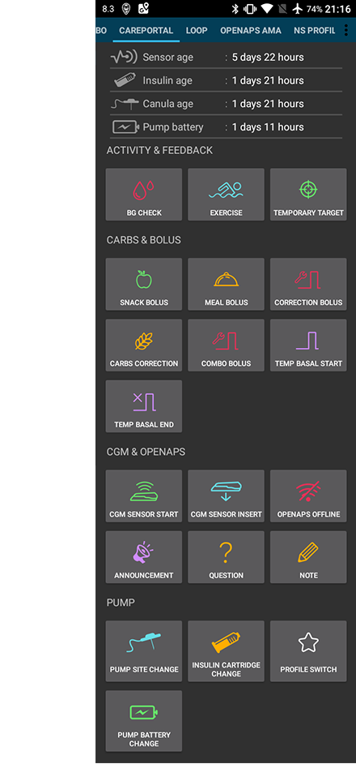

# AndroidAPS screens

## Overzicht-scherm

Dit is het eerste scherm dat je ziet wanneer je AndroidAPS opent en je vindt er de meeste dingen die je dagelijks nodig hebt.

### Section A

* navigate between the various AndroidAPS modules by swiping left or right

### Section B

* change the loop status (open loop, closed loop, suspend loop etc)
* see your current profile and do a [profile switch](../Usage/Profiles.md)
* see your current target blood glucose level and set a [temporary target](../Usage/temptarget.md).

Aanpassingen maak je door een veld lang ingedrukt te houden. I.e long press the target bar in the upper right ("110" in the screenshot above) to set a temp target.

### Section C

* latest blood glucose reading from your CGM
* how long ago it was read
* changes in the last 15 and 40 minutes
* your current basal rate - including any temporary basal rate (TBR) programmed by the system
* insulin on board (IOB)
* carbs on board (COB)

De optionele [statusindicatoren](../Configuration/Preferences#overview) (CAN | INS | RES | SEN | BAT) geeft een visuele waarschuwing voor laag reservoir, batterij bijna leeg, en infuuswissel.

De nog werkzame insuline (IOB) staat op nul als de loop in de afgelopen tijd jouw ingestelde basaalstand heeft afgegeven en er geen insuline meer over is van een eerdere bolus. De getallen binnen de haakjes is hoeveel insuline er nog werkzaam is van een eerdere bolus, en hoeveel verschil er zit tussen de door jou ingestelde basaalstanden en de tijdelijke basaalstanden (TBRs, temporary basal rates) die AndroidAPS heeft gegeven. Dat tweede getal zal negatief zijn, als je afgelopen tijd lagere tijdelijke basaalstanden hebt gehad.

### Section D

Click the arrow on the right side of the screen in section D to select which information is displayed on the charts below.

### Section E

Is the graph showing your blood glucose (BG) as read from your glucose monitor (CGM) it also shows Nightscout notifications such as fingerstick calibrations, and carbs entries.

Houd de grafiek lang ingedrukt om de tijdsduur aan te passen. Je kunt kiezen om de afgelopen 6, 8, 12, 18 of 24 uur te laten zien.

De verlengde lijnen zijn de voorspelde BG waardes en trends - wanneer je die hebt aangevinkt.

* **Orange** line: [COB](../Usage/COB-calculation.rst) (colour is used generally to represent COB and carbs)
* **Dark blue** line: IOB (colour is used generally to represent IOB and insulin)
* **Light blue** line: zero-temp (predicted BG if temporary basal rate at 0% would be set)
* **Dark yellow** line: [UAM](../Configuration/Sensitivity-detection-and-COB#sensitivity-oref1) (un-announced meals)

Deze lijnen laten voorspellingen zien aan de hand van verschillende scenario's. Eentje waarbij rekening wordt gehouden met de huidige absorptie van koolhydraten (COB). Eentje waarbij alleen met insuline rekening wordt gehouden (IOB). Eentje die laat zien wat er gebeurt als er vanaf nu een tijdelijke basaalstand van nul (zero-temp) wordt gegeven zonder verder rekening te houden met BG afwijkingen. En eentje waarbij het systeem een BG stijging heeft opgemerkt en ervan uitgaat dat je koolhydraten hebt gegeten zonder die ingevoerd te hebben (UAM, unannounced meal).

The **solid blue** line shows the basal delivery of your pump. The **dotted blue** line is what the basal rate would be if there were no temporary basal adjustments (TBRs) and the solid blue line is the actual delivery over time.

The **thin yellow** line shows the activity of Insulin. It is based on the expected drop in BG of the insulin in your system if no other factors (like carbs) were present.

### Section F

This section is also configurable using the options in section D.

* **Insulin On Board** (blue chart): It shows the insulin you have on board. If there were no TBRs, SMBs and no remaining boluses this would be zero. Decaying depends on your DIA and insulin profile settings. 
* **Carbs On Board** (orange chart): It shows the carbs you have on board. Decaying depends on the deviations the algorithm detects. If it detects a higher carb absorption than expected, insulin would be given and this will increase IOB (more or less, depending on your safety settings). 
* **Afwijkingen**: 
   * **GREY** bars show a deviation due to carbs. 
   * **GREEN** bars show that BG is higher than the algorithm expected it to be. 
   * **RED** bars show that BG is lower than the algorithm expected.
* **Sensitivity** (white line): It shows the sensitivity that Autosense has detected. Sensitivity is a calculation of sensitivity to insulin as a result of exercise, hormones etc.
* **Activity** (yellow line): It shows the activity of insulin, calculated by your insulin profile (it's not derivative of IOB). The value is higher for insulin closer to peak time. It would mean to be negative when IOB is decreasing. 

### Section G

Enables you to administer a bolus (normally you would use the Calculator button to do this) and to add a fingerstick CGM calibration. Also a Quick Wizzard button would be displayed here if configured in [Config Builder](../Configuration/Config-Builder#quickwizard-settings).

## Boluscalcuator

Wanneer je wilt bolussen voor een maaltijd, dan doe je dat meestal via dit scherm.

### Section A

contains is where you input the information about the bolus that you want. Het BG veld is normaalgesproken al ingevuld, dit is jouw meest recente CGM waarde. Wanneer jouw CGM het niet doet, dan is dit veld leeg. In het Koolhydraten veld voer je de hoeveelheid koolhydraten (in grammen) in die je wilt gaan eten. NB: Wanneer je gewend bent om 'broodwaarden' oid te gebruiken, zul je dus eerst naar grammen moeten omrekenen. The CORR field is if you want to modify the end dosage for some reason, and the CARB TIME field is for pre-bolusing so you can tell the system that there will be a delay before the carbs are to be expected. Je kunt ook een negatieve waarde in dit veld invullen als je bolust na je maaltijd.

Bij een SUPER BOLUS wordt de basale insuline voor de komende twee uur toegevoegd aan de maaltijdbolus, gevolgd door een tijdelijke basaalstand van nul voor de komende twee uur om te compenseren voor de extra insuline. Hiermee wordt de insuline 'naar voren gehaald', zodat je een minder hoge glucosepiek zult hebben na de maaltijd.

### Section B

shows the calculated bolus. Wanneer je al meer insuline aan boord (IOB) hebt dan de berekende bolus, dan zal hier alleen de ontbrekende hoeveelheid koolhydraten te zien zijn.

### Section C

shows the various elements that have been used to calculate the bolus. Je kunt variabelen uitschakelen die je niet wilt laten meenemen in de berekening, maar meestal zul je hier niets van aanpassen.

### Combinaties van COB en IOB en hun betekenis

<ul>
    <li>Wanneer je COB en IOB hebt aangevinkt, dan worden meegenomen: koolhydraten die nog niet zijn opgenomen en waarvoor nog geen insuline is genomen + alle insuline die eerder is afgegeven (dit zijn zowel tijdelijke basaalstanden als SMB).</li>
    <li>Wanneer je COB aanvinkt en IOB niet, dan loop je het risico om teveel insuline te krijgen omdat AAPS geen rekening houdt met de hoeveelheid insuline die eerder is afgegeven. </li>
    <li>Wanneer je IOB aanvinkt en COB niet, dan loop je het risico om te weinig insuline te krijgen. Want AAPS houdt wel rekening met insuline die eerder is afgegeven maar niet met koolhydraten die nog moeten worden opgenomen. Dan kun je een melding "Te weinig ... g" krijgen (ontbrekende koolhydraten).
</ul>

Wanneer je een bolus wilt geven voor extra koolhydraten, vlak na een maaltijdbolus (bijv. je neemt toch wél een nagerecht) dan kan het verstandig zijn om alle vinkjes weg te halen. Dat komt omdat er hierboven steeds wordt gesproken over 'koolhydraten die nog niet zijn opgenomen'. Zo kort na je maaltijdbolus zijn de koolhydraten van je hoofdgerecht waarschijnlijk nog niet opgenomen, en dus komt op dat moment de hoeveelheid IOB niet overeen met de hoeveelheid COB. Door alle vinkjes uit te zetten, berekent AAPS de nieuwe bolus met alleen de koolhydraten uit je nagerecht.

### Wrong COB detection

If you see the warning above after using bolus wizard, AndroidAPS has detected that the calculated COB value maybe wrong. So if you want to bolus again after a previous meal with COB you should be aware of overdosing! For details see the hints on [COB calculation page](../Usage/COB-calculation#detection-of-wrong-cob-values).

## Insuline curve

Dit is het werkingsprofiel van de door jou gekozen insuline. De PAARSE lijn laat zien hoeveel insuline er nog over is na een injectie, je ziet hoe die steeds verder afneemt als de tijd voorbijgaat. De BLAUWE lijn laat zien hoe actief de insuline is.

Normaal gesproken gebruik je een van de Oref profielen. Het is belangrijk om op te merken hoe lang het duurt voordat de activiteit van de insuline helemaal is opgehouden. Wanneer je eerder een insulinepomp hebt gebruikt, ben je waarschijnlijk gewend om in te stellen dat de activiteit van de insuline ongeveer 3,5 uur is. Alleen, wanneer je gaat loopen dan is de langere activiteit (ook al is deze activiteit maar heel weinig aan het einde) weldegelijk belangrijk om mee te laten nemen in berekeningen. Omdat al deze kleine beetjes zich gaan optellen, door de vele recursieve berekeningen die het AAPS algoritme doet.

Meer uitleg over de verschillende soorten insuline, hun werkingsprofielen en waarom dit allemaal belangrijk is, staat in dit artikel: [Understanding the New IOB Curves Based on Exponential Activity Curves](https://openaps.readthedocs.io/en/latest/docs/While%20You%20Wait%20For%20Gear/understanding-insulin-on-board-calculations.html#understanding-the-new-iob-curves-based-on-exponential-activity-curves).

En meer hierover staat in dit uitstekende blog: [Why we are regularly wrong in the duration of insulin action (DIA) times we use, and why it matters…](http://www.diabettech.com/insulin/why-we-are-regularly-wrong-in-the-duration-of-insulin-action-dia-times-we-use-and-why-it-matters/)

En nog meer in: [Exponential Insulin Curves + Fiasp](http://seemycgm.com/2017/10/21/exponential-insulin-curves-fiasp/)

## Pompstatus

Hier zie je de status van je insulinepomp - in dit geval een Accu-Check Combo. De informatie die je ziet spreekt voor zich. Via een druk op de HISTORIEK knop kun je alle informatie uit je pomp geschiedenis terugzien, inclusief je basaalprofiel. Maar onthoud dat er maar 1 basaalprofiel wordt gebruikt in de Combo pomp.

## Care Portal

Wat je hier ziet, is hetzelfde als wat je in Nightscout ziet wanneer je daar op het "+" symbool klikt. Je kunt dit gebruiken om notities te maken. Deze knoppen, zoals infuus wissel of insuline ampul wissel, spreken voor zich. LET OP! Met deze knoppen stuur je je pomp niet aan. Dus als je via de Care Portal een bolus toevoegt, dan krijg je alleen een notitie van de bolus op je Nightscout grafiek. De pomp zelf zal géén bolus geven.

## Loop, MA, AMA, SMB

Je hoeft je hier meestal niet druk om te maken. Je ziet hier de resultaten terug van wat het OpenAPS algoritme heeft berekend, iedere keer wanneer het systeem een nieuwe waarde krijgt van je CGM. Dit wordt ergens anders verder beschreven.

## Profiel

AndroidAPS kan werken met verschillende soorten profielen. Een veelgebruikte optie is - zoals hier weergegeven - een Nightscout profiel, waarbij het profiel via de ingebouwde Nightscout client wordt gedownload en hier is weergegeven in alleen-lezen modus. If you wanted to make any changes you would do this from your Nightscout user interface and then do a [Profile Switch](../Usage/Profiles.md) in AndroidAPS to activate the changes. Gegevens zoals bijv. je basaalstanden worden dan automatisch ook naar je pomp gestuurd.

**DIA:** betekent werkingsduur van je insuline (Duration of Insulin Action), zie hierboven het stuk over insuline curve.

**KH ratio:** is de koolhydraatratio - het aantal grammen koolhydraten waarvoor jij één eenheid insuline nodig hebt. In dit voorbeeldprofiel zijn er verschillende koolhydraatratio's ingesteld voor verschillende tijden van de dag.

**ISF:** is de insuline gevoeligheidsfactor (Insulin Sensitivity Factor) - de hoeveelheid die jouw bloedglucose zal dalen na het geven van één eenheid insuline, waarbij wordt aangenomen dat alle andere variabelen hetzelfde blijven.

**Basaal:** het in de pomp voorgeprogrammeerde basaalprofiel.

**Streefdoel:** zijn de glucosewaardes waar AndroidAPS steeds probeert binnen te blijven. Je kunt verschillende waardes instellen voor verschillende tijden van de dag als je dat wilt. En je kunt daarnaast een onderste en bovenste streefwaarde instellen, zodat het systeem alleen ingrijpt wanneer je buiten die streefwaardes komt. Bedenk wel dat wanneer je dat doet, dat het systeem pas later ingrijpt en dat je waardes dus minder stabiel zullen zijn.

## Behandelingen, xDrip, NSClient

Hier kun je de geschiedenis terugkijken van behandelingen (bolussen en koolhydraten), xDrip gegevens en Nightscout loggegevens die via de ingebouwde Nightscout client worden verzonden. Normaalgesproken hoef je hier niet naar op te kijken, tenzij er ergens een probleem is.

## Configurator

Op deze plek kun je jouw systeem instellen. In dit screenshot bestaat het systeem uit een Combo pomp, een Dexcom G5 CGM die zijn waardes doorgeeft via xDrip+, de insuline is NovoRapid met een Oref profiel en alle gegevens worden geupload naar Nightscout.

Als er in de kolom aan de rechterkant een vinkje staat, dan betekent dit dat die module wordt weergegeven als een tabje in de bovenste regel (zie sectie A in het screenshot met het Overzicht-scherm). Tikken op het tandwiel-symbooltje aan de rechterkant brengt je naar een scherm met verdere instellingen voor die module, als die er zijn.

## Instellingen en voorkeuren

In de rechterbovenhoek zie je drie stipjes onder elkaar staan. Pressing on these takes you to the app's preferences, history browser, setup wizard, about the app information and the exit button that will close AAPS.