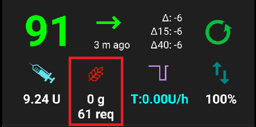

# AndroidAPS screenshots

## Overzicht-scherm

Dit is het eerste scherm dat je ziet wanneer je AndroidAPS opent en je vindt er de meeste dingen die je dagelijks nodig hebt.

### Sectie A - Tabbladen

* Schakel tussen de verschillende AndroidAPS-tabbladen door erop te tikken.
* Je kunt overigens ook van het ene naar het andere tabblad gaan door je huidige scherm naar links of rechts te swipen.
* Je kunt in de [Configurator](../Configuration/Config-Builder#tabblad-of-hamburger-menu) zelf bepalen welke onderdelen van AAPS worden weergegeven als tabbladen.

### Sectie B - Profiel & streefdoel

#### Huidig profiel

* Jouw actieve profiel wordt links weergegeven.
* Druk kort op de profielnaam om jouw profielgegevens te bekijken
* Houd de profielnaam lang ingedrukt om [ te wisselen tussen verschillende profielen](../Usage/Profiles#profiel-wissel).
* Als je had gekozen voor een profiel wissel met een beperkte tijdsduur, dan wordt de resterende tijd (in minuten) tussen haakjes weergegeven.

#### Streefdoel

* Het huidige bloedglucose streefdoel wordt weergegeven aan de rechterkant.
* Druk kort op het streefdoel om een [tijdelijk streefdoel](../Usage/temptarget.md) in te stellen.
* Als je een tijdelijk streefdoel hebt ingesteld, dan wordt de balk geel en wordt de resterende tijd (in minuten) tussen haakjes weergegeven.

#### Weergave van dynamisch aangepast streefdoel

* AAPS kan jouw streefdoel dynamisch aanpassen op basis van jouw insulinegevoeligheid (geldt alleen als je het SMB-algoritme hebt gekozen).
* Schakel hiervoor één of meerdere van de [volgende opties](../Configuration/Preferences#openaps-smb-instellingen) in: 
   * "Gevoeligheid verhoogt het doel" 
   * "Resistentie verlaagt het doel" 
* Als AAPS gevoeligheid of resistentie detecteert, zal het streefdoel dat in jouw profiel is ingesteld, worden aangepast. 
* Bij een dynamisch aangepast streefdoel kleurt de balk groen.

### Sectie C - BG & loop status

#### Huidige bloedglucose

* Laatste bloedglucosewaarde van jouw CGM staat aan de linkerkant.
* De kleur van de BG-waarde geeft aan of je binnen of buiten de [door jou ingestelde range](../Configuration/Preferences#bereik-voor-visualisatie) zit. 
   * groen = in range
   * rood = eronder
   * geel = erboven
* In het midden zie je het aantal minuten sinds de laatste CGM meting en ook het verschil tov de laatste meting, tov 15 minuten geleden en tov 40 minuten geleden.

#### Loop status

* Een pictogram geeft de status van de loop weer:
   
   * groene cirkel = closed loop modus ingeschakeld
   * groene cirkel met stippellijn = [stop voor laag](../Usage/Objectives#doel-6-starten-in-closed-loop-met-bescherming-tegen-lage-bg) modus
   * rode cirkel = loop uitgeschakeld (zonder eindtijd), je krijgt je normale basaal
   * gele cirkel = loop uitgeschakeld (tijdelijk onderbroken - resterende tijd wordt weergegeven onder het pictogram), je krijgt je normale basaal
   * grijze cirkel = pomp losgekoppeld (tijdelijk - de resterende tijd wordt weergegeven onder het pictogram), de pomp geeft geen insuline af
   * oranje cirkel = super bolus afgegeven - resterende tijd wordt weergegeven onder het pictogram
   * blauwe cirkel met stippellijn = open loop

* Druk kort of lang op het pictogram om te schakelen naar een andere loop-modus (Open, Closed, Stop Bij Laag of Uitschakelen), je kunt dit ook doen vóórdat de resterende tijd van een bepaalde modus afloopt, om de loop weer in te schakelen.
   
   * Als je kort drukt op het loop-pictogram, moet je je keuze bevestigen in het dialoogvenster.
   
   

### Sectie D - IOB, COB, BR en AS

* Injectiespuit: insuline aan boord (IOB) - hoeveelheid actieve insuline in jouw lichaam
   
   * De nog werkzame insuline (IOB) staat op nul als de loop in de afgelopen tijd jouw ingestelde basaalstand heeft afgegeven en er geen insuline meer over is van een eerdere bolus. 
   * IOB zal negatief zijn, als je afgelopen tijd lagere tijdelijke basaalstanden hebt gehad.
   * Druk op het pictogram om jouw IOB uitgesplitst te zien tussen bolus en basale insuline

* Graan: [koolhydraten aan boord (COB)](../Usage/COB-calculation.rst) -nog niet opgenomen koolhydraten die je eerder hebt gegeten -> dit pictogram flikkert als koolhydraten nodig zijn om een hypo te voorkomen

* Paarse lijn: huidige basaalstand (ookwel BR, Basaal Ratio genoemd) - het pictogram verandert van vorm als gevolg van tijdelijke veranderingen in basaalstand (als hij plat is, staat jouw basaal op 100%) 
   * Druk op het pictogram om meer details te zien over jouw normale basaal en eventuele tijdelijke basaal (inclusief de resterende tijdsduur)
* Pijltjes omhoog & naar beneden: autosens. Een kruis naast het pictogram geeft aan dat [autosens](../Usage/Open-APS-features#gevoeligheidsdetectie-autosens) is uitgeschakeld. De waarde wordt altijd weergegeven onder het pictogram (ter info, maakt niet uit of het is ingeschakeld of uitgeschakeld)

#### Koolhydraten benodigd

* Wanneer het algoritme denkt dat je extra koolhydraten nodig hebt om te voorkomen dat je een hypo krijgt, zal hij een waarschuwing geven.
* Dit is het geval wanneer het algoritme denkt dat een tijdelijke basaal van 0 (nul) niet voldoende zal zijn.
* De berekening achter de waarschuwing voor benodigde koolhydraten is veel geavanceerder dan de berekening achter de bolus calculator. De bolus calculator houdt alleen rekening met jouw profiel instellingen, icm COB/IOB. De koolhydraat waarschuwing houdt ook rekening met de voorspelde BG. Daarom kan het gebeuren dat je een koolhydraten waarschuwing krijgt, terwijl de boluscalculator geen ontbrekende koolhydraten toont.
* * 'Koolydraten nodig' meldingen kunnen worden gepusht naar Nightscout als je dat wenst, dan zal er een notitie worden gemaakt en naar Nightscout gestuurd.

### Sectie E - Statusindicatoren

* Status lights give a visual warning for 
   * Cannula age
   * Insulin age (days reservoir is used)
   * Reservoir level (units)
   * Sensor Leeftijd
   * Battery age and level (%)
* If threshold warning is exceeded, values will be shown in yellow.
* If threshold critical is exceeded, values will be shown in red.
* Settings can be made in [preferences](../Configuration/Preferences#status-lights).

### Section F - Main graph

* Graph shows your blood glucose (BG) as read from your glucose monitor (CGM). 
* Notes entered in action tab such as fingerstick calibrations and carbs entries as well as profile switches are shown here. 
* Long press on the graph to change the time scale. You can choose 6, 12, 18 or 24 hours.
* The green area reflects your target range. It can be configured in [preferences](../Configuration/Preferences#range-for-visualization).
* Blue triangles show [SMB](../Usage/Open-APS-features#super-micro-bolus-smb) - if enabled in [preferences](../Configuration/Preferences#openaps-smb-settings).
* Optional information:
   
   * Voorspellingslijnen
   * Basalen
   * Activity - insulin activity curve

#### Activate optional information

* Click the triangle on the right side of the main graph to select which information will be displayed in the main graph.
* For the main graph just the three options above the line "\---\---- Graph 1 \---\----" are available.
   
   

#### Prediction lines

* ** Oranje ** lijn: [COB](../Usage/COB-calculation.rst) (kleur wordt gebruikt om COB en koolhydraten weer te geven)
   
   Prediction line shows where your BG (not where COB itself!) will go based on the current pump settings and assuming that the deviations due carb absorption remain constant. Deze lijn wordt alleen getoond als je COB hebt.

* ** Donker blauwe ** lijn: IOB (kleur wordt gebruikt om IOB en insuline weer te geven)
   
   Deze voorspellingslijn laat zien waar jouw BG heengaat, alleen rekening houdend met de insuline die je aan boord hebt. Alsof je wel insuline hebt gebolusd maar vervolgens geen koolhydraten hebt gegeten.

* **Licht blauwe** lijn: zero-temp (voorspelde BG als tijdelijke basaalstand op 0% zou worden ingesteld)
   
   Deze voorspellingslijn is vergelijkbaar met IOB, maar gaat ervan uit dat er geen insuline meer wordt afgegeven door jouw pomp (0% TBR vanaf nu).

* **Donker gele** lijn: [UAM](../Configuration/Sensitivity-detection-and-COB#gevoeligheid-oref1) (un-announced meals, onaangekondigde maaltijden)
   
   Onaangekondigde maaltijden (Un Announced Meals) - het algoritme heeft een aanzienlijke toename van je glucosewaardes gedetecteerd. Bijvoorbeeld door maaltijden, adrenaline of andere invloeden. Deze voorspellingslijn is vergelijkbaar met de oranje COB lijn, maar veronderstelt dat de afwijkingen met een constante snelheid zullen afnemen (dmv het doortrekken van de huidige afnamesnelheid van de afwijkingen).

Bovenstaande voorspellingslijnen rekenen met verschillende (extreme) scenario's. Meestal eindigt je werkelijke bloedglucose curve ergens in het midden van deze lijnen, of dicht bij de lijn die aannames maakt die het meest lijken op jouw situatie van dat moment.

#### Basalen

* A **solid blue** line shows the basal delivery of your pump and reflects the actual delivery over time.
* The **dotted blue** line is what the basal rate would be if there were no temporary basal adjustments (TBRs).
* In times standard basal rate is given the area under the curve is shown in dark blue.
* When the basal rate is temporarily adjusted (increased or decreased) the area under the curve is shown in light blue.

#### Activiteit

* De ** dunne gele ** lijn is de insuline activiteit. 
* Het is gebaseerd op de verwachte daling in BG, alleen veroorzaakt door de aanwezige insuline, alsof er geen andere invloeden (zoals koolhydraten) aanwezig zijn.

### Section G - additional graphs

* You can activate up to four additional graphs below the main graph.
* To open settings for additional graphs click the triangle on the right side of the [main graph](../Getting-Started/Screenshots#section-f-main-graph) and scroll down.

* To add an additional graph check the box on the left side of its name (i.e. \---\---- Graph 1 \---\----).

#### Absolute insuline

* Active insulin including boluses **and basal**.

#### Insulin on board

* Shows the insulin you have on board (= active insulin in your body). It includes insulin from bolus and temporary basal (**but excludes basal rates set in your profile**).
* If there were no [SMBs](../Usage/Open-APS-features#super-micro-bolus-smb), no boluses and no TBR during DIA time this would be zero.
* IOB can be negative if you have no remaining bolus and zero/low temp for a longer time.
* Decaying depends on your [DIA and insulin profile settings](../Configuration/Config-Builder#local-profile-recommended). 

#### Carbs On Board

* Shows the carbs you have on board (= active, not yet decayed carbs in your body). 
* Hoe snel de COB afneemt, hangt af van de werkelijke BG stijging/daling die het algoritme detecteert tov de verwachte BG. 
* Als hij een hogere koolhydraat-absorptie detecteert dan verwacht, dan zal hij insuline afgegeven en zal de IOB toenemen (e.e.a. is afhankelijk van jouw veiligheidsinstellingen). 

#### Afwijkingen

* **GRIJZE** balken zijn een afwijking door koolhydraten. 
* **GROEN** is wanneer de BG hoger is dan het algoritme verwacht. Green bars are used to increase resistance in [Autosens](../Usage/Open-APS-features#autosens).
* **ROOD** is wanneer de BG lager is dan het algoritme verwacht. Red bars are used to increase sensitivity in [Autosens](../Usage/Open-APS-features#autosens).
* **YELLOW** bars show a deviation due to UAM.
* **BLACK** bars show small deviations not taken into account for sensitivity

#### Gevoeligheid

* Shows the sensitivity that [Autosens](../Usage/Open-APS-features#autosens) has detected. 
* Berekent veranderingen aan jouw insuline gevoeligheid veroorzaakt door sporten, hormonen, etc.

#### Activiteit

* Shows the activity of insulin, calculated by your insulin profile (it's not derivative of IOB). 
* De waarde is hoger wanneer het werkingsprofiel van jouw insuline dichter bij zijn piektijd zit.
* Wanneer de IOB afneemt dan wordt de waarde negatief. 

#### Richtingscoëfficiënt afwijking

* Internal value used in algorithm.

### Section H - Buttons

* Buttons for insulin, carbs and Calculator are 'always on'. 
* Other Buttons have to be setup in [preferences](../Configuration/Preferences#buttons).

#### Insuline

* To give a certain amount of insulin without using [bolus calculator](../Getting-Started/Screenhots#bolus-wizard).
* By checking the box you can automatically start your [eating soon temp target](../Configuration/Preferences#default-temp-targets).
* If you do not want to bolus through pump but record insulin amount (i.e. insulin given by syringe) check the corresponding box.

#### Koolhydraten

* To record carbs without bolusing.
* Certain [pre-set temporary targets](../Configuration/Preferences#default-temp-targets) can be set directly by checking the box.
* Time offset: When will you / have you been eaten carbs (in minutes).
* Duration: To be used for ["extended carbs"](../Usage/Extended-Carbs.rst)
* You can use the buttons to quickly increase carb amount.
* Notes will be uploaded to Nightscout - depending on your settings for [NS client](../Configuration/Preferences#ns-client).

#### Boluscalculator

* See [details below](../Configuration/Screenhots#bolus-wizard)

#### Calibrations

* Sends a calibration to xDrip+ or opens Dexcom calibration dialogue.
* Must be activated in [preferences](../Configuration/Preferences#buttons).

#### CGM

* Opens xDrip+.
* Back button returns to AAPS.
* Must be activated in [preferences](../Configuration/Preferences#buttons).

#### Quick Wizard

* Easily enter amount of carbs and set calculation basics.
* Details are setup in [preferences](../Configuration/Preferences#quick-wizard).

## Bolus Wizard

Wanneer je wilt bolussen voor een maaltijd, dan doe je dat meestal via dit scherm.

### Section I

* BG field is normally already populated with the latest reading from your CGM. Wanneer jouw CGM het niet doet, dan is dit veld leeg. 
* In het Koolhydraten veld voer je de hoeveelheid koolhydraten (in grammen) in die je wilt gaan eten. NB: Wanneer je gewend bent om 'broodwaarden' oid te gebruiken, zul je dus eerst naar grammen moeten omrekenen. 
* The CORR field is if you want to modify the end dosage for some reason.
* The CARB TIME field is for pre-bolusing so you can tell the system that there will be a delay before the carbs are to be expected. Je kunt ook een negatieve waarde in dit veld invullen als je bolust na je maaltijd.

### Section J

* Bij een SUPER BOLUS wordt de basale insuline voor de komende twee uur toegevoegd aan de maaltijdbolus, gevolgd door een tijdelijke basaalstand van nul voor de komende twee uur om te compenseren voor de extra insuline. 
* Hiermee wordt de insuline 'naar voren gehaald', zodat je een minder hoge glucosepiek zult hebben na de maaltijd.
* For details visit [diabetesnet.com](https://www.diabetesnet.com/diabetes-technology/blue-skying/super-bolus/).

### Section K

* Toont de berekende bolus. 
* Wanneer je al meer insuline aan boord (IOB) hebt dan de berekende bolus, dan zal hier alleen de ontbrekende hoeveelheid koolhydraten te zien zijn.
* Notes will be uploaded to Nightscout - depending on your settings for [NS client](../Configuration/Preferences#ns-client).

### Section L

* Details of wizard's bolus calculation.
* Je kunt variabelen uitschakelen die je niet wilt laten meenemen in de berekening, maar meestal zul je hier niets van aanpassen.
* For safety reasons the **TT box must be ticked manually** if you want the bolus wizard to calculate based on an existing temporary target.

#### Combinaties van COB en IOB en hun betekenis

* For safety reasons IOB boxed cannot be unticked when COB box is ticked as you might run the risk of too much insulin as AAPS is not accounting for what’s already given.
* If you tick COB and IOB unabsorbed carbs that are not already covered with insulin + all insulin that has been delivered as TBR or SMB will be taken into account.
* Wanneer je IOB aanvinkt en COB niet, dan loop je het risico om te weinig insuline te krijgen. Want AAPS houdt wel rekening met insuline die eerder is afgegeven maar niet met koolhydraten die nog moeten worden opgenomen. Dan kun je een melding "Te weinig ... g" krijgen (ontbrekende koolhydraten).
* If you bolus for **additional food** shortly after a meal bolus (i.e. additional desert) it can be helpful to **untick all boxes**. Dat komt omdat er hierboven steeds wordt gesproken over 'koolhydraten die nog niet zijn opgenomen'. Zo kort na je maaltijdbolus zijn de koolhydraten van je hoofdgerecht waarschijnlijk nog niet opgenomen, en dus komt op dat moment de hoeveelheid IOB niet overeen met de hoeveelheid COB. Door alle vinkjes uit te zetten, berekent AAPS de nieuwe bolus met alleen de koolhydraten uit je nagerecht.

#### Verkeerde COB-detectie

* Als je de waarschuwing hierboven ziet na het gebruik van de boluswizard, dan heeft AndroidAPS vastgesteld dat de berekende COB-waarde misschien onjuist is. 
* Dit betekent dat, als je weer wilt bolussen en je hebt nog COB van een vorige maaltijd, je moet uitkijken voor overdosering! 
* Zie voor meer informatie de [COB Berekening](../Usage/COB-calculation#detectie-van-verkeerde-cob-waarden) pagina.

## Insuline curve

* This shows the activity profile of the insulin you have chosen in [config builder](../Configuration/Config-Builder#insulin). 
* De PAARSE lijn laat zien hoeveel insuline er nog over is na een injectie, je ziet hoe die steeds verder afneemt als de tijd voorbijgaat. De BLAUWE lijn laat zien hoe actief de insuline is.
* The important thing to note is that the decay has a long tail. 
* Wanneer je eerder een insulinepomp hebt gebruikt, ben je waarschijnlijk gewend om in te stellen dat de activiteit van de insuline ongeveer 3,5 uur is. 
* Alleen, wanneer je gaat loopen dan is de langere activiteit (ook al is deze activiteit maar heel weinig aan het einde) weldegelijk belangrijk om mee te laten nemen in berekeningen. Omdat al deze kleine beetjes zich gaan optellen, door de vele recursieve berekeningen die het AAPS algoritme doet.

Meer uitleg over de verschillende soorten insuline, hun werkingsprofielen en waarom dit allemaal belangrijk is, staat in dit artikel: [Understanding the New IOB Curves Based on Exponential Activity Curves](https://openaps.readthedocs.io/en/latest/docs/While%20You%20Wait%20For%20Gear/understanding-insulin-on-board-calculations.html#understanding-the-new-iob-curves-based-on-exponential-activity-curves).

En meer hierover staat in dit uitstekende blog: [Why we are regularly wrong in the duration of insulin action (DIA) times we use, and why it matters…](http://www.diabettech.com/insulin/why-we-are-regularly-wrong-in-the-duration-of-insulin-action-dia-times-we-use-and-why-it-matters/)

And even more at: [Exponential Insulin Curves + Fiasp](http://seemycgm.com/2017/10/21/exponential-insulin-curves-fiasp/)

## Pompstatus

* Different information on pump status. Displayed information depends on your pump model.
* See [pumps page](../Hardware/pumps.rst) for details.

## Care Portal

De Careportal had dezelfde functies als wat je in Nightscout ziet wanneer je daar op het "+" symbool klikt. Je kon de Careportal gebruiken om dingen in te noteren.

### Review carb calculation

* If you have used the [Bolus Wizard](../Getting-Started/Screenshots#bolus-wizard) to calculate insulin dosage you can review this calculation later on treatments tab.
* Just press the green Calc link. (Depending on pump used insulin and carbs can also be shown in one single line in treatments.)

### Koolhydraten correctie

De Behandelingen tab kan worden gebruikt om foutieve koolhydraat-invoer te corrigeren, bijvoorbeeld als je de hoeveelheid koolhydraten hebt onderschat, of juist minder hebt gegeten dan gepland.

1. Bekijk en onthoud de werkelijke COB en IOB op Overzichtscherm.
2. Afhankelijk van de pomp op het behandelingen-tabblad kunnen koolhydraten samen met insuline op één regel staan, of als een aparte regel (dit laatste is zo bij de DanaRS).
3. Verwijder de regel met de foutieve koolhydraten-invoer.
4. Controleer op het Overzicht scherm of de koolhydraten inderdaad zijn verwijderd, het aantal COB zou moeten zijn aangepast.
5. Doe hetzelfde voor de IOB als er slechts één regel is op het Behandelingen-tabblad voor koolhydraten en insuline.
   
   -> Als koolhydraten per ongeluk niet waren verwijderd maar je voegt vervolgens wel extra koolhydraten toe zoals uitgelegd bij 6., zal COB te hoog zijn en dat kan leiden tot een te hoge dosis insuline. Let dus op wat er gebeurt!

6. Voer de juiste hoeveelheid koolhydraten in via de koolhydraten knop op het Overzichtscherm, zorg ervoor dat je het tijdstip aanpast naar het moment dat de koolhydraten daadwerkelijk zijn gegeten.

7. Als er op jouw Behandelingen-tabblad één regel wordt gebruikt voor koolhydraten en insuline, moet je ook de hoeveelheid insuline weer toevoegen. Doe dit via de insuline knop op het Overzichtscherm en zorg er ook hierbij voor dat je het tijdstip aanpast naar het moment dat de insuline was toegediend. Controleer tenslotte op het Overzichtscherm of de IOB is meeveranderd.

## Loop, AMA / SMB

* These tabs show details about the algorithm's calculations and why AAPS acts the way it does.
* Calculations are each time the system gets a fresh reading from the CGM.
* For more details see [APS section on config builder page](../Configuration/Config-Builder#aps).

## Profiel

* Profile contains information on your individual diabetes settings:
   
   * DIA (Duration of Insulin Action)
   * IC or I:C: Insulin to Carb ratio
   * ISF: Insulin Sensitivity Factor
   * Basaal
   * Target: Blood glucose level that you want AAPS to be aiming for

* You can either use a [local profile](../Configuration/Config-Builder#local-profile-recommended) that can be edited on your smartphone or a [Nightscout profile](../Configuration/Config-Builder#ns-profile) which must be edited on your NS page and transferred to your phone afterwards. For details see the corresponding sections on the [config builder page](../Configuration/Config-Builder.md).

## Behandelingen

History of the following treatments:

* Bolus & carbs -> option to [remove entries](../Getting-Started/Screenshots#carb-correction) to correct history
* [Vertraagde bolus](../Usage/Extended-Carbs#id1)
* Temporary basal rate
* [Tijdelijk streefdoel](../Usage/temptarget.md)
* [Profiel wissel](../Usage/Profiles.md)
* [Careportal](../Usage/CPbefore26#careportal-discontinued) - notes entered through action tab and notes in dialogues

## BG Source - xDrip, Dexcom App (pateched)...

* Depending on your BG source settings this tab is named differntly.
* Shows history of CGM readings and offers option to remove reading in case of failure (i.e. compression low).

## NSClient

* Displays status of the connection with your Nightscout site.
* Settings are made in [preferences](../Configuration/Preferences#nsclient). You can open the corresponding section by clicking the cog wheel on the top right side of the screen.
* For troubleshooting see this [page](../Usage/Troubleshooting-NSClient.md).