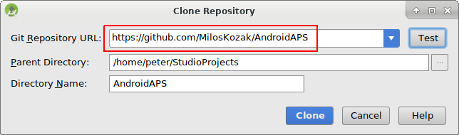

# Bouwen van de app

## Zelf bouwen, in plaats van downloaden

**AndroidAPS is niet beschikbaar als download vanwege regelgeving voor medische hulpmiddelen. Het is wettelijk wel toegestaan om de app voor eigen gebruik te bouwen, maar het is verboden om de kant-en-klare app te verspreiden. Zie de [Veelgestelde vragen](../Getting-Started/FAQ.md) pagina voor meer informatie.**

## ## Belangrijk:

* Gebruik **[Android Studio Versie 3.5.1](https://developer.android.com/studio/)** of nieuwer om de apk te bouwen.
* [Windows 10 32-bits systemen](../Installing-AndroidAPS/troubleshooting_androidstudio#unable-to-start-daemon-process) worden niet ondersteund door Android Studio 3.5.1.

**Configuration on demand** wordt niet ondersteund door de huidige versie van de Android Gradle-plugin.

Als je een foutmelding krijgt die gaat over "on demand configuration" kun je het volgende doen:

* Open het Preferences (Voorkeuren) venster door op File > Settings (Bestand > Instellingen) te klikken (op Mac, Android Studio > Voorkeuren).
* In het linkerscherm, klik op Build, Execution, Deployment > Compiler.
* Vink de Configure on demand checkbox uit.
* Klik op Apply (Toepassen) of OK.

* * *

### Dit artikel is verdeeld in twee delen.

* In het overzicht gedeelte wordt uitgelegd welke stappen je moet nemen om de APK (APK is het bestandsformaat van een app) te bouwen.
* In de stap voor stap instructie vind je heel gedetailleerd wat je moet doen, met behulp van screenshots. Omdat van Android Studio (het programma waarin je de APK bouwt) vaak een nieuwe versie uitkomt, kan het zijn dat de screenshots niet helemaal hetzelfde zijn als jouw versie maar het is een goede houvast. Android Studio kun je gebruiken onder Windows, Mac OS X en Linux, er kunnen kleine verschillen zitten tussen deze besturingssystemen. Als je vindt dat een belangrijke stap onjuist is of ontbreekt, stel er dan een vraag over in de facebook groep "AndroidAPS gebruikers" of in de Gitter chats [Android APS](https://gitter.im/MilosKozak/AndroidAPS) of [AndroidAPSwiki](https://gitter.im/AndroidAPSwiki/Lobby) zodat we hiernaar kunnen kijken.

## Overzicht

De belangrijkste stappen voor het bouwen van het APK bestand zijn:

* [Git installeren](../Installing-AndroidAPS/git-install.rst)
* Android Studio installeren en instellen
* Gebruik Git clone, om een kopie ('kloon') van de broncode voor AndroidAPS te downloaden vanaf Github.
* Open het gedownloade project in Android Studio.
* Bouw de ondertekende APK.
* Zet de ondertekende APK op jouw telefoon.

## Stap voor stap instructie

Gedetailleerde beschrijving van de verschillende stappen.

## Installeer Git (als je dat nog niet hebt)

Volg de handleiding op de [git-installatiepagina](../Installing-AndroidAPS/git-install.rst).

## Installeer Git + Android Studio

De volgende screenshots zijn gemaakt met Android Studio Versie 3.1.3. Jouw scherm ziet er misschien een beetje anders uit, afhankelijk van de versie van de Android Studio die je gebruikt. Maar laat je niet tegenhouden door kleine (uiterlijke) verschillen. Als je er niet uitkomt, kun je hulp vragen in de [AndroidAPS-Facebook-groep](https://www.facebook.com/groups/1900195340201874/) en op [andere plaatsen](../Where-To-Go-For-Help/Connect-with-other-users.md).

Installeer [Android Studio](https://developer.android.com/studio/install.html).

Selecteer "Do not import settings" (instellingen niet importeren) omdat je het nog niet eerder hebt gebruikt.

Klik "Next" (volgende).

Selecteer “Standard” Installation en klik op “Next”.

Selecteer het thema voor de gebruikersinterface. (In deze handleiding hebben we "Intellij" gebruikt). Klik daarna op "Next" (Volgende). Dit is alleen het uiterlijk van Android Studio, het kleurenschema. Je kunt hier ook iets anders kiezen als je dat mooier vind, wat je hier kiest maakt geen enkel verschil voor het bouwen van de app.

Klik op "Next" in het dialoogvenster "Verify Settings" (instellingen controleren).

De Android emulator (hiermee boots je een smartphone na op je computer) wordt niet gebruikt bij het bouwen van de APK. Klik op "Finish" om de installatie af te ronden, de documentatie kun je later lezen wanneer je wilt.

Android Studio gaat nu allerlei software-onderdelen downloaden. Je kunt klikken op de knop "Show Details" (details weergeven) om te zien wat er precies gebeurt, maar het is niet nodig om dat allemaal te weten.

Wanneer hij klaar is met downloaden, klik op "Finish" (afronden).

* Gefeliciteerd! Je hebt nu Android Studio succesvol geïnstalleerd en je kunt beginnen met het klonen van de broncode. Misschien is het even tijd voor pauze?

## Git pad in voorkeuren instellen

### Windows

* Laat Studio weten waar git.exe zich bevindt: File - Settings (Bestand - Instellingen)
  
  

* In het volgende venster: Versie Control - Git

* Kies het juiste pad: .../Git<b>/bin</b>

* Zorg ervoor dat de update methode "Merge" ("Samenvoegen") is geselecteerd.
  
  

### Mac

* Als je git installeert via homebrew, hoef je niets aan de instellingen te wijzigen. Voor het geval je ze toch zoekt: je vind ze hier: Android Studio - Preferences.

## Code en extra componenten downloaden

* Gebruik Git clone in Android Studio zoals in onderstaande screenshots te zien is. Selecteer “Check out project from Version Control” en kies “Git” als versie controle systeem.

Vul de URL in van de hoofdpagina van de AndroidAPS Repository (“https://github.com/MilosKozak/AndroidAPS”) en klik op “Clone”.

Android Studio zal nu het project gaan klonen (kopiëren). Klik niet op "Background" (achtergrond). Dit gaat snel en wanneer je het naar de achtergrond verplaatst, maak je het onnodig ingewikkeld voor nu.

Je krijgt de melding dat de "checkout from version control" (het klonen) is afgerond. Open het project door op "Yes" te klikken.

Gebruik de standaard "default gradle wrapper" en klik "OK".

Lees en sluit het scherm van de "Tip of the Day" (tip van de dag) van Android Studio door te drukken op "Close" (sluiten).

* Top! Je hebt jouw eigen kopie van de broncode en je bent klaar om de app te gaan bouwen.
* Nu krijg je je eerste foutmelding. Gelukkig geeft Android Studio je direct de oplossing hiervoor.

Klik op "Install missing platform(s) and sync project" (ontbrekende platforms installeren en project synchroniseren). Android Studio zal nu een ontbrekend stuk software gaan installeren.

Accepteer de gebruiksrechtovereenkomst door op "Accept" en op "Next" te klikken.

Het dialoogvenster geeft aan "Please wait until the installation finishes" (wacht aub tot de installatie is afgerond) en dus wacht je even.

Wanneer hij een melding geeft dat dit is afgerond, klik je op "Finish" (afronden). 

En dan... een volgende foutmelding. Maar ook hier geeft Android Studio je weer een vergelijkbare oplossing. Klik op “Install Build Tools and sync project” om de ontbrekende “Tools” te installeren.

Het dialoogvenster geeft aan "Please wait until the installation finishes" (wacht aub tot de installatie is afgerond) en dus wacht je even.

Wanneer hij een melding geeft dat dit is afgerond, klik je op "Finish" (afronden). 

En een andere foutmelding omdat Android Studio weer een ontbrekend platform moet installeren. Klik weer op "Install missing platform(s) and sync project".

Het dialoogvenster geeft aan "Please wait until the installation finishes" (wacht aub tot de installatie is afgerond) en dus wacht je even.

Wanneer hij een melding geeft dat dit is afgerond, klik je op "Finish" (afronden). 

Klik op “Install Build Tools and sync project” om de ontbrekende “Tools” te installeren.

Het dialoogvenster geeft aan "Please wait until the installation finishes" (wacht aub tot de installatie is afgerond) en dus wacht je even.

Wanneer hij een melding geeft dat dit is afgerond, klik je op "Finish" (afronden). 

Jippie! De foutmeldingen zijn voorbij en je bent begonnen. Misschien tijd om wat water te drinken?

Android Studio komt met een "update Gradle" melding (Gradle bijwerken). **Update Gradle nooit!** Dit kan tot problemen leiden!

Klik op "Don't remind me again for this project" (Nooit meer vragen voor dit project).

Hij gaat verder met bouwen...

Mooi, je hebt nu jouw eerste app "Build finished" (bouw afgerond). Maar we zijn nog niet klaar.

## Bouwen van de ondertekende APK

Selecteer in het menu "Build" en vervolgens "Generate Signed Bundle / APK...". (Het menu in Android Studio is gewijzigd per september 2018. In oudere versies ga je naar het menu "Build" en klik vervolgens op "Generate Signed APK...".)

Ondertekenen betekent dat je een handtekening op jouw app zet, een soort digitale vingerafdruk. Dat is nodig omdat Android om veiligheidsredenen voorschrijft dat een app altijd zo'n handtekening moet hebben. Voor meer informatie over dit onderwerp, volg de link [hier](https://developer.android.com/studio/publish/app-signing.html#generate-key). Veiligheid van apps is een groot en ingewikkeld onderwerp waarin je je niet verder hoeft te verdiepen.

In het volgende dialoogvenster selecteer je "APK" in plaats van "Android App Bundle" en klik op "Volgende".

Selecteer "App" en klik op "Next".

Klik op "Create new..." (maak nieuwe...) om jouw eigen key store (digitale handtekening) te maken. Een key store is een bestandje waarin de informatie van jouw handtekening is opgeslagen. Het bestandje is versleuteld en beveiligd met een wachtwoord. We raden aan om het op te slaan in jouw eigen map op je computer en om het wachtwoord goed te onthouden. Maar mocht je het bestandje of jouw wachtwoord kwijtraken dan is dat geen groot probleem, je moet dan gewoon een nieuwe maken. Het is goed om deze informatie zorgvuldig te bewaren.

* Vul de volgende tekstvelden in. 
  * Key store path: is de locatie waar je het bestandje met jouw handtekening opslaat. **Sla dit niet op in dezelfde map als jouw project. Je moet een andere locatie gebruiken!**
  * In de Password (wachtwoord) en Confirm (bevestig) velden vul je tweemaal het door jou gekozen wachtwoord in. Tweemaal om op typfouten te controleren.
  * Alias is de naam voor jouw handtekening. Je kunt de vooraf ingevulde tekst laten staan, of zelf een naam kiezen die je leuk vindt.
  * Ook hier moet je weer tweemaal een door jou gekozen wachtwoord invullen. Ook weer tweemaal, om op typfouten te controleren.
  * Je kunt de Validity (geldigheidsduur) op de standaardwaarde van 25 jaar laten staan.
  * Je hoeft alleen je First and Last Name (voor- en achternaam) in te vullen, de rest is optioneel. Klik daarna op "OK".

Vul de informatie in van jouw handtekening die je zojuist hebt aangemaakt in het volgende venster en klik op "Next".

Selecteer "full" (volledig) als "Flavour" (smaak) om de volledige AndroidAPS app te maken. Selecteer "V1 Jar Signature" (V2 is optioneel) en klik op "Finish". De volgende informatie kan handig zijn voor later.

* 'Release' is wat je hoort te kiezen als "Build Type", 'Debug' is alleen voor programmeurs.
* Kies de "Flavour" die je wilt bouwen: 
  * full/fullRelease (volledige versie van de app, deze heb je nodig om het systeem in closed loop modus te gebruiken)
  * openloop (je krijgt alleen voorstellen voor tijdelijke basaalstanden, die jij als gebruiker handmatig op de pomp moet invoeren)
  * pumpcontrol (functioneert alleen als afstandsbediening voor je pomp, zonder te loopen)
  * nsclient (je kunt de real time gegevens van een andere looper bekijken je kunt dingen invullen in de care portal van die andere looper, wordt gebruikt door ouders van een loopend kind)

In het Event Log kun je zien dat de Signed APK (ondertekende APK) succesvol is gebouwd.

Klik op de "locate" link in het Event Log.

## Overzetten van de APK naar je telefoon

Een Verkenner venster zal openen. Het kan dat het er iets anders uitziet, dit screenshot is met een Linux computer gemaakt. In Windows zal de "Verkenner" openen, op een Mac OS X de "Finder" Hier zul je een map zien met daarin een APK bestand. Helaas is dit de VERKEERDE locatie, omdat "wear-release.apk" NIET de ondertekende app die we zoeken.

Om de juiste locatie te openen, ga naar de map met AndroidAPS/app/full/release om het bestand "app-full-release.apk" te vinden. Zet dit bestand op jouw Android telefoon. Dit kan op verschillende manieren:

* Bluetooth
* Via de cloud (bijvoorbeeld Google Drive, Dropbox)
* Simpelweg met een usb kabeltje tussen computer en telefoon 
* Via e-mail (let op: sommige e-mailapps hebben de mogelijkheid om een apk-bestand als bijlage toe te voegen, geblokkeerd. Kies dan één van bovenstaande opties.)

In dit voorbeeld wordt Gmail gebruikt omdat het vrij eenvoudig is. Om de zelf-ondertekende app te kunnen installeren, moet je Android hiervoor toestemming geven, ook al is dit bestand via Gmail ontvangen, wat normaal gesproken niet toegestaan is. Als je een andere manier gebruikt om de APK over te zetten op je telefoon, geef dan de toestemmingen waar hij naar vraagt zodat je verder kunt.

In de instellingen van je telefoon is een optie om "Apps uit onbekende bronnen" toestemming te geven om te kunnen installeren. Daar moet je Gmail (in dit voorbeeld) toestemming geven om de APK te installeren.

Selecteer "Toestaan van deze bron". Nadat je klaar bent met installeren, wordt het aanbevolen om de instellingen weer terug te zetten op "niet toestaan".

De laatste stap is om op het APK bestand te tikken en de app te installeren. Als hij niet uit zichzelf installeert en je hebt een vorige versie van AndroidAPS op je telefoon staan die met een andere handtekening is ondertekend, dan moet je die versie van de app eerst verwijderen. Vergeet niet om eerst je instellingen van die versie te exporteren vóórdat je de app verwijdert!

Van harte! Je hebt de app geïnstalleerd op je telefoon en nu kun je verder met het instellen van AndroidAPS.

## Identify receiver (identificeer ontvanger) bij gebruik van xDrip

[Zie xDrip pagina](../Configuration/xdrip#identify-receiver)

## Problemen oplossen

Zie afzonderlijke pagina over [Probleemoplossing Android Studio](../Installing-AndroidAPS/troubleshooting_androidstudio.rst).