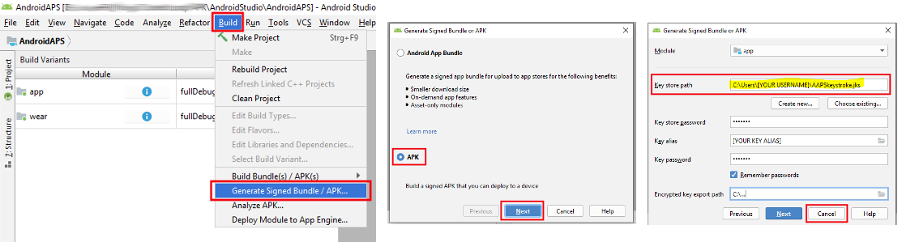

# Bijwerken naar een nieuwe versie

<font color="#FF0000"><b>Belangrijk: Vanaf versie 2.3 moet je git gebruiken om te updaten. Updating via zip file does not work anymore.</font></b>.

***Note***: If updating to AndroidAPS 2.3, you need to use [Android Studio Version 3.4](https://developer.android.com/studio/archive?), it doesn't work with the latest one.

## Installeer Git (als je dat nog niet hebt)

### Windows

* Elke versie van Git zou moeten werken. Bijvoorbeeld <https://git-scm.com/download/win>. Volg de instructies op die site om Git te installeren.
* Onthoud of noteer in welke map Git op jouw computer geïnstalleerd wordt. Dat heb je nodig in de volgende stap.
  
  

* Laat Studio weten waar git.exe zich bevindt: File - Settings (Bestand - Instellingen)
  
  

* In het volgende venster: Versie Control - Git

* Kies het juiste pad: .../Git<font color="#FF0000"><b>/bin</b></font>

* Zorg ervoor dat de update methode "Merge" ("Samenvoegen") is geselecteerd.
  
  

### Mac

* Elke versie van Git zou moeten werken. Bijvoorbeeld <https://git-scm.com/download/mac>. Volg de instructies op die site om Git te installeren.
* Gebruik homebrew om git te installeren: ```$ brew install git```.
* Voor meer informatie over het installeren van git zie de [officiële git documentatie](https://git-scm.com/book/en/v2/Getting-Started-Installing-Git).
* Als je git installeert via homebrew, hoef je niets aan de instellingen te wijzigen. Voor het geval je ze toch zoekt: je vind ze hier: Android Studio - Preferences.

## Bijwerken van jouw lokale kopie

* Zorg dat je in het hoofdscherm van Android Studio bent. Klik op VCS > Git > Fetch
  
  

## Selecteer branch

* Als je de branch wilt wijzigen, selecteer dan een andere branch uit het menu rechtsonder: "master" (de meest actuele, stabiele versie) of een andere versie (zie verderop).
  
  

and then checkout (You can use 'Checkout as New Branch' if 'Checkout' is not available.)

     
    

## Bijwerken vd branch vanuit Github

* Druk op Ctrl+T, selecteer Merge method en druk op OK
  
  

On the tray you'll see green message about updated project

## Bouwen van de ondertekende APK

<!--- Text is maintained in page building-apk.md ---> Selecteer in het menu "Build" en vervolgens "Generate Signed Bundle / APK...". (Het menu in Android Studio is gewijzigd per september 2018. In oudere versies selecteerde je in het menu "Build" en vervolgens "Generate Signed APK...”.)

  
Ondertekenen betekent dat je de door jou gemaakte app ondertekent. Dit is een soort digitale vingerafdruk in de app zelf. Dat is nodig omdat Android om veiligheidsredenen voorschrijft dat een app altijd zo'n handtekening moet hebben. Voor meer informatie over dit onderwerp, volg de link [hier](https://developer.android.com/studio/publish/app-signing.html#generate-key). Veiligheid van apps is een groot en ingewikkeld onderwerp waarin je je niet verder hoeft te verdiepen.


In het volgende dialoogvenster selecteer je "APK" in plaats van "Android App Bundle" en klik op "Volgende".


Selecteer "App" en klik op "Next".


Enter your key store path, enter key store password, select key alias and enter key password.

Select 'Remember passwords'.

Then click next.


Selecteer "full" (volledig) als "Flavour" (smaak) om de volledige AndroidAPS app te maken. Selecteer "V1 Jar Signature" (V2 is optioneel) en klik op "Finish". De volgende informatie kan handig zijn voor later.

* 'Release' is wat je hoort te kiezen als "Build Type", 'Debug' is alleen voor programmeurs.
* Kies de "Flavour" die je wilt bouwen: 
  * full (dwz je pomp wordt automatisch aangestuurd tijdens closed looping)
  * openloop (dwz voorstellen voor tijdelijke basaalstanden, die de gebruiker handmatig op de pomp instelt)
  * pumpcontrol (dwz alleeneen afstandsbediening voor de pomp, zonder te loopen)
  * nsclient (dwz de gegevens van een andere gebruiker worden weergegeven en care portal bijdragen kunnen worden toegevoegd)


In het Event Log kun je zien dat de Signed APK (ondertekende APK) succesvol is gebouwd.


Klik op de "locate" link in het Event Log.


## Overzetten van de APK naar je telefoon

<!--- Text is maintained in page building-apk.md ---> Een Verkenner venster zal openen. Het kan dat het er iets anders uitziet, dit screenshot is met een Linux computer gemaakt. In Windows zal de "Verkenner" openen, op een Mac OS X de "Finder" Hier zul je een map zien met daarin een APK bestand. Helaas is dit de VERKEERDE locatie, omdat "wear-release.apk" NIET de ondertekende app die we zoeken.


Om de juiste locatie te openen, ga naar de map met AndroidAPS/app/full/release om het bestand "app-full-release.apk" te vinden. Zet dit bestand op jouw Android telefoon. Het overzetten op je telefoon kun je simpelweg via een usb-kabeltje doen. Andere opties zijn Bluetooth, cloud upload, e-mail. Kies wat je makkelijk vindt. In dit voorbeeld wordt Gmail gebruikt. Om de zelf-ondertekende app te kunnen installeren, moet je Android hiervoor toestemming geven ookal is dit bestand via Gmail ontvangen, wat normaal gesproken niet toegestaan is. Als je een andere manier gebruikt om de APK over te zetten op je telefoon, geef dan de toestemmingen waar hij naar vraagt zodat je verder kunt.


In de instellingen van je telefoon is een optie om "Apps uit onbekende bronnen" toestemming te geven om te kunnen installeren. Daar moet je Gmail (in dit voorbeeld) toestemming geven om de APK te installeren.

Selecteer "Toestaan van deze bron". Nadat je klaar bent met installeren, wordt het aanbevolen om de instellingen weer terug te zetten op "niet toestaan".


De laatste stap is om op het APK bestand te tikken en de app te installeren. Als hij niet uit zichzelf installeert en je hebt een vorige versie van AndroidAPS op je telefoon staan die met een andere handtekening is ondertekend, dan moet je die versie van de app eerst verwijderen. Vergeet niet om eerst je instellingen van die versie te exporteren vóórdat je de app verwijdert!

Van harte! Je hebt de app geïnstalleerd op je telefoon en nu kun je verder met het instellen van AndroidAPS.

## Controleer AAPS versie op telefoon

You can check the AAPS version on your phone by clicking the three dots menu on the top right and then about.


# Problemen oplossen

## Kotlin compiler warning

If build completed successfully but you get Kotlin compiler warnings then just ignore these warnings.

App was build successfully and can be transferred to phone.


## Could not download… / Offline Work

If you get a failure message like this


make sure that ‘Offline work’ is disabled.

File -> Settings


## Uncommitted changes

If you receive failure message like


### Optie 1

* In Android Studio selecteer VCS -> GIT -> Reset HEAD 

### Optie 2

* Kopieer 'git checkout --' naar klembord (zonder aanhalingstekens)
* Schakel over naar Terminal in Android Studio (linkerbenedenhoek van Android Studio venster) 

* Plak gekopieerde tekst en druk op return 

## App niet geïnstalleerd


* Controleer of je inderdaad het bestand "app-full-release.apk" naar jouw telefoon hebt overgebracht.
* Als "App niet geïnstalleerd" wordt weergegeven op jouw telefoon volg dan deze stappen: 
  1. Ga naar de huidige AndroidAPS app op jouw telefoon en [Exporteer instellingen](../Usage/Objectives#export-import-settings)
  2. Verwijder de AndroidAPS app van jouw telefoon.
  3. Schakel vliegtuigmodus in & schakel bluetooth uit.
  4. Installeer nieuwe versie ("app-full-release.apk”)
  5. [Importeer instellingen](../Usage/Objectives#export-import-settings)
  6. Zet bluetooth weer aan en schakel de vliegtuigmodus uit

## App geïnstalleerd maar oude versie

If you build the app successfully, transferred it to your phone and installed it successfully but the version number stays the same then you might have missed the merging step in the [update manual](…/Installing-AndroidAPS/Update-to-new-version.html#updating-branch-from-github).

## Geen van de bovengenoemde

If non of the above tips helped you might consider building the app from scratch:

1. Ga naar de huidige AndroidAPS app op jouw telefoon en [Exporteer instellingen](../Usage/Objectives#export-import-settings)
2. Zorg dat je het eerder door jouzelf gemaakte key bestandje en wachtwoord bij de hand hebt. Mocht je de wachtwoorden vergeten zijn, kunt je proberen deze te vinden in de 'project files' zoals [hier](https://youtu.be/nS3wxnLgZOo) beschreven.
3.     Noteer de locatie van jouw key store bestand
      In Android Studio Build -> Generate signed APK 
      
      
  
  4. Bouw app vanaf nul zoals [hier](…/Installing-AndroidAPS/Building-APK.html#download-code-and-additional-components) beschreven. Gebruik bestaande keystore en wachtwoord.
4. Als je de APK hebt gebouwd, verwijder eerst de bestaande app van jouw telefoon. Verplaats daarna de nieuwe apk naar je telefoon en installeer.
5. [Importeer instellingen](../Usage/Objectives#export-import-settings)

## In het ergste geval

In case even building the app from scratch does not solve your problem you might want to try to uninstall Android Studio completely. Some Users reported that this solved their problem.

Make sure to uninstall all files associated with Android Studio. Manuals can be found online i.e. <https://stackoverflow.com/questions/39953495/how-to-completely-uninstall-android-studio-from-windowsv10>.

Install Android Studio from scratch as described [here](/Installing-AndroidAPS/Building-APK#install-android-studio) and **do not update gradle**.