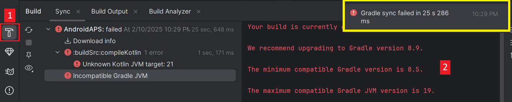
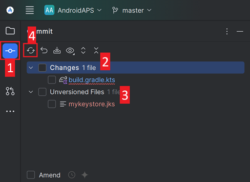

(troubleshooting-android-studio)=
# Problemen met Android Studio oplossen

(lost-keystore)=
## Keystore (digitale handtekening) kwijt
If you use the same keystore when updating AndroidAPS you do not have to uninstall the previous version on your smartphone. That's why it is recommended to store the keystore in a save place.

If you try to install the apk, signed with a different keystore than before, you will get an error message that the installation failed!

In case you cannot find your old keystore or its password anymore, proceed as follows:

1. [Export settings](../Usage/ExportImportSettings.md#export-settings) on your phone.
2. Copy or upload the settings file from your phone to an external location (i.e. your computer, cloud storage service...).
4. Generate signed apk of new version as described on the [Update guide](../Installing-AndroidAPS/Update-to-new-version) and transfer it to your phone.
5. Verwijder de vorige AAPS-versie van jouw telefoon.
6. Installeer de nieuwe AAPS-versie op jouw telefoon.
7. [Import settings](../Usage/ExportImportSettings.md#import-settings) to restore your objectives and configuration.
8. Check your battery optimization options and disable them again.

   If you can't find them on your phone copy them from the external storage to your phone.
8. Keep on looping.

## Gradle Sync failed
Gradle Sync can fail to various reasons. Wen you get a message saying that gradle sync failed, open the "Build" tab (1) at the bottom of Android Studio and check what error message (2) is displayed.

  

These are the usual gradle sync failures:
* [Uncommitted changes (Niet-opgenomen wijzigingen)](#uncommitted-changes)
* [No cached version of ... available](#could-not-resolve-no-cached-version)
* [Android Gradle requires Java 11 to run](#android-gradle-plugin-requires-java-11-to-run)

*Important*: After you have followed the instructions for your specific problem, you need to trigger the [gradle sync](#gradle-resync) again.

### Uncommitted changes (Niet-opgenomen wijzigingen)

If you receive a failure message like


#### Step 1 - Check git installation
  * Open the terminal tab (1) at the bottom of Android Studio and copy the following text and paste or type into the terminal.
    ```
    git --version
    ```

    

    Note: There is a space and two hyphens between git and version!

  * You must receive a message saying what git version is installed, as you can see in the screenshot above. In this case, go to [Step 2](#step-2-check-for-uncommitted-changes).

  * In case you get an message saying
    ```
    Git: command not found
    ```
    your Git installation is not right.

  * [Check git installation](../Installing-AndroidAPS/git-install.md#check-git-settings-in-android-studio)

  * if on Windows and git was just installed, you should restart your computer to make git globally available after the installation

  * If Git is installed, you have restarted (if on windows), and git still couldn't found:

  * Search your computer for a file "git.exe".

    Note for yourself, what directory it is in.

  * Go to the Environment variables in windows, select the variable "PATH" and click edit. Add the directory where you have found your git installation.

  * Save and close.

  * Restart Android Studio.

#### Step 2: Check for uncommitted changes.

  * In Android Studio, oben the "Commit" Tab (1) on the left-hand side. 
  * You can see either a "Default changeset" (2) or "Unversioned files" (3):

    * For "Default changeset", you probably updated gradle or changed some of the file contents by mistake.

    * Right click on "Default Changeset" and select "Rollback"

      

    * The files are fetched again from the Git server. If there are no other changes in the commit tab, go to [Step 3](#step-3-resync-gradle-again).

  * If you can see "Unversioned Files", you might have stored files in your sourecode directory which should be better places somewhere else, e.g. your keystore file.

    * Use your regular file explorer on your computer to move or cut and paste that file to a save place.

    * Go back to Android Studio and click the Refresh button (4) within the Commit tab to make sure the file is not stored in the AndroidAPS directory anymore.

      If there are no other changes in the commit tab, go to [Step 3](#step-3-resync-gradle-again).


#### Step 3: Resync Gradle (again)

Follow the instructions at [Gradle Resync](#gradle-resync).

### Android Gradle plugin requires Java 11 to run

  You might experience this error message:

  

  Click on "Gradle Settings" (1) to go to open the gradle settings.

  If you don't have the link to the "Gradle Settings", open the Gradle settings manually by selecting the Gradle Tab on the right border (1), select the tools icon (2) and there the item 'Gradle Settings' (3).

  

  When you have opened the Gradle settings dialog, open the options (1) at "Gradle JDK" and selected the "Embedded JDK version" (2).

  

  Press "OK" to save and close the settings dialog.

  *Important*: If you don't see the setting "Gradle JDK", you might have not updated Android Studio. Make sure you are using Android Studio 2021.1.1 Bumblebee) or newer.

  Now you need to trigger a [Gradle Resync](#gradle-resync)

### Could not resolve/No cached version

  You might get this error message:

    

  * On the right side, open the Gradle tab (1).

    Make sure the button shown at (2) is *NOT* selected.

    

  * Now you need to trigger a [Gradle Resync](#gradle-resync)

(unable-to-start-daemon-process)=
### Unable to start daemon process (Kan daemon proces niet starten)

  If you see an error message like the one below you probably use a Windows 10 32-bit system. This is not supported by Android Studio 3.5.1 and above and unfortunately nothing the AAPS developer can do about.

  If you are using Windows 10 you must use a 64-bit operating system.

  There are a lot of manuals on the internet how to determine wether you have a 32-bit or 64-bit OS - i.e. [this one](https://www.howtogeek.com/howto/21726/how-do-i-know-if-im-running-32-bit-or-64-bit-windows-answers/).

  

### Gradle Resync

  If you can still see the message that the gradle sync failed, now select the Link "Try again". 


  If you don't see the a message anymore, you can still trigger this manually:

  * Open the Gradle tab (1) on the right border of Android Studio.

    

  * Right-click on AndroidAPS (2)

  * Click on "Reload Gradle Project" (3)

## Generate Signed APK generated successfully with 0 build variants

When you generate the signed apk, you might get the notification that generation was successfully but are told that 0 build variants where generated:


This is a false warning. Check the directory your selected as "Destination folder" for generation (step [Generate Signed APK](../Installing-AndroidAPS/Building-APK.md#generate-signed-apk)) and you will find the generated apk there!


## App was created with compiler/kotlin warnings

If your build completed successfully but you get compiler or kotlin warnings (indicated by a yellow or blue exclamation mark) then you can just ignore these warnings.

 

Your app was build successfully and can be transferred to phone!


## Key was created with errors

When creating a new keystore for building the signed APK, on Windows the following error message might appear


This seems to be a bug with Android Studio 3.5.1 and its shipped Java environment in Windows. The key is created correctly but a recommendation is falsely displayed as an error. This can currently be ignored.


## No CGM data is received by AndroidAPS

* In case you are using patched Dexcom G6 app: This app is outdated. Use the [BYODA](../Hardware/DexcomG6.md#if-using-g6-with-build-your-own-dexcom-app) app instead.

* In case you are using xDrip+: Identify receiver as described on [xDrip+ settings page](../Configuration/xdrip.md#identify-receiver).


## App not installed


* Make sure you have transferred the “app-full-release.apk” file to your phone.
* If "App not installed" is displayed on your phone follow these steps:

1. [Export settings](../Usage/ExportImportSettings) (in AAPS version already installed on your phone)
2. Verwijder de AndroidAPS app van jouw telefoon.
3. Enable airplane mode & turn off bluetooth.
4. Installeer nieuwe versie ("app-full-release.apk”)
5. [Importeer instellingen](../Usage/ExportImportSettings)
6. Zet bluetooth weer aan en schakel de vliegtuigmodus uit

## App installed but old version

If you built the app successfully, transferred it to your phone and installed it successfully but the version number stays the same then you might have missed to [update your local copy](../Installing-AndroidAPS/Update-to-new-version.md#update-your-local-copy)

## None of the above worked

If non of the above tips helped you might consider building the app from scratch:

1. [Export settings](../Usage/ExportImportSettings) (in AAPS version already installed on your phone)

2. Houd jouw keystore file (digitale handtekening) en keystore wachtwoord bij de hand. In case you have forgotten passwords you can try to find them in project files as described [here](https://youtu.be/nS3wxnLgZOo).

    Of je maakt gewoon van een nieuw keystore bestand en wachtwoord aan.

3. Build app from scratch as described [here](../Installing-AndroidAPS/Building-APK.md#download-androidaps-code).

4. Als je de APK hebt gebouwd, verwijder eerst de bestaande app van jouw telefoon. Verplaats daarna de nieuwe apk naar je telefoon en installeer.
5. [Import settings](../Usage/ExportImportSettings) again to restore your objectives and settings.
6. You should check your battery optimization options and disable them again.

## Worst case scenario

In case even building the app from scratch does not solve your problem you might want to try to uninstall Android Studio completely. Some Users reported that this solved their problem.

**Make sure to uninstall all files associated with Android Studio.** If you do not completely remove Android Studio with all hidden files, uninstalling may cause new problems instead of solving your existing one(s). Manuals for complete uninstall can be found online i.e.

[https://stackoverflow.com/questions/39953495/how-to-completely-uninstall-android-studio-from-windowsv10](https://stackoverflow.com/questions/39953495/how-to-completely-uninstall-android-studio-from-windowsv10).

Install Android Studio from scratch as described [here](../Installing-AndroidAPS/Building-APK.md#install-android-studio).
