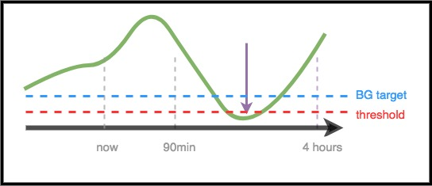

# Voor zorgprofessionals – Een algemene introductie en handleiding voor AndroidAPS

Deze pagina is bedoeld voor zorgprofessionals (zoals artsen en diabetesverpleegkundigen) die meer willen weten over 'open source' kunstmatige alvleesklier-technologie zoals AndroidAPS, of voor patiënten die informatie zoeken om te delen met hun arts/diabetesverpleegkundige.

We geven u achtergrondinformatie over doe-het-zelf closed loop systemen, en gaan wat dieper in op hoe AndroidAPS werkt. For more details on all of these topics, please view the [comprehensive AndroidAPS documentation online](../index.md). Als u vragen hebt, dan kunt u uw patiënt benaderen, of stel uw vraag aan één van de gebruikersgroepen. Als u niet actief bent op sociale media (bijv. [Twitter](https://twitter.com/kozakmilos) of Facebook), schroom dan niet om een email te sturen naar de ontwikkelaars: developers@AndroidAPS.org Verder kunt u [op deze website](https://openaps.org/outcomes/) een aantal van de laatste studies vinden & gegevens over de resultaten van closed loopen.

## The steps for building a DIY Closed Loop:

Om AndroidAPS te kunnen gebruiken, moet iemand de volgende dingen doen:

* Find a [compatible pump](../Hardware/pumps.md), a [compatible Android device](https://docs.google.com/spreadsheets/d/1gZAsN6f0gv6tkgy9EBsYl0BQNhna0RDqA9QGycAqCQc/edit?usp=sharing), and a [compatible CGM source](../Configuration/BG-Source.md).
* [Download de AndroidAPS broncode en bouw de app](../Installing-AndroidAPS/Building-APK.md).
* [Configure the software to talk to their diabetes devices and specify settings and safety preferences](../index.md#configuration).

## How A DIY Closed Loop Works

Mensen met diabetes die geen closed loop gebruiken, zullen informatie uit hun pomp en CGM gebruiken om te besluiten wat ze moeten doen, en vervolgens de bijbehorende actie ondernemen.

Het systeem doet eigenlijk hetzelfde: het verzamelt gegevens van de pomp, CGM, en waar dan ook informatie wordt ingevoerd (zoals Nightscout, een website waar gegevens 'in de cloud' worden opgeslagen). Deze informatie wordt gebruikt om berekeningen te doen en te bepalen hoeveel meer of juist minder insuline nodig is (ten opzichte van de normale basaalstanden). Het systeem gebruikt tijdelijke basaalstanden om de benodigde aanpassingen te maken, zodat de bloedglucosewaardes binnen de streefwaardes worden gehouden of gebracht.

Mocht de telefoon waarop AndroidAPS draait, stuk gaan of de verbinding met de pomp verliezen, dan zal de pomp terugvallen op de normale basaalstanden, zodra de op dat moment ingestelde tijdelijke basaalstand eindigt.

## How data is gathered:

De Android telefoon waar de AndroidAPS app op draait, heeft een Bluetooth verbinding met de pomp. AndroidAPS kan ook via Wifi of mobiele data communiceren met de cloud (denk aan Nightscout). Daarbij kan AndroidAPS zowel gegevens versturen als ontvangen, en op die manier kunnen bijvoorbeeld ouders van afstand monitoren wat AndroidAPS bij hun kind aan het doen is. Ook kunnen ze van afstand gegevens invoeren en daarmee de behandeling bijstellen.

De Android telefoon moet zowel met de pomp als de CGM verbonden zijn:

* om commando's naar de pomp te sturen, en ook om de pompgeschiedenis uit te lezen - om te weten hoeveel insuline is toegediend
* om gegevens te ontvangen van de CGM (rechtstreeks of via de cloud) - om te zien wat de bloedglucosewaardes doen

Wanneer deze gegevens zijn binnengekomen in de AndroidAPS app, zal het algoritme zijn berekeningen doen. De beslissingen die het algoritme neemt zijn gebaseerd op de instellingen van de gebruiker (insuline gevoeligheidsfactor, koolhydraat ratio, werkingsduur van insuline, bloedglucose streefdoel, etc.). 

De app krijgt ook informatie binnen vanaf de pomp, vanuit Nightscout en invoer van de gebruiker: over bolussen, gegeten koolhydraten en tijdelijke basaal aanpassingen. Die informatie wordt ook gebruikt om de benodigde hoeveelheid insuline te berekenen.

## How does it know what to do?

Het algoritme gebruikt dezelfde 'diabeteswiskunde' die mensen met diabetes bij traditionele therapie zelf zouden doen - maar dan veel vaker op een dag. Het algoritme berekent met alle verzamelde informatie een voorspelling van de bloedglucosewaardes voor de komende uren, waarbij hij verschillende scenario's gebruikt. Vervolgens berekent hij welke aanpassing er nodig is om de glucosewaardes binnen de streefwaardes te brengen of te houden. Dan stuurt hij commando's naar de pomp om die aanpassingen te maken. Het algoritme leest de gegevens weer uit, en doet dit hele proces dan steeds opnieuw.

Aangezien de bloedglucosewaardes de belangrijkste input zijn in dit proces, is het cruciaal dat de CGM betrouwbare gegevens levert. Voor de veiligheid zal het algoritme ook nooit een beslissing nemen op basis van één enkele waarde.

AndroidAPS is zo ontworpen dat alle ingevoerde gegevens, en de daaruit volgende aanpassingen en acties zichtbaar zijn voor de gebruiker. Zodat je het antwoord op de vraag: “Waarom doet het algoritme dit?” op elk moment kunt vinden door de logs te bekijken.

## Examples of AndroidAPS algorithm decision making:

Het algoritme dat oorspronkelijk is gemaakt voor OpenAPS (een doe-het-zef systeem dat draait op een minicomputer), wordt ook gebruikt door AndroidAPS. De functies die AndroidAPS heeft, komen grotendeels overeen met OpenAPS. Onderstaande voorbeelden zijn dan ook overgenomen uit de OpenAPS documentatie. Het algoritme maakt voorspellingen voor meerdere scenario's (zoals hierboven beschreven). Deze worden in Nightscout weergegeven als paarse lijnen in de toekomst. AndroidAPS uses different colors to separate these [prediction lines](../Installing-AndroidAPS/Releasenotes.md#overview-tab). In de logs is terug te vinden welke voorspelling en welk tijdsbestek heeft geleid tot een actie van het algoritme.

### Here are examples of the purple prediction lines, and how they might differ:

### Here are examples of different time frames that influence the needed adjustments to insulin delivery:

### Scenario 1 - Zero Temp for safety

In dit voorbeeld stijgt de bloedglucose op de korte termijn, maar er wordt een lage bloedglucose voorspeld voor de lange termijn. Er wordt voorspeld dat de glucosewaarde onder het streefdoel ('BG target') zal uitkomen *en* onder de veiligheidsdrempel ('threshold'). Om de lage glucosewaarde te voorkomen zal AndroidAPS een tijdelijke basaalstand van nul instellen totdat de voorspelde bloedglucose (zowel op korte als lange termijn) boven de veiligheidsdrempel ligt.

### Scenario 2 - Zero temp for safety

In dit voorbeeld wordt voorspeld dat de bloedglucose op korte termijn zal dalen, maar uiteindelijk boven het streefdoel zal liggen. Maar omdat de voorspelde bloedglucose op korte termijn onder de veiligheidsdrempel ligt, zal AndroidAPS ook hier een tijdelijke basaalstand van nul instellen, net zo lang tot geen enkel deel van de voorspellingslijn nog onder de veiligheidsdrempel komt.

### Scenario 3 - More insulin needed

In dit voorbeeld wordt op korte termijn een daling van de bloedglucose voorspeld waarbij hij onder het streefdoel komt. De voorspelling is dat de bloedglucose echter niet onder de veiligheidsdrempel komt. De uiteindelijke glucosewaarde ligt boven het streefdoel. Daarom zal AndroidAPS nu geen extra insuline geven, omdat dat ervoor zal zorgen dat de bloedglucose op de korte termijn nog lager wordt (en onder de veiligheidsdrempel zou komen). Vervolgens zal hij met het verstrijken van de tijd, kijken of het al veilig is om extra insuline te geven zodat de bloedglucose op de lange termijn lager (en dus dichter bij het streefdoel) uitkomt. *Afhankelijk van de gebruikersinstellingen en van de hoeveelheid en het tijdstip waarop extra insuline nodig is, wordt de insuline toegediend dmv een tijdelijke basaalstand of SMB's (super micro bolussen).*

### Scenario 4 - Low temping for safety

In dit voorbeeld ziet AndroidAPS dat de bloedglucose veel hoger is dan het streefdoel. Tegelijkertijd wordt er voorspeld dat er al voldoende insuline in het lichaam aanwezig is om de bloedglucose te laten zakken. De voorspellingslijn geeft aan dat de glucosewaarde uiteindelijk zelfs onder het streefdoel zal uitkomen. Daarom zal AndroidAPS geen extra insuline geven, om te voorkomen dat de bloedglucose op lange termijn te laag wordt. Er zal waarschijnlijk een lage tijdelijke basaalstand worden ingesteld (ook al is de bloedglucose op dit moment hoog).

## Optimizing settings and making changes

Als arts of diabetesverpleegkundige heeft u wellicht niet veel ervaring met AndroidAPS of met andere doe-het-zelf closed loop systemen, waardoor het op het eerste gezicht lastig kan lijken om advies te geven over het aanpassen van instellingen. Gelukkig zijn er meerdere tools en [handleidingen](https://openaps.readthedocs.io/en/latest/docs/Customize-Iterate/optimize-your-settings.html) online te vinden die patiënten helpen om kleine, stapsgewijze aanpassingen te maken aan hun instellingen en zo hun uitkomsten te optimaliseren.

Voor patiënten is het belangrijk om één verandering tegelijk te maken, en gedurende 2-3 dagen het effect ervan te bekijken voordat een er andere instelling wordt aangepast (tenzij het natuurlijk overduidelijk is dat de verandering een verslechtering is, in dat geval verander je de instelling weer terug). Een hele menselijke neiging is om aan alle knoppen tegelijk te willen draaien, maar wie dat doet kan eindigen met verdere sub-optimale instellingen, en dan is het soms lastig om de eerdere goede instellingen weer terug te vinden.

Eén van de krachtigste hulpmiddelen bij het aanpassen van instellingen is een geautomatiseerd rekeninstrument voor bepaalde parameters: basaalstanden, insuline gevoeligheidsfactor en koolhydraat ratio. Dit heet "[Autotune](https://openaps.readthedocs.io/en/latest/docs/Customize-Iterate/autotune.html)". Het is ontworpen om handmatig te worden uitgevoerd, en de resultaten ervan kunnen een leidraad zijn bij het aanpassen van de instellingen. Autotune wordt vaak gedraaid (en bekeken) voordat iemands instellingen worden aangepast. AndroidAPS gebruikers moeten Autotune steeds handmatig draaien, als een eenmalige berekening. Er wordt nog aan gewerkt om Autotune in AndroidAPS te integreren. As these parameters are a prerequisite both for standard pump insulin delivery and for closed loop insulin delivery, discussion of the autotune results and adustment of these parameters would be the natural link to the clinician.

Patiënten die een doe-het-zelf closed loop gaan gebruiken (na jaren van traditionele pen- of pomptherapie), zijn vaak nog geneigd om uit gewoonte te handelen. Als er bijvoorbeeld een lage bloedglucose wordt voorspeld, dan zal AndroidAPS al minder insuline beginnen te geven wanneer die daling wordt opgemerkt. Daardoor is er slechts een kleine hoeveelheid koolhydraten (bijvoorbeeld 3-4 gram) nodig om de bloedglucose weer te doen stijgen vanaf 70 mg/dl (3,9 mmol/l). Iemand zou in zo'n geval kunnen kiezen om een stuk meer koolhydraten te eten (bijvoorbeeld de regel van 15 gram bij een hypo), met als resultaat een snellere piek doordat er relatief veel koolhydraten worden gegeten terwijl er op dat moment weinig insuline in het lichaam is. Het durven terugbrengen van de hoeveelheid koolhydraten (gedragsverandering) levert in dit geval betere waardes op.

## OpenAPS

**Deze tekst is een annpassing van [The clinician's guide to OpenAPS](https://openaps.readthedocs.io/en/latest/docs/Resources/clinician-guide-to-OpenAPS.html) (De OpenAPS gids voor zorgprofessionals).** OpenAPS is een systeem dat draait op een klein programmeerbaar minicomputertje (ook bekend als "rig"). OpenAPS bestond al eerder, en AndroidAPS is gebaseerd op de software van OpenAPS. Daarom is de tekst over AndroidAPS vrijwel hetzelfde als de oorspronkelijke tekst over OpenAPS. Beide systemen bestaan nu naast elkaar en worden wereldwijd door patiënten gebruikt. AndroidAPS gebruikt veel van de techniek die in OpenAPS wordt gebruikt, en heeft grotendeels dezelfde logica en algoritmen. Het grootste verschil tussen de twee is de hardware: OpenAPS draait op een minicomputertje dat in een broekzak past, terwijl AndroidAPS op een Android telefoon draait.

## Summary

We hebben geprobeerd om een overzicht te geven van de werking van AndroidAPS. Er is natuurlijk een stuk meer over te vertellen. Vraag uw patiënt naar meer details, wordt lid van één van de Facebook groepen of lees de volledige AndroidAPS documentatie hier online.

Aanvullende aanbevolen informatie:

* De [volledige AndroidAPS documentatie](../index)
* Het [OpenAPS Reference Design](https://OpenAPS.org/reference-design/), hierin wordt uitgelegd hoe OpenAPS is ontworpen rondom veiligheid
* De [volledige OpenAPS documentatie](https://openaps.readthedocs.io/en/latest/index.html) 
  * Meer [details over OpenAPS berekeningen](https://openaps.readthedocs.io/en/latest/docs/While%20You%20Wait%20For%20Gear/Understand-determine-basal.html#understanding-the-determine-basal-logic)