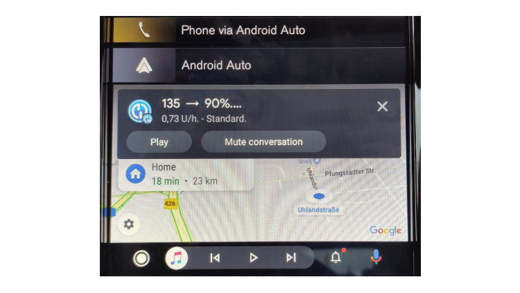

# Android Auto

(Android-auto-androidaps-settings-for-android-auto)=

## AndroidAPS instellingen voor Android Auto

Use system notifications for alerts and notifications:

* Open 3-dot-menu on top right of home screen and selecting **Preferences** ➜ **Local Alerts** ➜ and activating **Use system notifications for alerts and notifications** 

(Android-auto-androidaps-settings-in-android-auto-app-on-your-phone)=

## Instellingen in Android Auto app op jouw telefoon

As AAPS is no official Android Auto app notifications have to be activated in Android Auto.

* Open de Android Auto app op je telefoon.
* Tik op hamburger menu
* Selecteer instellingen
* Scroll helemaal naar beneden naar de onderkant van de lijst en tik 10 keer op versie nummer totdat bericht "Developer mode enabled" wordt weergegeven.

* Klik op 3 puntjes in rechterbovenhoek
* Selecteer "Ontwikkelaars instellingen"
* Scroll naar beneden helemaal naar de onderkant van de lijst en activeer "Onbekende bronnen"

* Now you can quit developer mode if you want. Klik hiervoor op de 3 menupuntjes rechtsboven.

## Toon meldingen in jouw auto

* Tik op het bel pictogram op de onderste menubalk in Android Auto in jouw auto

* CGM-waarden worden als volgt weergegeven:

## Problemen oplossen:

* If you don't see the notification, check if you [allowed AAPS to show notifications](Android-auto-androidaps-settings-for-android-auto) in Android and if [Android Auto has access rights to notifications](Android-auto-androidaps-settings-in-android-auto-app-on-your-phone).