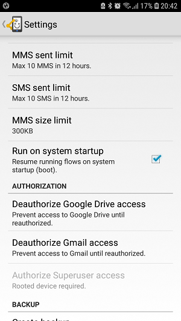
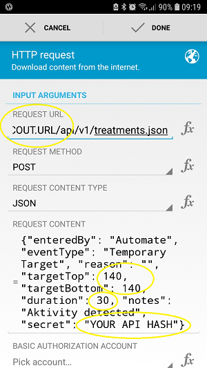
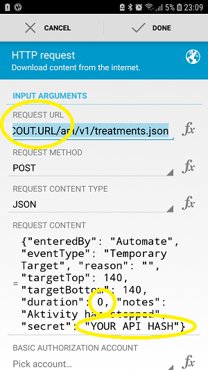

# Automatisering met Android Automate app

**Dit artikel is geschreven voordat AndroidAPS versie 2.5 uitkwam. Er is vanaf AAPS versie 2.5 een functie voor [automatisering in AndroidAPS](./Automation.rst) zelf ingebouwd. Voor sommigen is automatisering via de Automate app misschien nog handig, je kunt er hier alles over lezen. Gebruik van de Automate app wordt alleen aangeraden voor gevorderde AndroidAPS gebruikers.**

Aangezien AndroidAPS een hybride closed loop systeem is, is gebruikersinteractie soms noodzakelijk (bijv. de loop vertellen dat je gaat wandelen, dat je binnenkort eet, je op de bank ligt...). Allerlei handmatige invoer die je frequent doet, zou je kunnen automatiseren. Dit gaat via externe tools zoals Automate of IFTTT, als aanvulling op de AndroidAPS-functies.

## Android Automate App

De gratis Android™ app Automate kan allerlei taken op jouw smartphone automatiseren. Je kunt automatische acties aanmaken met flowcharts, bijvoorbeeld om je telefooninstellingen (zoals NFC, Bluetooth, Wi-Fi) te wijzigen, of acties uit te voeren zoals het verzenden van SMS, e-mail, gebaseerd op jouw locatie, het tijdstip van de dag of andere eventuele "event triggers". Automate heeft ook plug-ins gemaakt, zodat hij kan samenwerken met andere apps zoals Tasker en Locale.

Met behulp van deze tool kun je workflows aanmaken voor automatische behandel-acties voor jouw diabetes. Dat doe je op basis van meerdere voorwaarden volgens het principe 'als dit... en dit... niet dit..., doe dan dat... en dat...'. Er zijn duizenden mogelijkheden die je op deze manier kunt samenstellen.

Tot nu toe is het **nodig om te loopen via een Nightscout profiel**, omdat Automate alle acties uitvoert via een HTTP-verzoek dat rechtstreeks naar jouw Nightscout website gaat. De info in jouw Nightscout website wordt vervolgens gesynchroniseerd met jouw AndroidAPS app.

**Offline loopen (directe communicatie tussen Automate en AnroidAPS app) is nog niet ingeprogrammeerd**, maar is technisch gezien wel mogelijk. Misschien zal er in de toekomst een oplossing komen. Als je een manier hebt gevonden om dit te doen, voeg het dan toe aan deze documentatie of neem contact op met een ontwikkelaar.

### Wat heb je nodig:

#### Automate app

Download Android automatiseren in de Google Play Store of op <https://llamalab.com/automate/> en installeer het op de smartphone waar AndroidAPS op staat.

Tik in Automate op het hamburger menu aan de linkerbovenhoek van het scherm > Instellingen > Check 'Run on system startup'. Dit zal automatisch jouw workflows uitvoeren bij het opstarten van het systeem.

#### AndroidAPS

In AndroidAPS Instellingen, ga naar NSClient en kies Verbindingsinstellingen. Zorg dat 'Gebruik enkel de WiFi verbinding' en 'Enkel tijdens opladen' uit staan. Jouw automatische ingestelde behandelings-acties zullen alleen werken zolang AndroidAPS een verbinding heeft met Nightscout.

In AndroidAPS Instellingen, ga naar NSClient en kies Geavanceerde Instellingen. Zorg ervoor dat 'Alleen NS upload (sync. gedeactiveerd)' en 'Geen upload naar NS' uit staan.

Wees je bewust van eventuele [beveiligingsproblemen](../Installing-AndroidAPS/Nightscout#security-considerations) die zich zouden kunnen voordoen en wees voorzichtig als je een [Insight pomp](../Configuration/Accu-Chek-Insight-Pump#settings-in-aaps) gebruikt.

### Voorbeelden van workflows

#### Voorbeeld 1: Als activiteit (bijv. wandelen of hardlopen) wordt gedetecteerd, stel dan een hoog tijdelijk streefdoel (Temporary Target, TT) in. En als de activiteit eindigt, wacht dan 20 minuten en annuleer het TT.

Deze workflow zal gegevens gebruiken van je smartphone-sensoren (stappenteller, zwaartekracht sensor...) die jouw fysieke activiteit detecteren. Als er activiteit is zoals wandelen, hardlopen of fietsen wordt waargenomen, dan zal Automate een door jou ingesteld hoog tijdelijk streefdoel instellen gedurende de door jou opgegeven tijd. Wanneer de activiteit eindigt zal je smartphone dit detecteren, vervolgens 20 minuten wachten en zal dan het streefdoel terugzetten naar de normale waarde zoals in jouw profiel is aangegeven.

Download het Automate script <https://llamalab.com/automate/community/flows/27808>.

Bewerk de Flow door te tikken op het potlood-icoon > Flowchart

Je kunt de workflow aanpassen naar jouw wensen:

1. = Stel hoog tijdelijk streefdoel in (Temp Target, TT)
2. = Ga terug naar normale streefdoel 20 minuten na het einde van de activiteit

1 

2 

Request URL (URL voor aanvraag): Jouw Nightscout-URL eindigend met /api/v1/treatments.json (bijv. https://my-cgm.herokuapp.com/api/v1/treatments.json)

Request content (Inhoud opvragen):

* targetTop / targetBottom: de waarde waarop jij het tijdelijke hoge streefdoel wilt zetten. Bij targetTop (bovengrens) en targetBottom (ondergrens) moet je hetzelfde getal invullen.
* duration: De duur van het tijdelijk hoge streefdoel (nadat deze tijd is verstreken, zal het streefdoel weer terugvallen op het reguliere profiel tenzij de activiteit doorgaat). 
* secret: Jouw API SHA1 hash. Dit is NIET jouw api sleutel! Je kunt jouw API-sleutel converteren naar SHA1 formaat op <http://www.sha1-online.com/>

Opslaan: Tik op 'Done'

Start met Flow: Tik op de Play knop

#### Voorbeeld 2: Als xDrip+ een hoog BG alarm geeft, stel dan een laag tijdelijk streefdoel (Temporary Target, TT) in gedurende... minuten.

Deze workflow zal het xDrip+ notificatie kanaal op jouw telefoon in de gaten houden. Wanneer er een (eerder door jouzelf opgegeven) hoog BG alarm wordt afgegeven in xDrip+, dan zal Automate een door jou opgegeven laag tijdelijk streefdoel instellen voor de door jou opgegeven tijd. Zodra die tijd is verstreken, zou het laag tijdelijk streefdoel nog kunnen worden verlengd wanneer er een ander xDrip+ alarm is geweest.

##### xDrip+

Stap één: maak het alarm voor een hoge BG in xDrip+ aan. Dat gaat als volgt:

Alert name: (let op!) Deze naam is heb je nodig bij het laten ontstaan van de trigger. De naam moet eenduidig zijn en mag niet lijken op namen van andere alarmen. Voorbeeld: '180alarm' mag niet bestaan naast '80alarm'.

Threshold (drempel): de BG waarde die het hoge BG alarm doet afgaan.

Default Snooze (standaard snooze): Vul hier in hoe lang je wilt dat het tijdelijke streefdoel duurt, aangezien het alarm opnieuw kan afgaan en daardoor de duur van het tijdelijk lage streefdoel zal verlengen.

##### Automate

Stap twee: download het Automate script <https://llamalab.com/automate/community/flows/27809>.

Bewerk de Flow door te tikken op het potlood-icoon > Flowchart

Je kunt de workflow aanpassen naar jouw wensen:

Binnen de trigger 'Notification posted?' (notificatie gestuurd?) moet je bij 'TITLE' de naam invullen van jouw xDrip+ alarm. Voeg een * variabele toe voor en na de naam.

Request URL (URL voor aanvraag): Jouw Nightscout-URL eindigend met /api/v1/treatments.json (bijv. https://my-cgm.herokuapp.com/api/v1/treatments.json)

Request content (Inhoud opvragen):

* targetTop / targetBottom: de waarde waarop jij het tijdelijke hoge streefdoel wilt zetten. Bij targetTop (bovengrens) en targetBottom (ondergrens) moet je hetzelfde getal invullen.
* duration: De duur van het tijdelijk hoge streefdoel (nadat deze tijd is verstreken, zal het streefdoel weer terugvallen op het reguliere profiel). Het wordt aanbevolen om dezelfde duur te gebruiken als je zonet hebt ingevuld bij 'Standaard snooze' van jouw xDrip+ alarm.
* secret: Jouw API SHA1 hash. Dit is NIET jouw api sleutel! Je kunt jouw API-sleutel converteren naar SHA1 formaat op <http://www.sha1-online.com/>

Opslaan: Tik op 'Done'

Start met Flow: Tik op de Play knop

#### Voorbeeld 3: Die mag je zelf maken én hier toevoegen!!!

Voeg jouw eigen workflows toe door het uploaden van het .flo bestand naar de Automate community (gebruik als keyword 'Nightscout'). Voeg een beschrijving van jouw eigen workflow toe aan deze pagina door een [Pull Request in de AndroidAPSdocs repository](../make-a-PR.md) te doen.

## If This, Then That (IFTTT) oftwel Als Dit, Dan Dat

Je kunt ook IFTT gebruiken in plaats van Automate om allerlei handmatige invoer in AndroidAPS te automatiseren. Wanneer je weet hoe IFTTT werkt, en je wilt dit delen met anderen dan ben je van harte uitgenodigd om een uitleg hierover toe te voegen aan deze pagina via een Pull Request!