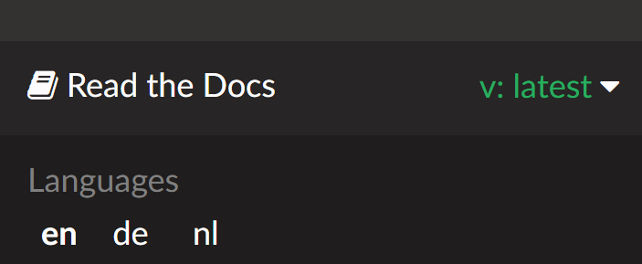

Taal aanpassen
**************************************************

.. note::
   De taalselectie is verplaatst naar de onderkant van het linkermenu. Klik op de onderste balk om het taalselectiemenu te openen.

Of klik op een van de volgende talen:

* `Engels <https://androidaps.readthedocs.io/en/latest/>`_
* `Tsjechisch <https://androidaps.readthedocs.io/cs/latest/>`_
* `Nederlands <https://androidaps.readthedocs.io/nl/latest/>`_
* `Duits <https://androidaps.readthedocs.io/de/latest/>`_
* `Grieks <https://androidaps.readthedocs.io/el/latest/>`_
* `Koreaans <https://androidaps.readthedocs.io/ko/latest/>`_
* `Litouws <https://androidaps.readthedocs.io/lt/latest/>`_
* `Russisch <https://androidaps.readthedocs.io/ru/latest/>`_
* `Spaans <https://androidaps.readthedocs.io/es/latest/>`_
