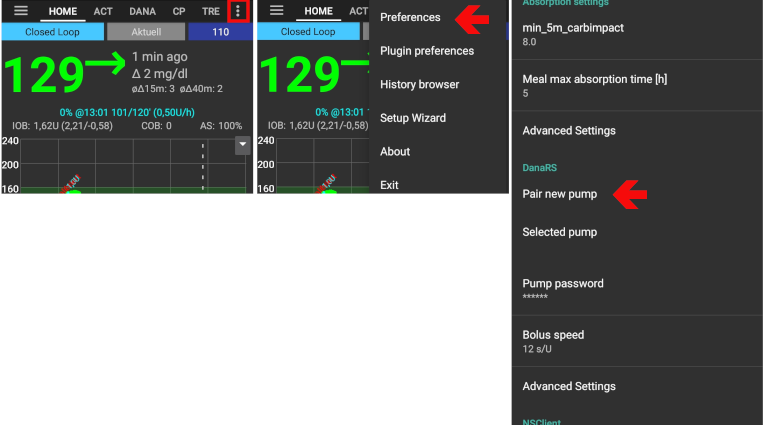

# Pompa Dana RS

*Te instrukcje dotyczą konfiguracji aplikacji i pompy, jeśli masz DanaRS wyprodukowaną po 2017 roku. Odwiedź [ Pompa insulinowa DanaR ](./DanaR-Insulin-Pump), jeśli zamiast niej masz oryginalną pompę DanaR.*

**New Dana RS firmware v3 can be used from AndroidAPS version 2.7 onwards.**

* W pompie DanaRS jest używana baza „BASAL A”. Istniejące dane zostaną zastąpione.

* W AndroidAPS przejdź do zakładki Konfiguracja > Pompa i wybierz „DanaRS”

* Wybierz Menu, dotykając 3 kropki w prawym górnym rogu. Wybierz Ustawienia

* Wybierz DanaRS sparuj nową pompę i kliknij swój numer seryjny DanaRS.
  
  

* Select Pump password and input your password.
  
  * For DanaRS with firmware v1 and v2 the default password is 1234.
  * For DanaRS with firmware v3 the default password is a combination of production month and production date (i.e. month 01 and day 24). ==> On your pump open main menu -> review -> information. No. 3 is production date.

* **You have to confirm the pairing on the pump!** That's just the way you are used to from other bluetooth pairings (i.e. smartphone and car audio).
  
  

* Select Bolus Speed to change the default bolus speed used (12sec per 1u, 30sec per 1u or 60sec per 1u).

* Restart your phone.

* Set basal step on pump to 0.01 U/h using Doctors menu (see pump user guide)

* Enable extended boluses on pump

## Dana RS znane problemy

### Błąd podczas podawania insuliny

In case the connection between AAPS and Dana RS is lost during bolus insulin delivery (i.e. you walk away from phone while Dana RS is pumping insulin) you will see the following message and hear an alarm sound.

* In most cases this is just a communication issue and the correct amount of insulin is delivered.
* Check in pump history (either on the pump or through Dana tab > pump history > boluses) if correct bolus is given.
* Delete error entry in [treatments tab](..Getting-Started/Screenshots#carb-correction) if you wish.
* Real amount is read and recorded on next connect. To force this press BT icon on dana tab or just wait for next connect.

## Dodatkowe informacje związane z wymianą telefonu

When switching to a new phone the following steps are neccessary:

* ** Eksportuj ustawienia ** na starym telefonie
  
  * Menu "hamburger" (trzy poziome kreski w lewym górnym narożniku ekranu)
  * Konserwacja
  * Eksport ustawień
    
    

* **Przenieś** ustawienia ze starego telefonu na nowy, korzystając z lokalizacji pliku wyświetlonej podczas eksportu

* **Ręcznie sparuj** Dana RS z nowym telefonem 
  * Ponieważ importowane są także ustawienia połączenia pompy, AAPS na twoim nowym telefonie będzie już "znał" pompę i dlatego nie rozpocznie skanowania bluetooth. Dlatego nowy telefon i pompa muszą być sparowane ręcznie.
* **Zainstaluj AndroidAPS** na nowym telefonie.
* **Zaimportuj ustawienia** na nowym telefonie 
  * Menu "hamburger" (trzy poziome kreski w lewym górnym narożniku ekranu)
  * Konserwacja
  * Zaimportuj ustawienia

## Strefy czasowe, podróżowanie z pompą Dana RS

For information on traveling accross time zones see section [Timezone traveling with pumps](../Usage/Timezone-traveling#danarv2-danars).