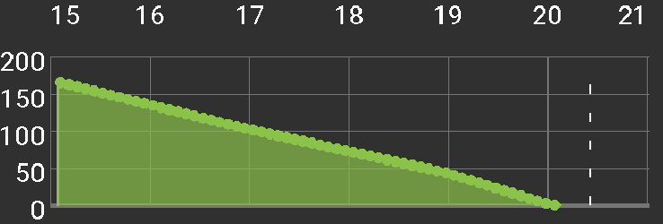

# Detekcja wrażliwości (sensitivity)

## Algorytmy detekcji wrażliwości na insulinę

Obecnie istnieje możliwość wyboru jednego z czterech modeli detekcji zmian wrażliwości na insulinę:

* Wrażliwość Oref0
* Wrażliwość AAPS
* Wrażliwość Średnia ważona
* Wrażliwość Oref1

### Wrażliwość Oref0

Co do zasady, wrażliwość jest obliczana na podstawie danych z ostatnich 24 godzin, przy czym węglowodany, które nie zostały wchłonięte przez okres ustalony w ustawieniach, są "ucinane" tj. nie są dalej brane pod uwagę. Ten algorytm jest podobny do algorytmu OpenAPS Oref0, opisanego w [dokumentacji OpenAPS Oref0](https://openaps.readthedocs.io/en/2017-05-21/docs/walkthrough/phase-4/advanced-features.html).

### Wrażliwość AAPS

Wrażliwość jest obliczana w taki sam sposób, jak algorytm Oref0, ale dodatkowo możliwe jest ustalenie okresu z którego następuje kalkulacja. Minimalna absorpcja węglowodanów jest obliczana na podstawie wskaźnika - maksymalnego czasu absorpcji węglowodanów (max carbs absorption time) określonego w ustawieniach

### Wrażliwość Średnia ważona

Wrażliwość jest obliczana jako średnia ważona odchyleń. Nowsze odchylenia mają wyższą wagę. Minimalna absorpcja węglowodanów jest obliczana na podstawie wskaźnika - maksymalnego czasu absorpcji węglowodanów (max carbs absorption time) określonego w ustawieniach. Algorytm ten jest najszybciej wykrywa zmiany wrażliwości.

### Wrażliwość Oref1

Wrażliwość jest obliczana na podstawie danych zebrany z ostatnich 8 godzin lub od chwili zmiany miejsca wkłucia (jeśli taka zmiana została dokonana w ostatnich 8 godzinach). Węglowodany, które nie zostały wchłonięte przez okres ustalony w ustawieniach, są "ucinane" tj. nie są dalej brane pod uwagę. Oref1 jest jedynym algorytmem, który współpracuje z metodą detekcji i reakcji na niezgłoszone posiłki (UAM) [Un-announced meal]. Współpraca ta polega na tym, iż momenty wykrycia niezgłoszonych posiłków (UAM) wyłączane są z obliczeń wrażliwości. Jeśli więc używasz SMB (super-mikro bolusów) z metodą detekcji UAM, do poprawnego funkcjonowania konieczne jest stosowanie algorytmu Oref1. Aby uzyskać więcej informacji przeczytaj [dokumentację OpenAPS Oref1](https://openaps.readthedocs.io/en/latest/docs/Customize-Iterate/autosens.html).

## Równoczesne węglowodany

Należy podkreślić, iż pomiędzy modelami wykrywania wrażliwości - AAPS, Średnią ważoną a Oref0 i Oref1 istnieją zasadnicze różnice. Oref plugins expects only one meal decaying at time. It means 2nd meal starts decaying after 1st meal is completely decayed. Algorytm AAPS oraz Średnio ważona zaczynają przyjmować wchłanianie posiłku niezwłocznie po tym, kiedy wpiszesz węglowodany do aplikacji. Jeśli w organizmie znajduje się więcej niż jeden posiłek, minimalne wchłanianie węglowodanów dostosowuje się do wielkości posiłku i maksymalnego czasu wchłaniania (carbs max absorption time). Minimalna absorpcja będzie odpowiednio wyższa w porównaniu do algorytmów Oref.

## Przykłady wchłaniania aktywnych węglowodanów (COB)

Oref0 / Oref1 - unabsorbed carbs are cut off after specified time

AAPS, WeightedAverage - absorption is calculated to have `COB == 0` after specified time

If minimal carbs absorption is used instead of value calculated from deviations, a green dot appears on COB graph