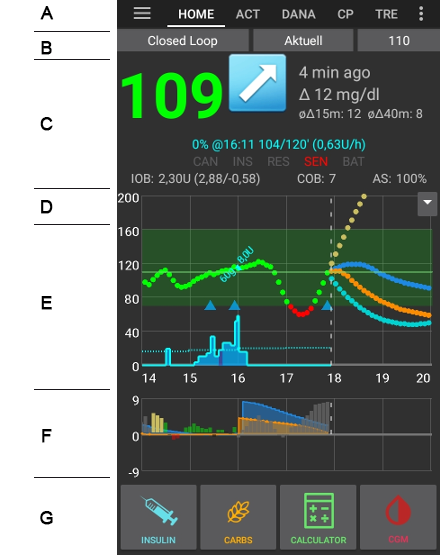

# Zrzuty ekranów

## Ekran główny

To jest pierwszy ekran, który zobaczysz po uruchomieniu AndroidAPS, zawiera on większość informacji, których będziesz codziennie potrzebować

** Sekcja A: ** umożliwia nawigację pomiędzy różnymi modułami AndroidAPS, przesuwając palcem w lewo lub w prawo.

** Sekcja B: ** Umożliwia zmianę statusu pętli (otwarta pętla, zamknięta pętla, pętla zawieszona, itp.), Podgląd bieżącego profilu, Podgląd bieżącego docelowego poziomu glikemii oraz ustawianie tymczasowego celu. Naciśnij dłużej dowolny przycisk, aby zmienić ustawienie. Np. Naciśnij ciemnoniebieski pasek celu w prawym górnym rogu ("5,5" na zrzucie ekranu), aby ustawić cel tymczasowy.

** Sekcja C: ** Najnowszy odczyt stężenia glukozy we krwi z CGM, jak dawno został odczytany, zmiana w ciągu ostatnich 15 i 40 minut, aktualna dawka bazowa - w tym dowolna tymczasowa dawka bazowa (TBR) zaprogramowana przez system, twoja insulina w organizmie (IOB) i węglowodany w organizmie (COB).

Opcjonalne [ kontrolki statusu ](../Configuration/Preferences.md) (CAN | INS | RES | SEN | BAT) dają wizualne ostrzeżenie o niskim poziomie zbiornika i akumulatora, a także o zaległej zmianie insuliny, kaniuli, sensora.

Ilość insuliny na pokładzie wynosiłaby zero, gdyby działała tylko twója standardowa baza i nie było insuliny z poprzednich bolusów. Liczby w nawiasach pokazują, ile składa się z insuliny pozostałej z poprzednich bolusów i ile insuliny pochodzi z dawki podstawowej i jej zmienności z powodu poprzednich TBR zaprogramowanych przez AAPS. Ten drugi składnik może być ujemny, jeśli ostatnio miały miejsce okresy obniżonej wartości dawki podstawowej (bazy).

** Sekcja D: ** Kliknij strzałkę po prawej stronie ekranu w sekcji D, aby wybrać informacje wyświetlane na poniższych wykresach.

** Sekcja E: ** Wykres przedstawiający stężenie glukozy we krwi (BG) wartości odczytane z monitora glukozy (CGM) pokazuje również powiadomienia Nightscout, takie jak kalibracje z "palca" i wpisy węglowodanów. Długie naciśnięcie na wykresie powoduje zmianę skali czasu. Możesz wybrać 6, 8, 12, 18 lub 24 godziny.

Rozszerzone linie pokazują przewidywane obliczenia BG i trendy - jeśli zostały wybrane.

* Orange line: COB (colour is used generally to represent COB and carbs)
* Dark blue line: IOB (colour is used generally to represent IOB and insulin)
* Light blue line: zero-temp
* Dark yellow line: UAM

Te linie pokazują różne przewidywania na podstawie aktualnej absorpcji węglowodanów (COB); tylko insuliny (IOB); pokazują, jak długo zajmie BG, aby wyrównać do/powyżej celu, jeśli odchylenia nagle ustaną, a do tego czasu mamy zerową bazę (zero-temp) i niezapowiedzianą detekcję posiłku, gdzie węglowodany są wykrywane, ale nie zostały wprowadzone do systemu przez użytkownika (UAM).

Stała niebieska linia pokazuje podstawową dawkę bazową dostarczaną przez Twoją pompę. Kropkowana niebieska linia pokazuje dawkę podstawową, jeśli nie byłoby tymczasowych zmian dawki bazowej (TBR), a stała niebieska linia jest rzeczywistą dostarczaną wartością w czasie.

** Sekcja F: ** jest także konfigurowalna za pomocą opcji w sekcji D. W tym przykładzie pokazujemy IoB (Insulina w organizmie) - jeśli nie było TBR i nie było żadnych bolusów, to wynosiłaby zero, czułość i odchylenie. SZARE paski pokazują odchylenie z powodu węglowodanów, ZIELONE, że BG jest wyższe niż algorytm oczekuje a CZERWONE, że jest niższe niż algorytm oczekuje.

** Sekcja G: ** umożliwia podawanie bolusa (zwykle do tego celu służy przycisk Kalkulator) i dodanie kalibracji CGM na podstawie pomiaru z palca.

## Kalkulator

Kalkulator jest narzędziem, za pomocą którego zazwyczaj będziesz podawać bolusy.

** Sekcja A: ** to miejsce, gdzie podajesz informacje o bolusie, który podajesz. Pole BG jest zwykle wypełnione najnowszym odczytem z CGM. Jeśli nie masz działającego CGM to miejsce będzie puste. W polu węglowodanów należy dodać oszacowaną ilości węglowodanów - lub równoważną - na jaką chcesz podać bolusa. Pole CORR jest po to, abyś mógł z jakiegoś powodu zmodyfikować dawkę końcową, a pole CARB TIME służy do wstępnego podawania bolusa, dzięki niemu możesz powiedzieć systemowi, że wystąpi opóźnienie, zanim będzie można oczekiwać węglowodanów, lub że bolus będzie opóźniony. Możesz umieścić ujemną liczbę w tym polu, jeśli podajesz bolusa dla wcześniej zjedzonych węglowodanów.

SUPER BOLUS polega na tym, że dawka insuliny bazowej jak byłaby podana przez następne dwie godziny jest dodawana do aktualnego bolusa, a zero TBR jest podawane przez następne dwie godziny. Dzieje się to w celu podania dodatkowej insuliny. Pomysł polega na szybszym dostarczaniu insuliny i, miejmy nadzieję, zmniejszeniu wybicia.

** Sekcja B: ** pokazuje obliczoną dawkę bolusa. Jeśli ilość insuliny w organizmie przekracza już obliczoną dawkę, to wartość ta pokaże ilość wciąż potrzebnych węglowodanów.

** Sekcja C: ** pokazuje różne składowe, które zostały użyte do obliczenia bolusa. Możesz odznaczyć te pola, których nie chcesz uwzględnić w obliczeniach, jednak normalnie nie powinieneś tego robić.

<b>Kombinacje COB i IOB i co one oznaczają</b>

<ul>
    <li>If you tick COB and IOB unabsorbed carbs that are not already covered with insulin + all insulin that has been delivered as TBR or SMB will be taken into account</li>
    <li>If you tick COB without IOB you run the risk of too much insulin as AAPS is not accounting for what’s already given. </li>
    <li>If you tick IOB without COB, AAPS takes account of already delivered insulin but won’t cover that off against any carbs still to be absorbed. This leads to a 'missing carbs' notice.
</ul>

Jeśli po bolusie na posiłek pojawi się dodatkowy pokarm (np. dodatkowy deser), pomocne może być odznaczenie wszystkich pól. W ten sposób dodawane są tylko nowe węglowodany, ponieważ główny posiłek niekoniecznie zostanie wchłonięty, więc IOB nie będzie dokładnie pasował do COB wkrótce po bolusie posiłkowym.

## Profil insuliny

Pokazuje profil aktywności insuliny, którą wybrałeś. Linia FIOLETOWA pokazuje ile insuliny pozostaje po wstrzyknięciu, ponieważ z czasem insulina się rozkłada, a linia NIEBIESKA pokazuje aktywność insuliny.

Zwykle używasz jednego z profili Oref - ważne jest, aby pamiętać, że rozkład insuliny ma długi "ogon". Jeśli używałeś wcześniej pompy tradycyjnie to, prawdopodobnie przywykłeś do założenia, że insulina rozpada się przez około 3,5 godziny. Jednakże, w przypadku pętli ten długi "ogon" ma znaczenie a obliczenia są znacznie dokładniejsze, te małe ilości sumują się, gdy są poddawane rekursywnym obliczeniom w algorytmie AndroidAPS.

Aby uzyskać więcej szczegółów na temat różnych rodzajów insuliny, ich profili aktywności i wyjaśnienia dlaczego wszystko to ma znaczenie, możesz przeczytać artykuł na ten temat tutaj [ Zrozumienie nowych krzywych IOB na podstawie krzywych aktywności wykładniczej ](https://openaps.readthedocs.io/en/latest/docs/While%20You%20Wait%20For%20Gear/understanding-insulin-on-board-calculations.html#understanding-the-new-iob-curves-based-on-exponential-activity-curves)

Możesz przeczytać również świetny artykuł na ten temat na blogu: [Dlaczego regularnie mylimy się z czasem działania insuliny (DIA) i dlaczego to ma znaczenie...](http://www.diabettech.com/insulin/why-we-are-regularly-wrong-in-the-duration-of-insulin-action-dia-times-we-use-and-why-it-matters/)

I jeszcze więcej na: [Wykładnicze krzywe insuliny + Fiasp](http://seemycgm.com/2017/10/21/exponential-insulin-curves-fiasp/)

## Status pompy

Tutaj widzimy status pompy insulinowej - w tym przypadku Accu-Chek Combo. Wyświetlane informacje są oczywiste. Dłuższe naciśnięcie przycisku HISTORY odczyta dane z historii pompy, w tym profil bazowy. Pamiętaj jednak, że tylko jeden profil podstawowy jest obsługiwany przez pompę Combo.

## Portal opieki

To powtórzenie funkcji dostępnych na ekranie Nightscout pod symbolem "+", które umożliwiają dodawanie notatek do twoich rejestrów. Funkcje takie jak wprowadzenie kiedy zmieniono wkłucie czy zbiornik z insuliną powinny być oczywiste. ALE ta sekcja nie wydaje żadnych poleceń twojej pompie. Jeśli więc dodasz bolus za pomocą tego ekranu, po prostu zanotujesz to w swoim rejestrze Nightscout, ale pompa nie będzie instruowana, aby podać bolus.

## Loop, MA, AMA, SMB

Zazwyczaj nie musisz się o to martwić, tutaj pokazywane są wyniki algorytmu OpenAPS, który uruchamia się za każdym razem, gdy system otrzymuje nowy odczyt z CGM. Są one omówione w innych miejscach.

## Profil

AndroidAPS można uruchomić przy użyciu różnych konfiguracji profilu. Zazwyczaj - tak jak tu pokazano - profil Nightscout zostaje pobrany za pomocą wbudowanego klienta Nighscout i jest on wyświetlany tutaj w formie tylko do odczytu. Jeśli chcesz wprowadzić jakieś zmiany, skorzystaj z interfejsu użytkownika na swojej stronie Nightscout, a następnie użyj polecenia "Aktywuj profil" w aplikacji AndroidAPS, aby ponownie pobrać profil. Dane takie jak profil bazowy (baza) zostaną następnie automatycznie zmienione w twojej pompie.

** DIA: ** oznacza czas działania insuliny i zostało to omówione powyżej w sekcji dotyczącej profili insulinowych.

** IC: ** współczynnik insuliny do węglowodanów. Ten profil ma wiele różnych wartości ustawionych dla różnych pór dnia.

** ISF: ** to współczynnik wrażliwości na insulinę - ilość, o którą jedna jednostka insuliny obniży stężenie glukozy we krwi przy założeniu, że nic innego się nie zmieni.

** Baza: ** jest profilem bazowym zaprogramowanym w pompie.

** Target: ** to wartość docelowa poziomu stężenia glukozy we krwi, która przez cały czas ma być ustawiana. Jeśli chcesz, możesz ustawić różne poziomy dla różnych okresów dnia. Możesz także ustawić górny i dolny zakres, tak aby system zaczął dokonywać zmian tylko wtedy, gdy przewidywana wartość stężenia glukozy we krwi wychodzi poza ten przedział. Jeśli to zrobisz, wtedy system będzie reagował wolniej i jest mało prawdopodobne, aby osiągnąć stabilne stężenie cukru we krwi.

## Treatment, xDrip, NSClient

Są to po prostu dzienniki terapii (bolusy i węglowodany), wiadomości z xDrip i wiadomości wysyłane do Nightscout za pośrednictwem wbudowanego klienta Nightscout. Zazwyczaj nie musisz się tu o nic martwić, chyba że wystąpi jakiś problem.

## Kreator konfiguracji

To miejsce gdzie przygotujesz konfigurację aplikacji AndroidAPS i urządzeń. Ten zrzut ekranu prezentuje typową platformę wykorzystującą pompę Combo, CGM Dexcom G5 zarządzany poprzez xDrip+, działający z insuliną NovoRapid z profilem Oref i podłączony do serwera opartego na chmurze Nightscout.

Pole wyboru po prawej stronie określa, czy dany moduł będzie wyświetlany na górnym pasku menu (patrz sekcja A na ekranie głównym), a symbol małego kółka zębatego umożliwia dostęp do ustawień tego modułu, jeśli takie istnieją.

## Ustawienia i preferencje

W prawym górnym rogu paska nawigacyjnego znajdują się trzy małe pionowe kropki. Pressing on these takes you to the app's preferences, history browser, setup wizard, about the app information and the exit button that will close AAPS.