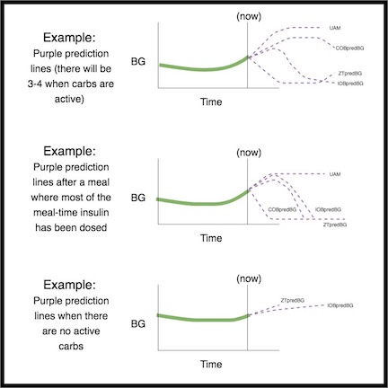

# Dla lekarzy specjalistów – Ogólne wprowadzenie i przewodnik po AndroidAPS

Ta strona jest przeznaczona dla lekarzy specjalistów, którzy wyrazili zainteresowanie technologią sztucznej trzustki open source, taką jak AndroidAPS, lub dla pacjentów, którzy chcą podzielić się takimi informacjami ze swoimi lekarzami.

Ten przewodnik zawiera trochę specjalistycznych informacji na temat zamkniętej pętli typu "zrób to sam", w szczególności jak działa AndroidAPS. For more details on all of these topics, please view the [comprehensive AndroidAPS documentation online](../index.md). Jeśli masz pytania, o więcej szczegółów proszę zapytać pacjenta ewentualnie ni krępuj się kierować pytań do naszej społeczności. (Jeśli nie korzystasz z mediów społecznościowych (np. [Twitter](https://twitter.com/kozakmilos) lub Facebook), prosimy o kontakt mailowy na adres developers@AndroidAPS.org). [Tutaj można również znaleźć niektóre z najnowszych badań i danych dotyczących wyników](https://openaps.org/outcomes/).

## The steps for building a DIY Closed Loop:

Aby rozpocząć korzystanie z AndroidAPS, należy podjąć następujące kroki:

* Find a [compatible pump](../Hardware/pumps.md), a [compatible Android device](https://docs.google.com/spreadsheets/d/1gZAsN6f0gv6tkgy9EBsYl0BQNhna0RDqA9QGycAqCQc/edit?usp=sharing), and a [compatible CGM source](../Configuration/BG-Source.md).
* [Download the AndroidAPS source code and build the software](../Installing-AndroidAPS/Building-APK.md).
* [Configure the software to talk to their diabetes devices and specify settings and safety preferences](../index.md#configuration).

## How A DIY Closed Loop Works

Bez systemu zamkniętej pętli, osoba cierpiąca na cukrzycę samodzielnie gromadzi dane z pompy i CGM (systemu ciągłego pomiaru glukozy), decyduje, co ma robić i podejmuje działania.

Przy automatycznym podawaniu insuliny, system robi to samo: zbiera dane z pompy, CGM oraz z innych miejsc w których informacje są rejestrowane (takie jak Nightscout), wykorzystuje te informacje do wykonania obliczeń i decyduje o tym, ile więcej lub mniej insuliny jest potrzebne (powyżej lub poniżej podstawowej bazy), a także wykorzystuje tymczasowe bazę w celu dokonania niezbędnych korekt, aby utrzymać lub sprowadzić stężenia glukozy do docelowego zakresu.

Jeśli urządzenie z systemem AndroidAPS przerwie działanie lub wyjdzie poza zasięg pompy, po zakończeniu ostatniej tymczasowej bazy, pompa wróci do swojej podstawowej funkcjonalności z zaprogramowanymi wcześniej ustawieniami bazy.

## How data is gathered:

Używając AndroidAPS, urządzenie z systemem Android uruchamia specjalną aplikację do wykonywania obliczeń, urządzenie komunikuje się za pomocą Bluetooth z obsługiwaną pompą. AndroidAPS może komunikować się z innymi urządzeniami poprzez chmurę, za pośrednictwem Wifi lub sieci komórkowej, aby zebrać dodatkowe informacje i zaprezentować pacjentowi, jego opiekunom oraz bliskim, co to robi i dlaczego.

Urządzenie z Androidem musi:

* komunikować się z pompą oraz pobierać historię - ile insuliny zostało dostarczone
* komunikować się z CGM (systemem ciągłego pomiaru glukozy) (bezpośrednio lub za pośrednictwem chmury) - aby zobaczyć jaki jest aktualnie/jak się kształtowały uprzednio stężenia glukozy we krwi

Po zebraniu tych danych przez urządzenie, algorytm uruchamia się i podejmuje decyzje w oparciu o ustawienia (ISF [współczynnik wrażliwości na insulinę], carb ratio [współczynnik węglowodanowy], DIA [współczynnik - czas aktywności insuliny], docelowy poziom cukru, itd.). W razie potrzeby wydaje polecenia do pompy, aby zmienić szybkość podawania insuliny. W razie potrzeby wydaje polecenia do pompy, aby zmienić szybkość podawania insuliny.

Aby obliczać dawki insuliny, system zbiera również wszelkie informacje o bolusach, wchłanianiu węglowodanów oraz tymczasowych celach poziomów cukrów z pompy lub z Nightscout-a.

## How does it know what to do?

Oprogramowanie zostało zaprojektowane w taki sposób aby sprawić, że urządzenie będzie przyjazne w obsłudze dla osób przyzwyczajonych (w trybie ręcznym) do obliczania niezbędnych do podania jednostek insuliny. W pierwszej kolejności zbiera dane ze wszystkich urządzeń wspomagających oraz z chmury, przygotowuje dane, wykonuje obliczenia, prognozuje poziomy cukrów w ciągu najbliższych godzin według różnych scenariuszy, a następnie oblicza niezbędne korekty tak, aby utrzymać lub doprowadzić poziom glukozy do docelowego zakresu. Następnie przesyła wszelkie niezbędne korekty do pompy. Następnie ponowne odczytuje dane, ponawiając procedurę... i tak w kółko.

Ponieważ najważniejszym parametrem wejściowym jest poziom glukozy we krwi pochodzący z CGM (systemu ciągłego monitorowania glukozy), ważne jest posiadanie wysokiej jakości danych CGM.

AndroidAPS jest przeznaczony do przejrzystego prezentowania wszystkich zebranych danych wejściowych, wynikających z nich zaleceń i wszelkich podjętych działań. Z tych względów, w dowolnym momencie przeglądając logi łatwo odpowiedzieć na pytanie "dlaczego akurat system robi X?".

## Examples of AndroidAPS algorithm decision making:

AndroidAPS używa tego samego algorytmu i funkcji, co OpenAPS. Algorytm dokonuje wielu prognoz (na podstawie ustawień i sytuacji) reprezentujących różne scenariusze tego, co może się wydarzyć w przyszłości. W Nightscout prognozy te są wyświetlane jako "purpurowe linie". AndroidAPS uses different colors to separate these [prediction lines](../Installing-AndroidAPS/Releasenotes.md#overview-tab). W logach system natomiast będzie opisywał, które z tych prognoz (i w jakich ramach czasowych) wykorzystuje się do podejmowania niezbędnych działań.

### Here are examples of the purple prediction lines, and how they might differ:

### Here are examples of different time frames that influence the needed adjustments to insulin delivery:

### Scenario 1 - Zero Temp for safety

Na tym przykładzie poziom cukru rośnie w krótkim okresie czasu, jednak przewiduje się, że w dłuższym okresie czasu poziom cukru będzie niski. W rzeczywistości prognozuje się, że cukier spadnie poniżej poziomu docelowego *i* progu bezpieczeństwa. Dla bezpieczeństwa, aby zapobiec niedocukrzeniu, AndroidAPS ustawi zerową bazę (tymczasowa baza na 0%) , aż do momentu, gdy eventualBG \[prognozowany cukier\] (w dowolnym przedziale czasowym) jest powyżej progu.

### Scenario 2 - Zero temp for safety

Na tym przykładzie prognozuje się, że w najbliższym czasie stężenie cukru spadnie poniżej zera, ale przewiduje się, że ostatecznie przekroczy wartość docelową. Jednakże, ponieważ w najbliższym czasie spadek cukru jest poniżej progu bezpieczeństwa, AndroidAPS ustawi zerową bazę tymczasową, aż do momentu, gdy nie będzie już żadnego punktu linii prognozowania, który jest poniżej progu.

### Scenario 3 - More insulin needed

Na tym przykładzie krótkoterminowa prognoza pokazuje spadek cukru poniżej celu. Nie przewiduje się jednak, aby ten spadek był poniżej progu bezpieczeństwa. Prognozowany cukier (eventualBG) jest powyżej wartości docelowej. Dlatego też AndroidAPS powstrzyma się od dodawania insuliny, która przyczyniłaby się w najbliższym czasie do niedocukrzenia (dodanie insuliny spowodowałoby, że prognoza spadłyby poniżej progu). Następnie, gdy to tylko będzie bezpieczne, system oszacuje dodanie insuliny w celu obniżenia do poziomu docelowego, według najniższego poziomu z możliwych prognoz cukrów. *(W zależności od ustawień oraz wymaganej ilości i czasu podawania insuliny, insulina ta może być podawana przez bazę tymczasową lub SMB (super-mikro bolusy) )*

### Scenario 4 - Low temping for safety

Na tym przykładzie AndroidAPS widzi, że poziom glukozy jest znacznie powyżej celu. Jednakże, ze względu na czas działania insuliny, w organizmie jest już wystarczająco dużo insuliny, aby ostatecznie doprowadzić BG do prawidłowego zakresu. W rzeczywistości przewiduje się, że stężenie glukozy w organizmie będzie ostatecznie niższe od wartości docelowej. Dlatego też AndroidAPS nie będzie dostarczał dodatkowej insuliny, więc nie przyczyni się w dłuższej perspektywie czasowej do niedocukrzenia. Pomimo, iż poziom glukozy jest wysoki/wzrastający, to jednak w tym przypadku zasadne jest obniżenie bazy.

## Optimizing settings and making changes

Trudna może okazać się pomoc pacjentowi (dla lekarza specjalisty, który nie ma doświadczenia z AndroidAPS oraz z zamkniętymi pętlami), w szczególności przy optymalizacji ustawień oraz dokonywaniu zmian w celu poprawy wyników. We have multiple tools and [guides](https://openaps.readthedocs.io/en/latest/docs/Customize-Iterate/optimize-your-settings.html) in the community that help patients make small, tested adjustments to improve their settings.

Przy dostrajaniu systemu pacjenci powinni przyjąć jedną podstawową zasadę - należy dokonywać wyłącznie jednej zmiany na raz, a następnie obserwować wpływ tej zmiany przez około 2-3 dni. Ewentualne, kolejne pojedyncze zmiany systemu należy wykonywać stopniowo, dopiero po weryfikacji wpływu poprzedzającej zmiany (z tym zastrzeżeniem, iż jeśli okaże się, że zmiana źle wpływa na funkcjonowanie systemu, pacjenci powinni natychmiast powrócić do poprzedniego ustawienia). Natura ludzka skłania do obracania wszystkich pokręteł i zmieniania wszystkiego na raz, ale jeśli ktoś tak postępuje, z dużym prawdopodobieństwem spowoduje powstanie kolejnych wadliwych ustawień, a w konsekwencji nawet utrudni sobie powrót do ostatniego, znanego zadowalającego stanu.

Jednym z najbardziej przydatnych narzędzi do dostrajania systemu jest zautomatyzowane narzędzie służące do obliczania bazy, ISF (współczynnika wrażliwości na insulinę) i współczynnika węglowodanowego. This is called “[Autotune](https://openaps.readthedocs.io/en/latest/docs/Customize-Iterate/autotune.html)”. Zostało ono zaprojektowane tak, aby mogło być uruchamiane niezależnie/ręcznie, dostarczając dane, które pomagają pacjentowi w stopniowym dokonywaniu zmian ustawień. Najlepszą praktyką jest najpierw uruchamianie (lub przeglądanie raportów) Autotune, a dopiero następnie ewentualna modyfikacja ustawień. Na chwilę obecną, korzystając z AndroidAPS, Autotune należy uruchamiać niezależnie, nie mniej jednak trwają prace, aby zaimplementować Autotune bezpośrednio w AndroidAPS. As these parameters are a prerequisite both for standard pump insulin delivery and for closed loop insulin delivery, discussion of the autotune results and adustment of these parameters would be the natural link to the clinician.

Dodatkowo należy wskazać, iż zachowanie człowieka (uczonego i przyzwyczajonego do normalnego prowadzenia cukrzycy) często wpływa na wyniki, nawet przy zamkniętej pętli. Na przykład, jeśli przewiduje się, że stężenie glukozy obniży się, a AndroidAPS zmniejszy poziom insuliny w trakcie spadku, do podniesienia stężenia glukozy z 70 mg/dl (3,9 mmol) może być potrzebna tylko niewielka ilość węglowodanów (np. 3-4 g węglowodanów). Jednak w wielu przypadkach ktoś może zdecydować się na przyjęcie dużo większej ilości węglowodanów (np. trzymając się zasady 15), co spowoduje szybszy skok zarówno od dodatkowej glukozy, jak i dlatego, że insulina została zmniejszona przez AndroidAPS w okresie spadku glukozy.

## OpenAPS

**Niniejszy przewodnik został oparty na [Przewodniku klinicznym do OpenAPS](https://openaps.readthedocs.io/en/latest/docs/Resources/clinician-guide-to-OpenAPS.html).** OpenAPS jest systemem opracowanym do pracy na małym przenośnym komputerze (ogólnie nazywanym "platformą" ["rig"]). AndroidAPS wykorzystuje wiele technik zaimplementowanych w OpenAPS i w dużej mierze wykorzystuje logikę i algorytmy OpenAPS. Z tych względów niniejszy przewodnik jest bardzo podobny do oryginalnego opracowania. Wiele informacji o OpenAPS można łatwo zaadaptować do AndroidAPS, przy uwzględnieniu okoliczności, iż podstawową różnicą obydwu systemów jest platforma sprzętowa, na której one funkcjonują.

## Summary

Reasumując, przewodnik niniejszy jest specjalistycznym streszczeniem jak działa AndroidAPS. Aby uzyskać więcej informacji, zapytaj pacjenta, skontaktuj się ze społecznością lub przeczytaj pełną dokumentację AndroidAPS dostępną online.

Dodatkowo warto przeczytać:

* The [full AndroidAPS documentation](../index)
* [Projekt Referencyjny OpenAPS](https://OpenAPS.org/reference-design/), wyjaśniający mechanizmy bezpieczeństwa zaprojektowane w OpenAPS: https://openaps.org/reference-design/
* The [full OpenAPS documentation](https://openaps.readthedocs.io/en/latest/index.html) 
  * More [details on OpenAPS calculations](https://openaps.readthedocs.io/en/latest/docs/While%20You%20Wait%20For%20Gear/Understand-determine-basal.html#understanding-the-determine-basal-logic)