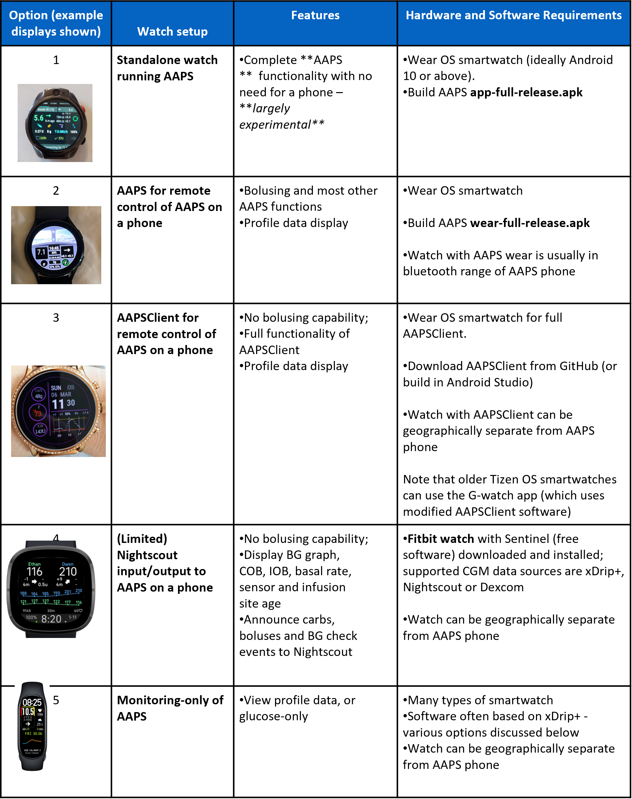

# Remote control of AAPS
There are four highly effective tools for remotely managing **AAPS**:

1) [SMS commands](sms-commands) (follower phone can be either Android or iOS), 2) [AAPSClient](aapsclient) (follower phone is Android) 3) [Nightscout](nightscout) (Android, iOS or other computer/device).  
4) [Smartwatches](smartwatches) (Android)

The first three are mostly appropriate for carers/parents, but smartwatches are very useful for carers/parents **and** for adults with diabetes themselves.


#### Considerations when setting up remote control of **AAPS** for a child

1.  Think about how you will keep the child’s phone in range of their pump and CGM. This can be challenging with children who are too young to be responsible for a phone. Ensuring you select an AAPS phone with a good bluetooth connection range and finding a comfortable way for the child to carry the pump and phone - if they are old/big enough to have the phone on them -  (_e.g._ a [SPI Belt](https://spibelt.com/collections/kids-belts) may help.
2.  Take your time to set-up and test commands with your child next to you, before starting remote treatment and monitoring. Many parents choose school holidays or weekends.
3.  Make sure other caregivers/teachers are aware of your child's treatment plan and work out how adding in remote control is going to work with/enhance the existing plan.
4.  Many parents find it helpful to have a separate line of communication with childcare providers, for example a cheap small teacher “follow” phone.
5.  Examples for school care plans for children of different ages can be found in the [“files section”](https://www.facebook.com/groups/AndroidAPSUsers/files/) of the **AAPS** Facebook page.
6.  What is your emergency plan for when remote control does not work (_i.e._ network problems or lost bluetooth connection)?  Always consider what will happen with **AAPS** if you suddenly can’t send a new command. **AAPS** overwrites the pump basal, ISF and ICR with the current profile values. Only use temporary profile switches (_i.e._ with a set time duration) if switching to a stronger insulin profile, in case your remote connection is disrupted. Then the pump will revert to the original profile when the time expires.

(sms-commands)=
## 1) SMS Commands

You can control **AAPS** remotely via text (SMS) message through a feature known as **SMS Commands**. SMS commands can be sent to **AAPS**  by _any_ type of phone (iPhone/Android).

**SMS commands are really useful:**
1. For routine remote control

2. If you want to remotely bolus insulin

3. In a region of poor internet reception, where text messages are able to get through, but data/internet phone reception is limited. This is very useful when going to remote areas (e.g. camping, skiing).

4. If your other methods of remote control (Nightscout/AAPSClient) are temporarily not working

### SMS command safety
If you enable **SMS Communicator** in **AAPS**, consider that the phone which is set up to give remote commands could be stolen, and/or used by someone else. Always lock your phone handset with at least a PIN. A strong password and/ or biometric lock are highly recommended, and ensure this is different from your APK Master password (the password which is required to change **AAPS** settings) . A second phone number must be enabled for SMS commands to work, even if you only have one primary caregiver/follower. You can then use the second number to temporarily disable SMS communicator (with the command **“SMS stop”**) if your main caregiver/parent phone is compromised. Versions of **AAPS** 2.7 and newer also use an [Authenticator app](authentication-or-not)).

### Different types of SMS commands
The **SMS Commands Table** below shows all the possible SMS commands. _Example values_ are given, to aid understanding. The commands have the same range of possible values (targets, percent profile etc.) which are allowable in the AAPS app itself. The commands below have been listed by how commonly used they are likely to be, the first two tables should have most of the SMS commands you need with full looping.

### SMS commands tables


(authentication-or-not)=
### Authentication or not?

You may notice from the table above that some SMS commands give an immediate response, and some SMS commands require **authenticating** with a security code from an additional app and a PIN (see below (link for more detail). A simple enquiry like “**bg**” (which requests an update on current glucose) is quick to type, doesn’t need authenticating, and returns the **AAPS** status information shown below:


Commands which need more security require a code to be entered, for example:


### How to set up SMS commands

The overall process is as follows:

**1)    Download an authenticator (caregiver phone)**

**2)    Check phone settings (AAPS phone)**

**3)    Date and time synching (caregiver and AAPS phone)**

**4)    AAPS settings (APPS phone)**

**5)    Testing SMS commands works (caregiver and AAPS phone)**

### Let's get started!

1) **Download an authenticator**: On the caregiver phone, download (from the App store or Google play) and install one authenticator of your choice from the list below:

[**Authy**](https://authy.com/download/)

[**Google Authenticator - Android / iOS**](https://play.google.com/store/apps/details?id=com.google.android.apps.authenticator2&pli=1)

[**LastPass Authenticator**](https://www.lastpass.com/solutions/authentication)

[**FreeOTP Authenticator**](https://freeotp.github.io/)

These Authenticator apps produce a time-limited, one-time 6-digit password, similar to mobile banking or shopping. You can use an alternative Authenticator app, as long as it supports RFC 6238 TOTP tokens. The Microsoft Authenticator does not work.

2) **Check phone settings:** In the **AAPS** phone settings go to Apps > AndroidAPS > Permissions  > SMS  > Allow SMS


3) **Date and time synching:** In both the **AAPS** phone and the caregiver phone, check the date and time are synched. Exactly how you do this depends on your specific handsets, you may need to try out different settings.

Example (for Samsung S23 handset): Settings – general management – date and time- automatic date and time

Some options may be greyed out, due to needing admin via a family account if the phone has been set up as a child account. This date and time setting is called “set automatically” on a caregiver/parent iPhone. If you are not sure if you have synched the handsets, don’t worry, you can set up the SMS commands and troubleshoot afterwards if it seems to be causing problems (ask for help if needed).

4) **AAPS settings:**

i) Now that the phone settings have been checked, in the **AAPS** app itself, use the left hand hamburger menu to navigate to Config Builder:


ii) Enable “SMS communicator” by checking the boxes, then click the “cog” to get to the SMS communicator preferences screen:


_Note - as an alternative route to Config Builder, you can also use the new “SMS Communicator tab” at the top of the AAPS screen, then right click on the custom right hand hamburger menu for that page, to get to the SMS communicator preferences screen._

iii) On the preferences screen enable “allow remote commands via SMS”:


iv) Enter the caregiver phone number(s). Include the country code and exclude the first “0” of the phone number, as shown in these examples:

UK phone number: +447976304596

US phone number: +11234567890

FR phone number:  +33612344567

_etc._

Note that the “+” in front of the number may or may not be required based on your location. To determine this, send a sample text which will show the received format in the SMS Communicator tab.

If you have more than one phone number to add, separate them by semicolons, with NO space between numbers (this is critical!). Select “OK”:


v) Choose a PIN which you (and any other caregivers) are going to use at the end of the authenticator code when the SMS command is sent.

PIN requirements are:

•3 to 6 digits

•not the same digits (_i.e._ 1111 or 1224)

•not sequential numbers (_i.e._ 1234)


vi) On the preferences screen select “Authenticator setup”

●   Follow the step-by-step instructions on the screen.

●   Open your installed authenticator app on the _caregiver’s phone_ set up a new connection and

●   Use the caregiver phone to scan the QR code provided by **AAPS**, when prompted.

●   Test the one-time passcode from the authenticator app on the caregiver phone followed by your PIN:

Example:

The token from the authenticator app is 457051

Your mandatory PIN is 2401

Code to check: 4570512401

If the entry is correct, the red text “WRONG PIN” will change automatically to a green “OK”. The process is now complete, there is no “OK” button you need to press after entering the code:


You should now be set up with SMS commands.

### First steps using SMS commands

1)  To check you have set everything up correctly, test the connection by typing “bg” as an SMS message from the caregiver phone to the AAPS phone. You should get a response similar to that shown here:


2)  Now try an SMS command that requires the authenticator. To do this, send a text from the caregiver’s phone with the required command to the**AAPS** phone (_e.g._ “target hypo”). The caregiver’s phone will receive a text back, prompting you to enter the **six-digit authenticator password** from the authenticator app, followed by an additional secret **PIN** known only to caregivers/followers (a string of ten digits in total, assuming your PIN is only 4 digits).

This example is shown below, with the SMS command “target hypo” to set a hypo temp target:

●   In this example, your PIN is 1289

●   Code from your authenticator app is 274127

●   When prompted, text 2741271289

Commands must be sent in English. The response should be in your local language. When you try sending an SMS command for the first time, try it in the presence of the AAPS phone, to see how it works:


The caregiver’s phone will receive a SMS in reply from **AAPS** to confirm if the remote SMS command has been carried out successfully. There are several possible reasons the command may not be successful:

●   SMS commands setup isn’t complete/correct

●   You sent a command which had an incorrect format (like “disconnect pump 45” instead of “pump disconnect 45”)

●   You used an incorrect, or expired authenticator code (it is usually good to wait a few seconds for a fresh code, if the current one is about to expire)

●   The code+PIN was OK, but there was a delay in the SMS leaving/arriving, which led AAPS to calculate that the authenticator code had expired

●   The AAPS phone is out of range/contact with the pump

●   The system is already busy delivering a bolus

If your command is successful, you will receive a reply to confirm this. If there is a problem you will receive an error message.

Common errors are shown in the examples below:


### Additional safety notes on SMS commands

The default minimum time delay between bolus commands is 15 minutes. For safety reasons, you have to add at least two authorised phone numbers to change this to a shorter time delay. If you try to remotely bolus again within 15 minutes of the previous bolus, you will receive the response “Remote bolus not available. Try again later”

If you want to remove the ability of a caregiver phone to send SMS commands, use the emergency button “RESET AUTHENTICATORS” in AAPS (see preferences screenshot above, link) or send the SMS command “SMS stop”. By resetting authenticators you make ALL the caregivers' phones invalid. You will need to set them up again.

### Delivering mealtime boluses through SMS commands

Remote bolusing of insulin can _only_ be done via **SMS Commands**, it cannot be actioned through NightScout or AAPSClient. Carbs however, can be announced through any of the three methods. It is not possible to send both carbs and insulin commands in one single SMS message. These commands must be sent separately as follows:

1)  Send the insulin bolus (_e.g._“bolus 2” will command a bolus of 2 units) through SMS commands is equivalent to using the “syringe” icon in **AAPS**. 2)  Send the carbs (_e.g._ “carbs 20” will announce 20g of carbs). This is equivalent to using the “carbs” tab in **AAPS**.

To avoid hypos, it is a good idea to start conservatively, by bolusing **less insulin** than would be needed according to your carb ratio, because you are not taking into account the current glucose level or glucose trend.

**The order in which you send these commands is important**. If you announce a large amount of carbs by any route, and have SMBs enabled, **AAPS** may immediately respond by giving a partial bolus of insulin. So, if you then try to send an insulin bolus _after_ announcing the carbs, you may have a frustrating delay and a “bolus in progress” message, and you then need to check what has been given as an SMB. Or, if you do not realise an SMB is being delivered, and your own subsequent bolus is also successful, too much insulin may be delivered for the meal overall. Therefore, if bolusing for meals remotely, always send the insulin bolus _before_ the carb announcement. If you prefer, you can use a combination of Nightscout or AAPSClient with SMS commands. Carbs can be announced through Nightscout without any authentication (see instructions sub section below) , and are therefore quicker than SMS commands.

### SMS commands troubleshooting and FAQ

#### Q: What _can’t_ we do with SMS commands?

1)  **You cannot set a _temporary_ profile switch** (so for example, setting “profile exercise“ for 60 minutes), although you can permanently switch to “profile exercise”. Temporary profiles switches can instead be set through Nightscout or AAPSClient.

2)  **You cannot cancel automations** or **set user-defined targets** but there are approximate solutions: As an example, imagine the normal profile target is 5.5. You have set an automation in AAPS, to always set a high target of 7.0 between 2.30pm and 3.30pm because of a sports class in school, and a condition of the automation is that “no temp target exists”. This week, you have been told at short notice that the sports class is cancelled, and is being replaced by a pizza-eating session, but your kid is already at school with the AAPS phone. If the high temporary target of 7.0 is started by the automation and you cancel it (on the AAPS phone, or remotely) the conditions for the automation are still met and **AAPS** will simply set the high target again, a minute later.

**If you did have access to the AAPS phone**, you could uncheck/modify the automation, or, if you don’t want to do that, you could simply set a new temp target of 5.6 for 60 min under the Actions Tab or by pressing on the target tab. This would prevent the automation from setting the high target of 7.0.

**If you don’t have access to the AAPS phone** SMS commands can be used for an approximate fix: for example, by using the command “target meal” to set a target of 5.0 for 45 mins (other default targets are 8.0 for activity or hypo, see Table). However, with SMS commands you cannot specify a _specific_ value target value (of 5.6 for 60 minutes, for example), you would need to use **AAPSClient** or Nightscout to do this.

#### Q: What happens if I change my mind about a command I have just sent?

**AAPS** will only deliver on the most recent command. So, if you type “bolus 1.5”, and then, without authenticating, you send a new command “bolus 1”, it will ignore the earlier 1.5 command. **AAPS** will always send the caregiver's phone a response to confirm what the SMS command is before you are prompted to enter the authentication code, as well as a response following the action.

#### Q: Why didn't I get a response to an SMS command?

It could be for one of these reasons:

1)  The message has not got through to the phone (network issues). 2)  **AAPS** is still in the process of processing the request (_e.g._ a bolus, which can take some time to deliver depending on your bolus rate). 3)  The AAPS phone does not have good bluetooth connection to the pump when the command is received, and the command has failed (this usually creates an alarm on the AAPS phone).

#### Q: How can I stop a command once it has been authenticated?

You can't. However, you can cancel a bolus sent by SMS on the **AAPS** phone itself, by simply cancelling it on the bolusing popup, if you are quick. Many SMS commands (apart from bolusing and carb announcements) can be easily reversed, or actions taken to mitigate unintended effects if a mistake is made.

For errors in bolusing and carb announcements, you can still take action. For example, if you have announced 20g carbs but your child only eats 10g and you (or an onhand caregiver) is unable to delete the treatment in the **AAPS** phone directly, you could set a high temporary target, or set a reduced profile, to encourage **AAPS** to be less aggressive.

#### Q. Why am I getting multiple SMS texts of the same message?

If you receive the same message repeatedly (_e.g._ a profile switch) you may have accidentally set up a looping condition with other apps. This could be xDrip+, for example. If so, please ensure that xDrip+ (or any other app) does not upload treatments to NightScout.

#### Q. I’ve just set up SMS commands and I am now getting far too many text messages. Can I reduce the frequency, or make them stop?

Using SMS commands may generate a lot of automated messages from the AAPS phone to the caregiver’s phone. You will also receive messages, for example “basal profile in pump updated” if you have automations set up in **AAPS**. It can be useful to have unlimited SMS allowance on your AAPS phone plan (and for each caregiver phone used) if a lot of SMS will be sent, and to deactivate SMS notifications, alarms or vibrations on all phones. It is not possible to use SMS commands and not receive these updates. Because of this, you may want an alternative way to communicate directly with your child (if they are old enough), instead of SMS. Common alternative communication apps used by **AAPS** caregivers include Whatsapp, Lime, Telegram, and Facebook Messenger.

#### Q. Why are SMS commands not working on my Samsung phone?

There was a report of SMS commands stopping after an update on a Samsung Galaxy S10 phone. This was solved by disabling ‘send as chat message’.


#### Q. How can I fix issues with the Android Messages App?

If you are having issues sending or receiving SMS commands with the Android Messages app, disable end-to-end encryption on both caregiver and dependent’s phones:

●   Open the specific SMS conversation in Messages

●   Select the options ellipsis in the top right corner

●   select “Details”

●   Activate “Only send SMS and MMS messages”

(aapsclient)=
## 2) AAPSClient

_Note that **NSClient** has been replaced by **AAPSClient** for AAPS version 3.2 and higher, check the version release notes for more information._

For versions of **AAPS** which are older than AAPS 3.2, if you have a caregiver/parent Android phone you can directly download and install the [**AAPSClient**](https://github.com/nightscout/AndroidAPS/releases/) apk. **AAPSClient** looks very similar in appearance to **AAPS** itself, offering the caregiver tabs that will remotely action commands in **AAPS**:


There are 2 versions of the apk that can be [downloaded from here](https://github.com/nightscout/AndroidAPS/releases/),  **AAPSClient** & **AAPSClient2** which have a subtle but important difference as explained below.

**AAPSClient** can be installed on a single phone or multiple follower phones (i.e. parent 1’s follower phone and parent 2’s follower phone) in order for both caregivers to be granted access and remote control a patient's **AAPS** phone.

Should a caregiver require a second copy of **AAPSClient** to remote control an additional patient with a Nightscout account, they should install **AAPSClient2** in addition to **AAPSClient**. **AAPSClient 2** allows a single caregiver to install the **AAPSClient** apk twice on the same follower phone in order to be given simultaneous access and remote control to two different patients.

To download **AAPSClient**, navigate to [here](https://github.com/nightscout/AndroidAPS/releases/) and click on the asset **“app-AAPSClient-release_x.x.x.x”** (it may be a newer version to that shown in the screenshot below):


Then go to  _downloads_ on your computer. On Windows, -downloads_ will show the right hand ribbon:


Once downloaded, click _show in folder_ to locate the file.

The **AAPSClient** apk can now be either:

Transferred by a USB cable onto the follower phone; or Dragged into Google drive folder, and then added onto the follower phone by clicking on the "app-AAPSClient-release" file.

### Synchronization- AAPSClient and AAPS set up (for Version 3.2.0.0 above)

Once __AAPSClient__ apk is installed on the follower phone, the user must ensure their ‘Preferences’ in Config Builder are correctly set up and aligned with __AAPS__ for Nightscout 15 (see Release Notes [here](./Installing-AndroidAPS/Update-to-new-version.md)). The example below provides Synchronization guidance for NSClient and NSClientV3 using Nightscout15 but there are other options available with __AAPS__ (e.g xDrip+).

Within the ‘Synchronization’ located under ‘Config Builder’, the user can opt for either Synchronization options for both __AAPS__ and follower phone being:

- Option 1: NSClient (also known as ‘v1’) - which synchronises the user’s data with Nightscout; or

- Option 2: NSClientV3 (also referred to as ‘v3’).- which synchronises the user’s data with Nightscout using v3 API.


The user must ensure that __both__ the AAPS and AAPS Client phones are synched together by actioning either option for v1 or v3 being:

Option 1: v1 for both phones:

- Enter your Nightscout URL

- Enter your API secret

Option 2: v3 for both phones:

- Enter your Nightscout URL under NSClientV3 tab

- Enter your NS access token under ‘Config Build’ tab. Please follow the notes [here](https://nightscout.github.io/nightscout/security/#create-a-token)

If selecting Websockets (which is optional) ensure this is activated or deactivated for both __AAPS’__ and __AAPSClient’s__ phone. Activating Websockets in __AAPS__ and not within __AAPSClient__ (and vice versa) will only cause __AAPS__ to malfunction. By enabling websockets will allow for faster synchronization with Nightscout but may lead to more phone battery consumption.


Users should ensure that both __AAPSClient__ and __AAPS__ are showing  ‘connected’ under the ‘NSClient' tab for each phone, and that ‘Profile Switches’ or ‘Temp Target' can be correctly activated in __AAPS__ once selected in __AAPSClient__.

Users should also ensure that carbs are logged in both ‘Treatments’ within both __AAPSClient__ and __AAPS__ otherwise this could indicate a malfunction within the user’s set up.

### Troubleshooting 'NS access token' configuration issues

The precise 'NS access token' configuration may differ depending upon whether your Nightscout provider is a paid for hosted site or not.

If you are struggling with **AAPS** v3 to accept the 'NS access token' and using a paid for hosted Nightscout site, you may wish to first liaise with your Nightscout provider on how to resolve the 'NS access token' difficulties. Otherwise, please reach out to the **AAPS** group but please double check that you have correctly followed the notes before doing so [here](https://nightscout.github.io/nightscout/security/#create-a-token).

### Features of AAPSClient include:


**AAPSClient** allows the caregiver to make many of the adjustments that are allowed directly in **AAPS** (excluding insulin boluses) remotely, via the mobile or internet network. The main benefits of **AAPSClient** are the speed and ease with which caregivers/parents can use it to remotely control **APPS**. __AAPSClient__ _can_ be much faster than entering SMS Commands, if delivering a command which would require authentication. Commands entered on **AAPSClient** are uploaded onto Nightscout.

Remote control through **AAPSClient** is only recommended if your synchronization is working well (_i.e._ you don’t see unwanted data changes like self-modification of TT, TBR etc) see [release notes for Version 2.8.1.1](Releasenotes-important-hints-2-8-1-1) for further details.

### AAPSClient with smartwatch options

A smartwatch can be a very useful tool for helping to manage **AAPS** with kids. A couple of different configurations are possible. If **AAPSClient** is installed on the parents phone, the [**AAPSClient WearOS** app](https://github.com/nightscout/AndroidAPS/releases/) can be downloaded and installed on a compatible smartwatch which is connected to the parent's phone. This will show current BG, loop status and allow carb entry, temp targets and profile changes. It will NOT allow bolusing from the WearOS app. You can read more about Smartwatches [here](smartwatches).

(nightscout)=
## 3) Nightscout

As well as Nightscout being a server in “the Cloud”, there is also a dedicated **Nightscout** app which can be downloaded directly from the App Store on your iPhone. If you have an Android follower phone, there is not a dedicated Nightscout app and it is better to use [**AAPSClient**](AAPSClient), or, if you only want to follow, and not send treatments you can download and install the [Nightwatch](link) app from the Playstore.

Once you have installed the **Nightscout** app on your iPhone, open the app and follow the set-up prompts, entering your Nightscout address (see below, left). The form of this may vary depending on how your Nightscout is hosted. (_e.g._ http://youraddresshere.herokuapp.com). Then enter your Nightscout API secret (see below, right). If not prompted for your API password, then you need to enter this by clicking on the padlock at the top of the app:


More info on setup is available directly from [Nightscout](https://nightscout.github.io/nightscout/discover/)

When you first log in, you will have a very simple display (below, left). Customise the display options, by selecting the “hamburger” in the top right and scrolling down:


Scroll down through to “Settings”. You may wish to change the “scale” to “linear” as the default for the BG display is logarithmic, and under “render basal” select “default” so that the pump basal shows up. Continue to scroll down until you get to “show plugins”. You need to make sure “careportal” is checked, and can also select various other metrics (most useful are: IOB, care portal, pump, cannula age, insulin age, basal profile and OpenAPS).


Importantly, you now need to click “save” at the bottom for these changes to take effect.

After pressing “save” the app will return to your main Nightscout screen which will look a little like this:


Looking in more detail at the top left menu of the Nightscout app:


There is a huge amount of information on the status of the **AAPS** system in the grey tabs (and even more information is revealed if you tap the tab) on this screen:


### Sending treatments through the Nightscout app to AAPS

To set-up sending treatments from the **Nightscout** app to **AAPS**, on the main AAPS phone, go into the **AAPSClient** tab in the **AAPS** app. Open the right-hand dot menu, and open AAPSClientpreferences – synchronisation and select the relevant options in this menu. Set it to receive the different commands (temporary targets, etc) and also to synchronise profiles. If things don’t seem to be synchronised, go back to the AAPSClient tab and select “full synchronisation” and wait a few minutes.

Nightscout on your iPhone has all the same functions as Nightscout on your PC. It allows you to send many commands to **AAPS**, but it does not allow you to send insulin boluses.

### Cancelling negative insulin to avoid repeat hypos

Although you cannot actually bolus insulin, you can however “announce” insulin through Nightscout as a “correction bolus”, although it is not delivered. Because AAPS now takes that fake insulin bolus into account, announcing insulin actually works to make AAPS _less aggressive_, and can be useful for cancelling negative insulin and preventing lows in the event that your profile has been too strong (for example due to prior exercise). You will want to check this for yourself in the presence of the **AAPS** phone, in case your **Nightscout** setup differs.


Some of the most useful **Nightscout** commands are described in the table below.

#### Nightscout command table


Read more about **Nightscout** options [here](https://nightscout.github.io/)

### Tips for getting the most out of the Nightscout app

1). If you get “stuck” on a page and want to be able to see the main screen again, just click “refresh” (bottom middle) and this will take you back to the **Nightscout** homepage with the BG graph.

To see the current profile which is running on the phone, press the various icons on the screen above the graph. More info (current carb ratio, sensitivity and timezone etc.) can be seen by pressing “basal” and “OpenAPS” gives info about the profile and current target etc. Both the phone battery% and the pump battery % can also be monitored. BWP gives information on what the algorithm thinks will happen in the future, given the IOB and COB.

#### Other icons in the menu: what does the pencil (edit) mean?

You can (technically) use the edit pencil to move or delete bolus or correction treatments from the last 48h.

More about this [here](https://nightscout.github.io/nightscout/discover/#edit-mode-edit)

Although this could potentially be useful for deleting announced (but not bolused for) carbs, in practice it doesn’t currently work well with **AAPS** and we recommend making changes like this via the **AAPS** app directly.

(smartwatches)=
## 4) Smartwatches

Smartwatches are becoming increasingly used with **AAPS** _both_ for adults with diabetes and carers/parents of children with diabetes.

### General advantages of using smartwatches with **AAPS**


Smartwatches - depending on the model - can be used in many different ways with **AAPS**. They can be used to fully or partly control **AAPS**, or simply to remotely check glucose levels, insulin-on-board, and other parameters.

Integrating a smartwatch with **AAPS** can be useful in many situations, including driving a car or (motor) bike and during exercise. Some people feel that looking at a watch (in a meeting, party, dinner table etc.) is more discreet than looking on a phone. From a security perspective, a smartwatch can also be beneficial while on the move, enabling user to have their **AAPS** phone stored out of sight (like inside a bag), but with the aid of the smartwatch for remote control use.

### Specific advantages for parents/carers using **AAPS**

For a child - if their **AAPS**  phone is nearby - a caregiver can use a smartwatch to monitor or make modifications without needing to use the **AAPS**  phone. This can be useful, for example, if the **AAPS** phone is hidden away in a pump belt.

A smartwatch can be used either _in addition_ to, or as an _alternative_ to the PHONE-based options for [remote control](remote-control.md) or [following only](following-only.md).

Additionally, unlike parent/carer follower phones (which rely on the mobile network or wifi connection), bluetooth connected smartwatches can be useful in remote locations, like a cave, in a boat, or half-way up a mountain. If both devices (**AAPS** phone and smartwatch) are on the same wifi network, they can also use wifi.

### Different types of Smartwatch-AAPS interactions

Many of the possible smartwatch options available to **AAPS** users are detailed at [Nightscout on your watch](https://nightscout.github.io/nightscout/wearable/#), so you are strongly advised to read those pages first to get a good idea of all the possibilities.

There are currently five main ways in which smartwatches are used in conjunction with **AAPS**. These are shown in the table below: 





Please note this table was prepared in 2023, it is not exhaustive, and additional options are being added all the time.

### Before you buy a smartwatch…

The exact model of smartwatch you buy depends on the desired function(s). There are currently two historical spreadsheets recording compatible [smartphones](https://docs.google.com/spreadsheets/d/1zO-Vf3wv0jji5Gflk6pe48oi348ApF5RvMcI6NG5TnY/edit#gid=2097219952) and [smartphones and watches](https://docs.google.com/spreadsheets/d/1gZAsN6f0gv6tkgy9EBsYl0BQNhna0RDqA9QGycAqCQc/edit#gid=698881435) but these will no longer continue to be updated since it is easier to ask via the Discord and Facebook groups, due to the huge range of options.

Popular watch brands include Samsung Galaxy, Garmin, Fossil, Mi band and Fitbit. The different options summarised in the Table above are explained in more detail below, to help you decide which smartwatch is right for your situation.

If you are integrating a smartwatch with **AAPS** on a phone with the intention to remotely interact with **AAPS**, you also need to consider if the two devices are compatible with each other, particularly if you have an older, or an unusual phone.

In general, if you only want to follow glucose numbers and not interact with **AAPS**, there are a wider range of affordable and simpler watches you can use.

The best way to choose a smartwatch is to search for "watch" posts on either Discord or Facebook **AAPS** groups. Have a read of others experiences, and post any specific questions, if your query isn't answered by older posts.

#### For Smartwatch Options 1 - 3: What _is_ Wear OS?

The first three smartwatch options require the smartwatch to have **Wear OS** installed.

**Wear OS** is the operating system which runs on some modern Android smartwatches. In [2018](https://en.wikipedia.org/wiki/Wear_OS), Google rebranded _Android Wear 1.x to Wear OS_ from version 2.x. So, if a device is labelled “_Android Wear_” rather than **Wear OS** it may indicate an older version. If the description of the smartwatch indicates only _compatibility_ with Android and iOS - it does not mean it is running Wear OS. It may be some other sort of Vendor specific operating system which is not compatible with **AAPS**. To support installation and use of any version of **AAPS** or **AAPSClient**, a smartwatch will need to be running **Wear OS**, and ideally be Android 10 or newer. As a guide, as of October 2023, the latest release of **Wear OS** is version 4.0 (based on Android 13).

If you install **AAPS** wear.apk on a **Wear OS** watch, there are a range of different custom **AAPS** watchfaces which  can be  selected. Alternatively, you can use a standard smartphone watchface, with your **AAPS** information included in small tiles known as “complications” on the face. A complication is any feature that is displayed on a watch face in addition to the time. Features like complications require Wear OS version 2.0 or newer to work.


#### What could my smartwatch look like with remote control of AAPS?

After installing **AAPS** onto your watch, you will automatically be able to select your preferred watchface from these **AAPS**-dedicated watchfaces. On most watches, you simply long-press on the homescreen until the screen shrinks and swipe right to select an alernative screen:


#### How would I operate a Wear OS watch from day-to-day?

Further details about the watchfaces, and day-to-day use, including how to make (and share) your own customised watchface, can be found in the section [Operation of Wear AAPS on a Smartwatch](../Configuration/Watchfaces.md).

### Option 1) Standalone Watch running **AAPS**

It sounds like an attractive option, right? However, at present, only a few enthusiasts are experimenting with **AAPS**  on a stand-alone watch. There are a limited number of smartwatches with a reasonable interface which also which work well with standalone use of **AAPS** and your CGM app. Popular models include the LEMFO LEM 14, 15 and 16. You will need to load the watch with the **AAPS** "full" apk (the apk which is usually installed on a smartphone) rather than the **AAPS** "wear" apk.

While there is no clear specification which helps you to know if a watch will work well for standalone **AAPS** use, the following parameters will help:

1)  Android 10 or newer. 2)  Being able to take the watchface off “square” mode to make text larger and easier to read. 3)  Very good battery life. 4)  Good bluetooth range.

Most of the frustrations of standalone **AAPS** watches come from interacting with a tiny screen, and the fact that the current AAPS full app interface has not been designed for a watch. You may prefer to use a stylus to edit **AAPS**  settings on the watch, due to the restricted screen size, and some AAPS buttons may not be visible on the watch screen.

Additional challenges are that it is hard to get sufficient battery life, and watches with sufficient battery are often bulky and thick. Users report fighting with the OS and power-saving settings, difficulty in starting sensors on the watch, poor bluetooth range (for maintaining connection with both the sensor and pump) and questionable water resistance. Examples are shown in the photos below (photo credit: Janvier Doyon).


If you are interested in setting up a standalone watch, read the posts and comments on the **AAPS**  Facebook group (good search options are “standalone” and “Lemfo”) and Discord for more information.

### Option 2) **AAPS** on watch, for remote control of **AAPS** on a phone

Similarly to using a follower phone with either AAPSClient, Nightscout or SMS commands (link to sections) a smartwatch can be used to remotely control **AAPS** and provide full profile data. A key difference to using a follower phone is that the smartwatch to **AAPS** phone link is via bluetooth and does not require an authenticator code. As a side-note, users have reported that if both smartwatch and **AAPS** phone linked by bluetooth are also a wifi network, the watch may also interact with the **AAPS** phone over the wifi, giving a longer range of communication. This includes remote delivery of a bolus where the caregiver with the **AAPS** watch and T1D child (with **AAPS** phone) are in different locations and which can useful in circumstances where the T1D child is in school.

A remote control smartwatch is therefore often useful in any situation where:

a)  **AAPSClient**/Nightscout/**SMS** commands cannot work; or

b)  The user wishes to avoid the need for authenticator code (as required for the follower phone with inputting data, selecting TT or entering carbs).

A smartwatch needs to have **Android wear** software (ideally 10 or higher) to be able to control **AAPS**. Please check the technical specifications of the watch, and check the [spreadsheet of compatible watches](link). Search, or ask in the **AAPS**  Facebook/Discord groups if unsure.

Specific How-to guides for setting up **AAPS** on the popular [Samsung Galaxy Watch 4 (40mm) is given below. The [Garmin](https://apps.garmin.com/en-US/apps/a2eebcac-d18a-4227-a143-cd333cf89b55?fbclid=IwAR0k3w3oes-OHgFdPO-cGCuTSIpqFJejHG-klBTm_rmyEJo6gdArw8Nl4Zc#0) watch is also a popular choice. If you have experience of setting up a different smartwatch which you think would be useful to others, please add it into these pages [edit the documentation](../make-a-PR.md) to share your findings with the wider **AAPS** community.

#### The AAPS Wear apk

The Wear OS App of **AAPS**  (“Wear OS apk”) required for the smartwatch has been separated from the "full" **AAPS** build for the Android phone. Therefore you have to generate a second installation file, or apk, to install **AAPS** wear onto the watch (which is done by side-loading it from the phone). It is strongly recommended that the **AAPS** Wear apk file is built immediately after first building the full **AAPS** apk for the phone. Not only is this very quick to do if you are [building **AAPS** for the first time](link to building **AAPS** for the first time), but it will avoid any potential compatibility issues when you try to set up the watch-phone communication. The **AAPS** Wear apk on the watch is unlikely to be compatible with the **AAPS** phone apk if they have been built in different versions of Android Studio, or if months have past since the initial **AAPS** build.

If you are already using **AAPS** on a phone and you did not build both the phone and watch (wear) **AAPS** apks at the same time, to ensure success it is therefore best to do a fresh build of both apk files at the same time. If you have already installed Android studio, then you may wish to uninstall and then reinstall Android studio as outlined below, and build the AAPS phone and watch apks at the same time, using the same **keystore file**.

#### How to uninstall Android Studio

Make sure your keystore file is safely stored elsewhere on your computer, outside of the Android Studio folders.

There are several steps required to completely remove Android Studio from a computer. This is a [good guide](https://www.geeksforgeeks.org/how-to-completely-uninstall-android-studio-on-windows/) if you are using a Windows machine. In the final step of these instructions, you also need to manually remove the folder “StudioProjects”.

Now reinstall the latest version of Android Studio.

#### Building the **AAPS** Wear apk
As a summary, the build process for the Wear apk is very similar to that for the "full" phone apk, the difference is that in Android Studio you need to select “**AndroidAPS.wear**”  in the drop-down menu, and as build variant choose “**fullRelease**”. This will generate the **AAPS** Wear apk file.  If you prefer, you can build **“pumpcontrolRelease”** instead, from the drop-down menu, which will allow you to just remotely control the pump but without looping.

The following guide assumes you have reinstalled the latest version of Android studio (scenario below has used Giraffe 2022.3.1)).


To get back here:


continue to follow the instructions.

Follow the prompts through the different screens until you are given an option with a dropdown menu offering to build the AAPS full apk. At this point, select  “Wear” from the dropdown instead of “AndroidAPS.apk” because you are building the apk for the smartwatch.


Next Step go to "Build" in the ribbon


Go to Build > Generate Signed Bundle / APK


Select > APK:


Select in Module: AndroidAPSwear


Enter keystore file at the default location. Your keystore path will depend where you have stored your Keystore. For this scenario the keystore path was located: C:\Program Files\Android\Android Studio\jbr\bin


The next screen should show this:


And select “fullRelease”.

Be patient - the **AAPS** Wear apk should be built in around 10-20 minutes, depending on the speed of your internet connection.

### Rozwiązywanie problemów

In the process of building the 3.2 full **AAPS** app (and in fact any signed app), Android Studio generates a .json file in the same folder. This then causes errors with [uncommitted changes](troubleshooting_androidstudio-uncommitted-changes) when you try to build the next signed app, like the **AAPS** wear app. The quickest way to resolve this is to navigate to the folder where the full AAPS app has been built, your folder is probably something like:

C:\Users\Your Name\StudioProjects\AndroidAPS\app\aapsclient\release.

Either delete, or move the unneeded .json file out of the folder. Then try to build the **AAPS** wear app again. If that doesn't work, the more detailed [troubleshooting guide](troubleshooting_androidstudio-troubleshooting-android-studio) will help you to identify the specific file causing the issue, which could also be your keystore file.


#### How to set up a Samsung Galaxy 4 smartwatch with **AAPS**

This section assumes you are totally new to Smartwatches, and gives you basic orientation of a popular watch, the **Galaxy Watch 4**, followed by a step-by-step guide to setup **AAPS** on the watch.

_This guide assumes the Samsung Galaxy watch you are setting up is running Wear OS version 3 or lower._ If you are setting up a watch running Wear OS 4/OneUI 5 or later, you will need to use a new ADB pairing process, this is explained in the Samsung software on your phone and will be updated here in due course. Here are basic setup guides for the [Galaxy Watch 5](https://www.youtube.com/watch?v=Y5upzOIxwTU) and [Galaxy Watch 6](https://www.youtube.com/watch?v=D6bq20KzPW0)

##### Basic smartwatch familiarity

After basic setup of your watch according to the video above, go to the playstore on the phone and download the following apps: "Galaxy Wearable" “Samsung” and either “Easy Fire tools” or "Wear Installer 2".

There are plenty of 3rd party YouTube videos which will help you with getting familiar with your new smartwatch, for example:

https://www.youtube.com/watch?v=tSVkqWNmO2c

The app “Galaxy Wearable” also has an instruction manual section in it. Open galaxy wearable on the phone, search for the watch, attempt to pair the watch with the phone. Depending on your version, this may prompt you to install a further 3rd app “galaxy watch 4 plugin” from the playstore (takes a while to download). Install this on the phone, and then attempt to pair the watch and phone again in the wearable app. Go through a series of menus and tick various preferences.

##### Setting up a Samsung account

You need to make sure that the email account you use to set up the Samsung account has a date-of-birth such that the user is age 13+, as otherwise the Samsung permissions are really difficult to approve. If you have given your child under 13 a Gmail account and are using that email address, you cannot simply change it to an adult account. One way around this is to modify the current date-of-birth to make the current age 12 years and 363 days old. The following day, the account will be converted to an adult account, and you can progress with the setup of the Samsung account.

##### Transferring the **AAPS** Wear app onto your **AAPS** phone

Loading the Wear.apk from Android Studio to your phone can be done either by:

a)  using a USB cable to put the **AAPS** wear apk file onto the phone, and then “side-load” it to the watch. Transfer Wear.apk to the phone via USB into the downloads folder; or

b)  cut and paste Wear.apk from Android Studio onto your Gdrive.


You can use either Wear Installer 2 or Easy Fire tools to side-load AAPS onto the watch. Here we recommend Wear Installer 2, because the instructions and process in the video are so clear and well-explained.

##### Using Wear Installer 2 to side-load **AAPS** Wear from the phone onto the watch

 

Wear Installer 2, developed by [Malcolm Bryant](https://www.youtube.com/@Freepoc) can be downloaded from Google Play onto your phone and can be used to side-load the AAPS wear app onto the watch. The app includes a handy ‘how to sideload’ [video.](https://youtu.be/abgN4jQqHb0?si=5L7WUeYMSd_8IdPV)

This provides all the necessary detail (best to open the video on a separate device so you can watch it whilst setting up the phone).

As mentioned in the video, once complete, switch ADB debugging off on the watch, to avoid draining the smartwatch battery.

Alternatively, you can:

```{admonition} Use Easy Fire tools to side-load the **AAPS** wear on the watch
:class: dropdown

1)   Download _Easy Fire Tools_ from playstore onto phone 


2)  Make yourself a developer in the watch (once set up and connected to phone): 

Go to settings >about watch (bottom option) >- software info > software version. 

Rapidly tap on “ software version” until a notification appears that the watch is now in "developer mode". Return to the top of settings menu, scroll to the bottom
 and see “developer options” below “about watch”. 

In “developer options”, turn on “ADB debugging” and “wireless debugging”. The latter option then reveals the IP address of the watch, the final two digits of which changes each time the watch is paired with a new phone. It will be something like: **167.177.0.20.** 5555 (ignore the last 4 digits). Note that the last two digits (here, “20”) of this address will change every time you change to a new phone handset for AAPS.  


STEP 3)     Enter IP address _e.g._ **167.177.0.20** into Easy Fire tools on the phone (go into the left hamburger, settings and enter the IP address). Then click the plug socket icon on the top right.  


STEP 4) Follow the instructions [here](https://wearablestouse.com/blog/2022/01/04/install-apps-apk-samsung-galaxy-watch-4/?utm_content=cmp-true) to side-load (i.e. transfer)  Wear.apk onto the smartwatch using Easy Fire tools

Click side "plug-in" socket in the app, in order to upload Wear OS.apk onto the smartwatch: 


 Next step > accept the authorisation request on the smartwatch


```


##### Setting up the connection between the watch and the phone from **AAPS**

The final step is to configure **AAPS** on the phone to interact with **AAPS** Wear” on the watch. To do this, enable the Wear plugin in Config Builder:

●   Go to the **AAPS** app on the phone

●   Select > Config Builder in the left-hand Hamburger tab

●   Tick for Wear selection under General


To change to a different **AAPS**  watchface, press on the home screen of the watch and it will come to “customise”. Then swipe right until you get to all the **AAPS**  faces.

If the **AAPS** Wear.apk has been successfully side-loaded onto the smartwatch, it will look like this:


#### Troubleshooting the **AAPS** watch- **AAPS** phone communication
1.  If EasyFire tools does not connect or if you are receiving ‘authorisation failed’ > check IP address has been correctly entered.
2.  Check that the smartwatch is connected to the internet (and not just connected to the phone via Bluetooth).
3.  Check that the **AAPS** Phone and smartwatch are paired or linked in Samsung app.
4.  It may also help to do a hard restart of Phone and smartwatch (meaning turning phone on and off)
5.  Assuming you have managed to download the Wear.apk onto your phone but you are not receiving any BG data, _check_ that you have side-loaded the correct **AAPS** apk version onto the watch. If your AAPS wear.apk version is listed as any of the following: a) “wear-AAPSClient-release’; b) ‘wear-full-release.aab’; or c) the word ‘debug’ appears in the title, you have not selected the correct Wear OS apk version during the build.
6.  Check that your router is not isolating the devices from one another.

More troubleshooting tips can be found [here](https://freepoc.org/wear-installer-help-page/#:~:text=If%20you%20are%20having%20problems,your%20phone%20and%20your%20watch.)

### Controlling AAPS from the Wear Watch

Once you have setup **AAPS** on your watch, extensive details about the smartwatch faces and their functions can be found in [Operation of Wear AAPS on a Smartwatch](../Configuration/Watchfaces.md).

As a brief overview, the following functions can be triggered from the smartwatch:

●   set a temporary target

●   use the bolus calculator (calculation variables can be defined in settings on the phone)

●   administer eCarbs

●   administer a bolus (insulin + carbs)

●   watch settings

●   status

●   check pump status

●   check loop status

●   check and change profile, CPP (Circadian Percentage Profile = time shift + percentage)

●   show TDD (Total daily dose = bolus + basal per day)

●   Remote bolus where the caregiver and T1D child are in different locations (this is possible for the **AAPS** watch and **AAPS** phone providing both devices are connected to a Wifi network)

#### Communication from caregivers to the watch using other apps (like Whatsapp)

It is possible to add additional apps to the watch, like Whatsapp, for messaging (for example) between caregivers and kids. It is important only to have ONE Google account associated with the phone, or the watch will not bring this data across. You need to be 13 or older to have a Samsung account, and this needs to be set up in the same email address which is used on the Android phone.

A video explaining getting Whatsapp setup for messaging on the Galaxy 4 watch (you can’t get full functionality of Whatsapp) is shown [here](https://gorilla-fitnesswatches.com/how-to-get-whatsapp-on-galaxy-watch-4/)

Making adjustments in both the **Galaxy wearable** app on the **AAPS** phone and the watch makes it possible for Whatsapp messages to announce with a slight vibration, and also for the Whatsapp message to display over the existing watchface.

#### Troubleshooting Sony smartwatch setup

Although it was discontinued a few years ago, if you are using a Sony Smartwatch SW 3 please see here for a troubleshooting guide: [Troubleshooting Sony Smartwatch SW 3](./Usage/SonySW3.md)


### Option 3) AAPSClient on a watch for remote control of **AAPS** on a phone

The software for the watch, **AAPSClient** Wear apk, can be downloaded directly from [Github](https://github.com/nightscout/AndroidAPS/releases/).

To download the software, click on the required app (in this screenshot, either **wear-aapsclient-release_3.2.0.1** or **wear-aapsclient2-release_3.2.0.1** would work, there are two versions in case you need a copy for a second caregiver watch):


Then "save as" and save the file to a convenient location on your computer:


The **AAPSClient** wear apk can be transferred to your phone and side-loaded onto the watch in the same way as the **AAPS** Wear app, as detailed in [Transferring the Wear app onto your AAPS phone](remote-control.md#transferring-the-wear-app-onto-your-aaps-phone)

### Option 4) Limited Nightscout (and other options) on a watch - Fitbit watches


**"Sentinel"** is a clockface developed by [Ryan Chen](http://ryanwchen.com/sentinel.html) for his family and shared for free for the Fitbit smart watches: Sense1/2, Versa 2/3/4. it is not compatible with the FitBit Luxe since this is only a fitness tracker. Sentinel can be downloaded from the [FitBit mobile app](https://gallery.fitbit.com/details/5f75448f-413d-4ece-a53d-b969c6afea7c).

It allows the monitoring of 1, 2, or 3 individual's blood glucose numbers using either Dexcom Share, Nightscout, or a combination of the two as data sources.

You can also use xDrip+ or SpikeApp if used with local web server mode. Users can set custom alarms and submit events using Nightscout's careportal functionality directly from the watch to help track insulin-on-board (IOB), carbs-on-board (COB), enter meal information (carb count and bolus amount), and BG check values.

All will appear on the Nightscout timeline-graph, and as updated values in the IOB and COB fields. Community support can be found at the dedicated [Facebook group, Sentinel.](https://www.facebook.com/groups/3185325128159614)

There are additional options for FitBit watches which appear to be for monitoring only. This includes [Glance](https://glancewatchface.com/). These additional options are described in the [Nightscout webpages.](https://nightscout.github.io/nightscout/wearable/#fitbit)

### Option 5) **Monitoring of AAPS** (full profile data, or glucose-only) where **AAPS** is running on a phone.

These options are described in more detail in the ["following only"](following-only.md) section of the documentation.

In general, there are a wide range of affordable smartwatches which can provide glucose display only. If you are using Nightscout, then a good overview of all the options are described in the [Nightscout pages](https://nightscout.github.io/nightscout/wearable/#).


