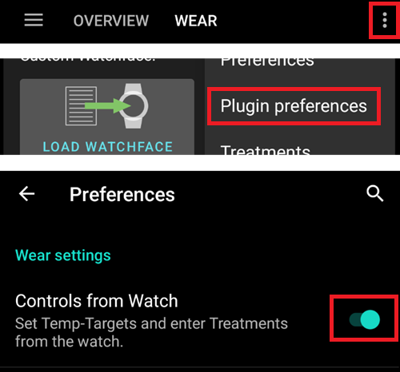

# Configurador

Dependendo de suas configurações pode-se abrir o Configurador através de um separador na parte superior do ecrã ou através do menu hambúrguer.

O Configurador (Conf) é o separador onde ativa e desativa os módulos de configurações. As caixas do lado esquerdo (A) permitem selecionar qual usar, as caixas do lado direito (C) permitem que as veja como um separador (E) no AndroidAPS. Caso a caixa direita não esteja ativada, pode chegar à função utilizando o menu hamburger (D) no topo esquerdo do ecrã.

Onde existem configurações adicionais disponíveis dentro do módulo, pode clicar na roda dentada (B) que o levará para as configurações específicas dentro das preferências.

**Primeira configuração:** Desde AAPS 2.0 um assistente de instalação guia através do processo de configuração do AndroidAPS. Carregue no menu de 3 pontos no lado superior direito do ecrã (F) e selecione 'Assistente de instalação' para usá-lo.

## Separador ou menu Hambúrguer

Com a caixa de seleção sob o símbolo de olho, você pode decidir como abrir a seção de programa correspondente.

## Perfil

Selecione o perfil basal que prefere usar. Ver a página [Perfis](../Usage/Profiles.md) para mais informações de configuração.

### Perfil local (recomendado)

O perfil local usa o perfil basal inserido manualmente no telefone. Assim que é selecionado, aparece um novo separador em AAPS, onde é possivel alterar os dados do perfil lidos da bomba se necessário. Com o próximo interruptor de perfil eles são então escritos na bomba em perfil 1. Este perfil é recomendado pois não depende de ligação à internet.

Your local profiles are part of [exported settings](../Usage/ExportImportSettings.rst). So make sure to have a backup in a safe place.

Buttons:

* green plus: add
* red X: delete
* blue arrow: duplicate

#### Clone profile switch

You can easily create a new local profile from a profile switch. In this case timeshift and percentage will be applied to the new local profile.

1. Go to treatments tab.
2. Select ProfileSwitch.
3. Press "Clone".
4. You can edit the new local profile in Local Profile (LP) tab or via the hamburger menu.

If you want to switch from Nightscout profile to local profile just do a profile switch on your NS profile and clone the profile switch as described above.

#### Upload local profiles to Nightscout

Local profiles can also be uploaded to Nightscout. The settings can be found in NS Client preferences.

Advantage:

* no internet connection necessary to change profile settings
* profile changes can be made directly on the phone
* new profile can be created from profile switch
* local profiles can be uploaded to Nightscout

Disadvantage:

* none

### Perfil NS

NS Profile uses the profiles you have saved on your Nightscout site (https://[yournightscoutsiteaddress]/profile). You can use the [Profile Switch](../Usage/Profiles.md) to change which of those profiles is active, this writes the profile to the pump in case of AndroidAPS failure. This allows you to easily create multiple profiles in Nightscout (i.e.. work, home, sports, holidays, etc.). Shortly after clicking on "Save" they will be transferred to AAPS if your smartphone is online. Even without an Internet connection or without a connection to Nightscout, the Nightscout profiles are available in AAPS once they have been synchronized.

Do a **profile switch** to activate a profile from Nightscout. Press and hold the current profile in the AAPS homescreen at the top (grey field between the light blue "Open/Closed Loop" field and the dark blue target area field) > Profile switch > Select profile > OK. AAPS also writes the selected profile into the pump after the profile change, so that it is available without AAPS in an emergency and continues to run.

Advantage:

* multiple profiles
* easy to edit via PC or tablet

Disadvantage:

* no local changes to profile settings
* profile cannot be changed directly on the phone

## Insulina

Select the type of insulin curve you are using. The options 'Rapid-Acting Oref', Ultra-Rapid Oref' and 'Free-Peak Oref' all have an exponential shape. More information is listed in the [OpenAPS docs](http://openaps.readthedocs.io/en/latest/docs/While%20You%20Wait%20For%20Gear/understanding-insulin-on-board-calculations.html#understanding-the-new-iob-curves-based-on-exponential-activity-curves), the curves will vary based on the DIA and the time to peak.

The DIA is not the same for each person. That's why you have to test it for yourself. But it must always be at least 5 hours. You can read more about that in the Insulin Profile section of [this](../Getting-Started/Screenshots#insulin-profile) page.

For Rapid-Acting and Ultra-Rapid, the DIA is the only variable you can adjust by yourself, the time to peak is fixed. Free-Peak allows you to adjust both the DIA and the time to peak, and must only be used by advanced users who know the effects of these settings.

The [insulin curve graph](../Getting-Started/Screenshots#insulin-profile) helps you to understand the different curves. You can view it by enabling the tickbox to show it as a tab, otherwise it will be in the hamburger menu.

### Rapid-Acting Oref

* recommended for Humalog, Novolog and Novorapid
* DIA = pelo menos 5.0h
* Máx. peak = 75 minutes after injection (fixed, not adjustable)

### Ultra-Rapid Oref

* recommended for FIASP
* DIA = pelo menos 5.0h
* Máx. peak = 55 minutes after injection (fixed, not adjustable)

For a lot of people there is practically no noticeable effect of FIASP after 3-4 hours any more, even if 0.0xx units are available as a rule then. This residual amount can still be noticeable during sports, for example. Therefore, AndroidAPS uses minimum 5h as DIA.

### Free Peak Oref

With the "Free Peak 0ref" profile you can individually enter the peak time. The DIA is automatically set to 5 hours if it is not specified higher in the profile.

This effect profile is recommended if an unbacked insulin or a mixture of different insulins is used.

## Fonte de Glic.

Select the blood glucose source you are using - see [BG Source](BG-Source.rst) page for more setup information.

* [xDrip+](https://xdrip-plus-updates.appspot.com/stable/xdrip-plus-latest.apk)
* NSClient BG
* [MM640g](https://github.com/pazaan/600SeriesAndroidUploader/releases)
* [Glimp](https://play.google.com/store/apps/details?id=it.ct.glicemia&hl=de) - only version 4.15.57 and newer are supported
* [Dexcom App (patched)](https://github.com/dexcomapp/dexcomapp/) - Select 'Send BG data to xDrip+' if you want to use xDrip+ alarms.
    
    

* [Poctech](http://www.poctechcorp.com/en/contents/268/5682.html)

## Bomba

Select the pump you are using.

* [Dana R](DanaR-Insulin-Pump.md)
* Dana R Korean (for domestic DanaR pump)
* Dana Rv2 (DanaR pump with firmware upgrade)
* [Dana RS](DanaRS-Insulin-Pump.md)
* [Accu Chek Combo Pump](Accu-Chek-Combo-Pump.md) (requires ruffy installation)
* MDI (receive AAPS suggestions for your multiple daily injections therapy)
* Virtual pump (open loop for pump which don't have any driver yet - AAPS suggestions only)

For dana pumps, use **Advanced settings** to activate BT watchdog if necessary. It switches off bluetooth for one second if no connection to the pump is possible. This may help on some phones where the bluetooth stack freezes.

## Detecção de Sensibilidade

Select the type of sensitivity detection. This will analyze historical data on the go and make adjustments if it recognizes that you are reacting more sensitively (or conversely, more resistant) to insulin than usual. Details about the Sensitivity Oref0 algorithm can be read in the [OpenAPS docs](http://openaps.readthedocs.io/en/latest/docs/walkthrough/phase-4/advanced-features.html#auto-sensitivity-mode).

You can view your sensitivity on the homescreen by selecting SEN and watching the white line. Note, you need to be in [Objective 8](../Usage/Objectives#objective-8-adjust-basals-and-ratios-if-needed-and-then-enable-autosens) in order to let Sensitivity Detection/[Autosens](../Usage/Open-APS-features.html#autosens) automatically adjust the amount of insulin delivered. Before reaching that objective, the Autosens percentage / the line in your graph is displayed for information only.

### Absorption settings

If you use Oref1 with SMB you must change **min_5m_carbimpact** to 8. The value is only used during gaps in CGM readings or when physical activity "uses up" all the blood glucose rise that would otherwise cause AAPS to decay COB. At times when [carb absorption](../Usage/COB-calculation.rst) can't be dynamically worked out based on your bloods reactions it inserts a default decay to your carbs. Basically, it is a failsafe.

## APS

Select the desired APS algorithm for therapy adjustments. You can view the active detail of the chosen algorithm in the OpenAPS(OAPS) tab.

* OpenAPS MA (meal assist, state of the algorithm in 2016)
* OpenAPS AMA (advanced meal assist, state of the algorithm in 2017)  
    More detail about OpenAPS AMA can be found in the [OpenAPS docs](http://openaps.readthedocs.io/en/latest/docs/Customize-Iterate/autosens.html#advanced-meal-assist-or-ama). In simple terms the benefits are after you give yourself a meal bolus the system can high-temp more quickly IF you enter carbs reliably.  
    Note you need to be in [Objective 9](../Usage/Objectives#objective-9-enabling-additional-oref0-features-for-daytime-use-such-as-advanced-meal-assist-ama) in order to use OpenAPS AMA.
* [OpenAPS SMB](../Usage/Open-APS-features.md) (super micro bolus, most recent algorithm for advanced users)  
    Note you need to be in [Objective 10](../Usage/Objectives#objective-10-enabling-additional-oref1-features-for-daytime-use-such-as-super-micro-bolus-smb) in order to use OpenAPS SMB and min_5m_carbimpact must be set to 8 in Config builder > Sensitivity detection > Sensitivity Oref1 settings.

## Loop

Define whether you want to allow AAPS automatic controls or not.

### Open Loop

AAPS continuously evaluates all available data (IOB, COB, BG...) and makes treatment suggestions on how to adjust your therapy if necessary. The suggestions will not be executed automatically (as in closed loop) have to be entered manually into the pump or by using a button in case you are using a compatible pump (Dana R/RS or Accu Chek Combo). This option is for getting to know how AndroidAPS works or if you are using an unsupported pump.

### Closed Loop

AAPS continuously evaluates all available data (IOB, COB, BG...) and automatically adjusts the treatment if necessary (i.e. without further intervention by you) to reach the set target range or value (bolus delivery, temporary basal rate, insulin switch-off to avoid hypo etc.). The Closed Loop works within numerous safety limits, which you can be set individually. Closed Loop is only possible if you are in [Objective 6](../Usage/Objectives#objective-6-starting-to-close-the-loop-with-low-glucose-suspend) or higher and use a supported pump.

## Objectivos (programa de aprendizagem)

AndroidAPS has a number of objectives that you have to fulfill step by step. This should guide you safely through setting up a closed loop system. It guarantees that you have set everything up correctly and understand what the system does exactly. This is the only way you can trust the system.

You should [export your settings](../Usage/ExportImportSettings.rst) (including progress of the objectives) on a regularly basis. In case you have to replace your smartphone later (new purchase, display damage etc.) you can simply import those settings.

See [Objectives](../Usage/Objectives.rst) page for more information.

## Tratamentos

If you view the Treatments (Treat) tab, you can see the treatments that have been uploaded to nightscout. Should you wish to edit or delete an entry (e.g. you ate less carbs than you expected) then select 'Remove' and enter the new value (change the time if necessary) through the [carbs button on the home screen](../Getting-Started/Screenshots.md#carb-correction).

## Geral

### Visão Geral

Displays the current state of your loop and buttons for most common actions (see [section The Homescreen](../Getting-Started/Screenshots.md) for details). Settings can be accessed by clicking the cog wheel.

#### Keep screen on

Option 'Keep screen on' will force Android to keep the screen on at all times. This is useful for presentations etc. But it consumes a lot of battery power. Therefore, it is recommended to connect the smartphone to a charger cable.

#### Buttons

Define which Buttons are shown on the home screen.

* Tratamentos
* Calculadora
* Insulina
* Carbs
* CGM (opens xDrip+)
* Calibration

Furthermore, you can set shortcuts for insulin and carb increments and decide whether the notes field should be shown in treatment dialogues.

#### QuickWizard settings

Create a button for a certain standard meal (carbs and calculation method for the bolus) which will be displayed on the home screen. Use for standard meals frequently eaten. If different times are specified for the different meals you will always have the appropriate standard meal button on the home screen, depending on the time of day.

Note: Button will not be visible if outside the specified time range or if you have enough IOB to cover the carbs defined in the QuickWizard button.

#### Advanced settings

Enable super bolus functionality in wizard. Use with caution and do not enable until you learn what it really does. Basically, the basal for the next two hours is added to the bolus and a two hour zero-temp activated. **AAPS looping functions will be disabled - so use with care! If you use SMB AAPS looping functions will be disabled according to your settings in ["Max minutes of basal to limit SMB to"](../Usage/Open-APS-features#max-minutes-of-basal-to-limit-smb-to), if you do not use SMB looping functions will be disabled for two hours.** Details on super bolus can be found [here](https://www.diabetesnet.com/diabetes-technology/blue-skying/super-bolus).

### Ações

Some buttons to quickly access common features:

* Profiles Switch (see [Profiles page](../Usage/Profiles.md) for more setup information)
* Temporary targets
* Set / cancel temp. taxa basal
* Extended bolus (DanaR/RS or Combo pump only)
* Record for any specific care entries
    
    * BG check
    * Prime / fill - record pump site change and prime (if not done on pump)
    * CGM sensor insert
    * Pump battery change
    * Note
    * Exercise
* View the current sensor, insulin, canula and pump battery ages
* History browser
* TDD (Total daily dose = bolus + basal per day)

Some doctors use - especially for new pumpers - a basal-bolus-ratio of 50:50. Therefore ratio is calculated as TDD / 2 * TBB (Total base basal = sum of basal rate within 24 hours). Others prefer range of 32% to 37% of TDD for TBB. Like most of these rules-of-thumb it is of limited real validity. Note: Your diabetes may vary!

### Comunicador SMS

Allows remote caregivers to control some AndroidAPS features via SMS, see [SMS Commands](../Children/SMS-Commands.rst) for more setup information.

### Food

Displays the food presets defined in the Nightscout food database, see [Nightscout Readme](https://github.com/nightscout/cgm-remote-monitor#food-custom-foods) for more setup information.

Note: Entries cannot be used in the AndroidAPS calculator. (View only)

### Wear

Monitor and control AAPS using your Android Wear watch (see [page Watchfaces](../Configuration/Watchfaces.md)). Use settings (cog wheel) to define which variables should be considered when calculating bolus given though your watch (i.e. 15min trend, COB...).

If you want to bolus etc. from the watch then within "Wear settings" you need to enable "Controls from Watch".

Through Wear tab or hamburger menu (top left of screen, if tab is not displayed) you can

* Resend all data. Might be helpful if watch was not connected for some time and you want to push the information to the watch.
* Open settings on your watch directly from your phone.

### xDrip Statusline (watch)

Display loop information on your xDrip+ watchface (if you are not using AAPS/[AAPSv2 watchface](../Configuration/Watchfaces.md)

### Ongoing Notification

Displays a summary of current BG, delta, active TBR%, active basal u/h and profile, IOB and split into bolus IOB and basal IOB on the phones's dropdown screen and phone's lock screen.

### Cliente NS

Setup sync of your AndroidAPS data with Nightscout.

If **Log app start to NS** is activated each AndroidAPS will be visible in Nightscout. Might be useful to detect problems with the app (i.e. battery optimization not disabled for AAPS) but can flood the Nightscout graph with entries.

#### Alarm options

Activate/deactivate AndroidAPS alarms

#### Connection settings

Offline looping, disable roaming...

If you want to use only a specific WiFi network you can enter its **WiFi SSID **. Several SSIDs can be separated by semicolon. To delete all SSIDs enter a blank space in the field.

#### Advanced settings

* Auto backfill missing BGs from Nightscout
* Create announcement from errors Create Nightscout announcement for error dialogs and local alerts (also viewable in careportal in treatments section)
* Enable local broadcast to other apps like xDrip+
* NS upload only (sync disabled)
* No upload to NS
* Always use basal absolute values -> Must be activated if you want to use [Autotune](https://openaps.readthedocs.io/en/latest/docs/Customize-Iterate/autotune.html) properly.

### Manutenção

Email and number of logs to be send. Normally no change necessary.

### Configurador

Use tab for config builder instead of hamburger menu.