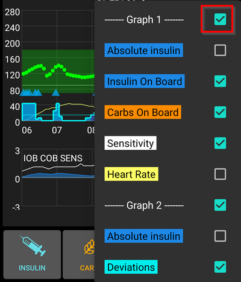

# AndroidAPS screens

## Ecrã inicial

This is the first screen you will come across when you open AndroidAPS and it contains most of the information that you will need day to day.

### Section A - Tabs

* Navigate between the various AndroidAPS modules.
* Alternatively you can change screens by swiping left or right.
* Displayed tabs can be selected in [config builder](../Configuration/Config-Builder#tab-or-hamburger-menu).

### Section B - Profile & target

#### Perfil

* Current profile is displayed in the left bar.
* Long press profile bar to view profile details or to [switch between different profiles](../Usage/Profiles#profile-switch).
* If profile switch was made with duration remaining time in minutes is shown in brackets.

#### Target

* Current target blood glucose level is displayed in the right bar.
* Long press target bar to set a [temporary target](../Usage/temptarget.md).
* If temp target is set bar turns yellow and remaining time in minutes is shown in brackets.

#### Visualization of Dynamic target adjustment

* AAPS can dynamically adjust your target based on sensitivity if you are using SMB algorithm.
* Enable either one or both of the [following options](../Configuration/Preferences#openaps-smb-settings) 
   * "sensitivity raises target" and/or 
   * "resistance lowers target" 
* If AAPS detects resistance or sensitivity the target will change from what is set from profile. 
* When it alters the target glucose background will change to green.

### Section C - BG & loop status

#### Current blood glucose

* Latest blood glucose reading from your CGM is shown on the left side.
* Color of the BG value reflects the status to the defined [range](../Configuration/Preferences#range-for-visualization). 
   * green = in range
   * red = below range
   * yellow = above range
* The greyish block in the middle shows minutes since last reading and changes since last reading, in the last 15 and 40 minutes.

#### Loop status

* A new icon shows loop status:
   
   * green circle = loop running
   * green circle with dotted line = [low glucose suspend (LGS)](../Usage/Objectives#objective-6-starting-to-close-the-loop-with-low-glucose-suspend)
   * red circled = loop disabled (not working permanently)
   * yellow circle = loop suspended (temporarily paused but basal insulin will be given) - remaining time is shown below icon
   * grey circle = pump disconnected (temporarily no insulin dosage at all) - remaining time is shown below icon
   * Orange circle = super bolus running - remaining time is shown below icon
   * blue circle with dotted line = open loop

* Long press the icon to open the menu to disable, suspend, re enable loop or disconnect / reconnect pump.
   
   

### Section D - IOB, COB, BR and AS

* Syringe: insulin on board (IOB) - amount of active insulin inside your body
   
   * The insulin on board figure would be zero if just your standard basal was running and there was no insulin remaining from previous boluses. 
   * IOB may be negative if there have recently been periods of reduced basal.
   * Press the icon to see the split of bolus and basal insulin

* Grain: [carbs on board (COB)](../Usage/COB-calculation.rst) - yet unabsorbed carbs you have eaten before -> icon pulses if carbs are required

* Purple line: basal rate - icon changes reflecting temporary changes in basal rate (flat at 100%) 
   * Press the icon to see the base basal rate and details of any temp basal (including remaining duration)
* Arrows up & down: indicating actual [autosens](../Usage/Open-APS-features#autosens) status (enabled or disabled) and value is shown below icon

#### Carbs required

* Carbs suggestions are given when the reference design detects that it requires carbs.
* This is when the oref algorithm thinks I can't rescue you by 0 (zero) temping and you will need carbs to fix.
* The carb notifications are much more sophisticated than the bolus calculator ones. You might see carbs suggestion whilst bolus calculator does not show missing carbs.
* Carb required notifications can be pushed to Nightscout if wished, in which case an announcement will be shown and broadcast.

### Section E - Status lights

* Status lights give a visual warning for 
   * Cannula age
   * Insulin age (days reservoir is used)
   * Reservoir level (units)
   * Sensor age
   * Battery age and level (%)
* If threshold warning is exceeded, values will be shown in yellow.
* If threshold critical is exceeded, values will be shown in red.
* Settings can be made in [preferences](../Configuration/Preferences#status-lights).

### Section F - Main graph

* Graph shows your blood glucose (BG) as read from your glucose monitor (CGM). 
* Notes entered in action tab such as fingerstick calibrations and carbs entries as well as profile switches are shown here. 
* Long press on the graph to change the time scale. You can choose 6, 12, 18 or 24 hours.
* The green area reflects your target range. It can be configured in [preferences](../Configuration/Preferences#range-for-visualization).
* Blue triangles show [SMB](../Usage/Open-APS-features#super-micro-bolus-smb) - if enabled in [preferences](.../Configuration/Preferences#openaps-smb-settings).
* Optional information:
   
   * Previsão
   * Basals
   * Activity - insulin activity curve

#### Activate optional information

* Click the triangle on the right side of the main graph to select which information will be displayed in the main graph.
* For the main graph just the three options above the line "\---\---- Graph 1 \---\----" are available.
   
   

#### Prediction lines

* **Orange** line: [COB](../Usage/COB-calculation.rst) (colour is used generally to represent COB and carbs)
   
   Prediction line shows where your BG (not where COB itself!) will go based on the current pump settings and assuming that the deviations due carb absorption remain constant. This line only appears if there are known COB.

* **Dark blue** line: IOB (colour is used generally to represent IOB and insulin)
   
   Prediction line shows what would happen under the influence of insulin only. For example if you dialled in some insulin and then didn’t eat any carbs.

* **Light blue** line: zero-temp (predicted BG if temporary basal rate at 0% would be set)
   
   Prediction line shows how the IOB trajectory line would change if the pump stopped all insulin delivery (0% TBR).

* **Dark yellow** line: [UAM](../Configuration/Sensitivity-detection-and-COB#sensitivity-oref1) (un-announced meals)
   
   Unannounced meals means that a significant increase in glucose levels due to meals, adrenaline or other influences is detected. Prediction line is similar to the ORANGE COB line but it assumes that the deviations will taper down at a constant rate (by extending the current rate of reduction).

Usually your real glucose curve ends up in the middle of these lines, or close to the one which makes assumptions that closest resemble your situation.

#### Basals

* A **solid blue** line shows the basal delivery of your pump and reflects the actual delivery over time.
* The **dotted blue** line is what the basal rate would be if there were no temporary basal adjustments (TBRs).
* In times standard basal rate is given the area under the curve is shown in dark blue.
* When the basal rate is temporarily adjusted (increased or decreased) the area under the curve is shown in light blue.

#### Activity

* The **thin yellow** line shows the activity of Insulin. 
* It is based on the expected drop in BG of the insulin in your system if no other factors (like carbs) were present.

### Section G - additional graphs

* You can activate up to four additional graphs below the main graph.
* To open settings for additional graphs click the triangle on the right side of the [main graph](../Getting-Started/Screenshots#section-f-main-graph) and scroll down.

* To add an additional graph check the box on the left side of its name (i.e. \---\---- Graph 1 \---\----).

#### Absolute insulin

* Active insulin including boluses **and basal**.

#### Insulin on board

* Shows the insulin you have on board (= active insulin in your body). It includes insulin from bolus and temporary basal (**but excludes basal rates set in your profile**).
* If there were no [SMBs](../Usage/Open-APS-features#super-micro-bolus-smb), no boluses and no TBR during DIA time this would be zero.
* IOB can be negative if you have no remaining bolus and zero/low temp for a longer time.
* Decaying depends on your [DIA and insulin profile settings](../Configuration/Config-Builder#local-profile-recommended). 

#### Carbs On Board

* Shows the carbs you have on board (= active, not yet decayed carbs in your body). 
* Decaying depends on the deviations the algorithm detects. 
* If it detects a higher carb absorption than expected, insulin would be given and this will increase IOB (more or less, depending on your safety settings). 

#### Deviations

* **GREY** bars show a deviation due to carbs. 
* **GREEN** bars show that BG is higher than the algorithm expected it to be. Green bars are used to increase resistance in [Autosens](../Usage/Open-APS-features#autosens).
* **RED** bars show that BG is lower than the algorithm expected. Red bars are used to increase sensitivity in [Autosens](../Usage/Open-APS-features#autosens).
* **YELLOW** bars show a deviation due to UAM.

#### Sensitivity

* Shows the sensitivity that [Autosens](../Usage/Open-APS-features#autosens) has detected. 
* Sensitivity is a calculation of sensitivity to insulin as a result of exercise, hormones etc.

#### Activity

* Shows the activity of insulin, calculated by your insulin profile (it's not derivative of IOB). 
* The value is higher for insulin closer to peak time.
* It would mean to be negative when IOB is decreasing. 

#### Deviation slope

* Internal value used in algorithm.

### Section H - Buttons

* Buttons for insulin, carbs and Calculator are 'always on'. 
* Other Buttons have to be setup in [preferences](../Configuration/Preferences#buttons).

#### Insulina

* To give a certain amount of insulin without using [bolus calculator](../Configuration/Screenhots#bolus-wizard).
* By checking the box you can automatically start your [eating soon temp target](../Configuration/Preferences#default-temp-targets).
* If you do not want to bolus through pump but record insulin amount (i.e. insulin given by syringe) check the corresponding box.

#### Carbs

* To record carbs without bolusing.
* Certain [pre-set temporary targets](../Configuration/Preferences#default-temp-targets) can be set directly by checking the box.
* Time offset: When will you / have you been eaten carbs (in minutes).
* Duration: To be used for ["extended carbs"](../Usage/Extended-Carbs.rst)
* You can use the buttons to quickly increase carb amount.
* Notes will be uploaded to Nightscout - depending on your settings for [NS client](../Configuration/Preferences#ns-client).

#### Calculadora

* See [details below](../Configuration/Screenhots#bolus-wizard)

#### Calibrations

* Sends a calibration to xDrip+ or opens Dexcom calibration dialogue.
* Must be activated in [preferences](../Configuration/Preferences#buttons).

#### CGM

* Opens xDrip+.
* Back button returns to AAPS.
* Must be activated in [preferences](../Configuration/Preferences#buttons).

#### Quick Wizard

* Easily enter amount of carbs and set calculation basics.
* Details are setup in [preferences](../Configuration/Preferences#quick-wizard).

## Bolus Wizard

When you want to make a meal bolus this is where you will normally make it from.

### Section I

* BG field is normally already populated with the latest reading from your CGM. If you don't have a working CGM then it will be blank. 
* In the CARBS field you add your estimate of the amount of carbs - or equivalent - that you want to bolus for. 
* The CORR field is if you want to modify the end dosage for some reason.
* The CARB TIME field is for pre-bolusing so you can tell the system that there will be a delay before the carbs are to be expected. You can put a negative number in this field if you are bolusing for past carbs.

### Section J

* SUPER BOLUS is where the basal insulin for the next two hours is added to the immediate bolus and a zero TBR is issued for the following two hours to take back the extra insulin. 
* The idea is to deliver the insulin sooner and hopefully reduce spikes.
* For details visit [diabetesnet.com](https://www.diabetesnet.com/diabetes-technology/blue-skying/super-bolus/).

### Section K

* Shows the calculated bolus. 
* If the amount of insulin on board already exceeds the calculated bolus then it will just display the amount of carbs still required.
* Notes will be uploaded to Nightscout - depending on your settings for [NS client](../Configuration/Preferences#ns-client).

### Section L

* Details of wizard's bolus calculation.
* You can deselect any that you do not want to include but you normally wouldn't want to.
* For safety reasons the **TT box must be ticked manually** if you want the bolus wizard to calculate based on an existing temporary target.

#### Combinations of COB and IOB and what they mean

* For safety reasons IOB boxed cannot be unticked when COB box is ticked as you might run the risk of too much insulin as AAPS is not accounting for what’s already given.
* If you tick COB and IOB unabsorbed carbs that are not already covered with insulin + all insulin that has been delivered as TBR or SMB will be taken into account.
* If you tick IOB without COB, AAPS takes account of already delivered insulin but won’t cover that off against any carbs still to be absorbed. This leads to a 'missing carbs' notice.
* If you bolus for **additional food** shortly after a meal bolus (i.e. additional desert) it can be helpful to **untick all boxes**. This way just the new carbs are being added as the main meal won't necessarily be absorbed so IOB won't match COB accurately shortly after a meal bolus.

#### Wrong COB detection

* If you see the warning above after using bolus wizard, AndroidAPS has detected that the calculated COB value maybe wrong. 
* So, if you want to bolus again after a previous meal with COB you should be aware of overdosing! 
* For details see the hints on [COB calculation page](../Usage/COB-calculation#detection-of-wrong-cob-values).

## Perfil Insulina

* This shows the activity profile of the insulin you have chosen in [config builder](../Configuration/Config-Builder#insulin). 
* The PURPLE line shows how much insulin remains after it has been injected as it decays with time and the BLUE line shows how active it is.
* The important thing to note is that the decay has a long tail. 
* If you have been used to manual pumping you have probably been used to assuming that insulin decays over about 3.5 hours. 
* However, when you are looping the long tail matters as the calculations are far more precise and these small amounts add up when they are subjected to the recursive calculations in the AndroidAPS algorithm.

For a more detailed discussion of the different types of insulin, their activity profiles and why all this matters you can read an article here on [Understanding the New IOB Curves Based on Exponential Activity Curves](https://openaps.readthedocs.io/en/latest/docs/While%20You%20Wait%20For%20Gear/understanding-insulin-on-board-calculations.html#understanding-the-new-iob-curves-based-on-exponential-activity-curves)

And you can read an excellent blog article about it here: [Why we are regularly wrong in the duration of insulin action (DIA) times we use, and why it matters…](http://www.diabettech.com/insulin/why-we-are-regularly-wrong-in-the-duration-of-insulin-action-dia-times-we-use-and-why-it-matters/)

And even more at: [Exponential Insulin Curves + Fiasp](http://seemycgm.com/2017/10/21/exponential-insulin-curves-fiasp/)

## Estado da Bomba

* Different information on pump status. Displayed information depends on your pump model.
* See [pumps page](../Hardware/pumps.rst) for details.

## Care Portal

Careportal replicated the functions you will find on your Nightscout screen under the “+” symbol which allows you to add notes to your records.

### Review carb calculation

* If you have used the [Bolus Wizard](../Getting-Started/Screenshots#bolus-wizard) to calculate insulin dosage you can review this calculation later on treatments tab.
* Just press the green Calc link. (Depending on pump used insulin and carbs can also be shown in one single line in treatments.)

### Carb correction

Treatment tab can be used to correct faulty carb entries (i.e. you over- or underestimated carbs).

1. Check and remember actual COB and IOB on homescreen.
2. Depending on pump in treatment tab carbs might be shown together with insulin in one line or as a separate entry (i.e. with Dana RS).
3. Remove the entry with the faulty carb amount.
4. Make sure carbs are removed successfully by checking COB on homescreen again.
5. Do the same for IOB if there is just one line in treatment tab including carbs and insulin.
   
   -> If carbs are not removed as intended and you add additional carbs as explained here (6.), COB will be too high and that might lead to too high insulin delivery.

6. Enter correct carb amount through carbs button on homescreen and make sure to set the correct event time.

7. If there is just one line in treatment tab including carbs and insulin you have to add also the amount of insulin. Make sure to set the correct event time and check IOB on homescreen after confirming the new entry.

## Loop, AMA / SMB

* These tabs show details about the algorithm's calculations and why AAPS acts the way it does.
* Calculations are each time the system gets a fresh reading from the CGM.
* For more details see [APS section on config builder page](../Configuration/Config-Builder#aps).

## Perfil

* Profile contains information on your individual diabetes settings:
   
   * DIA (Duration of Insulin Action)
   * IC or I:C: Insulin to Carb ratio
   * ISF: Insulin Sensitivity Factor
   * Basal rate
   * Target: Blood glucose level that you want AAPS to be aiming for

* You can either use a [local profile](../Configuration/Config-Builder#local-profile-recommended) that can be edited on your smartphone or a [Nightscout profile](../Configuration/Config-Builder#ns-profile) which must be edited on your NS page and transferred to your phone afterwards. For details see the corresponding sections on the [config builder page](/Configuration/Config-Builder.md).

## Treatment

History of the following treatments:

* Bolus & carbs -> option to [remove entries](../Getting-Started/Screenshots#carb-correction) to correct history
* [Bólus estendido](../Usage/Extended-Carbs#id1)
* Temporary basal rate
* [Temporary target](../Usage/temptarget.md)
* [Troca de Perfil](../Usage/Profiles.md)
* [Careportal](../Usage/CPbefore26#careportal-discontinued) - notes entered through action tab and notes in dialogues

## BG Source - xDrip, Dexcom App (pateched)...

* Depending on your BG source settings this tab is named differntly.
* Shows history of CGM readings and offers option to remove reading in case of failure (i.e. compression low).

## NSClient

* Displays status of the connection with your Nightscout site.
* Settings are made in [preferences](../Configuration/Preferences#nsclient). You can open the corresponding section by clicking the cog wheel on the top right side of the screen.
* For troubleshooting see this [page](../Usage/Troubleshooting-NSClient.md).