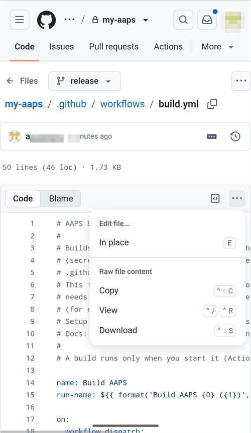
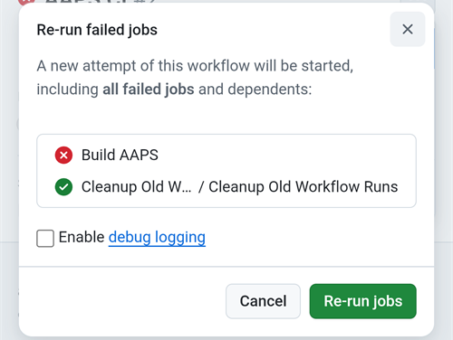

(aaps-ci-troubleshooting)=

# Compilação no navegador: resolução de problemas

```{note}
This page collects troubleshooting tips for the [Browser build](../SettingUpAaps/BrowserBuild.md).
```

(aaps-builder-troubleshooting)=

## AAPS Builder

### Step 1: the repository

(aaps-builder-ts-repo-exists)=

#### "my-aaps already exists in this account"


You already have this repository, for example from an earlier attempt. Close the GitHub tab, keep that name in step 1 of the setup page and go on. If you already did steps 2 and 3 for it, your key is still in it: continue with [step 4](#aaps-builder-step4). If it was made with an earlier version of the setup page, update its workflow once as explained in [Updating AAPS](#aaps-builder-updates). You prefer a fresh start? Type another name, for example `my-aaps-2`, and use the same keystore in step 2.

(aaps-builder-ts-user-not-found)=

#### "No GitHub user with this name"


- **"No GitHub user with this name"** no passo 1: escreva o seu nome de utilizador do GitHub, como aparece no seu perfil do GitHub, não o seu e-mail.
- **No "Build AAPS" or "Run workflow" button, or the repository is empty**: the repository was not created from the template. Delete it (**Settings** → bottom of the page → **Delete this repository**) and do [step 1](#aaps-builder-step1) again with the **Create my private repository** button.

### Step 3: the secret

(aaps-builder-ts-404)=

#### "Page not found" (404)


- **"Page not found" (404) quando a página de configuração abre o GitHub**: inicie sessão em github.com no mesmo navegador (o GitHub mostra 404 para repositórios privados quando não tem sessão iniciada). Se tiver sessão iniciada, o nome de utilizador ou o nome do repositório no passo 1 da página de configuração não corresponde ao seu repositório. Escreva os nomes exatos.

### Step 4: the build

(aaps-builder-ts-workflow-not-found)=

#### "This workflow does not exist"


Right after the repository is created, GitHub may not have read its workflow file yet: **Build AAPS** is missing from the **Actions** tab, and there is no **Run workflow** button. Any small change to the file makes GitHub read it:

1. In your repository, open **Code**, then the folder `.github`, then `workflows`, then the file `build.yml`.
2. Tap the **⋯** menu at the top right of the file, then **Edit file… In place** (on a computer, click the pencil).

   

3. Tap at the very end of the text and add an empty line (Enter). Tap **Commit changes…** at the top.

   

4. Tap **Commit changes** again.

   

5. Open the **Actions** tab again: **Build AAPS** is now in the list of workflows (on a phone, the list opens with the icon at the left of **All workflows**). Tap it, then **Run workflow**.

   

(aaps-builder-ts-build-failed)=

#### The build failed (red cross)

1. On the setup page, tap **Open my builds** and tap the build with the red cross.

   

2. The page of the build shows **Failure**, and which part failed: **AAPS / Check** (the repository, the secret, the version or the variant: nothing was built) or **AAPS / Build AAPS**.

   

3. Scroll down to **Annotations**, with your finger on the text, not on the diagram. The red lines explain the problem: tap **Show more** to read the whole message, then find it below.

   

- **"Secret KEYSTORE_SET is missing"**: do step 3 of the setup page.
- **A compilação para com "This repository is PUBLIC"**: no seu repositório, abra **Settings** → **General** → **Danger Zone** → **Change visibility** → **Private** e depois compile de novo.
- **"Version … does not exist"**: only released versions of **AAPS** can be built, the ones on the [tags page](https://github.com/nightscout/AndroidAPS/tags) of nightscout/AndroidAPS, such as `3.3.2.0`. A branch name such as `dev` doesn't work. Use `latest`, or type a tag exactly as listed.
- **"Variant … is not supported"**: your workflow file is an older version. Replace it as explained in [Updating AAPS](#aaps-builder-updates).
- **"The secret is too short"**, **"The secret is not a valid code"** ou **"The secret does not contain a keystore"**: foi colado o texto errado no secret, muitas vezes a própria palavra `KEYSTORE_SET`, ou só parte do código. In your repository, open **Settings** → **Secrets and variables** → **Actions**, edit `KEYSTORE_SET` and paste the long code from **Copy secret** again (redo step 2 of the setup page first if you closed it).
- **"Keystore, password or alias is wrong"**: check your keystore's password and alias, then redo steps 2 and 3 of the setup page.
- **"Google Drive access has expired or was revoked"**: redo [step 6](#aaps-builder-google-drive) and update the `GDRIVE_OAUTH2` secret.
- **"Process completed with exit code 1" and a red line with only a link to `services.gradle.org`**, after less than a minute: the build could not download Gradle, a tool it needs to build the app. The Gradle website was not responding. Your repository and your settings are fine. Wait half an hour, then [run the build again](#aaps-ci-rerun).
- **Another error**: [read the build log](#aaps-ci-read-the-logs), then [run the build again](#aaps-ci-rerun). If it fails again the same way, ask for help with the name of the failed step and the error lines. Nunca partilhe o conteúdo dos seus secrets.

### Step 5: the app

- **Não há link Download, ou abriu a app GitHub**: a app GitHub não consegue transferir compilações. Open the build in Chrome as explained in [step 5](#aaps-builder-step5). Para impedir que os links do GitHub abram na app: Android **Settings** (Definições) → **Apps** (Aplicações) → **GitHub** → **Open by default** (Abrir por predefinição) → desative **Open supported links** (Abrir links suportados).

## Resolução de problemas do AAPS-CI

(aaps-ci-read-the-logs)=
### Primeiro: descubra o que correu mal

Quando uma compilação falha, o GitHub guarda um registo de cada passo. O registo diz-lhe qual passo falhou e porquê. Leia-o antes de tentar qualquer outra coisa: a mensagem de erro é o que deve procurar nesta página, e é o que quem o ajudar vai pedir.

1. Na sua cópia do AndroidAPS no GitHub, abra **Actions**. Uma compilação que falhou tem uma cruz vermelha. Toque no nome dela.

   

2. O resumo da execução mostra **Failure** (falha) e, por baixo, o job que falhou (**Build AAPS**, com uma cruz vermelha).

   

3. Desça até **Annotations** (anotações) e toque na linha vermelha **Build AAPS**.

   

4. O job abre-se. Os passos com um visto cinzento funcionaram. O passo com a cruz vermelha é o que falhou: o GitHub abre-o para si. Os passos seguintes foram ignorados (círculo cinzento).

   

5. Leia as linhas logo acima de `Error: Process completed with exit code 1.`: elas explicam o problema. Neste exemplo, o passo **Retrieving Google Drive access token** falhou com `invalid_grant` e `Token has been expired or revoked.`, veja [O token de atualização do Google expirou](#aaps-ci-google-token-expired).

   

```{tip}
Vai pedir ajuda? Partilhe o nome do passo que falhou e as linhas de erro (uma captura de ecrã como a de cima serve). Nunca partilhe o conteúdo dos seus secrets.
```

(aaps-ci-update-secret)=
#### Atualizar um secret

Muitas correções significam substituir o valor de um secret. Na sua cópia do AndroidAPS no GitHub, vá a **Settings** → **Secrets and variables** → **Actions** e toque no lápis ao lado do secret.


Introduza ou cole o novo valor e toque em **Update secret**. O GitHub nunca mostra o valor antigo: o campo está sempre vazio.


(aaps-ci-rerun)=
#### Executar de novo a compilação depois de uma correção

Depois de corrigir a causa, não precisa de começar do zero: abra a execução que falhou, toque em **...** (canto superior direito) e depois em **Re-run failed jobs**.


Toque em **Re-run jobs**. Também pode iniciar uma nova compilação a partir de **Run workflow**, como habitualmente.



(aaps-ci-preparation-web)=
### Página web aaps-ci-preparation
  - A página de preparação é mostrada por um servidor local temporário (por exemplo o Simple Web Server num computador), que também recebe o token de atualização do Google.
  - Se vir o ecrã abaixo, o servidor local parou ou não está acessível.
  - Feche a página de preparação, verifique se o servidor local está a funcionar e depois abra de novo o aaps-ci-preparation.html da mesma forma que no Passo 2 e conclua os passos restantes. Isto é necessário sobretudo ao criar a primeira ligação ao Google durante a configuração.

  

(aaps-ci-google-token-expired)=
### O token de atualização do Google expirou
  - Os tokens de atualização (refresh tokens) OAuth2 do Google expiram se não forem usados durante 6 meses e também podem deixar de ser válidos noutras situações (por exemplo, se alterou a senha da sua conta Google ou se retirou o acesso manualmente). Para mais informações, veja a [documentação OAuth2 do Google](https://developers.google.com/identity/protocols/oauth2).
  - No [registo da compilação](#aaps-ci-read-the-logs), o passo **Retrieving Google Drive access token** falha com `invalid_grant` e `Token has been expired or revoked.`:

  

  - Se a sua compilação falhar por causa de um token de atualização do Google expirado ou retirado, tem de repetir os passos de [Autorização do Google Drive](#aaps-ci-google-drive-auth) para obter um novo token `GDRIVE_OAUTH2`, [atualizar o secret](#aaps-ci-update-secret) no seu repositório GitHub e depois [executar de novo a compilação](#aaps-ci-rerun).
  - Se a autorização falhar outra vez, ou se o Google já não pedir o seu consentimento, retire primeiro o acesso do AAPS à sua conta Google, veja [abaixo](#aaps-ci-google-remove-access).

(aaps-ci-google-remove-access)=
### Retirar o acesso do AAPS à sua conta Google e reiniciar a autorização
  - Se a autorização do Google Drive continuar a falhar, ou se quiser começar de novo do zero, retire primeiro o acesso que deu ao AAPS e depois faça a autorização outra vez.
  - No telefone, abra [https://myaccount.google.com](https://myaccount.google.com), toque em **Security** (Segurança), desça até **Your connections to third-party apps & services** (As suas ligações a apps e serviços de terceiros) e abra a lista de aplicações ligadas. Também pode ir diretamente para [https://myaccount.google.com/connections](https://myaccount.google.com/connections).
  - Toque em **AAPS** na lista.

  

  - A página mostra o acesso que deu ao AAPS (os ficheiros do Google Drive usados com a aplicação). Toque em **Delete all** (Eliminar tudo) para retirar a ligação, ou toque em **See details** (Ver detalhes) para a ver primeiro.

  

  - Na página de detalhes, toque em **Remove all access** (Remover todo o acesso).

  

  - Toque em **Confirm** (Confirmar).

  

  - O Google confirma que o AAPS já não tem acesso. O AAPS já não aparece na lista de aplicações ligadas.

  

  - Agora reinicie a autorização do zero: feche **tanto** a página de preparação como a aplicação de gestão de ficheiros, abra de novo o aaps-ci-preparation.html a partir do gestor de ficheiros e repita os passos de [Autorização do Google Drive](#aaps-ci-google-drive-auth). O Google vai pedir-lhe de novo para conceder o acesso e a página vai dar-lhe um novo token `GDRIVE_OAUTH2`.
  - [Atualize o secret `GDRIVE_OAUTH2`](#aaps-ci-update-secret) no seu repositório GitHub com o novo token e depois [execute de novo a compilação](#aaps-ci-rerun).

(aaps-ci-disable-software)=
### Disable Software That May Interfere With OAuth Verification
  - Disable any VPN or security app (firewall, antimalware,...) on the phone before trying to get the OAuth key.

(aaps-ci-actions-permission)=
### Verificar as definições de permissões do GitHub Actions
  - Confirme que as políticas do GitHub Actions estão definidas como «Allow all actions and reusable workflows» (permitir todas as ações e workflows reutilizáveis) (Settings → Actions → General). Se o alterar, toque em **Save** por baixo das opções.

  

`actions/checkout@v4` and `actions/setup-java@v4` are not allowed to be used in `xxxxx/AndroidAPS`. Actions in this workflow must be: within a repository owned by `xxxxx`

(aaps-ci-workflow-permissions)=
### Verificar as definições de permissões dos workflows do GitHub
  - Se a compilação falhar logo no início com um erro «Invalid workflow file» (ficheiro de workflow inválido) parecido com o de baixo, as permissões predefinidas dos workflows do seu repositório são demasiado restritas:

```
Invalid workflow file
The workflow is not valid. .github/workflows/aaps-ci.yml (Line: 361, Col: 3):
Error calling workflow 'xxxxx/AndroidAPS/.github/workflows/cleanup-workflow-runs.yml@...'.
The nested job 'cleanup' is requesting 'actions: write', but is only allowed 'actions: none'.
```

  - Confirme que as permissões dos workflows estão definidas como «Read and write permissions» (permissões de leitura e escrita) (Settings → Actions → General → Workflow permissions). Depois guarde e execute de novo o workflow de compilação.

  

(aaps-ci-password-special-characters)=
### A compilação falha ao verificar a senha da keystore
  - No [registo da compilação](#aaps-ci-read-the-logs), o passo **Validating keystore, alias and password** falha com `Either KEYSTORE_BASE64, KEYSTORE_PASSWORD, KEY_PASSWORD, or KEY_ALIAS is incorrect`, seguido de `Keystore was tampered with, or password was incorrect`. A compilação para aí: a keystore e as senhas são verificadas antes de o AAPS ser compilado.

  

  - O workflow de compilação mantém todos os caracteres das suas senhas sem alterações. Introduza `KEYSTORE_PASSWORD` e `KEY_PASSWORD` exatamente como são, sem acrescentar uma barra invertida ou qualquer outro carácter de escape. Se acrescentou barras invertidas, [atualize os secrets](#aaps-ci-update-secret) com a senha exatamente como ela é. O exemplo abaixo está errado: a senha é `Example2026`, a barra invertida foi acrescentada.

  

  - Se a compilação continuar a falhar ao assinar o APK, embora a senha esteja correta, e a senha tiver `$`, um acento grave (backtick), `"` ou `\`, o ficheiro de workflow no seu fork é anterior a setembro de 2026 e ainda interpreta estes caracteres. [Sincronize o seu fork](#Update-to-new-version-update-your-repo) com a versão dev mais recente e depois execute de novo o workflow de compilação.
  - A barra vertical `|` é um caso especial. A página de preparação da [Opção 1](#aaps-ci-option1) junta a keystore, as senhas e o alias num único secret `KEYSTORE_SET`, separados por `|`, e o workflow divide-o por esse carácter. A senha gerada pela página de preparação tem apenas letras e números, por isso isto não pode acontecer com a Opção 1. Só pode acontecer se tiver criado um secret `KEYSTORE_SET` manualmente a partir de uma senha que contém `|`. Nesse caso, elimine o `KEYSTORE_SET` e introduza em vez dele os secrets separados da [Opção 2](#aaps-ci-option2).
