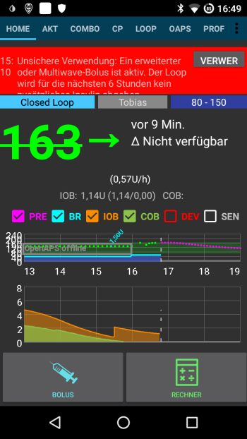

# Accu-Chek Combo - Dicas para uso básico

## Como assegurar operações suaves

* Ande **SEMPRE com o smartphone consigo**, deixe-o próximo da sua cama à noite.
* Certifique-se sempre de que a bateria da bomba está o mais completa possível. Consulte a seção da bateria para dicas sobre a bateria.
* É melhor **não mexer na app ruffy** enquanto o sistema está em execução. Se a app for iniciada novamente, a conexão com a bomba pode ser interrompida. Uma vez que a bomba esteja conectada ao ruffy, não há necessidade de se reconectar. Mesmo após um reinício do telefone, a conexão é restabelecida automaticamente. Se possível, mova a app para um ecrã não utilizado ou para uma pasta no seu smartphone para que não a abra acidentalmente.
* Se abrir involuntariamente a app ruffy durante o loop, é melhor reiniciar o smartphone logo de seguida.
* Sempre que possível, opere com a bomba apenas através da app AndroidAPS. Para facilitar isto, ative o Key lock na bomba em **CONFIGURAÇÕES DE BOMBA / BLOQUEIO DE CHAVE / ON**. Somente ao trocar a bateria ou o cartucho, é necessário utilizar as chaves da bomba. 

## Bomba inacessível. O que fazer?

### Ativar alarme da bomba inacessível

* Na AndroidAPS, vá até **Preferências / Alertas locais** e ative o **Alertar caso não seja possível alcançar a bomba** e configure o **Limite para bomba inacessível [Min]** para **31** minutos. 
* Isto dar-lhe-á tempo suficiente para não ativar o alarme ao sair da sala enquanto o seu telefone é deixado na mesa de secretária, mas informará se a bomba não pode ser alcançada durante o tempo que excede a duração de uma taxa basal temporária.

### Restaurar o alcance da bomba

* Quando a AndroidAPS reporta um alarme de **Bomba inacessível** , primeiro solte o bloqueio de teclas e **pressione qualquer tecla na bomba** (por exemplo, botão "para baixo"). Assim que o ecrã da bomba se desligar, pressione **ATUALIZAR** no separador **Combo** na AndroidAPS. Na maior parte dos casos, a comunicação volta a funcionar.
* Se isto não ajudar, reinicie o smartphone. Após o reinício, a AndroidAPS e o ruffy serão reativados e uma nova conexão será estabelecida com a bomba.
* Os testes com smartphones diferentes mostraram que certos smartphones acionam o erro "bomba inacessível" com mais frequência do que outros. [AAPS Phones](https://docs.google.com/spreadsheets/d/1gZAsN6f0gv6tkgy9EBsYl0BQNhna0RDqA9QGycAqCQc/edit) lista de smartphones testados com sucesso. 

### Raiz das causas, e consequências, de erros de comunicação frequentes

* Em telefones com **pouca memória** (ou **configurações agressivas de poupança de bateria** ), a AndroidAPS é frequentemente encerrada. Pode identificar isto quando os botões Insulina e Calculadora no ecrã inicial não são exibidos ao abrir a AAPS, porque o sistema está a iniciar. Isto pode ativar alarmes de "bomba inacessível" na inicialização. No campo **Última Ligação** do separador Combo, é possível verificar quando a AndroidAPS comunicou pela última vez com a bomba. 

 

* Este erro pode gastar a bateria da bomba rapidamente porque o perfil basal é lido pela bomba quando a aplicação é reiniciada.
* Aumenta também a probabilidade de causar o erro que faz com que a bomba rejeite todas as conexões de entrada até que um botão na bomba seja pressionado. 

## Falha do cancelamento de uma basal temporária

* Ocasionalmente, a AndroidAPS pode não cancelar automaticamente um alerta de **DBT CANCELADA**. Then you have to either press **UPDATE** in the AndroidAPS **Combo tab** or the alarm on the pump will be confirmed.

## Pump battery considerations

### Changing the battery

* After a **low battery** alarm, the battery should be changed as soon as possible to always have enough energy for a reliable Bluetooth communication with the smartphone, even if the phone is within a wider distance of the pump.
* Even after a **low battery** alarm, the battery might be used for a significant amount of time. However, it is recommended to always have a fresh battery with you after a "low battery" alarm rang.
* To do this, long-press on **Closed Loop** on the main screen and select **Suspend loop for 1h**. 
* Wait for the pump to communicate with the phone and the Bluetooth logo on the pump has faded.

* Release the key lock on the pump, put the pump into stop mode, confirm a possibly canceled temporary basal rate, and change the battery.
* Then put the pump back in run mode select **Resume** when long-pressing on **Suspended** on the main screen.
* AndroidAPS will re-set a necessary temporary basal rate with the arrival of the next blood sugar value. 

### Battery type and causes of short battery life

* As intensive Bluetooth communication consumes a lot of energy, only use **high-quality batteries** like Energizer Ultimate Lithium ,the "power one"s from the "large" Accu-Chek service pack, or if you are going for a rechargeable battery, use Eneloop batteries. 

 

Ranges for typical life time of the different battery types are as follows:

* **Energizer Ultimate Lithium**: 4 to 7 weeks
* **Power One Alkaline** (Varta) from the servcie pack: 2 to 4 weeks
* **Eneloop rechargable** batteries (BK-3MCCE): 1 to 3 weeks

If your battery life is significantly shorter than the ranges given above, please check the following possible causes:

* The latest version (March 2018) of the [ruffy App](https://github.com/MilosKozak/ruffy) significantly improved pump battery lifetime. Make sure you are on that version if you have issues with a short battery lifetime.
* There are some variants of the screw-on battery cap of the Combo pump, which partially short circuit the batteries and drain them quickly. The caps without this problem can be recognized by the golden metal contacts.
* If the pump clock does not "survive" a short battery change, it is likely that the capacitor is broken which keeps the clock running during a brief power outage. In this case, only a replacement of the pump by Roche will help, which is not a problem during the warranty period. 
* The smart phone hardware and software (Android operating system and bluetooth stack) also impact the battery lifetime of the pump, even though the exact factors are not completely known yet. If you have the opportunity, try another smartphone and compare battery lifetimes.

## Daylight saving time changes

* Currently the combo driver does not support automatic adjustment of the pump's time.
* During the night of a daylight saving time change, the time of the smartphone is updated, but the time of the pump remains unchanged. This leads to an alarm due to deviating times between the systems at 3 am.
* If you do not want to be awakened at night, **deactivate the automatic daylight saving time changeover on the mobile phone** in the evening before the time changeover and adjust the times manually the next morning.

## Extended bolus, multiwave bolus

The OpenAPS algorithm does not support a parallel extended bolus or multiwave bolus. But a similar treatment can be achieved by the following alternative:

* Input the carbs but do not bolus for it. The loop algorithm will react more aggressively. If needed, use **eCarbs** (extended carbs).

* If you are tempted to just use the extended or multiwave bolus directly on the pump, AndroidAPS will penalize you with disabling the closed loop for the next six hours to ensure that no excess insulin dosage is calculated.

## Alarms at bolus delivery

* If AndroidAPS detects that an identical bolus has been successfully delivered at the same minute, bolus delivery will be prevented with identical number of insulin units. If you really want to bolus the same insulin twice in short succession, just wait two more minutes and then deliver the bolus again. If the first bolus has been interrupted or was not delivered for other reasons, you can immediately re-submit the bolus since AAPS 2.0.
* Background is a safety mechanism that reads the pump's bolus history before submitting a new bolus to correctly calculate insulin on board (IOB), even when a bolus is delivered directly from the pump. Here indistinguishable entries must be prevented.

* This mechanism is also responsible for a second cause of the error: If during the use of the bolus calculator another bolus is delivered via the pump and thereby the bolus history changes, the basis of the bolus calculation is wrong and the bolus is aborted. 

