# Cum să utilizați modulul Autotune

Documentația despre algoritmul Autotune poate fi găsită în [documentația OpenAPS](https://openaps.readthedocs.io/en/latest/docs/Customize-Iterate/autotune.html).

Modulul Autotune este o implementare a algoritmului autotune OpenAPS în AAPS.

Modulul Autotune este disponibil în versiunile AAPS de la [3.4](#version3400), dar este ascuns în mod implicit.

## Arătați modulul Autotune

Creați un fișier gol numit `enable_autotune` în subdosarul `extra` din [dosarul AAPS](#preferences-maintenance-settings) al telefonului dumneavoastră.

***NOTĂ: Asigurați-vă că verificați în setările **AAPS** unde este dosarul AAPS, și că ați plasat fișierul în cel corect, un număr de mai multe persoane au fost depistate punând fișierul în dosarul greșit.***

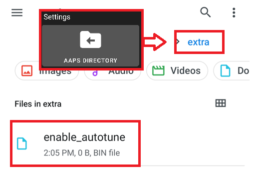

Autotune va fi afișat în Constructorul de Configurare după ce reporniți AAPS.

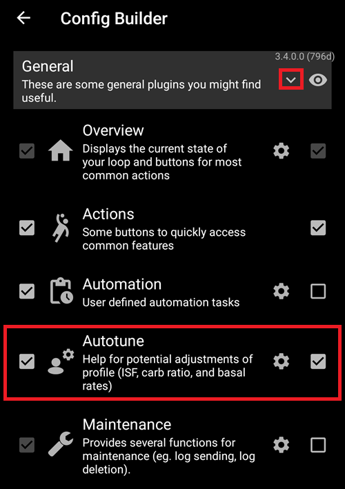

***NOTĂ: Dacă nu puteți vedea opțiunea `Autotune`, va trebui să apăsați pe săgeata evidențiată (caseta roșie) pentru a extinde și a afișa toate setările în secțiunea `General`.***

## Interfața utilizatorului pentru Autotune


- Puteți selecta în meniul derulant profilul de intrare pe care doriți să-l ajustați (în mod implicit profilul dvs. activ în prezent va fi selectat)
  - Notă: De fiecare dată când selectați un profil nou, rezultatele anterioare vor fi șterse și parametrii ce țin de reglarea zilnică vor fi setați la valoarea implicită
- Apoi Zile reglare este pentru selecția de zile care vor fi folosite în calculele pentru reglajul profilului tău. Valoarea minimă este de 1 zi, iar valoarea maximă este de 30 de zile. Acest număr nu ar trebui să fie prea mic astfel încât să se obțină rezultate iterative și omogene (peste 7 zile pentru fiecare calcul)
  - Notă: de fiecare dată când modificați parametrul Zile de reglare, rezultatele anterioare vor fi eliminate
- Ultima Rulare reprezintă o legătură care recuperează ultimul calcul valid. Dacă nu ați lansat Autotune în ziua curentă sau dacă rezultatele anterioare au fost șterse cu o modificare a parametrului de calcul de mai sus, atunci puteți recupera parametrii și rezultatele ultimei rulări reușite.
- Atenționare vă arată, de exemplu, unele informații despre profilul selectat (dacă aveți mai multe valori ICI sau mai multe valori ISF)
  - Notă: Calcularea automată funcționează cu o singură valoare IC și o singură valoare ISF. În prezent nu există niciun algoritm Autotune care să regleze un IC circadian sau un ISF circadian. Dacă profilul tău de intrare are mai multe valori, poți vedea în secțiunea de avertizări valoarea medie luată în considerare pentru a-ți regla profilul.
- Check Input Profile button open the Profile Viewer to allow you a quick verification of your profile (Units, DIA, IC, ISF, basal and target)
  - Note: Autotune will only tune your IC (single value), ISF (single value) and basal (with circadian variation). Units, DIA and target will remain unchanged in output profile.

- "Run Autotune" will launch Autotune calculation with selected profile and the number of Tune days
  - Note: Autotune calculation can take a long time. Once launched, you can switch to another view (home, ...) and come back later in Autotune plugin to see results

  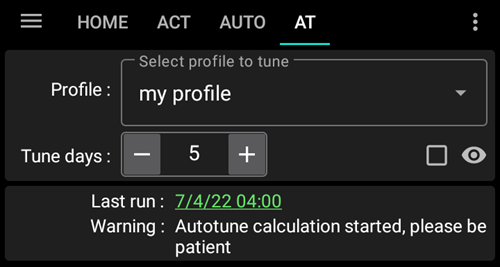

- Then during the run you will see intermediate results below

  - Note: During run, settings are locked, so you cannot change anymore selected input profile or the number of day. You will have to wait the end of current calculation if you want to launch another run with other parameters.

  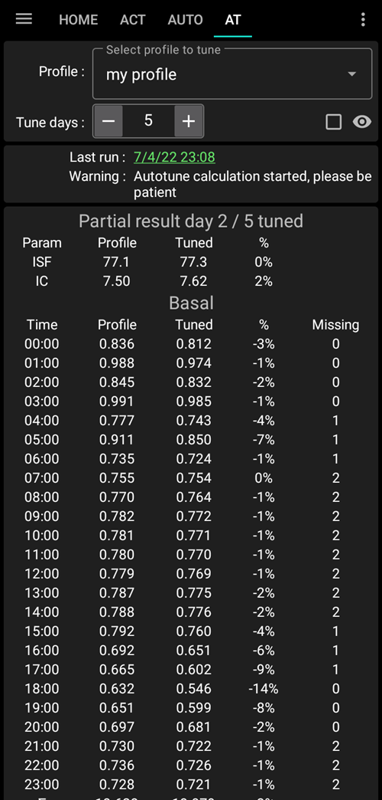

- When Autotune calculation is finished, you will see the result (Tuned profile) and four buttons below.

  

- It's important to always compare input profile (column "Profile"), output profile (column "Tuned") and the percentage of variation for each value (Column "%").

- For basal rates, you also have the number of "missing days". You have missing days when Autotune don't have enough data categorized as "Basal" to tune basal rate for this period (for example after each meal when you have carbs absorption). This number should be as low as possible especially when basal is important (for example during the night or at the end of the afternoon)

- The "Compare profiles" button open the profile comparator view. Input profile is in blue, and output profile (named "Tuned") is in red.

  - Note: in the example below input profile has circadian variation for IC and ISF, but output calculated profile has a single value. If it's important for you to get a circadian output profile see [Circadian IC or ISF profile](#autotune-circadian-ic-or-isf-profile) below.

  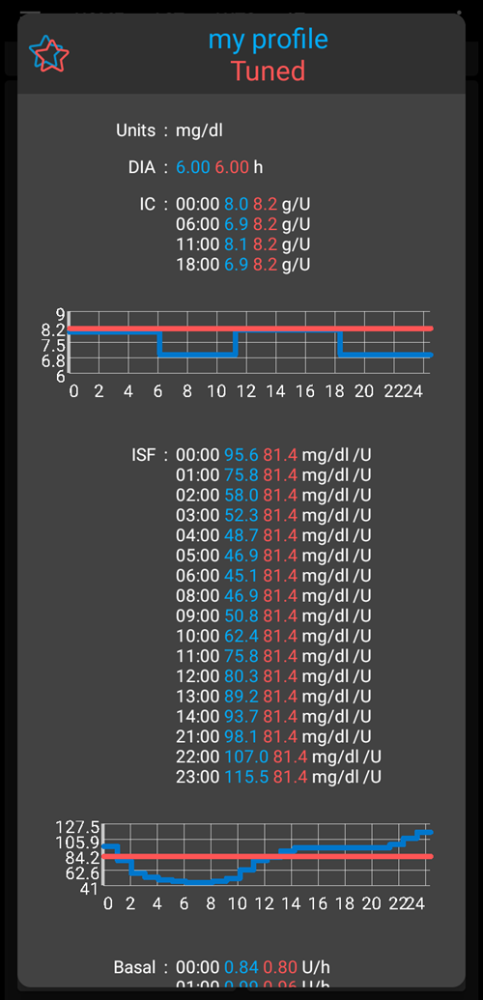

- If you trust results (low percentage of variation between input profile and output profile), you can click on "Activate profile" button and then click on OK to validated.

  - Activate Tuned profile will automatically create a new profile "Tuned" in your Local profile plugin.
  - If you already have a profile named "Tuned" in your local profile plugin, then this profile will be updated with calculated Autotune profile before the activation

  

- Dacă credeți că profilul ajustat mai trebuie reglat (spre exemplu, dacă credeți că anumite variații sunt prea importante), atunci puteți apăsa pe butonul "Copiați la profilul local"

  - Un nou profil cu prefixul "Ajustat" și data și ora executării vor fi create în modulul de profil local

  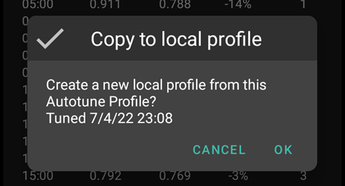

- Apoi puteți selecta profilul local pentru a edita profilul Ajustat (acesta va fi selectat în mod implicit atunci când deschideți modulul pentru profil local)

  - valorile din profilul local, dar rotunjite în interfața utilizatorului în raport cu capacitățile pompei

  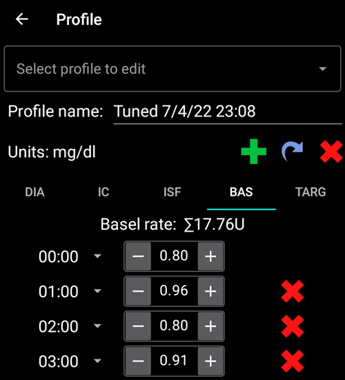

- Dacă doriți să înlocuiți profilul de intrare cu rezultatul Autotune, apasăți pe butonul "Actualizați profilul de intrare" și validați notificarea prin apăsarea pe OK

  - Notă: dacă apăsați pe "Activare profil" după "Actualizați profilul de intrare", atunci veți activa profilul actualizat și nu profilul implicit "Ajustat"?

  

- Dacă ați actualizat profilul de intrare, atunci butonul "Actualizați profilul de intrare" este înlocuit de butonul "Reveniți la profilul de intrare" (a se vedea captura de ecran de mai jos). Puteți vedea imediat în acest fel dacă profilul dvs. curent de intrare din modulul pentru profilul local include deja rezultatul ultimei rulări sau nu. De asemenea, aveți posibilitatea de a vă recupera profilul de intrare fără rezultatul Autotune cu acest buton

  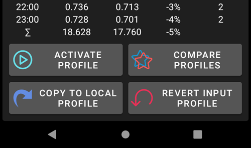


## Setări Autotune

(autotune-plugin-settings)=

### Setări modul Autotune

  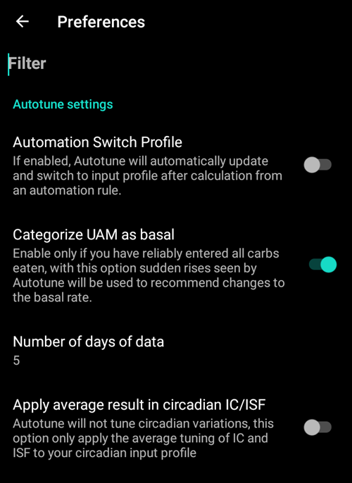

```{admonition} Only DEV
:class: info
Funcția de Comutare automată a profilului este disponibilă doar în modul Dev/Inginerie.
```

- Schimbare automată a profilului (implicit dezactivată): vedeți [Executați Autotune cu o condiție de automatizare](#autotune-run-autotune-with-an-automation-rule) mai jos. Dacă schimbați această setare pe Pornit, profilul de intrare va fi actualizat automat de către profilul Ajustat și va fi activat.
  - **Fiți atenți, trebuie să aveți încredere și să verificați în următoarele zile, că după o actualizare și o activare a profilului ajustat fără modificare, se îmbunătățește sistemul de buclă**

- Categorizează UAM ca bazală (implicit pornit): Această setare este pentru utilizatorii care folosesc AndroidAPS fără ca carbohidrații să fie introduși (complet UAM). Va opri (când este oprit) să catalogheze UAM ca bazală.
  - Notă: dacă aveți cel puțin o oră detectată de absorbție a carbohidraților în timpul unei zile, apoi toate datele clasificate ca "UAM" vor fi clasificate ca bazală, indiferent de această setare (pornită sau oprită)
- Numărul de zile de date (implicit 5): Puteți defini valoarea implicită cu această setare. De fiecare dată când selectați un nou profil în modului Autotune, parametrul zile de ajustare va fi înlocuit cu această valoare implicită
- Aplicați rezultatul mediu în IC/ISF circadian (implicit oprit): vedeți mai jos [Profilul circadian IC sau ISF](#autotune-circadian-ic-or-isf-profile).

### Alte setări

- Autotune folosește și raportul Max autosens și raportul Min autosens pentru a limita variația. Puteți vedea și ajusta aceste valori în Configurator > Modul detectare sensibilitate > Setări > Setări avansate

  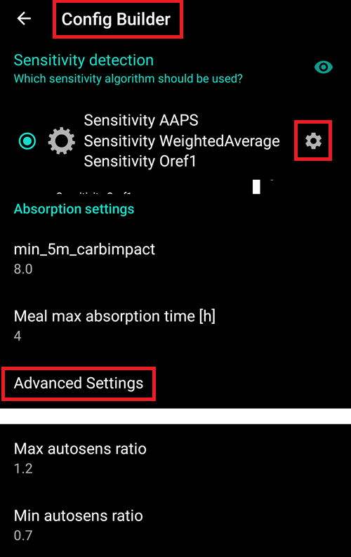


## Caracteristici avansate

(autotune-circadian-ic-or-isf-profile)=

### Profil Circadian IC sau ISF

- Dacă aveți o variație importantă a IC și/sau ISF în profilul dumneavoastră, și aveți încredere deplină în durata și variația dumneavoastră circadiană, apoi puteți seta "Aplicați rezultatul mediu în profilul circadian IC/ISF"

  - Țineți cont că calculul Autotune se va face întotdeauna cu o singură valoare, iar variația circadiană nu va fi reglată de Autotune.

- Vedeți în captura de ecran de mai jos profilul ajustat cu Aplică variația medie, oprită (pe partea stângă) și pornită (pe partea dreaptă)

  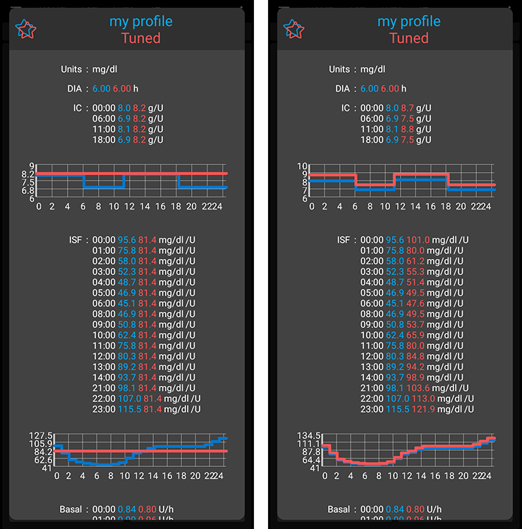


### Ajustați anumite zile ale săptămânii

- Dacă apăsați pe caseta de selectare cu ochiul din dreapta parametrului "Ajustează zile", veți vedea selecția zilei. Puteți specifica care zi a săptămânii ar trebui inclusă în calculul Autotune (în captura de ecran de mai jos puteți vedea un exemplu pentru "zile lucrătoare" cu sâmbătă și duminică eliminate din calculul Autotune)
  - Dacă numărul de zile incluse în calculul Autotune este mai mic decât numărul Zile ajustate, atunci veți vedea câte zile vor fi incluse în selectorul din dreapta Zile ajustate (10 zile în exemplul de mai jos)
  - Această setare oferă rezultate bune doar dacă numărul de zile rămase nu este prea mic (spre exemplu dacă ajustezi un anumit profil pentru zilele de sfârșit de săptămână cu doar duminica și sâmbăta selectate, trebuie să selectați un minimum de 21 sau 28 de Zile de reglare pentru a avea 6 sau 8 zile incluse în calculul Autotune)

  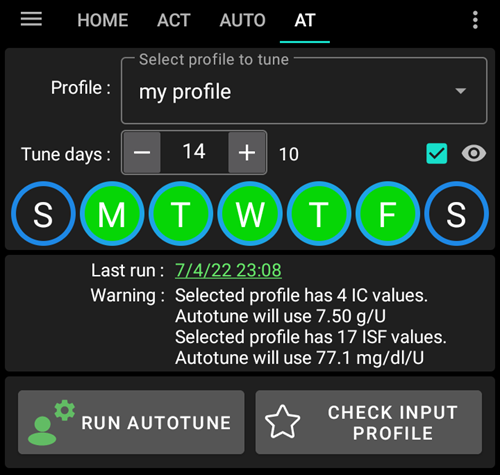

- În timpul calculului Autotune, puteți vedea progresul calculelor ("Rezultat parțial ziua 3 / 10 ajustată" în exemplul de mai jos)

  


(autotune-run-autotune-with-an-automation-rule)=

## Execuția Autotune cu o condiție de automatizare

```{admonition} Only DEV
:class: info
Funcția de Comutare automată a profilului este disponibilă doar în modul Dev/Inginerie.
```

Primul pas este definirea unui declanșator corect pentru o regulă de automatizare cu Autotune:

Notă: pentru mai multe informații despre cum să setați o condiție de automatizare, vedeți [aici](../DailyLifeWithAaps/Automations.md).

- Ar trebui să selectați declanșatorul pentru execuții programate: executați Autotune doar o dată pe zi, Autotune este proiectat să fie executat zilnic (pentru fiecare nouă execuție schimbați ziua și modificarea profilului ar trebui să fie minusculă)

  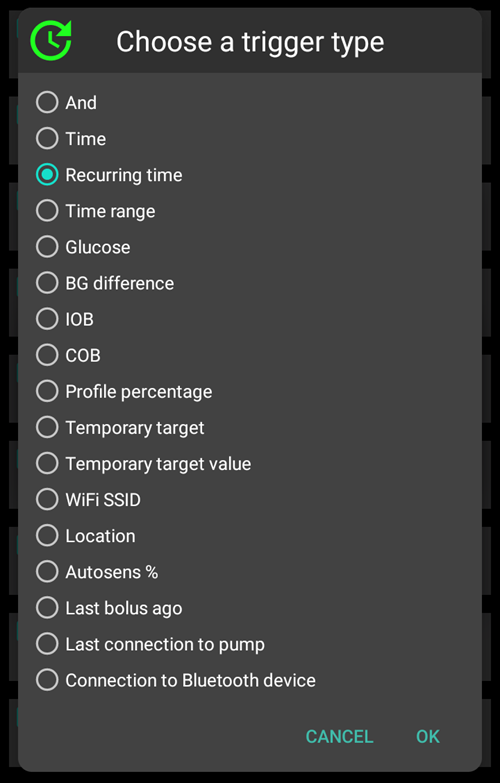

- Este mai bine la început să executați Autotune în timpul zilei pentru a putea verifica rezultatele. Dacă doriți să rulați Autotune în timpul nopții, trebuie să selectați în declanșator ora 4 dimineața sau mai târziu pentru a include ziua curentă în următorul calcul Autotune.

  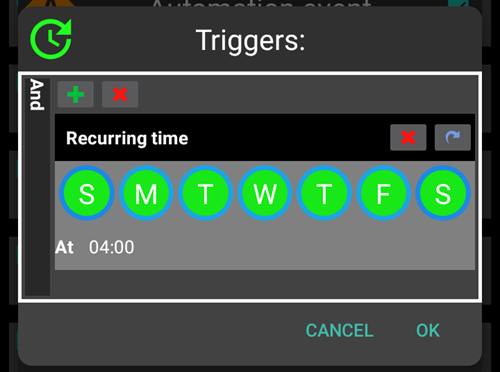

- Apoi puteți selecta acțiunea "Executați Autotune" din listă

  

- Apoi puteți selecta Acțiune Autotune pentru a ajusta parametrii pentru rularea dumneavoastră. Parametrii impliciți sunt "Profil activ", numărul implicit de zile pentru ajustare așa cum au fost definite în preferințele modulului Autotune, și Toate zilele sunt selectate.

  

- După câteva zile, dacă aveți încredere deplină în rezultatele Autotune și procentajul modificării este scăzut, puteți modifica [setările Autotune](#autotune-plugin-settings) "Comutarea automată a profilului" pe modul activat astfel profilul ajustat după calcul să fie actualizat și activat în mod automat.

Notă: dacă doriți să reglați automat profiluri pentru anumite zile ale săptămânii (de exemplu, un profil pentru "Zilele săptămânii" și altul pentru "Zile lucrătoare"), apoi creați o regulă pentru fiecare profil, selectează aceleași zile în declanșator și în acțiunea Autotune, zilele de reglare trebuie să fie suficient de multe pentru a fi sigur că se va face reglarea cu cel puțin 6 sau 8 zile, și nu uitați să selectați timpul după 4 dimineața în declanșator...

- Vedeți mai jos un exemplu de regulă pentru a regla "profilul meu" în toate "Zilele lucrătoare" cu 14 zile de reglaj selectate (deci doar 10 zile incluse în calculul Autotune).

  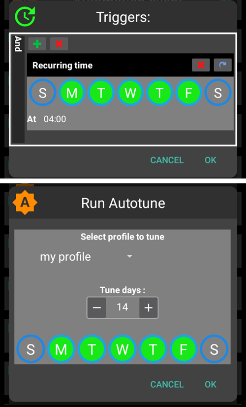


## Sfaturi și trucuri

Autotune funcționează cu informații existente în baza de date, deci dacă tocmai ați instalat AAPS pe un telefon nou, va trebui să așteptați câteva zile înainte de a putea lansa Autotune cu suficiente zile pentru a obține rezultate relevante.

Autotune este doar un ajutor, este important să verificați periodic dacă sunteți de acord cu profilul calculat. Dacă aveți îndoieli, schimbați setările de autoreglare (de exemplu numărul de zile) sau copiați rezultatele în profilul local și ajustați profilul înainte de a-l folosi.

Utilizați întotdeauna Autotune câteva zile manual pentru a verifica rezultatele înainte de a le aplica. și doar când aveți încredere deplină în rezultatele Autotune, și atunci când variația devine mică între profilul anterior și profilul calculat apoi începeți să utilizați Automatizarea (niciodată înainte)

- Autotune poate funcționa foarte bine pentru unii utilizatori și pentru alții nu, așa că **Dacă nu aveți încredere în rezultatul Autotunei, nu îl folosiți**

De asemenea, este important să analizăm rezultatele Autotune pentru a înțelege (sau a încerca să înțelegeți) de ce Autotune propune aceste modificări

- puteți avea o creștere sau o scădere totală a intensității profilului dumneavoastră (de exemplu o creștere a valorii bazalei totale asociată scăderii valorilor ISF și IC). ar putea urma câteva zile următoare cu corecție autosens peste 100% (este nevoie de mai mult agresivitate) sau sub 100% (sunteți mai sensibil)
- Uneori Autotune propune un echilibru diferit între ratele bazale și IC/FSI (de exemplu bazale mai mici și IC/FSI mai agresive)

Recomandăm să nu se folosească Autotune în următoarele cazuri:

- Nu introduceți toți carbohidrații
  - Dacă nu introduceți corecția carbohidraților pentru hipoglicemie, Autotune va vedea o creștere neașteptată a valorii glicemiei și va crește ratele bazalelor cu 4 ore mai devreme, ar putea fi opusul a ceea ce trebuie pentru a evita o hipoglicemie, mai ales dacă este la miezul nopții. De aceea e important să introduceți toți carbohidrații, mai ales când corectați pentru hipoglicemie.
- Aveți o mulțime de cicluri cu UAM detectate în timpul zilei.
  - Ați introdus toți carbohidrații și ați estimat corect carbohidrații?
  - Toate perioadele UAM (cu excepția cazului în care nu introduceți niciun carbohidrat într-o zi și clasificarea UAM ca bazală este dezactivată), toate perioadele dumneavoastră UAM vor fi clasificate ca bazale, acest lucru poate crește mult bazala dumneavoastră (mai mult decât este necesar)

- Absorbția dumneavoastră de carbohidrați este foarte lentă: dacă cea mai mare parte a absorbției de carbohidrați este calculată cu parametrul min_5m_carbimpact (poți vedea aceste perioade cu un punct portocaliu mic în partea superioară a curbei COB), calcularea COB ar putea fi greșită și ar putea duce la rezultate greșite.
  - Atunci când practicați sport, în general sunteți mai sensibili și glicemia dumneavoastră nu crește mult, așa că, în timpul sau după un exercițiu fizic, se obișnuiește să vedeți unele perioade cu carbohidrați lenți. Dar dacă aveți prea des absorbție lentă neașteptată a carbohidraților, atunci este posibil să aveți nevoie de o ajustare de profil (valoare mai mare de IC) sau un min_5m_carbimpact un pic prea mare.
- Aveți "zile foarte proaste", de exemplu sunteți blocați câteva ore în hiperglicemie cu o cantitate imensă de insulină pentru a putea coborî în interiorul intervalului țintă sau după schimbarea senzorului aveți perioade lungi de valori eronate ale glicemiei. Dacă în ultimele săptămâni aveți doar una sau două "zile rele", puteți dezactiva manual aceste zile în calculul Auotutne pentru a le exclude din calcul, și din nou **verificați cu atenție dacă puteți avea încredere în rezultate**
- Dacă procentajul modificării este prea important
  - Puteți încerca să creșteți numărul de zile pentru a obține rezultate mai omogene
