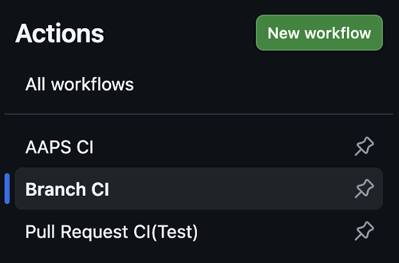
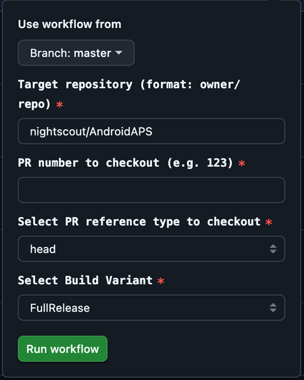

# Ramura de dezvoltare

<font color="#FF0000"><strong>Atenție:</strong></font>
Ramura Dev este doar pentru dezvoltarea viitoare a AAPS. Ar trebui folosit pe un telefon separat pentru testare <font color="#FF0000"><strong>nu pentru buclă reală!</strong></font>

Cea mai stabilă versiune de AAPS este cea din [Ramura Principală](https://github.com/nightscout/AndroidAPS/tree/master). Este recomandat să rămâneți pe ramura principală pentru folosirea buclei.

Versiunea dev a AAPS este doar pentru dezvoltatori și cei care testează care sunt confortabili cu stacktraces; în căutarea fișierelor de jurnal și poate cu pornirea depanatorul pentru a produce rapoarte de erori care sunt de ajutor pentru dezvoltatori (pe scurt: oameni care știu ce fac fără a fi ajutați!). Prin urmare, multe caracteristici nefinalizate sunt dezactivate. Pentru a activa aceste caracteristici, intrați în **Modul inginerie** prin crearea unui fișier numit `inginer_mode` în directorul /AAPS/extra . Activarea modului de inginerie poate strica complet bucla.

Cu toate acestea, versiunea dev este un loc bun pentru a vedea care sunt funcțiile testate și pentru a ajuta la remedierea erorilor și pentru a oferi feedback cu privire la funcționarea practică a noilor caracteristici. Adesea, oamenii vor testa ramura dev pe un telefon vechi și o pompă până când vor avea încredere că este stabilă - orice utilizare a acesteia este pe propriul risc. Când testați orice caracteristici noi, țineți minte că alegeți să testați o caracteristică încă în dezvoltare. Faceți acest lucru pe propriul risc & cu grija cuvenită pentru a vă menține în siguranță.

Dacă găsiți o eroare sau credeți că s-a întâmplat ceva greșit atunci când folosiți ramura Dev, atunci vedeți [secțiunea probleme](https://github.com/nightscout/AndroidAPS/issues) pentru a verifica dacă altcineva a găsit-o sau adăugați-o chiar dumneavoastră dacă nu. Cu cât puteți partaja mai multe informații aici cu atât mai bine (nu uitați că poate fi nevoie să partajați [fișierele de jurnal](../GettingHelp/AccessingLogFiles.md). Noile caracteristici pot fi de asemenea discutate pe [discord](https://discord.gg/4fQUWHZ4Mw).

O versiune dev are o dată de expirare. Acest lucru pare deranjant atunci când o folosiți în mod satisfăcător, dar servește unui scop. Când o singură versiune de dezvoltator circulă, este mai ușor să urmărești erorile pe care oamenii le raportează. Dezvoltatorii nu doresc să se afle într-o poziție în care circulă trei versiuni de dev unde erorile sunt reparate în unele și în altele nu, iar oamenii continuă să le raporteze pe cele corectate.

(branch-ci-test)=

## Test a specific branch (branch-ci)

To build a test branch, select branch-ci, which allows you to choose a specific branch for APK creation. You can use this method when you need to test the dev branch.




(github-pr-test)=

## Elemente de test într-o propunere de modificare (GitHub CI actions deploy)

Disponibil de la 3.3.2.1.dev

- Este adecvat pentru testatori sau pentru cei care contribuie la testare.

```{eval-rst}
.. raw:: html

    <!--crowdin: exclude-->
    <div align="center" style="max-width: 360px; margin: auto; margin-bottom: 2em;">
      <div style="position: relative; width: 100%; aspect-ratio: 9/16;">
        <iframe
          src="https://www.dailymotion.com/embed/video/x9rdx1q"
          style="position: absolute; top: 0; left: 0; width: 100%; height: 100%;"
          frameborder="0"
          allowfullscreen>
        </iframe>
      </div>
    </div>
```



- Numărul PR: Vă rugăm să introduceți numărul PR pe care doriți să-l testați.

- Tipuri de referință PR: tipurile de referință PR includ două opțiuni:
    
    - head:
    - Preia conținutul real din ramura autorului PR, adică istoricul original al comiterii fără operațiuni de îmbinare).
    - Aceasta este echivalentă cu starea originală a ramurei PR, ca și cum ar fi fost preluată direct de pe o copie derivată sau o ramură cu caracteristici.
    
    - fuzionare:
    
    - Preia rezultatul fuzionării presimulate a PR a GitHub-ului în ramura țintă (de exemplu, dev).
    - Aceasta este o comitere de îmbinare virtuală creată automat de GitHub.
    - Această confirmare există doar atunci când cererea de integrare nu are conflicte și poate fi îmbinată.
    
    - variant:
    
    - Vă rugăm să consultați [varianta](variant)