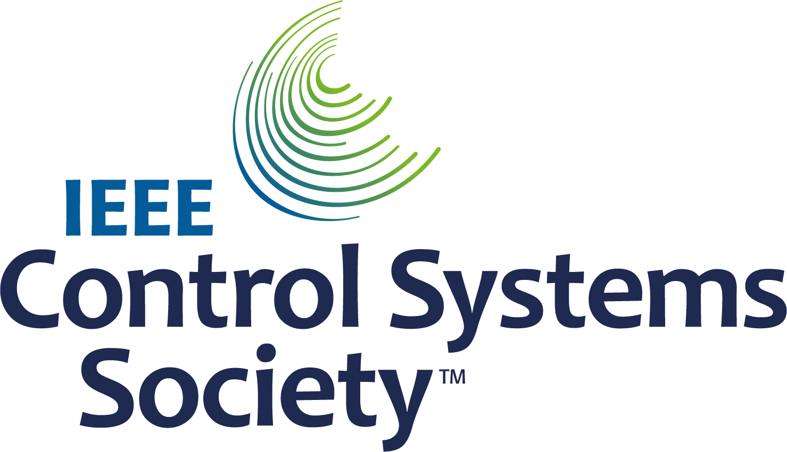
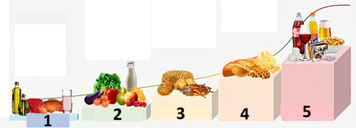
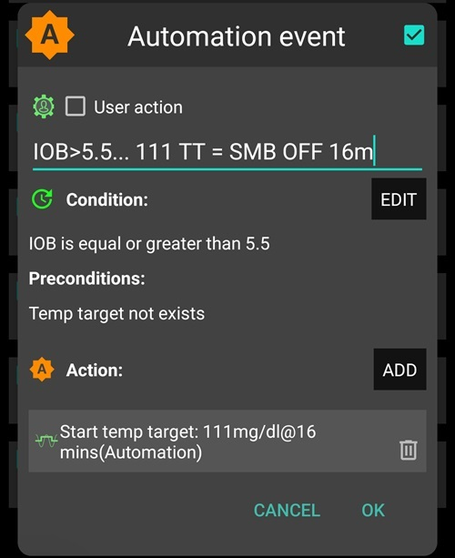
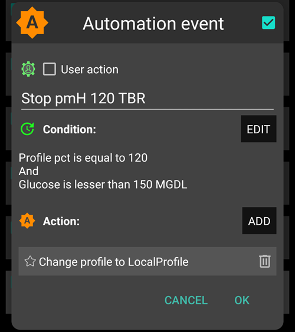

# Full Closed Loop


The main attraction of Full Closed Looping **FCL** is that it has the potential to mimic an artificial pancreas and make daily management easier without having the need to bolus for meals.

În timp ce **buclă închisă hibrid** ('HCL') se bazează pe algoritm, acesta necesită totuși ca utilizatorul să livreze bolusuri manual înainte de mese. Drept rezultat, bucla poate intra într-o oprire temporară (bazală temporară zero) pentru a preveni administrarea în exces a insulinei.

În **FCL** bolusurile legate de dimensiunea meselor nu mai sunt necesare: lăsați-le în baza algoritmului!  **AAPS** le poate permite fără ca utilizatorul să boluseze, și fără a face intrări de carbohidrați într-un mod numit 'mese neanunțate' **("UAM")**. **UAM** permite **AAPS** să tolereze mai bine intrările incorecte de carbohidrați fiind mai agresiv.

## La ce să ne așteptăm?

Există multe studii publicate cu privire la rezultatele favorabile pe care **FCL** le poate obține. Pentru lecturi suplimentare, vedeți:

1)   Biblioteca Națională de Medicină, PubMed [Prima utilizare a AndroidAPS cu livrare automată de insulină open-Source în Scenario-ul cu circuit închis complet: Pancreas4ALL Studiu pilot Randomizat](https://pubmed.ncbi.nlm.nih.gov/36826996/);

2)  ClinicalTrials.gov Biblioteca Națională de Medicină, Studiul clinic [Studiu de Fezabilitate și Siguranță al Studiului Automat cu Buclă administrată de Insulină Pancreas4ALL (ASAP)](https://www.clinicaltrials.gov/study/NCT04835350?term=Feasibility%20and%20Safety%20Study%20of%20the%20Automated%20Insulin%20Delivery%20Closed%20Loop%20System%20Pancreas4ALL%20(ASAP)&rank=1)

Succesul pentru **FCL** cere utilizatorului să:

- verifice dacă au îndeplinit cerințele **FCL**;
- creeze **Automatizări** care sunt adaptate nevoilor zilnice ale managementului lor; și
- ajusteze setările **AAPS** (în special **Automatizările**).


## Considerații generale de ce (nu) se trece de la HCL la FCL

**FCL** nu este pentru toată lumea:

- Unii utilizatori **FCL** ating TIR (70-180) aproximativ 90% și HbA1c sub 6%, dar alți utilizatori preferă un control mai strict. În special, reducerea la minimum a valorilor peste 140 mg/dl în dietele cu carbohidrați rapizi necesită probabil prebolusare.
- Reglarea **AAPS** poate fi dificilă. Nu este destinat acelor utilizatori care se simt copleșiți de AAPS.  Va trebui să dedicați câteva săptămâni pentru a ajusta și a regla **FCL**. Să dedicați acest timp poate duce la rezultate mai bune și la controlul **glicemiei**.
- Gestionarea meselor poate deveni mai ușoară, însă exercițiul fizic poate reprezenta încă o provocare în **FCL**. Celor mai mulți dintre noi ne place să limităm gustările din timpul sportului în încercarea de a controla greutatea corporală.
- Rămân încă dificultăți în a stabili un **FCL** pentru copii (discutat mai jos).


## Buclă hibridă închisă reglată bine

Este recomandabil să se stabilească mai întâi o **HCL** bine reglată înainte de a lua în considerare tranziția la **FCL**.  Succesul cu **FCL** necesită o reglare individualizată a setărilor utilizatorului astfel încât **AAPS** să poată oferi insulină pentru a imita îndeaproape modul reușit de buclă hibridă închisă al DUMNEAVOASTRĂ.

**FCL** cere utilizatorului să configureze și să regleze **Automatizările**. Cu toate acestea, utilizatorul trebuie să aibă o înțelegere sigură a nevoilor sale de gestionare a insulinei înainte de a se înhăma la **FCL**. Erorile pot fi mascate de contra-erori. Acest lucru poate crea un sistem **FCL** instabil, și îl poate face greu de corectat ulterior. Ar trebui să vă așteptați să atingeți un %TIR comparabil cu FCL așa cum vedeți astăzi în **HCL**.

**FCL este un sistem DIY creat din automatizări determinate de utilizator prin analizarea datelor sale atât din experiența de succes cu HCL și din experiența inițială cu FCL atunci când se ajustează setările.**

## Insulină rapidă (Lyumjev, Fiasp)

**FCL** necesită insulină rapidă.  Acesta este astfel încât la începutul creșterii **glicemiei**, **FCL** este în măsură să mențină **glicemia** în interval (prin definiție comună, sub 180 mg/dl (10 mmol/l)).

Un studiu de modelare (detalii vedeți LINK FullLoop V2/March2023; secțiunea 2.2) poate arăta în termeni cantitativi că <0>insulinele mai rapide</0>

Sursă:

 


IEEE Control Systems Magazine, ResearchGate [The Artificial Pancreas and Meal Control: An Overview of Postprandial Glucose Regulation in Type 1 Diabetes](https://www.researchgate.net/publication/322866519_The_Artificial_Pancreas_and_Meal_Control_An_Overview_of_Postprandial_Glucose_Regulation_in_Type_1_Diabetes);

- va rezulta în semnificativ mai puține vârfuri ale *glicemiei** decât ale insulinelor mai lente;
- tolerează primul bolus de la masă cu o întârziere de câteva minute fără a aduce la înălțimi inacceptabile ale vârfurilor; și
- minimizează efectul asupra vârfului **glicemiei** ale diferitelor cantități de carbohidrați (dimensiunea mesei).

**FCL** este puțin probabil să fie eficace cu altă insulină decât Lyumjev sau Fiasp, cu excepția cazului în care utilizatorul urmează o dietă foarte moderată până la mică de carbohidrați.

Cu toate acestea, Fiasp sau Lyumjev poate duce la ocluzii frecvente ale pompei, chiar și după optimizarea unor aspecte cum ar fi lungimea acului. Este important să fiți atent la canulă sau la durata de utilizare a pompei. Mulți utilizatori găsesc că 48 de ore sunt limita de eficacitate a insulinei, înainte de a rezulta un eșec al canulei/pompei.

## Cerințe preliminare

Valori **glicemice** și conectivitate Bluetooth stabilă sunt necesare pentru a asigura că **AAPS** poate funcționa în mod optim fără a pierde timp important. **FCL** necesită un sistem stabil din punct de vedere tehnic 24/7:

- **performanța CGM. Senzorul CGM nu ar trebui să producă valori săltărețe **ale glicemiei** care ar putea fi interpretate greșit de **FCL** ca un semn al unui început de masă. Similar, calibrările **CGM** pot produce rezultate săltărețe.
- cum și unde se face orice omogenizarea valorilor de la **CGM** și ce poate implica acest lucru pentru ajustările dumneavoastră. În special, modul în care se definește delta, și AAPS recunoaște acest lucru ca fiind semnul unui început de masă.
- stabilitatea Bluetooth a pompei și a senzorului;
- evitarea (sau cel puțin recunoașterea precoce) a ocluziei pompei;
- fluxul de date și aplicațiile utilizate ale telefonului dumneavoastră și diferența între zilele de utilizare a senzorului;
- păstrarea tuturor componentelor **AAPS** bine încărcate și în piesele de schimb în proximitate imediată; și
- schimbarea canulei (sau a pompei) întotdeauna suficient de devreme pentru a reduce riscul de ocluzie;

Cele de mai sus vor depinde de componentele sistemului dumneavoastră **AAPS** și de stilul de viață.

## Limitări legate de masă

- Setarea unei **FCL** poate fi mai ușoară pentru persoanele ale căror diete nu constau în componente alimentare cu efect rapid ridicat asupra **glicemiei**, și tipare la de masă care nu variază în mod dramatic de la o zi la alta. Aceasta nu înseamnă neapărat o dietă săracă în carbohidrați.

- Dietele bogate în grăsimi sau proteine sau o digestie lentă/gastropareză, face lucrurile mai degrabă ușoare decât grele pentru **FCL**  pentru că acei carbohidrați târzii acoperă frumos "cozile" inevitabile ale acțiunii tardive din bolusurile necesare în jurul momentului de vârf.

### Indexul glicemic și efectul asupra glicemiei

Provocările pentru modul **UAM** cresc o dată cu creșterea 'Efectului asupra glicemiei ('EBG')

- Porniți moderat/scăzut și reglați setările **Profilului** dumneavoastră. Numai atunci, "testați" mesele cu **EBG** mare.
- Luați în considerare un bolus inițial < 50% dacă consumați ceva cu **EBG foarte mare**.

1) **Fără EBG**: de exemplu, carne proaspătă, pește, ouă, șuncă, uleiuri, brânză. 2) **EBG scăzut**: de exemplu legume proaspete și fructe, ciuperci, fructe, lapte, iaurt, brânză proaspătă de vacă. 3) **EBG moderat**: de exemplu pâine integrală/tăieței, cartofi, orez sălbatic, ovăz și fructe uscate. 4) **EBG ridicat**: spre exemplu pâine de grâu, baghetă, toast, vafe, prăjituri, cartofi piure, tăieței, orez. 5) **EBG foarte mare**: spre exemplu zahăr, băuturi dulci, sucuri de fructe, fulgi de porumb, bomboane, dulciuri, chipsuri de cartofi, sticksuri.



Cele mai dificile mese pentru **FCL** sunt acele alimente cu componente **EBG** exclusiv mari și foarte mari (a se vedea textul în roșu): Nu numai că **glicemia** sare rapid, dar și componenta de grăsime/proteină/fibră este mică pentru a echilibra inevitabila "coadă" a activității insulinei care ar veni cu încercările de la început de a controla glicemiile mari.

Consumul dezordonat de gustări și băuturi dulci care sunt încărcate cu carbohidrați ce se absorb rapid este problematic pentru **FCL**.


## Pregătirea pentru activitate/sport

Atunci când se efectuează exerciții fizice sau sunteți activ, cu o pompă sau o buclă închisă hibrid, este recomandat ca utilizatorul să reducă **IOB** înainte de a efectua exercițiile.

Cu **FCL**, algoritmul este reglat pentru a detecta **UAM** și pentru a livra automat insulină pentru a contoriza creșteri **glicemice**.  O **țintă temporară** mare și un **procentaj al profilului** mai mic (activat deja în jurul începerii mesei) ar trebui setate cu mult timp înainte de orice activitate.

Nivelurile neobișnuite sau neregulate ale activității fizice prezintă dificultăți pentru **FCL**. Planificarea este necesară pentru exerciții fizice (în special dacă doriți să reduceți nevoia de carbohidrați de salvare/gustări în timpul unei hipoglicemii cauzate de sport). După o zi activă este recomandat ca o valoare mai mică a **procentajului de profil** să fie setată peste noapte după ce masa de seară este complet digerată: setată în **automatizări** o valoare țintă ridicată (>100 mg/dl) a **glicemiei**, cu "fără **SMB** pentru ținta ridicată" selectată în preferințele **AAPS***.

## Dificultăți pentru copii

**FCL** poate prezenta provocări suplimentare pentru copii, iar acestea includ:

- Este posibil ca Lyumjev sau Fiasp să nu fie disponibile sau bine tolerate.
- Rata bazală pe oră poate fi foarte scăzută, oferind o bază slabă pentru **SMBs** mari.
- Dieta poate fi bogată în componente dulci. Cu volumul sangvin tipic scăzut al unui corp mic, tendință puternică către vârfuri ale **glicemiei**.
- Hormonii de creștere și modificările substanțiale ale sensibilității la insulină fac dificilă menținerea cu precizie a unui **FCL** ajustat.


## Activarea SMB amplificate: siguranță

În **HCL** restricțiile de siguranță sunt implementate în ceea ce privește dimensiunile bolusurilor care pot fi date automat prin buclă.

Utilizatorii **FCL** nu mai trebuie să dea un bolus considerabil în jurul începutului mesei. Impactul acestui lucru înseamnă că restricțiile privind limitele de dimensiune pentru **SMB** trebuie lărgite pentru a face bucla capabilă să furnizeze **SMB** suficient de mari.

Dacă operați cu **AAPS** în versiunea principală, este sugerat că preferințele din**AAPS** să fie setate cu dimensiunea maximă admisă **SMB**, astfel încât **FCL** să poată oferi (maxUAMSMBBasalMinutes=120, adică 2 ore de bazală în acel moment al zilei).

Dacă rata bazală este foarte mică, limitele **SMB** rezultate ar putea fi prea mici pentru a permite un control suficient pentru a contracara creșterile de după masă **ale glicemiei**. O posibilă soluție este să evităm dieta care cauzează vârfuri puternice ale **glicemiei** și să schimbăm ulterior la o variantă **AAPS** dev care oferă un nou parametru în setările de livrare **SMB**: smb_max_range_extension. Acest lucru va extinde valoarea bazală maximă de 2 ore cu un factor >1. (Additionally, the default 50% **SMB** delivery ratio might be elevated in dev. variante).

**Urmează instrucțiunile pentru a activa AAPS să imite bolusarea ta prin intermediul a două SMB**.

Verificați periodic fila **SMB** pentru a vedea dacă valorile **SMB** permise sunt suficiente pentru a administra insulina necesară buclei în perioada de început a meselor.

Dacă nu, eforturile dumneavoastră de ajustare vor fi câteodată în zadar!


```{admonition} Boosting **ISF** can become dangerous
:class: pericol

Observați cu atenție/analizați dimensiunile **SMB** la scurt timp după ce ați început mesa. Ajustați în trepte și nu modificați mai mult de 1 sau 2 parametri deodată.

Setările **AAPS'** trebuie să fie suficient de bine configurate pentru a face față (!) unei varietăți de mese.
```

## Detectarea mesei/ Automatizările dumneavoastră pentru amplificare

Pentru succesul **FCL**, **ISF** este parametrul cheie de ajustare. Când se utilizeaza **AAPS** varianta master + **Automatizări**, **o schimbare de profil > 100% trebuie să fie declanșată în mod automat la momentul recunoașterii mesei** (prin diferențele dintre citirile de glicemie, delta), și să propună un **ISF** mărit.

**AAPS** master permite până la o mărire temporară de 130% a **Profilului** în modul **HCL**. Amplificarea **ISF** se face în 3 pași:

- Pasul 1 - revizuiește **ISF-ul** care este aplicabil pentru această oră de masă în cadrul **Profilulului**, și vedeți dacă spre exemplu Autosens sugerează o modificare care ia în considerare starea curentă (ultimele câteva ore) de sensibilitate la insulină a organismului.
- Pasul 2 - aplică un factor (1/Profile%, așa cum este setat în **Automatizări**) pentru a crește **ISF**.
- Pasul 3 - verifică dacă **ISF** sugerat se încadrează în limitele de siguranță stabilite.

### Șabloanele de automatizare pentru FCL

Cutii de bifat în partea de sus. Aveți opțiunea:

- În lista dumneavoastră de **Automatizări**, poți bifa semnul de înregistrare (la stânga fiecărui câmp) Oprit => Acest lucru dezactivează **Automatizarea**. De exemplu, puteți face asta pentru toate **Automatizările** **FCL** asociate cu micul dejun pentru a merge pe varianta **HCL** pentru micul dejun.

- Pentru fiecare regulă de **Automatizare** puteți bifa căsuța pentru acțiunea utilizatorului =>, atunci acțiunile definite nu vor fi executate în mod automat când se întrunesc condițiile. Mai degrabă, ecranul principal **AAPS** vă va avertiza ori de câte ori **FCL** va da automat un **SMB**. Aveți apoi posibilitatea să spuneți "da" sau "nu". Acest lucru este extrem de util în faza de reglare.

Această caracteristică poate fi utilă în anumite situații cum ar fi sindromul "picioare pe podea" în care apare o creștere bruscă a **glicemiei** la trezirea de dimineață, dar utilizatorul vrea să prevină un răspuns complet automat de tip "micul dejun a început".

Secțiunea de mai jos oferă îndrumări despre modul de grupare al **Automatizărilor** Condiții și modul de abordare al situațiilor în care **AAPS** ar trebui să crească (sau să diminueze) administrarea de insulină. Deoarece **ISF** nu poate fi ajustat direct, creșterea **Procentajului de profil** peste 100% va face același lucru pentru ceea ce vrem.

### SMB automatizate la creștere glicemiei

Cheia pentru succesul **FCL** **la începutul creșterilor glicemice de după mese, SMB automate și foarte mari trebuie administrate prin buclă cât mai repede posibil** "pentru a prinde din urmă" **IOB** necesar (comparativ cu bolusul administrat tipic pentru o masă similară în **HCL**!)

Pentru a realiza acest lucru, datele de la **HCL** ar trebui analizate pentru a se determina care **delta** ar putea să nu aibă legătură cu masa și care ar putea fi delta care ar putea avea legătură.

- Pentru că puteți defini **Automatizarea** într-o fereastră de timp predefinită, trebuie doar să analizați acolo.
- Dacă aveți mese foarte diferite (de exemplu un mic dejun bogat în carbohidrați; dar la prânz cu carbohidrați mai puțini) puteți alege să aveți două (seturi) diferite de **Automatizări** pentru fiecare interval orar.
- Excludeți nopțile dacă vedeți sărituri ocazionale cauzate de hipoglicemiile de compresie
- De obicei, doar prin folosirea delta din ultimele 5 minute a fost suficient.
- Dar puteți folosi o delta medie. Prin compararea diferențelor (detlta) în condițiile **Automatizărilor** dumneavoastră ați putea defini chiar și acțiuni de agresivitate diferită în funcție dacă creșterea **glicemiei** este într-o manieră accelerată sau nu.

> ( delta – media scurtă delta )>n este un termen care ar putea fi utilizat pentru detectarea accelerării, pentru a declanșa primul **SMB** la cel mai scurt timp semn de creștere a **glicemiei**. -                                                                             
> Atenție: nu se poate folosi cu **valori ale CGM-ului care sunt slabe sau foarte omogenizate!

Un **CGM** cu date nepotrivite pune utilizatorul într-o poziție proastă deoarece, pentru a fi în siguranță, ai nevoie să "îndiguiești" definiția ta de delta, care ar putea fi sigur un semn al unei mese începute. Asta înseamnă:

- **FCL** pierde timp suplimentar, ce rezultă în vârfuri **glicemice** mai mari și %**TIR** mai mic;
- nu puteți folosi un delta de mai devreme sau mai mic care ar putea să declanșeze, de asemenea în absența unei mese, **SMB** care să țină loc de bolusul utilizatorului în **FCL**.

În plus, primele creșteri de după o masă sunt caracterizate de o prezență **mică IOB**. Așadar, o Automatizare(#1) pentru o cină ar putea arăta în felul următor:


Automatizarea #1

Dacă condițiile sunt îndeplinite, **AAPS** ar da 1 sau 2 **SMB** în următoarele 12 minute, utilizând un **ISF** amplificat conform **Procentajului de profil**ridicat setat (în exemplu, o amplificare de 30% a insulinReq). Atâta timp cât se întrunesc aceste condiții, regula de **Automatizare** se extinde cu alte 12 minute. O masă cu carbohidrați puțini poate avea caracteristici de creștere mai lentă a **glicemiei**. Ar putea beneficia de o altă automatizare (#2) care s-ar declanșa la o delta inferioară și ar oferi o amplificare mai mică în ceea ce privește insulina.


The same **Automation** probably will kick in also in higher carb meals, once the steep rise as defined in Automation#1 is over.

You need to “stage” these two (+ maybe a third) **Automations** to fit with what you see in your meal (variety) => Setting appropriate jump sizes, **iob** criteria, and amplifications will be an iterative tuning process.  Also, if you include appropriate time slots in the Conditions, you can easy do different Automations for your different daily meals times (breakfast, lunch, dinner).

Note that, still in the rise phase (!), the "overflow" of **iob** must be blocked so that the late effects of the **insulin** (the "**tail**" after 3-5 hours) will not exceed the braking capacity of the loop through zero-temping (“taking away” basal, to reduce hypo risk).

With large meals there is **sometimes a second increase**. By then, usually also the iob has dropped a bit, and the more aggressive Automations take effect again. (Check that your iob condition in Automation #2 is not set too low to for this to happen).

Soon after a few initial **SMBs** are given comes a **balanced phase** where moderate delivery of insulin should cover the additional carbs absorbed. (Except in low carb meals, where the loop might see too weak of a**BG** rise, and go into zero-temping right away already now).

The **AAPS** main screen (where you see cob=0 in **UAM** full loop) might in this phase ask for more carbs required. In **UAM** mode that simply means, you could make a very rough plausibility check: Is that amount of carbs likely in your body, un-absorbed from your meal just about an hour ago (about which you gave your loop no info)?


### iob threshold

Often, **Automations** #1 and/or #2 make iob rise to heights that typically are enough for **your** meals. For personalised tuning, look in your **HCL** data at the max iob values that occur with well-managed meals (often: your meal bolus), and above which magnitude a hypo (or requirement for extra carbs) occurred at the end.

Sensible **iob thresholds** at which you should reduce aggressiveness of your loop, might not be the same for every meal. But especially in the first hour after the start of a meal, which is very crucial in the **UAM** mode. It will defer to for each user. For some users just about 30g/hour get absorbed, and to define a meaningful **iob** independent of the exact meal can be possible.

For exceptional meals, or to lower it if sports follow, the **iob** threshold can rapidly be set differently in your **Automation**.

Automation(#3),”iobTH reached => **SMBs** off”, is defined to end (or pause, until another wave of carb-related rise hits) the aggressive **SMB** boosting.



Automation #3

It tells the loop that above your set **iob threshold** it's better not to use any more **SMBs**

- The given example does that by setting TT=111 (which is kind of arbitrary; pick a number>100 that you easy recognise as your automated **SMB** shut-off)
- In **AAPS' Preferences/ SMB** Settings generally do not allow **SMB** at elevated target).                                                                                                                   
  The insulin required will then have to be delivered with much more caution through the bottleneck of **TBRs**

**Caution: Automation #3 only works when there is no active TT.** So, in case you worked with EatingSoonTT, it must be ended by that time, which usually should be 30-40 minutes after meal start.

One way to do this is to set up an **Automation** Condition that ends an eventually running EatingSoonTT under the Condition **iob**>65% * iobTH.
> Ways to work with EatingSoonTT Some loopers set (by pressing the TT button, or automated via a lowered **Profile** **BG** target if eating time slots are fairly fixed) an EatingSoonTT roughly an hour or more before meal start, just to guarantee a low starting **BG** and slightly increased  **iob**. But, assuming the **FCL** is always en route towards target, this might not yield much and you may prefere to define an **Automation** that sets an EatingSoonTT at recognition of meal start (glucose delta, or acceleration = delta > avg delta). A low **TT** is important in this stage because any **SMB** is calculated by your loop using (predicted glucose minus TT)/sens, so a small TT makes the resulting insulinReq bigger.

After the first boosted **SMB**s were given, your set iobTH and *Automation** #3 should strike a good balance of limiting the glucose peak, but also not leading to a hypo after the meal.

Dacă micul dejun deviază substanțial în conținutul de carbohidrați de cina obișnuită, poți beneficia de definirea **Automatizărilor** care se aplică în orele respective, și să aveți un profil **iobTH** diferit (posibil și delte diferite și diferite **Procentaje de Profil** setate). Amândoi, dumneavoastră cu definiția spectrului de masă și cu setările (în special, **iobTH**), și bucla care gestionează curba **glicemică** în desfășurare, trebuie să acceptați anumite înălțimi ale vârfurilor astfel încât să reduceți pericolul de hipoglicemie către sfârșitul **duratei de acțiune a insulinei DIA** de la **SMB**.

### Stagnare la valori mari ale glicemiei

În caz că, după o masă "bogată", se observă o stagnare de lungă durată cu o valoare a **glicemiei ridicată**, **Automatizarea** #6 (mai jos, stânga), "Hiperglicemie post-masă", ajută la combaterea rezistenței acizilor grași: după mesele cu mai multe feluri, pizza mare și onctuoasă, seară cu brânză topită la racletă, curba de glicemie poate forma două cocoașe sau, foarte des, un platou înalt alungit.


Automatizarea #4



Automatizarea #5

Automatizarea #4, "Hiperglicemie post-masă", este de asemenea potrivită în bucla închisă hibridă.

În plus, este necesară o Automatizare #5 de terminare, "Stop pmH", astfel încât agresivitatea administrării insulinei să fie redusă, imediat ce valoarea glicemiei scade. (Cu toate acestea, adesea bucla limitează oricum mai mult insulina pentru prevenirea hipoglicemiei deoarece glicemia prognozată indică deja o scădere).

## Prevenirea hipoglicemiei

Problema centrală este că **UAM** **FCL** (fără carbohidrați introduși) **nu poate știi câte grame de carbohidrați sunt încă disponibile** pentru absorbție, și cât ar mai folosi din insulina aceea reziduală, fără ca dumneavoastră să aveți o hipoglicemie de pe urma ei.

Folosind **SMB** amplificate, **FCL** "prinde din urmă" ceea ce făceam în trecut cu un bolus de masă. Dar, **la sfârșitul "cozii" activității insulinei, prevenirea hipoglicemiei poate deveni un subiect grav**.

În pregătire pentru **FCL**, utilizatorul trebuie să se uite mai îndeaproape la **durată de viață a IOB** pentru mesele tipice, și să judece **atunci când devine prea mult, și cum se poate prinde prin ajustarea Automatizărilor**. Acest lucru este posibil deoarece avem mai multe elemente de ajustare. Realizarea acestui lucru poate reprezenta o provocare

În general, nu are niciun sens să continuăm să optimizăm setările pentru un anumit tip de masă. Odată ce ai o setare suficient de bună, spre exemplu pentru un tip de prânz pe care îl luați frecvent, testați cum funcționează aceasta cu alte feluri și cum ați face "compromisul".

Pentru a preveni hipoglicemia în orele 3-5 de după masă, reduceți agresivitatea înainte ca prea mult IOB să se acumuleze. Abordări specifice:

- Faceți ca **ISF** să fie din ce în ce mai blând deja în timpul creșterii de glicemie, ca în exemplele date de Automatizare #1 și #2.
- Definiți pragul de IOB, dincolo de care **AAPS** devine semnificativ mai prudent (Automatizarea #3, de mai sus). Atenție acest **IOB** poate fi depășit de ultimul **SMB** înainte de a intra în vigoare; și mai departe de către RBT, dacă în buclă se observă absorbția de carbohidrați insulinReq va fi asigurată o mișcare contraactivă spre un IOB mai mic.
- Pragul de IOB poate fi diferențiat în funcție de mese: prin clonarea automatizărilor, se poate diferenția cu ușurință pentru intervalele orare de mic dejun, prânz și cină (sau chiar pentru locuri geografice, cum ar fi cantina companiei sau soacra șamd)
> S-ar putea diferenția și mai mult în aceste intervale orare, prin stabilirea unor ținte temporare diferite pentru carbohidrați înceți față de carbohidrați rapizi, șamd și, prin urmare, să se poată "programa pentru" diferite tipuri de masă care pot apărea în acest moment al zilei, și prin apeluri la **Automatizările** special ajustate pentru ele. Acest lucru nu este probabil necesar, cu excepția cazului în care obiceiurile dumneavoastră alimentare variază mult.

Înainte de provocarea care vine cu o masă mai specială, puteți ridica pragul de **IOB**, sau să faceți o altă modificare în oricare dintre Automatizările dumneavoastră în mai puțin de 5 secunde, direct din ecranul principal AAPS (partea de sus stânga; sau din fila **Automatizări**, în funcție de cum ați configurat **AAPS**).

Pericolul unei hipoglicemii la câteva ore după masă este, în esență, o chestiune legată de faptul dacă felul în care a fost compusă masa ta a făcut ca **excesul de insulină rămas după "lupta" cu cea mai mare parte a carbohidraților** să fie **consumat de "carbohidrații extinși"** (absorbție excesivă/întârziată a carbohidraților/proteine/grăsimi/fibre).

De-a lungul timpului veți învăța tipare, veți ajusta automatizările - poate chiar vă veți ajusta obiceiurile alimentare puțin, spre exemplu bucurați-vă doar de puțin din gustarea târzie ceea ce poate ajuta la menținerea unui bun **echilibru al activității insulinei și al absorbției carbohidraților** pentru **întreaga** durată a masei (digestie, timp de absorbție) și astfel să vă faceți viața pentru bucla dumneavoastră (și pentru dumneavoastră) mai ușoară.

### Ordinea Automatizărilor programate

Pot apărea probleme cu suprapunerea definițiilor în **Automatizări**. Exemplu: Problema este că delta >8 este, de asemenea, delta >5, adică pot exista două **Automatizări** concurente. Ce face bucla atunci? Aceasta decide întotdeauna în funcție de secvența în care **Automatizările** apar în meniul burger / ecranul principal AAPS.  Exemplu: Regula delta > +8 trebuie să vină întâi (și să lanseze cel mai puternic impuls dacă toate condițiile sunt întrunite); apoi vine verificarea pentru delta >5 (și un răspuns mai blând). Dacă s-ar face invers, regula delta>8 nu ar intra niciodată în vigoare deoarece delta>5 se aplică deja, caz închis.
> Sfat pentru automatizări: Modificările ce țin de ordine sunt foarte ușor de făcut. Apăsați pe o intrare din listă în **AAPS/Automatizări** și utilizatorul rearanjează **Automatizările** în cauză într-o altă poziție.

De asemenea, este foarte ușor și rapid să ajustați oricare din condiții sau acțiuni în orice moment, în câteva secunde, doar pe telefonul dumneavoastră inteligent cu AAPS; de exemplu, dacă vă duceți la un eveniment gastronomic deosebit. (Dar nu uitați să reveniți la normal în/pentru ziua următoare).

## Depanare

### Cum să vă întoarceți la bucla închisă hibrid

Puteți debifa casetele de sus în **Automatizări** legate de **FCL**, și să vă întoarceți la bolusarea pentru mese și la introducerea de carbohidrați din nou. S-ar putea să fie nevoie să mergeți la Preferințe/Vedere de ansamblu/Butoane în **AAPS** și să puneți din nou pe ecranul principal **AAPS** butoanele pentru "Insulină, Calculator...". Țineți cont de faptul că acum depinde de dumneavoastră să faceți bolusuri pentru mese.

Poate fi un lucru înțelept să faceți **FCL** doar pentru mese (intervale orare) unde **Automatizările** sunt complet definite și bifate, și să le debifați pe acelea pentru celelalte momente de masă când doriți să faceți **HCL** (sau nu ați definit încă nimic, în perioada dumneavoastră de tranziție).

De exemplu, este perfect posibil, fără pași suplimentari după ce **Automatizările** pentru intervalele orare de cină sunt definite, să faceți **FCL** doar pentru cine, în timp ce micul dejun și prânzul sunt efectuate într-un regim **HCL** așa cum sunteți obișnuiți.


### Sunt condițiile preliminare pentru FCL încă îndeplinite?

- Este **profilul** de bază încă corect?
- S-a deteriorat calitatea **senzorului de monitorizare continuă a glicemiei (CGM)**
- Consultați cerințele prealabile (a se vedea mai sus).

### Glicemia este prea mare

- Mesele nu sunt recunoscute de îndată
    - Verificați (in)stabilitatea Bluetooth
    - Verificați dacă puteți seta delta mai mici pentru a declanșa primul **SMB**
    - Experimentați cu un aperitiv, supă câteva minute înainte de începerea mesei
- SMB sunt prea slabe
    - Verificați ordinea **Automatizărilor** (spre exemplu, delta mare înainte de delta mic)
    - Verificați (în timp real) în fila **SMB** dacă bazala profilului orar și minutele setate (maximum 120) limitează ce este permis prin SMB
    - Verificați (în timp real) în fila **SMB** dacă %profilul trebuie setat să fie mai mare
- Dacă toate setările sunt la limită, atunci s-ar putea să fie nevoie să trăiți cu acea hiperglicemie temporară, sau să vă ajustați dieta.
> Dacă sunteți gata să utilizați variante dev ale AAPS, puteți utiliza una care permite extinderea suplimentară a dimensiunilor SMB. Unii utilizatori recurg și la utilizarea unui mic pre-bolus în "FCL". Totuși, acest lucru interferează cu modul în care se comportă curba glicemiei și, prin urmare, detectarea creșterilor și a declanșării **SMB**, și, prin urmare, nu este ușor de pus în aplicare în general cu un beneficiu concret.
- O observație importantă a utilizatorilor-pilot a fost, faptul că modul în care curbele glicemiei și IOB-ului se prezintă înainte de masă contează foarte mult în ceea ce privește modul în care se atinge vârful de la carbohidrați: O coborâre (spre exemplu, către o țintă temporară mănânc în curând ), acumularea de IOB, și înclinarea deja către o accelerare pozitivă puternică pare foarte utilă pentru a menține vârfurile glicemice la un nivel scăzut.

### Glicemia scade prea mult

- Mesele sunt recunoscute în mod eronat
    - Verificați dacă ați putea seta delta mai mari pentru a declanșa primul **SMB**
    - Apăsați pe "Acțiune utilizator" din Automatizarea conexă, astfel încât în viitor să puteți decide ad-hoc să blocați execuția Automatizării dacă nu are legătură cu masa
    - Pentru a preveni gustările să declanșeze **SMB** ca la o masă, setați o țintă temporară>100 când luați gustări (așa cum ați face oricum în timpul activităților sportive și pentru gustările anti-hipoglicemie)
- SMB livrează în general prea multă insulină
    - Verificați (în timp real) în secțiunea **SMB** dacă extensia razei **SMB** trebuie setată mai mică
    - Verificați (în timp real) în secțiunea **SMB** dacă **procentajul profilului** trebuie setat mai mic
    - Raportul livrării SMB poate fi probabil mai mic. Notă: în acest caz, funcționează pentru toate **SMB** (toate intervalele orare),
- Probleme cu "coada" de insulină după mese
    - Este posibil să fie necesar să luați o gustare (a se vedea predicția hipoglicemică) sau comprimate de glucoză (dacă sunt sunteți în zona de hipoglicemie). Dar țineți cont că carbohidrații necesari, de care v-ar spune bucla la un moment dat, sunt foarte probabil exagerați, deoarece bucla nu are absolut nicio informație despre cantitatea de carbohidrați (în timp ce dumneavoastră puteți ghici câți ar mai fi, inclusiv din grăsimi și proteine) care încă așteaptă să fie absorbită.
    - O informație valoroasă ar fi dacă problema își are originea în cea mai mare parte încă din faza de creștere a glicemiei. Atunci stabilirea unui iobTH mai mic ar putea fi un remediu facil.
    - Dacă nevoia de carbohidrați suplimentari se întâmplă des, notați câte grame sunt necesare (fără să numărați din nou ceea ce ați luat în cele din urma prea mult și a necesitat insulină suplimentară).  Apoi folosiți valoarea din profil a IC pentru a estima câtă insulină, mai puțin **SMB**, ar fi trebuit administrată, și mergeți cu această informație în reglajul dumneavoastră (referitor la **Procentajul Profilului** în **Automatizări**, sau poate și iobTH setat). Acest lucru se poate referi la **SMB-** date când glicemia era mare, sau la extinderea, de asemenea, în ceea ce privește **SMB** în timpul creșterii **glicemiei**.
    - S-ar putea să trebuiască pur și simplu să acceptați vârfuri mai mari de **glicemie** pentru a nu face hipoglicemie. Sau schimbați dieta la ceva cu cantități mai mici de carbohidrați și cantități mai mari de proteine și grăsimi.


### Mai multe informații

Asigurați-vă că sunteți în legătură cu alți utilizatori **FCL**.

Discuție buclă complet închisă prin utilizarea automatizări:

- Engleză:   [Discord Channel](https://discord.gg/ChXj8BaKwA)

- Germană:  [Comunitatea germană Looper](https://de.loopercommunity.org/t/ueber-die-kategorie-full-loop/10107)
