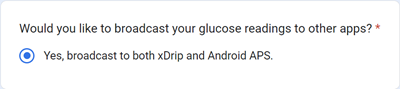

# Dexcom G6 și ONE

## Elemente de bază

-   Urmați recomandarea generală privind igiena și setarea senzorului de glicemie [aici](../CompatibleCgms/GeneralCGMRecommendation.md).

## Sugestii generale pentru buclă cu G6 și ONE

- Transmițătorii recenți se numesc Firefly. Senzorii nu pot fi reporniți fără a scoate transmițătorul, acesta nu se poate reseta, și nici nu generează date neprelucrate.

- Dacă reporniți senzorii, asigurați-vă că sunteți pregătit să îi calibrați și să urmăriți cu atenție variațiile.

- Preîmbibarea G6/ONE cu calibrarea din fabrică e probabil să determine variații ale rezultatelor. Dacă faceți preinserare, atunci pentru a obține cele mai bune rezultate, probabil că va trebui să calibrați senzorul.

Citiți mai multe in [articolul](https://www.diabettech.com/artificial-pancreas/diy-looping-and-cgm/) publicat de către Tim Street la [www.diabettech.com](https://www.diabettech.com).

## Dacă utilizați G6 sau ONE cu xDrip+

- Dacă folosiți un transmițător recent (Firefly), repornirile preventive sunt **ignorate**.
- Dacă folosiți un transmițător modificat **nu aveți nevoie** să folosiți reporniri preventive.
-   Dacă folosiți un transmițător vechi cu bateria schimbată, cel mai sigur lucru de făcut este să **dezactivați** [repornirile preventive](https://navid200.github.io/xDrip/docs/Preemptive-Restart.html). Totuși, în acest caz va trebui să folosiți G6 în [modul non-nativ](https://navid200.github.io/xDrip/docs/Native-Algorithm.html) (care nu este recomandabil pentru că dezactivează calibrarea din fabrică și nu filtrează citirile zgomotoase), pentru că altfel senzorul s-ar opri după 10 zile.
-   Transmițătorii G6 și ONE pot fi conectați simultan la receptorul Dexcom (sau alternativ la pompa t:slim) și la o aplicație de pe telefonul dumneavoastră.
-   Dacă utilizați xDrip+ ca receptor, mai întâi dezinstalați aplicația Dexcom. **Transmițătorul NU POATE FI conectat simultan cu xDrip+ și aplicația Dexcom**
-   Dacă aveți nevoie de Clarity și doriți și alarmele din xDrip+ folosiți [BYODA](#DexcomG6-if-using-g6-with-build-your-own-dexcom-app) (doar G6) cu transmisiune locală către xDrip+.
-   Puteți folosi, de asemenea, xDrip+ ca o aplicație companion a aplicației oficiale Dexcom, dar este posibil să aveți întârzieri în citirile glicemiei.
-   Dacă nu-l aveți configurat deja, descărcați [xDrip+](https://github.com/NightscoutFoundation/xDrip) și urmați instrucțiunile de pe pagina [xDrip+ din pagina de setări](../CompatibleCgms/xDrip.md).
-   Selectați xDrip+ în [Configurator, Sursă glicemie](#Config-Builder-bg-source).

- Reglați setările în xDrip+ în concordanță cu [pagina de setări xDrip+](../CompatibleCgms/xDrip.md)

(DexcomG6-if-using-g6-with-build-your-own-dexcom-app)=
## Dacă utilizați G6 cu construită cu Build Your Own Dexcom App

```{admonition} Old app version
:class: avertisment
Dexcom G6 BYODA este acum o versiune foarte veche a aplicației și nu poate fi actualizată.
```

-   [Construiește-ți propria aplicație Dexcom](https://docs.google.com/forms/d/e/1FAIpQLScD76G0Y-BlL4tZljaFkjlwuqhT83QlFM5v6ZEfO7gCU98iJQ/viewform?fbzx=2196386787609383750) (BYODA) acceptă transmisiuni locale către AAPS și/sau xDrip+ (**nu** **pentru senzori G5/ONE/G7!**)



-   Această aplicație vă permite să folosiți senzorul Dexcom G6 cu orice telefon inteligent Android.
-   Dezinstalați aplicația Dexcom originală sau aplicația Dexcom modificată dacă ați folosit anterior una dintre aceste aplicații (**nu opriți** senzorul care rulează în prezent)
-   Instalați apk-ul descărcat
-   Introduceți codul senzorului și numărul de serie al transmițătorului în aplicația modificată.
-   În setările telefonului mergeți la aplicații > Dexcom G6 > permisiuni > permisiuni suplimentare și apăsați pe 'Acces aplicație Dexcom'.
-   După o scurtă perioadă de timp, aplicația ar trebui să recepționeze semnalul de la transmițător.

### Setări pentru AAPS

-   Selectați 'Dexcom App (patched)' în [Configurator, Sursă glicemie](#Config-Builder-bg-source).

-   Dacă nu primiți nici o valoare selectați orice altă sursă de date, apoi reselectați "Dexcom App (patched)" pentru a declanșa cererea de permisiuni de stabilire a conexiunii dintre AAPS și BYODA.

### Setări pentru xDrip+

-   Selectați '640G/Eversense' ca sursă de date.
-   Comanda "start senzor" trebuie efectuată în xDrip+ pentru a primi valori. Acest lucru nu vă va afecta senzorul actual controlat de Build Your Own Dexcom App.


(DexcomG6-troubleshooting-g6)=
## Depanare pentru G6 și ONE

### Depanare specifică Dexcom G6/ONE

-   Derulați în jos până la **Depanare** [aici](https://navid200.github.io/xDrip/docs/Dexcom_page.html).

### Depanare generală

Depanare generală pentru CGMs se poate găsi [aici](#general-cgm-troubleshooting).

### Transmițător nou cu senzor în funcțiune

Dacă se întâmplă să schimbați transmițătorul în timpul unei sesiuni de senzor care funcționează, ați putea încerca să înlăturați transmițătorul fără a deteriora senzorul. Un videoclip poate fi găsit [aici](https://navid200.github.io/xDrip/docs/Remove-transmitter.html). Dacă optați pentru [această soluție](https://youtu.be/tx-kTsrkNUM) în schimb, trebuie să aveți grijă să evitați [deteriorarea contactelor senzorului](https://navid200.github.io/xDrip/docs/Petroleum-jelly-in-Dexcom-G6-Sensor.html) cu bandeleta.
