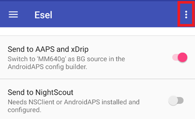
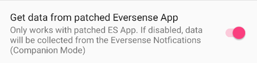

# Pentru utilizatorii de Eversense

Există trei metode diferite de accesare a citirilor de la Eversense:

- ESEL în mod companion
- ESEL modificat
- Aplicația xDrip+ companion

## ESEL

Obțineți și instalați [aplicația ESEL](https://github.com/BernhardRo/Esel/tree/master/apk), urmând aceste instrucțiuni [](https://github.com/BernhardRo/Esel?tab=readme-ov-file#esel).

- Activați "Trimiteți în AAPS și xDrip"
- **Dezactivați** "Trimiteți la Nightscout"
- Deoarece datele glicemice din Eversense pot fi zgomotoase, se recomandă activarea "Filtrați Datele" în ESEL.



### Mod Companion

Citește datele din notificările aplicației Eversense (funcționează cu aplicația Eversense standard, disponibilă de la versiunea ESEL 3.0.1).

1. Folosiți aplicația oficială Eversense din Google Play Store
   - Opțional, dar necesar pentru scriere în urmă: Autentificați-vă în contul dumneavoastră Eversense
   - În sincronizare, activați sincronizarea automată
2. Configurarea ESEL:
   - Dezactivați setarea "Obțineți date de la aplicația Eversense modificată"
   - Pentru scriere în urmă: Activați "Umpleți datele lipsă de la eversensedms.com"
   - Furnizați ca adresă de e-mail și parolă datele de conectare Eversense
3. Setați "MM640g" ca sursă de glicemie în [Configurator, Sursă glicemie](#Config-Builder-bg-source).

### Aplicația Eversense modificată

 Necesită o versiune modificată a aplicației Eversense (funcționează complet offline, inclusiv scriere în urmă).

1. Dezinstalați aplicația Eversense (Atenție: datele dumneavoastră istorice locale (mai vechi de 1 săptămână) vor fi pierdute!)

2. Instalați aplicația [modificată Eversense](https://cr4ck3d3v3r53n53.club) și folosiți-o cum este descris de către producător

   - Porniți aplicația Eversense, conectați-vă la transmițătorul dumneavoastră și folosiți-o la fel ca pe aplicația normală.

3. Configurarea ESEL:

   - Activați setarea "Obțineți date de la aplicația Eversense modificată"




Dacă rulați ESEL cu o instalare nouă de Eversense pentru prima dată, poate dura până la 15 minute până când primele valori apar în xDrip!

4. Setați "MM640g" ca sursă de glicemie în [Configurator, Sursă glicemie](#Config-Builder-bg-source).

## xDrip+

xDrip+ poate citi notificările de la aplicația oficială, așa cum face ESEL. No backfilling available.

- Download and install xDrip+: [xDrip](https://github.com/NightscoutFoundation/xDrip)
- As data source in xDrip+ “Companion App” must be selected.
- Selectați xDrip+ în [Configurator, Sursă glicemie](#Config-Builder-bg-source).
- Adjust the xDrip+ settings according to the explanations on the xDrip+ settings page [xDrip+ settings](../CompatibleCgms/xDrip.md).
- Enable [Exponential Smoothing](../CompatibleCgms/SmoothingBloodGlucoseData.md) in AAPS.

```{warning}
BG values reading frequency is not always 5 minutes and duplicates can occur.
```