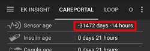

# Recomandări generale CGM

## Igiena CGM

Indiferent de sistemul CGM pe care îl utilizați, dacă doriți să utilizați calibrarea bazată pe glucometru, atunci există unele reguli foarte clare pe care ar trebui să le aplicați, indiferent dacă utilizați sau nu software-ul DIY CGM sau aplicațiile oficiale.

-   Asigurați-vă că mâinile și trusa sunt curate.
-   Încercați să calibrați atunci când aveți o serie de puncte cu o evoluție orizontală (15-30 de minute este de obicei suficient)
-   Evitați calibrarea atunci când nivelurile glicemiei se mișcă în sus sau în jos.
-   Faceți "suficiente" calibrări - în aplicațiile oficiale vi se vor cere una sau două verificări ale glicemiei pe zi. În cazul sistemelor DIY este posibil să nu fiți alertat și ar trebui să fiți prudent când continuați fără calibrări.
-   În cazul senzorilor care nu necesită sau nu permit calibrarea, verificați cel puțin zilnic glicemia reală din sânge. AAPS va fi la fel de sigur pe cât de încredere sunt citirile senzorului dumnevoastră.
-   Dacă este posibil, calibrați cu unele valori dintr-o gamă mai mică (4-5mmol/l sau 72-90mg/dl) și unele de la un nivel ușor mai înalt (7-9mmol/l sau 126-160mg/dl), deoarece aceasta oferă o gamă mai bună pentru calibrarea punctelor/pantei.

## Inserare senzor (G6)

Atunci când este inserat senzorul, este recomandat să nu se apese prea ferm pe inserator pentru a evita sângerarea. Contactele senzorului nu trebuie să intre în contact cu sângele.

După inserarea senzorului, transmițătorul poate fi apăsat în suportul de pe senzor. Atenție! Mai întâi îl introduceți în partea ascuțită și apoi apăsați pe partea rotundă.

(depanare-generală-cgm)=
## Depanare

### Probleme de conectare

Conexiunea Bluetooth poate fi deranjată de alte dispozitive Bluetooth din apropiere, cum ar fi glucometre, căști, tablete sau dispozitive de bucătărie cum ar fi cuptoarele cu microunde sau plitele electrice. În acest caz, xDrip nu afișează valorile glicemiei. Când conexiunea Bluetooth este restabilită, datele sunt recuperate și completate.

### Erori senzor

Dacă apar erori de senzor repetate, încercați să alegeți un alt loc pe corp pentru a insera senzorul. Contactele senzorului nu trebuie să intre în contact cu sângele.

Adesea o eroare de senzor poate fi corectată prin hidratare imediată și masare ușoară în jurul senzorului!

### Valori săltărețe

Ați putea încerca să modificați setările pentru blocarea zgomotului în xDrip+ (Setările între aplicații - Blocarea zgomotului), adică "Blocare zgomot foarte mare și mai rău". Vedeți de asemenea [Netezirea datelor de glicemie](../CompatibleCgms/SmoothingBloodGlucoseData.md).

### Vârstă negativă a senzorului

Acest lucru se întâmplă dacă există fie o înregistrare dublă "Inserare senzor CGM" în [fila / meniul de acțiuni](#screens-action-tab) sau un senzor inserat cu dată greșită. Mergeți la fila de tratamente \> careportal și ștergeți intrarea greșită.
