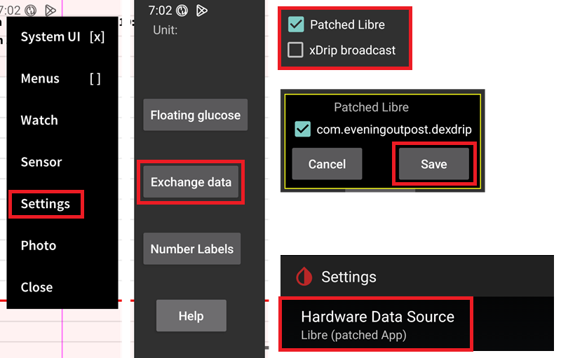

# Setări Juggluco

Dacă nu este deja configurat, atunci descărcați [Juggluco](https://www.juggluco.nl/Juggluco/download.html).

Urmați instrucțiunile  pentru a conecta senzorul.

## Setări de bază pentru toate sistemele CGM

### Dezactivați încărcarea în Nightscout

Începând cu AAPS 3.2, nu ar trebui să lăsați nicio altă aplicație să încarce date (glicemia din sânge și tratamente) în Nightscout.

Dezactivați orice încărcător activ în Nightscout din Juggluco.

(juggluco-to-aaps)=

## Juggluco în AAPS

Juggluco poate trimite glicemia direct la AAPS, activând SMB întotdeauna dacă folosiți un senzor [de încredere](#GettingStarted-TrustedBGSource).

Atunci când se utilizează un senzor Libre 2/2+/3/3+, citirile de minut cu minut vor fi trimise la AAPS, dar nu vor declanșa calcule de la minut la minut în AAPS.

Activați transmisia xDrip în Juggluco (nu activați aplicație Libre modificată) confirmați și salvați informațiile pachetului AAPS. Selectați ca sursa de date a glicemiei xDrip+ în AAPS.

Aplicați suficientă [omogenizare](./SmoothingBloodGlucoseData.md) în AAPS.

(juggluco-to-xdrip) =

## Juggluco în xDrip+

Juggluco poate trimite glicemia către xDrip+, care le va trimite apoi către AAPS.

Activați aplicație Libre modificată în Juggluco (nu activați transmisia xDrip), confirmați și salvați informațiile pachetului dexdrip. Selectați ca sursa de date a glicemiei xDrip+ în AAPS.

Aplicați suficientă [omogenizare](./SmoothingBloodGlucoseData.md) în AAPS, dacă este necesar, atunci când se folosește un senzor Libre 2/2+/3/3+, xDrip+ va face media citirilor din minut în minut sau a citirilor la 5 minute și [ le va omogeniza, de asemenea](#libre2-value-smoothing-raw-values).

